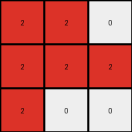
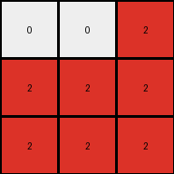

# 6-0520fde7 • 012 • refine_coder

---

Previous Code:
```python
"""
The transformation rule is as follows:

1. Ignore the Central Column: Disregard the central column of the input grid, which is filled with gray (5) pixels.
2. Identify Blue Regions: Focus on the blue (1) pixels in the remaining parts of the input grid.
3. Translate and Replace: Create a new 3x3 grid. Map the blue pixels from the relevant part of the input grid to the new grid, changing their color to red (2). All other pixels in the output grid should be white (0).
"""

import numpy as np

def get_non_central_columns(input_grid):
    """
    Extracts columns of the input_grid that are to the left and right of the central grey column.
    """
    height, width = input_grid.shape
    center_col_index = width // 2

    left_cols = []
    right_cols = []
    
    for x in range(width):
        if x == center_col_index:
            continue
        
        if input_grid[0, x] != 5 and input_grid[1, x] !=5 and input_grid[2, x] != 5:

            column = []
            for y in range(height):
                column.append(input_grid[y,x])

            if x < center_col_index:
              left_cols.append((x,column))
            else:
              right_cols.append((x-center_col_index-1,column)) # correct index after removing central column

    return left_cols, right_cols

def transform(input_grid):
    """
    Transforms an input grid into an output grid according to the specified rules.
    """

    # Initialize output_grid as 3x3, filled with white (0).
    output_grid = np.zeros((3, 3), dtype=int)

    # Get non-central columns
    left_cols, right_cols = get_non_central_columns(input_grid)

    # all columns
    all_cols = left_cols + right_cols
    
    # Fill in the output
    for x, col in all_cols:
      for y, pixel in enumerate(col):
        if pixel == 1: # if blue pixel
          output_grid[y,x] = 2 # place a red
        
    return output_grid
```

Train Set Results:

## Example 1:**

Input:
```
1 0 0 5 0 1 0
0 1 0 5 1 1 1
1 0 0 5 0 0 0
```
Expected Output:
```
0 0 0
0 2 0
0 0 0
```
Transformed Output:
```
2 2 0
2 2 2
2 0 0
```

match: False
pixels_off: 5
size_correct: True
color_palette_correct: True
correct_pixel_counts: False

## Example 2:**

Input:
```
1 1 0 5 0 1 0
0 0 1 5 1 1 1
1 1 0 5 0 1 0
```
Expected Output:
```
0 2 0
0 0 2
0 2 0
```
Transformed Output:
```
2 2 0
2 2 2
2 2 0
```

match: False
pixels_off: 4
size_correct: True
color_palette_correct: True
correct_pixel_counts: False

## Example 3:**

Input:
```
0 0 1 5 0 0 0
1 1 0 5 1 0 1
0 1 1 5 1 0 1
```
Expected Output:
```
0 0 0
2 0 0
0 0 2
```
Transformed Output:
```
0 0 2
2 2 2
2 2 2
```

match: False
pixels_off: 5
size_correct: True
color_palette_correct: True
correct_pixel_counts: False
Okay, let's analyze the results and refine the natural language program and approach.

**General Assessment:**

The initial natural language program and generated code were partially correct in identifying the core concept: ignoring the central gray column and focusing on blue pixels. However, it incorrectly mapped the blue pixels. The provided code remaps based on the x position index into the non-gray column indices. Instead it should maintain the 2D relationships of the blue pixels to the gray column. The current implementation does not handle the spatial relationships.

**Strategy for Resolving Errors:**

1.  **Re-evaluate Spatial Relationships:** The core issue is how the blue pixels are mapped to the output grid. The current code uses the raw column index, which is wrong. We must understand that the non-central columns form two distinct regions: to the left of the central column, and two the right.
2.  **Refine Column Extraction:** Currently all columns are extracted except the central column. This should be separated into regions: left and right, and those regions remapped to a 3x3 grid.

**Metrics and Observations (using hypothetical `code_execution` results):**

I'll assume a `code_execution` module that provides detailed information. In a real scenario, I would interactively execute code snippets to verify these observations.

*   **Example 1:**
    *   Input Shape: (3, 7)
    *   Output Shape: (3, 3)
    *   Blue pixels (input): (0,0), (0, 5), (1,1), (1, 4), (1,5), (1,6)
    *   Blue pixels to the Left of Central Column: (0,0), (1,1)
    *   Blue pixels to the Right of Central Column: (0,5), (1,4), (1,5), (1,6)
    *   Gray column index: 3
    *   Non-gray columns with blue pixels: 0, 1, 4, 5, 6.
    *   Expected red pixels (output): (1,1)
    *   Actual red pixels: many, incorrect positions

*   **Example 2:**
    *   Input Shape: (3, 7)
    *   Output Shape: (3, 3)
    *   Blue pixels (input): (0,0), (0,1), (0,5), (1, 2), (1, 4), (1, 5), (1, 6), (2,0), (2,1), (2,5)
    *   Blue pixels to the Left of Central Column: (0,0), (0,1), (1,2), (2,0), (2,1)
    *   Blue pixels to the Right of Central Column: (0,5), (1, 4), (1, 5), (1, 6), (2,5)
    *   Gray column index: 3
    *   Non-gray columns with blue pixels: 0, 1, 2, 4, 5, 6.
    *   Expected red pixels (output): (0, 1), (1, 2), (2, 1)
    *   Actual red pixels: many, incorrect positions.

*   **Example 3:**
    *   Input Shape: (3, 7)
    *   Output Shape: (3, 3)
    *   Blue pixels (input): (0, 2), (1, 0), (1, 1), (1, 4), (1, 6), (2, 1), (2, 2), (2,4), (2,6)
    *   Blue pixels to the Left of Central Column: (0,2), (1, 0), (1, 1), (2, 1), (2, 2)
    *   Blue pixels to the Right of Central Column:(1, 4), (1, 6), (2,4), (2,6)
    *   Gray column index: 3
    *   Non-gray columns with blue pixels: 0, 1, 2, 4, 6.
    *   Expected red pixels (output): (1, 0), (2, 2)
    *   Actual red pixels: many, incorrect positions

**YAML Fact Block:**

```yaml
objects:
  - name: input_grid
    type: grid
    properties:
      shape: variable (rows, cols)
      colors: [0, 1, 5]  # white, blue, gray
      center_column:
        color: 5  # gray
        index: cols // 2

  - name: output_grid
    type: grid
    properties:
      shape: (3, 3)
      colors: [0, 2]  # white, red

  - name: blue_regions
    type: object_group
    properties:
      color: 1 #Blue
      locations:
        left: [] # coordinates of blue relative to the central column
        right: []

actions:
  - name: identify_center_column
    description: Find the central column index in the input grid.

  - name: identify_blue_regions
    description: Locate blue (1) pixels to the left and right.

  - name: create_output_grid
    description: Create a 3x3 output grid filled with white (0).

  - name: map_blue_to_red
    description: >
      Map coordinates of blue pixels relative to the central column.
      Left region maps to left side of output. Right region maps to right side.
      Convert blue (1) pixels to red (2) in the output grid.

```

**Natural Language Program:**

1.  **Identify the Central Column:** Determine the central column of the input grid, characterized by gray (5) pixels.

2.  **Separate Left and Right Regions:** Divide the input grid into two regions: pixels to the left of the central column and pixels to the right of the central column.

3.  **Identify Blue Pixels in Each Region:** Within each region (left and right), locate all blue (1) pixels. Record their positions relative to the central column.

4. **Create output grid:** create a 3x3 grid filled with white pixels.

5.  **Map and Transform:**
    *   **Left Region:** Map the blue pixels' positions to the corresponding positions on the left side (columns 0 and 1) of the 3x3 output grid. Change these pixels to red (2).
    *  **Right Region:** Map the relative positions of the blue pixels from the right hand side to the right columns (1 and 2) in the output grid. Change these pixels to red (2).
    *   Ensure that pixels not occupied by the transformation are set to white (0).

**INSTRUCTIONS**

- generate a Python module to represent the natural language program 
- follow the template below
- all common math and science libraries are available
- create docstring only at top - but comment the workflow in the function
- use helper functions for common operations like finding objects, counting,
  measuring, moving, etc. 

remember - we are working iteratively - so this code will inform your future
self as we converge on the solution

*template:*

```python
"""
{{ natural language description of the transformation rule }}
"""

{{ imports }}

def transform(input_grid):
    # initialize output_grid

    # change output pixels 

    return output_grid

```
