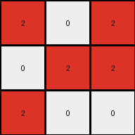
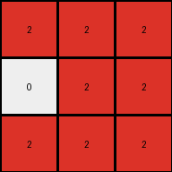

# 6-0520fde7 • 013 • refine_dreamer

---


Previous Code:
```python
"""
1.  **Identify the Central Column:** Determine the central column of the input grid, characterized by gray (5) pixels.

2.  **Separate Left and Right Regions:** Divide the input grid into two regions: pixels to the left of the central column and pixels to the right of the central column.

3.  **Identify Blue Pixels in Each Region:** Within each region (left and right), locate all blue (1) pixels. Record their positions relative to the central column.

4. **Create output grid:** create a 3x3 grid filled with white pixels.

5.  **Map and Transform:**
    *   **Left Region:** Map the blue pixels' positions to the corresponding positions on the left side (columns 0 and 1) of the 3x3 output grid. Change these pixels to red (2).
    *  **Right Region:** Map the relative positions of the blue pixels from the right hand side to the right columns (1 and 2) in the output grid. Change these pixels to red (2).
    *   Ensure that pixels not occupied by the transformation are set to white (0).
"""

import numpy as np

def get_blue_regions(input_grid):
    """
    Identifies blue pixels in the left and right regions relative to the central column.
    """
    height, width = input_grid.shape
    center_col_index = width // 2
    left_region = []
    right_region = []

    for y in range(height):
        for x in range(width):
            if x < center_col_index and input_grid[y, x] == 1:
                left_region.append((y, x))
            elif x > center_col_index and input_grid[y, x] == 1:
                right_region.append((y, x - center_col_index -1)) # important to use relative position
    return left_region, right_region

def transform(input_grid):
    # initialize output_grid
    output_grid = np.zeros((3, 3), dtype=int)

    # Get left and right regions with blue pixel coordinates
    left_region, right_region = get_blue_regions(input_grid)

    # Map left region to output grid
    for y, x in left_region:
      if y < 3 and x < 2:  # only map to first two columns
          output_grid[y, x] = 2

    # Map Right Region
    for y, x in right_region:
        if y < 3 and x < 2:  # only map to last two columns starting at 1
            output_grid[y, x+1] = 2 # offset by one

    return output_grid
```

Train Set Results:

## Example 1:**

Input:
```
1 0 0 5 0 1 0
0 1 0 5 1 1 1
1 0 0 5 0 0 0
```
Expected Output:
```
0 0 0
0 2 0
0 0 0
```
Transformed Output:
```
2 0 2
0 2 2
2 0 0
```

match: False
pixels_off: 4
size_correct: True
color_palette_correct: True
correct_pixel_counts: False

## Example 2:**

Input:
```
1 1 0 5 0 1 0
0 0 1 5 1 1 1
1 1 0 5 0 1 0
```
Expected Output:
```
0 2 0
0 0 2
0 2 0
```
Transformed Output:
```
2 2 2
0 2 2
2 2 2
```

match: False
pixels_off: 5
size_correct: True
color_palette_correct: True
correct_pixel_counts: False

## Example 3:**

Input:
```
0 0 1 5 0 0 0
1 1 0 5 1 0 1
0 1 1 5 1 0 1
```
Expected Output:
```
0 0 0
2 0 0
0 0 2
```
Transformed Output:
```
0 0 0
2 2 0
0 2 0
```

match: False
pixels_off: 3
size_correct: True
color_palette_correct: True
correct_pixel_counts: False

**INSTRUCTIONS**

The code above was generated based on observations from the first training
example

we have tested the transform function on each of the task example inputs and
compared with the expected output

review each of the examples provided and the results and consider how the
natural language program should be updated to accommodate this new knowledge

respond with the following deliverables:

- general assessment of the information provided and strategy for resolving the
  errors
- gather metrics about each of the examples and results - use code_execution to
  develop accurate reports on your assumptions
- a YAML block documenting facts - Focus on identifying objects, their properties, and the actions performed on them.
- a natural language program - Be as clear and concise as possible, providing a complete description of the transformation rule.


your responses should be considered as information in a report - not a
conversation
