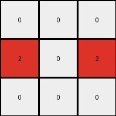

# 6-0520fde7 • 015 • refine_dreamer

---


Previous Code:
```python
"""
1.  **Identify the Central Column:** Find the vertical column in the input grid that contains only gray (5) pixels. This column divides the input grid into left and right regions.

2.  **Output Grid:** Create a 3x3 output grid filled with white (0) pixels.

3.  **Locate Key Blue Pixels:** Examine the input grid for blue pixels (1) that are exactly *one* cell away (horizontally) from the central gray column, either to the left or the right. Ignore other blue pixels.

4.  **Transform and Map:**
    *   For each blue pixel found in step 3:
        *   If the blue pixel is one cell to the *left* of the central column, place a red pixel (2) in the same row, and *first* column of the output grid.
        *   If the blue pixel is one cell to the *right* of the central column, place a red pixel (2) in the same row, and the *third* column of the output grid.
        *   The y-coordinate of the red pixel should be equal to the y coordinate of the blue pixel.

5.  The central column in the output will always be white (0).
"""

import numpy as np

def find_central_gray_column(input_grid):
    """Finds the index of the central gray column."""
    height, width = input_grid.shape
    for x in range(width):
        if np.all(input_grid[:, x] == 5):
            return x
    return -1  # Should not happen in valid cases, but good practice

def transform(input_grid):
    # initialize output_grid
    output_grid = np.zeros((3, 3), dtype=int)

    # Find the central gray column
    center_col_index = find_central_gray_column(input_grid)

    # Iterate through the input grid and find relevant blue pixels
    height, width = input_grid.shape
    for y in range(height):
        for x in range(width):
            if input_grid[y, x] == 1:
                # Check if the blue pixel is one step left of the center
                if x == center_col_index - 1:
                    output_grid[y, 0] = 2  # First column
                # Check if the blue pixel is one step right of the center
                elif x == center_col_index + 1:
                    output_grid[y, 2] = 2  # Third column
    return output_grid
```

Train Set Results:

## Example 1:**

Input:
```
1 0 0 5 0 1 0
0 1 0 5 1 1 1
1 0 0 5 0 0 0
```
Expected Output:
```
0 0 0
0 2 0
0 0 0
```
Transformed Output:
```
0 0 0
0 0 2
0 0 0
```

match: False
pixels_off: 2
size_correct: True
color_palette_correct: True
correct_pixel_counts: True

## Example 2:**

Input:
```
1 1 0 5 0 1 0
0 0 1 5 1 1 1
1 1 0 5 0 1 0
```
Expected Output:
```
0 2 0
0 0 2
0 2 0
```
Transformed Output:
```
0 0 0
2 0 2
0 0 0
```

match: False
pixels_off: 3
size_correct: True
color_palette_correct: True
correct_pixel_counts: False

## Example 3:**

Input:
```
0 0 1 5 0 0 0
1 1 0 5 1 0 1
0 1 1 5 1 0 1
```
Expected Output:
```
0 0 0
2 0 0
0 0 2
```
Transformed Output:
```
2 0 0
0 0 2
2 0 2
```

match: False
pixels_off: 4
size_correct: True
color_palette_correct: True
correct_pixel_counts: False

**INSTRUCTIONS**

The code above was generated based on observations from the first training
example

we have tested the transform function on each of the task example inputs and
compared with the expected output

review each of the examples provided and the results and consider how the
natural language program should be updated to accommodate this new knowledge

respond with the following deliverables:

- general assessment of the information provided and strategy for resolving the
  errors
- gather metrics about each of the examples and results - use code_execution to
  develop accurate reports on your assumptions
- a YAML block documenting facts - Focus on identifying objects, their properties, and the actions performed on them.
- a natural language program - Be as clear and concise as possible, providing a complete description of the transformation rule.


your responses should be considered as information in a report - not a
conversation
