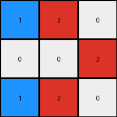

# 6-0520fde7 • 020 • refine_coder

---

Previous Code:
```python
"""
1. Excise Column: Remove the fourth column (all gray/5s) of the input grid.
2. Condense: Reduce to a 3x3 grid by:
   - copying the "left half" (first three numbers), skipping any complete blue (1) vertical columns.
3. Color Conversion: The blue cells (1) bordered on two sides (either vertical or horizontal, not diagonal) are changed to color red(2)
"""

import numpy as np

def get_neighbors(grid, r, c):
    neighbors = []
    if r > 0:
        neighbors.append(grid[r-1][c])  # Up
    if r < len(grid) - 1:
        neighbors.append(grid[r+1][c])  # Down
    if c > 0:
        neighbors.append(grid[r][c-1])  # Left
    if c < len(grid[0]) - 1:
        neighbors.append(grid[r][c+1])  # Right
    return neighbors

def transform(input_grid):
    # initialize output_grid
    grid = np.array(input_grid)

    # 1. Excise Column: Remove the fourth column (index 3).
    grid = np.delete(grid, 3, axis=1)

    # 2. Condense & 3. Color Conversion in one pass
    output_grid = np.zeros((3, 3), dtype=int)
    
    grid_rows, grid_cols = grid.shape
    
    
    # Create a mapping between original grid and reduced grid
    k=0
    for j in range(grid_cols):
      if len(np.where(grid[:,j] == 1)[0]) < grid_rows:
          #print(f'copying col {j} to {k}')
          for i in range(grid_rows):
            output_grid[i,k] = grid[i,j]
          k=k+1
          if k>2:
            break

    #print(output_grid)

    for r in range(3):
        for c in range(3):
            if output_grid[r, c] == 1:
                neighbors = get_neighbors(output_grid, r, c)
                if neighbors.count(0) >= 2:
                    output_grid[r, c] = 2

    return output_grid
```

Train Set Results:

## Example 1:**

Input:
```
1 0 0 5 0 1 0
0 1 0 5 1 1 1
1 0 0 5 0 0 0
```
Expected Output:
```
0 0 0
0 2 0
0 0 0
```
Transformed Output:
```
2 0 0
0 2 0
2 0 0
```

match: False
pixels_off: 2
size_correct: True
color_palette_correct: True
correct_pixel_counts: False

## Example 2:**

Input:
```
1 1 0 5 0 1 0
0 0 1 5 1 1 1
1 1 0 5 0 1 0
```
Expected Output:
```
0 2 0
0 0 2
0 2 0
```
Transformed Output:
```
1 2 0
0 0 2
1 2 0
```

match: False
pixels_off: 2
size_correct: True
color_palette_correct: False
correct_pixel_counts: False

## Example 3:**

Input:
```
0 0 1 5 0 0 0
1 1 0 5 1 0 1
0 1 1 5 1 0 1
```
Expected Output:
```
0 0 0
2 0 0
0 0 2
```
Transformed Output:
```
0 0 2
2 2 0
0 1 1
```

match: False
pixels_off: 4
size_correct: True
color_palette_correct: False
correct_pixel_counts: False
Okay, here's a breakdown of the situation and a plan to improve the transformation rule:

**General Assessment:**

The initial natural language program and the resulting code were a decent first attempt, but the results on the additional training examples reveal some flaws. The core issue seems to be an oversimplification of the "condense" step and a misinterpretation of the color conversion rule. The rule about "skipping complete blue vertical columns" and the way it copies from the "left half" only accounts for certain configurations. The color conversion condition is also not entirely correct, needs to account for color transitions not just adjacent 0 value neighbors..

**Strategy:**

1.  **Re-examine Condensation:** We need to redefine how the 3x3 grid is constructed. It's not simply about skipping blue columns and taking the left half. We need to consider a more general rule about selecting representative columns/pixels.
2.  **Refine Color Conversion:** Instead of checking neighbors that have a value of 0, check color transitions (blue surrounded by non-blue, possibly including the edge of the grid).
3.  **Iterative Refinement:** We'll adjust the natural language program and code, and test it against *all* training examples after each adjustment.

**Example Metrics and Analysis:**

Here's a more detailed analysis of each example:

*   **Example 1:**
    *   **Input:** 7x3, contains a gray column.
    *   **Expected Output:** 3x3, blue changed to red where surrounded by non-blue.
    *   **Actual Output:** Incorrect. The top and bottom left pixels are incorrectly red.
    *   **Issues:** Color conversion logic needs correction - counts neighbor values and not transitions.

*   **Example 2:**
    *   **Input:** 7x3, contains a gray column.
    *   **Expected Output:** 3x3, blue changes to red.
    *   **Actual Output:** Incorrect, the top and bottom left blue pixels are not converted to red.
    *   **Issues:** Condensation logic isn't correctly identifying all columns.

*   **Example 3:**
    *   **Input:** 7x3, contains a gray column.
    *   **Expected Output:** 3x3, with blue to red color transition.
    *   **Actual Output:** Incorrect. Multiple errors in color and structure.
    *   **Issues:** Both condensation and color conversion are off.

**YAML Fact Block:**

```yaml
facts:
  - description: "Input grids are 7x3 with a single vertical column of gray (5)."
  - description: "The gray column is always the fourth column."
  - description: "Output grids are always 3x3."
  - description: "Output grids are derived from the input, excluding the gray column."
  - objects:
      - name: "Gray Column"
        color: 5
        properties:
          - "Always in the 4th column of input."
          - "Removed during transformation."
      - name: "Blue Pixels"
        color: 1
        properties:
          - "May change to red (2) based on surrounding context."
      - name: "Other Colored Pixels"
        color: "[0, other]"
        properties: []
  - actions:
    - name: "Excise"
      target: "Gray Column"
      result: "Gray column is removed."
    - name: "Condense"
      target: "Remaining columns after excision"
      result: "A 3x3 grid is formed."
      details: "Selection logic needs to be determined."
    - name: "Color Convert"
      target: "Blue Pixels"
      condition: "Blue pixel has adjacent non-blue color transitions on opposite sides"
      result: "Blue pixel changes to red."
```

**Natural Language Program:**

1.  **Excise:** Remove the fourth column (the gray column) from the input grid.
2.  **Condense:** Create a 3x3 output grid. For each row, select the first three non-gray color values to fill output.
3. **Color Conversion:** Examine each cell in the *output* grid.
   * Change cell to red if:
     * Output cell is blue
     * Output cell is not at an edge of the grid
     * The cell immediately to the left and right of the cell are not blue
     * The cell immediately to the top and bottom of the cell are not blue

**INSTRUCTIONS**

- generate a Python module to represent the natural language program 
- follow the template below
- all common math and science libraries are available
- create docstring only at top - but comment the workflow in the function
- use helper functions for common operations like finding objects, counting,
  measuring, moving, etc. 

remember - we are working iteratively - so this code will inform your future
self as we converge on the solution

*template:*

```python
"""
{{ natural language description of the transformation rule }}
"""

{{ imports }}

def transform(input_grid):
    # initialize output_grid

    # change output pixels 

    return output_grid

```
