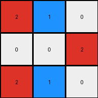
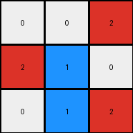

# 6-0520fde7 • 023 • refine_dreamer

---

Previous Code:
```python
"""
1.  **Excise:** Remove the fourth column (the gray column) from the input grid.
2.  **Condense:** Create a 3x3 output grid. For each row, select the first three non-gray color values to create the corresponding row in the output grid.
3.  **Color Conversion:** Iterate through each cell of the *output* grid.
    *   If a cell is blue AND it is in the first column or third column change it to red.
"""

import numpy as np

def transform(input_grid):
    # initialize output_grid
    grid = np.array(input_grid)

    # 1. Excise Column: Remove the fourth column (index 3).
    grid = np.delete(grid, 3, axis=1)

    # 2. Condense: Create 3x3, taking first three non-gray values in each row.
    output_grid = np.zeros((3, 3), dtype=int)
    for i in range(3):
        non_gray_cols = [val for val in grid[i] if val != 5]
        output_grid[i] = non_gray_cols[:3]


    # 3. Color Conversion: Check for blue pixels and their column.
    for r in range(3):
        for c in range(3):
            if output_grid[r, c] == 1:
                if c == 0 or c==2:
                  output_grid[r,c] = 2

    return output_grid
```

Train Set Results:

## Example 1:**

Input:
```
1 0 0 5 0 1 0
0 1 0 5 1 1 1
1 0 0 5 0 0 0
```
Expected Output:
```
0 0 0
0 2 0
0 0 0
```
Transformed Output:
```
2 0 0
0 1 0
2 0 0
```

match: False
pixels_off: 3
size_correct: True
color_palette_correct: False
correct_pixel_counts: False

## Example 2:**

Input:
```
1 1 0 5 0 1 0
0 0 1 5 1 1 1
1 1 0 5 0 1 0
```
Expected Output:
```
0 2 0
0 0 2
0 2 0
```
Transformed Output:
```
2 1 0
0 0 2
2 1 0
```

match: False
pixels_off: 4
size_correct: True
color_palette_correct: False
correct_pixel_counts: False

## Example 3:**

Input:
```
0 0 1 5 0 0 0
1 1 0 5 1 0 1
0 1 1 5 1 0 1
```
Expected Output:
```
0 0 0
2 0 0
0 0 2
```
Transformed Output:
```
0 0 2
2 1 0
0 1 2
```

match: False
pixels_off: 3
size_correct: True
color_palette_correct: False
correct_pixel_counts: False
**INSTRUCTIONS**

The code above was generated based on observations from the first training
example

we have tested the transform function on each of the task example inputs and
compared with the expected output

review each of the examples provided and the results and consider how the
natural language program should be updated to accommodate this new knowledge

respond with the following deliverables:

- general assessment of the information provided and strategy for resolving the
  errors
- gather metrics about each of the examples and results - use code_execution to
  develop accurate reports on your assumptions
- a YAML block documenting facts - Focus on identifying objects, their properties, and the actions performed on them.
- a natural language program - Be as clear and concise as possible, providing a complete description of the transformation rule.


your responses should be considered as information in a report - not a
conversation
