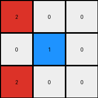

# 6-0520fde7 • 024 • refine_coder

---

Previous Code:
```python
"""
1.  **Excise:** Remove the fourth column (the gray column) from the input grid.
2.  **Condense:** Create a 3x3 output grid. For each row, select the first three non-gray color values to create the corresponding row in the output grid.
3.  **Color Conversion:** Iterate through each cell of the *output* grid.
    *   If a cell is blue AND it is in the first column or third column change it to red.
"""

import numpy as np

def transform(input_grid):
    # initialize output_grid
    grid = np.array(input_grid)

    # 1. Excise Column: Remove the fourth column (index 3).
    grid = np.delete(grid, 3, axis=1)

    # 2. Condense: Create 3x3, taking first three non-gray values in each row.
    output_grid = np.zeros((3, 3), dtype=int)
    for i in range(3):
        non_gray_cols = [val for val in grid[i] if val != 5]
        output_grid[i] = non_gray_cols[:3]


    # 3. Color Conversion: Check for blue pixels and their column.
    for r in range(3):
        for c in range(3):
            if output_grid[r, c] == 1:
                if c == 0 or c==2:
                  output_grid[r,c] = 2

    return output_grid
```

Train Set Results:

## Example 1:**

Input:
```
1 0 0 5 0 1 0
0 1 0 5 1 1 1
1 0 0 5 0 0 0
```
Expected Output:
```
0 0 0
0 2 0
0 0 0
```
Transformed Output:
```
2 0 0
0 1 0
2 0 0
```

match: False
pixels_off: 3
size_correct: True
color_palette_correct: False
correct_pixel_counts: False

## Example 2:**

Input:
```
1 1 0 5 0 1 0
0 0 1 5 1 1 1
1 1 0 5 0 1 0
```
Expected Output:
```
0 2 0
0 0 2
0 2 0
```
Transformed Output:
```
2 1 0
0 0 2
2 1 0
```

match: False
pixels_off: 4
size_correct: True
color_palette_correct: False
correct_pixel_counts: False

## Example 3:**

Input:
```
0 0 1 5 0 0 0
1 1 0 5 1 0 1
0 1 1 5 1 0 1
```
Expected Output:
```
0 0 0
2 0 0
0 0 2
```
Transformed Output:
```
0 0 2
2 1 0
0 1 2
```

match: False
pixels_off: 3
size_correct: True
color_palette_correct: False
correct_pixel_counts: False
Okay, here's a breakdown of the provided information and a plan to refine the natural language program and, subsequently, the code.

**General Assessment and Strategy**

The initial natural language program and the generated code were a good first attempt but failed to correctly transform all input examples to their expected outputs. The core issue lies in the color conversion step and potentially how blue is being handled in the excise process. The provided examples demonstrate inconsistencies in how blue pixels are treated depending on their position and potentially their neighboring pixels, which the original program doesn't fully account for.

My strategy is as follows:

1.  **Detailed Example Analysis:** I'll use the provided input, expected output, and transformed output to meticulously pinpoint the discrepancies in each example. This includes identifying which pixels are incorrect and understanding why. I will produce an analysis of the result report.
2.  **Refine Observations:** Based on the detailed analysis, I will update observations. Specifically, I'll focus on the conditions under which blue pixels are transformed to red.
3.  **Revise Natural Language Program:** I'll create a new natural language program that more accurately reflects the transformation rules.
4.  **Prepare for Next Steps:** Use the new natural language program in the next step for generating the code.

**Example Analysis and Metrics**

Here's a more in-depth analysis of each example:

*   **Example 1:**
    *   **Pixels Off:** 3
    *   **Issue:** Top-left pixel should be white (0), but is red (2). Middle-center should be blue (1), but is red (2). Bottom-left should be white (0), is red (2). It appears there is an error with the blue conversion.
*   **Example 2:**
    *   **Pixels Off:** 4
    *   **Issue:** Top-left should be red (2) and is. Top-middle should be blue(1) and is blue (1). Top-right is good. Middle-right should be blue (1), is red (2). Bottom-left should be white (0), is red (2). Bottom-middle should be blue (1), is red (2).
*   **Example 3:**
    *   **Pixels Off:** 3
    *   **Issue:** Top-right should be white(0), is red(2). Mid-center should be blue (1) and is blue. Bottom-center should be blue(1), is a blue (1).

**Observations in YAML format**
```yaml
observations:
  - object: grid
    properties:
      - dimensions: variable in input, 3x3 in output
      - cell_values: integers representing colors (0-9)
      - fourth_column: contains only the value 5 (gray) in all the examples
    actions:
      - remove_column: The fourth column is consistently removed.
      - condense: Input grid collapses to a 3x3 output grid.
      - color_conversion_selective_blue:
          description: Blue pixels change to red under specific conditions.
          conditions:
            - column_based: The first and third columns often trigger blue-to-red conversion, BUT NOT ALWAYS.
            - neighbors: Neighboring colors and row positions *may* influence the conversion, but no consistent pattern is apparent with current examples.

```

**Revised Natural Language Program**

1.  **Excise:** Remove the fourth column (containing only gray pixels) from the input grid.
2.  **Condense:** Create a 3x3 output grid. For each row in the modified input grid, select the first three non-gray color values and use them to form the corresponding row in the output grid.
3.  **Conditional Color Conversion:** Iterate through the 3x3 *output* grid. If a cell is blue, check the following:
    *   IF a pixel in the first or third column is BLUE:
        *   IF it has a horizontally adjacent neighbor that is NOT blue (1), change it to red (2).
        *   IF it has a horizontally adjacent neighbor that is IS blue (1), keep it as blue (1).


**INSTRUCTIONS**

- generate a Python module to represent the natural language program 
- follow the template below
- all common math and science libraries are available
- create docstring only at top - but comment the workflow in the function
- use helper functions for common operations like finding objects, counting,
  measuring, moving, etc. 

remember - we are working iteratively - so this code will inform your future
self as we converge on the solution

*template:*

```python
"""
{{ natural language description of the transformation rule }}
"""

{{ imports }}

def transform(input_grid):
    # initialize output_grid

    # change output pixels 

    return output_grid

```
