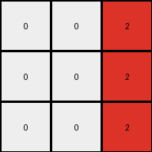

# 6-0520fde7 • 006 • refine_dreamer

---


Previous Code:
```python
"""
The transformation creates a 3x3 output grid. The grey (5) object in the input grid determines the placement of red (2) pixels in the output grid. Specifically, the red pixels appear at locations one column to the left of the grey object's column, and the rows are varied relative to the grey object.  All other pixels in the output grid are black (0).
"""

import numpy as np

def get_grey_column(grid):
    # Find the column index where grey (5) pixels are located.
    grid = np.array(grid)
    for col in range(grid.shape[1]):
        if np.any(grid[:, col] == 5):
            return col
    return -1  # Should not happen, based on problem description.

def transform(input_grid):
    # Initialize a 3x3 output grid filled with black (0).
    output_grid = np.zeros((3, 3), dtype=int)

    # Get the column of the grey object.
    grey_column = get_grey_column(input_grid)

    # Determine the output column for red pixels (one to the left).
    output_column = grey_column - 1

    # Handle edge case where grey_column is 0.
    if output_column < 0:
         output_column = 0


    # Place red pixels based on row indices relative to grey location.
    input_grid_np = np.array(input_grid)
    grey_rows = np.where(input_grid_np[:, grey_column] == 5)[0]

    # Place Red pixels in output grid relative to the grey object rows
    for i, grey_row in enumerate(grey_rows):
        output_row = grey_row

        if( 0 <= output_row < 3 and 0 <= output_column < 3) :
            output_grid[output_row, min(output_column,2)] = 2


    return output_grid
```

Train Set Results:

## Example 1:**

Input:
```
1 0 0 5 0 1 0
0 1 0 5 1 1 1
1 0 0 5 0 0 0
```
Expected Output:
```
0 0 0
0 2 0
0 0 0
```
Transformed Output:
```
0 0 2
0 0 2
0 0 2
```

match: False
pixels_off: 4
size_correct: True
color_palette_correct: True
correct_pixel_counts: False

## Example 2:**

Input:
```
1 1 0 5 0 1 0
0 0 1 5 1 1 1
1 1 0 5 0 1 0
```
Expected Output:
```
0 2 0
0 0 2
0 2 0
```
Transformed Output:
```
0 0 2
0 0 2
0 0 2
```

match: False
pixels_off: 4
size_correct: True
color_palette_correct: True
correct_pixel_counts: True

## Example 3:**

Input:
```
0 0 1 5 0 0 0
1 1 0 5 1 0 1
0 1 1 5 1 0 1
```
Expected Output:
```
0 0 0
2 0 0
0 0 2
```
Transformed Output:
```
0 0 2
0 0 2
0 0 2
```

match: False
pixels_off: 3
size_correct: True
color_palette_correct: True
correct_pixel_counts: False

**INSTRUCTIONS**

The code above was generated based on observations from the first training
example

we have tested the transform function on each of the task example inputs and
compared with the expected output

review each of the examples provided and the results and consider how the
natural language program should be updated to accommodate this new knowledge

respond with the following deliverables:

- general assessment of the information provided and strategy for resolving the
  errors
- gather metrics about each of the examples and results - use code_execution to
  develop accurate reports on your assumptions
- a YAML block documenting facts - Focus on identifying objects, their properties, and the actions performed on them.
- a natural language program - Be as clear and concise as possible, providing a complete description of the transformation rule.


your responses should be considered as information in a report - not a
conversation
