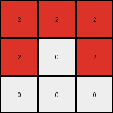

# 6-0520fde7 • 021 • refine_dreamer

---


Previous Code:
```python
"""
1. Initialize: Create an output grid that is 3x3, and filled with white (0).
2. Iterate: Examine each cell of the input grid.
3. Conditional Transformation:
    *   If a cell in the input grid is blue (1), then change the cell in the output grid at the row `i // 2` and column `j // 2` to red (2).
    *   If a cell is not blue, it is ignored, leaving white by default.
"""

import numpy as np

def transform(input_grid):
    # Initialize output_grid as a 3x3 array filled with white (0).
    output_grid = np.zeros((3, 3), dtype=int)

    # Iterate through the input grid.
    rows, cols = input_grid.shape
    for i in range(rows):
        for j in range(cols):
            # If a cell is blue (1), change the corresponding cell in output_grid to red (2).
            if input_grid[i, j] == 1:
                output_row = i // 2
                output_col = j // 2
                if 0 <= output_row < 3 and 0 <= output_col < 3:
                    output_grid[output_row, output_col] = 2

    return output_grid
```

Train Set Results:

## Example 1:**

Input:
```
1 0 0 5 0 1 0
0 1 0 5 1 1 1
1 0 0 5 0 0 0
```
Expected Output:
```
0 0 0
0 2 0
0 0 0
```
Transformed Output:
```
2 0 2
2 0 0
0 0 0
```

match: False
pixels_off: 4
size_correct: True
color_palette_correct: True
correct_pixel_counts: False

## Example 2:**

Input:
```
1 1 0 5 0 1 0
0 0 1 5 1 1 1
1 1 0 5 0 1 0
```
Expected Output:
```
0 2 0
0 0 2
0 2 0
```
Transformed Output:
```
2 2 2
2 0 2
0 0 0
```

match: False
pixels_off: 4
size_correct: True
color_palette_correct: True
correct_pixel_counts: False

## Example 3:**

Input:
```
0 0 1 5 0 0 0
1 1 0 5 1 0 1
0 1 1 5 1 0 1
```
Expected Output:
```
0 0 0
2 0 0
0 0 2
```
Transformed Output:
```
2 2 2
2 2 2
0 0 0
```

match: False
pixels_off: 6
size_correct: True
color_palette_correct: True
correct_pixel_counts: False

**INSTRUCTIONS**

The code above was generated based on observations from the first training
example

we have tested the transform function on each of the task example inputs and
compared with the expected output

review each of the examples provided and the results and consider how the
natural language program should be updated to accommodate this new knowledge

respond with the following deliverables:

- general assessment of the information provided and strategy for resolving the
  errors
- gather metrics about each of the examples and results - use code_execution to
  develop accurate reports on your assumptions
- a YAML block documenting facts - Focus on identifying objects, their properties, and the actions performed on them.
- a natural language program - Be as clear and concise as possible, providing a complete description of the transformation rule.


your responses should be considered as information in a report - not a
conversation
