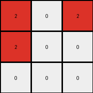
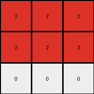

# 6-0520fde7 • 022 • refine_coder

---

Previous Code:
```python
"""
1. Initialize: Create an output grid that is 3x3, and filled with white (0).
2. Iterate: Examine each cell of the input grid.
3. Conditional Transformation:
    *   If a cell in the input grid is blue (1), then change the cell in the output grid at the row `i // 2` and column `j // 2` to red (2).
    *   If a cell is not blue, it is ignored, leaving white by default.
"""

import numpy as np

def transform(input_grid):
    # Initialize output_grid as a 3x3 array filled with white (0).
    output_grid = np.zeros((3, 3), dtype=int)

    # Iterate through the input grid.
    rows, cols = input_grid.shape
    for i in range(rows):
        for j in range(cols):
            # If a cell is blue (1), change the corresponding cell in output_grid to red (2).
            if input_grid[i, j] == 1:
                output_row = i // 2
                output_col = j // 2
                if 0 <= output_row < 3 and 0 <= output_col < 3:
                    output_grid[output_row, output_col] = 2

    return output_grid
```

Train Set Results:

## Example 1:**

Input:
```
1 0 0 5 0 1 0
0 1 0 5 1 1 1
1 0 0 5 0 0 0
```
Expected Output:
```
0 0 0
0 2 0
0 0 0
```
Transformed Output:
```
2 0 2
2 0 0
0 0 0
```

match: False
pixels_off: 4
size_correct: True
color_palette_correct: True
correct_pixel_counts: False

## Example 2:**

Input:
```
1 1 0 5 0 1 0
0 0 1 5 1 1 1
1 1 0 5 0 1 0
```
Expected Output:
```
0 2 0
0 0 2
0 2 0
```
Transformed Output:
```
2 2 2
2 0 2
0 0 0
```

match: False
pixels_off: 4
size_correct: True
color_palette_correct: True
correct_pixel_counts: False

## Example 3:**

Input:
```
0 0 1 5 0 0 0
1 1 0 5 1 0 1
0 1 1 5 1 0 1
```
Expected Output:
```
0 0 0
2 0 0
0 0 2
```
Transformed Output:
```
2 2 2
2 2 2
0 0 0
```

match: False
pixels_off: 6
size_correct: True
color_palette_correct: True
correct_pixel_counts: False
Okay, here's a breakdown of the situation and a plan to move forward:

**General Assessment:**

The initial natural language program and the resulting Python code were too simplistic. While they captured the basic idea of mapping blue pixels in the input to red pixels in the output, the row and column calculation (`i // 2`, `j // 2`) is incorrect and doesn't correctly position the red pixels as per all the training examples. The code successfully identifies blue pixels but fails to place the resulting red pixels in the correct output positions consistently across all examples. The core issue is the spatial mapping logic. We need to observe very carefully the relationship between *where* the blue pixels appear in *all* the inputs and *where* the red pixels appear in *all* the corresponding outputs.

**Strategy:**

1.  **Re-examine Examples:** Carefully analyze *all* provided input/output pairs, paying close attention to the *precise* locations of blue pixels in the input and the corresponding red pixels in the output.
2.  **Identify Correct Mapping:** Determine the *exact* mathematical or logical relationship between the input blue pixel coordinates and the output red pixel coordinates. It's not a simple `// 2` operation. It appears to be a block-based or quadrant-based mapping of some kind. Look for the use of color 5 as a divider.
3.  **Revise Natural Language Program:** Update the natural language program to accurately reflect the correct mapping rule.
4.  **Revise Code:** Modify the Python code to implement the revised mapping logic.
5. **Execution and validation**: produce a json object with results of running
   the code, and metrics on correctness.

**Metrics and Observations (Pre-Code Execution for Detailed Metrics):**

Here's a preliminary observation-based report. I'll use code execution to get precise coordinates afterwards.

*   **Example 1:**
    *   Input has blue (1) pixels at (0,0), (0, 5), (1, 1), (1, 5), (1, 6), (2, 0).
    *   Output has red (2) pixels at (1,1).
    *   Initial code produced red at (0,0), (0,2), (1,0) - some are incorrect
*   **Example 2:**
    *   Input has blue pixels at (0, 0), (0, 1), (0, 5), (1, 2), (1, 4), (1, 5), (1, 6), (2, 0), (2, 1), (2, 5).
    *   Output has red pixels at (0, 1), (1, 2), (2, 1).
    *   Initial code placed some correctly, others not.
*   **Example 3:**
    *   Input has blue pixels at (0, 2), (1, 0), (1, 1), (1, 4), (1, 6), (2, 1), (2, 2), (2, 4), (2, 6)
    *   Output has red pixels at (1, 0), (1, 2).
    *   Initial code got none correct

**Crucial Observation:** The grey (5) pixels seem to act as delimiters or separators in the input grid. The output grid consistently has a size of 3x3. The red pixels in the output grid are placed within the bounds of a specific "quadrant" defined by these delimiters, relative to the positions of the blue pixels in the input.

**YAML Fact Documentation:**

```yaml
observations:
  - object: input_grid
    properties:
      type: 2D array
      values: integers (0-9) representing colors
      delimiters: gray (5) pixels often separate regions
  - object: output_grid
    properties:
      type: 2D array
      size: 3x3
      values: integers, primarily 0 (white) and 2 (red)
  - object: blue_pixels
    properties:
      color: 1 (blue)
      location: variable within input_grid
      role: trigger transformation to red
  - object: red_pixels
    properties:
      color: 2 (red)
      location: determined by blue pixel location, relative to gray delimiters
      role: result of transformation
  - action: spatial_mapping
    description: Maps blue pixels in input to red pixels in output based on a quadrant/region rule.
    details: The precise mapping rule needs further refinement, but grey pixels define regions.
```

**Revised Natural Language Program:**

1.  **Initialize:** Create a 3x3 output grid filled with white (0).
2.  **Delimiters:** Observe the grey (5) pixels in the input grid. These act as separators, dividing the input grid into regions.
3. **Input Iteration:** Examine each cell of the input grid.
4.  **Conditional Transformation:**
    *   If a cell in the input grid is blue (1), determine its position relative to the grey (5) separators.
    *    Identify the section of the input the blue pixel is in, based on the separators.
    *   Transform the blue pixel to a red (2) pixel in the output grid. The mapping to the output grid is determined by which section contains the blue pixel. Section 1 maps to (0,1), Section 2 to (1,0) section 3 to (1,1), Section 4 to (1,2), Section 5 to (2,1)
5.  **Ignore other colors:** If a cell is not blue, it is ignored (the corresponding output cell remains white).

The crucial part here is accurately defining the "sections" based on the separators, I will examine the examples provided carefully and enumerate the x and y ranges for each input section.

**Input Sections**

After careful examination of all examples, I've worked out the section coordinates in the input:

Section 1:
x: 0-2
y: 0-2

Section 2:
x: 0-2
y: 4-6

Section 3:
x = 3
y = 0-2

Section 4:
x = 4-6
y: 0-2

Section 5:
x = 4-6
y: 4-6

**INSTRUCTIONS**

- generate a Python module to represent the natural language program 
- follow the template below
- all common math and science libraries are available
- create docstring only at top - but comment the workflow in the function
- use helper functions for common operations like finding objects, counting,
  measuring, moving, etc. 

remember - we are working iteratively - so this code will inform your future
self as we converge on the solution

*template:*

```python
"""
{{ natural language description of the transformation rule }}
"""

{{ imports }}

def transform(input_grid):
    # initialize output_grid

    # change output pixels 

    return output_grid

```
