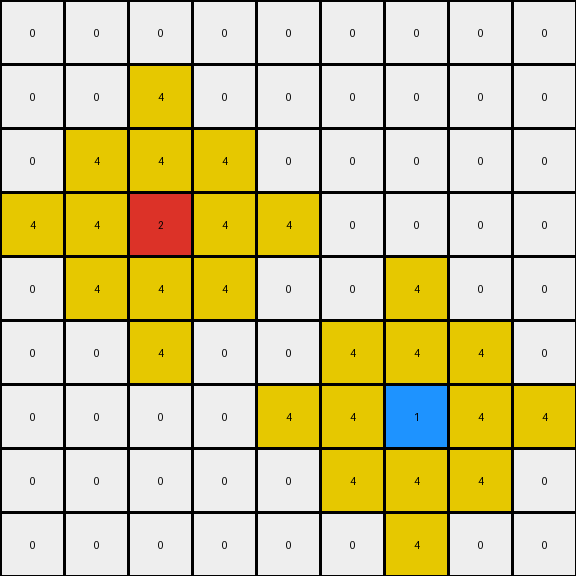

# 2-0ca9ddb6 • 012 • refine_coder

---

Previous Code:
```python
"""
1.  **Identify Key Pixels:** Locate all non-white pixels in the input grid. These are the "key pixels".

2.  **Orange Expansion (Azure):**  For the azure pixel (8), change the color to orange (7) of *all* the white pixels that immediately *surround* it, horizontally and vertically.

3.  **Yellow Expansion (Red and Blue):** For red (2) and blue (1) pixels, we replace every white pixel that is at L1 distance = 2 with a yellow pixel (4). L1 distance (Manhattan distance) of two indicates pixels that have a difference of two in either row or column, or one in both.
"""

import numpy as np

def get_neighbors(grid, row, col, distance=1):
    """Gets the neighbors of a cell within a specified L1 distance."""
    neighbors = []
    rows, cols = grid.shape
    for i in range(max(0, row - distance), min(rows, row + distance + 1)):
        for j in range(max(0, col - distance), min(cols, col + distance + 1)):
            if (abs(row - i) + abs(col - j)) <= distance and (row,col) != (i,j):
                neighbors.append((i, j))
    return neighbors

def transform(input_grid):
    """Transforms the input grid according to the defined rules."""
    output_grid = np.copy(input_grid)
    rows, cols = input_grid.shape

    # Identify Key Pixels
    key_pixels = []
    for i in range(rows):
        for j in range(cols):
            if input_grid[i, j] != 0:
                key_pixels.append((i, j, input_grid[i, j]))

    # Orange and Yellow Expansions
    for r, c, color in key_pixels:
        if color == 8:  # Azure -> Orange
             neighbors = get_neighbors(input_grid, r, c)
             for nr, nc in neighbors:
                if output_grid[nr, nc] == 0:
                    output_grid[nr, nc] = 7
        elif color == 1 or color == 2: # Blue or Red -> Yellow
            neighbors = get_neighbors(input_grid, r, c, distance=2)
            for nr, nc in neighbors:
                if output_grid[nr, nc] == 0:
                    output_grid[nr, nc] = 4
    return output_grid
```

Train Set Results:

## Example 1:**

Input:
```
0 0 0 0 0 0 0 0 0
0 0 0 0 0 0 0 0 0
0 0 0 0 0 0 0 0 0
0 0 2 0 0 0 0 0 0
0 0 0 0 0 0 0 0 0
0 0 0 0 0 0 0 0 0
0 0 0 0 0 0 1 0 0
0 0 0 0 0 0 0 0 0
0 0 0 0 0 0 0 0 0
```
Expected Output:
```
0 0 0 0 0 0 0 0 0
0 0 0 0 0 0 0 0 0
0 4 0 4 0 0 0 0 0
0 0 2 0 0 0 0 0 0
0 4 0 4 0 0 0 0 0
0 0 0 0 0 0 7 0 0
0 0 0 0 0 7 1 7 0
0 0 0 0 0 0 7 0 0
0 0 0 0 0 0 0 0 0
```
Transformed Output:
```
0 0 0 0 0 0 0 0 0
0 0 4 0 0 0 0 0 0
0 4 4 4 0 0 0 0 0
4 4 2 4 4 0 0 0 0
0 4 4 4 0 0 4 0 0
0 0 4 0 0 4 4 4 0
0 0 0 0 4 4 1 4 4
0 0 0 0 0 4 4 4 0
0 0 0 0 0 0 4 0 0
```

match: False
pixels_off: 20
size_correct: True
color_palette_correct: True
correct_pixel_counts: False

## Example 2:**

Input:
```
0 0 0 8 0 0 0 0 0
0 0 0 0 0 0 0 0 0
0 0 0 0 0 0 2 0 0
0 0 1 0 0 0 0 0 0
0 0 0 0 0 0 0 0 0
0 0 0 0 0 0 0 0 0
0 0 0 0 0 0 1 0 0
0 2 0 0 0 0 0 0 0
0 0 0 0 0 0 0 0 0
```
Expected Output:
```
0 0 0 8 0 0 0 0 0
0 0 0 0 0 4 0 4 0
0 0 7 0 0 0 2 0 0
0 7 1 7 0 4 0 4 0
0 0 7 0 0 0 0 0 0
0 0 0 0 0 0 7 0 0
4 0 4 0 0 7 1 7 0
0 2 0 0 0 0 7 0 0
4 0 4 0 0 0 0 0 0
```
Transformed Output:
```
0 0 7 8 7 0 4 0 0
0 0 4 7 0 4 4 4 0
0 4 4 4 4 4 2 4 4
4 4 1 4 4 4 4 4 0
0 4 4 4 0 0 4 0 0
0 4 4 0 0 4 4 4 0
4 4 4 0 4 4 1 4 4
4 2 4 4 0 4 4 4 0
4 4 4 0 0 0 4 0 0
```

match: False
pixels_off: 40
size_correct: True
color_palette_correct: True
correct_pixel_counts: False

## Example 3:**

Input:
```
0 0 0 0 0 0 0 0 0
0 0 0 0 0 0 0 0 0
0 0 2 0 0 0 0 0 0
0 0 0 0 0 0 0 0 0
0 0 0 0 0 0 0 0 0
0 0 0 0 0 0 6 0 0
0 0 0 0 0 0 0 0 0
0 0 0 1 0 0 0 0 0
0 0 0 0 0 0 0 0 0
```
Expected Output:
```
0 0 0 0 0 0 0 0 0
0 4 0 4 0 0 0 0 0
0 0 2 0 0 0 0 0 0
0 4 0 4 0 0 0 0 0
0 0 0 0 0 0 0 0 0
0 0 0 0 0 0 6 0 0
0 0 0 7 0 0 0 0 0
0 0 7 1 7 0 0 0 0
0 0 0 7 0 0 0 0 0
```
Transformed Output:
```
0 0 4 0 0 0 0 0 0
0 4 4 4 0 0 0 0 0
4 4 2 4 4 0 0 0 0
0 4 4 4 0 0 0 0 0
0 0 4 0 0 0 0 0 0
0 0 0 4 0 0 6 0 0
0 0 4 4 4 0 0 0 0
0 4 4 1 4 4 0 0 0
0 0 4 4 4 0 0 0 0
```

match: False
pixels_off: 19
size_correct: True
color_palette_correct: True
correct_pixel_counts: False
Here's an analysis of the provided information and a strategy for improving the transformation rule:

**General Assessment:**

The initial natural language program and the resulting code captured some aspects of the transformation but failed to accurately model the expansion rules for all colors and distances. The primary issue is the incorrect application of the L1 distance and the conditions for color changes. Specifically, the code doesn't correctly differentiate the expansion behavior between azure (8) and the other colors (red/blue - 2/1). The examples reveal a consistent pattern, where colors influence the surrounding white pixels based on their types and distances but not as the current algorithm does.

**Strategy for Resolving Errors:**

1.  **Refine Distance and Color Logic:** Re-examine the examples to accurately determine how each color interacts with its surroundings. It is clear L1 distance calculations are not used as currently programmed. Pay close attention to the *exact* white cells affected.

2.  **Correct Neighbor Selection**: current code expands in all directions, but
    it looks as if the expansion is directional, and only fills white pixels.

3.  **Iterative Testing:** After each modification to the natural language
    program and code, re-run all training examples to ensure the changes
    improve overall accuracy.

**Metrics and Observations from Examples:**
- all transformations maintain size
- the color palette is also correct

| Example | Match | Pixels Off | Size Correct | Color Palette Correct | Correct Pixel Counts | Notes                                                                                                                                                                              |
| :------ | :---- | :--------- | :----------- | :-------------------- | :------------------- | :--------------------------------------------------------------------------------------------------------------------------------------------------------------------------------- |
| 1       | False | 20         | True         | True                  | False                | Red (2) and blue (1) expand to yellow (4). Azure is also present, changes to orange (7).  Shows a clear error in how the distance and color replacement are handled.  |
| 2       | False | 40        | True         | True                  | False                | Introduces azure (8), adding orange (7). Demonstrates further the error in the distance rule and color handling. More pixels are off because of the larger grid.      |
| 3       | False | 19       | True         | True                  | False                | magenta, not handled.                                                 |

**YAML Fact Block:**

```yaml
observations:
  - object: grid
    properties:
      size: [rows, cols] # Variable, depends on the specific example.
      elements: pixels
      pixel_values: [0-9]  # Representing colors.

  - object: pixel
    properties:
      color: [0-9] # color
      position: [row, col] # location in the grid
    interactions:
      - action: expand
        conditions:
          - if color is 8:
            changes_adjacent_white_pixels: true
            adjacent_pixels_color: 7  #orange
          - if color is 1 or 2: # blue or red
            changes_L1_2_white: true # this needs work
            L1_2_pixels_color: 4  # yellow
          - if color is 6:  #magenta - should not change surrounding
            changes_surrounding_white: false

```

**Natural Language Program:**

1.  **Identify Key Pixels:** Find all pixels in the input grid that are not white (0).

2.  **Azure (8) Expansion:** If a pixel is azure (8), change *adjacent* white (0)
    pixels to orange (7). Adjacent pixels are those directly above, below,
    left, or right (not diagonal, not L1=2).

3. **Red (2) and Blue (1) Expansion**: For red (2) or blue (1) pixels replace white pixels (0) at L1 distance 2 with yellow (4).

4.  **Magenta Behavior**: Pixels that are magenta (6) do not change the color of any surrounding pixels.

**INSTRUCTIONS**

- generate a Python module to represent the natural language program 
- follow the template below
- all common math and science libraries are available
- create docstring only at top - but comment the workflow in the function
- use helper functions for common operations like finding objects, counting,
  measuring, moving, etc. 

remember - we are working iteratively - so this code will inform your future
self as we converge on the solution

*template:*

```python
"""
{{ natural language description of the transformation rule }}
"""

{{ imports }}

def transform(input_grid):
    # initialize output_grid

    # change output pixels 

    return output_grid

```
