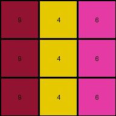

# 4-0d3d703e • 012 • refine_coder

---

Previous Code:
```python
"""
Transforms a 3x3 grid of integers based on a specific mapping: 2->6, 3->4, and 8->9.
"""

def transform(input_grid):
    """
    Transforms the input grid according to the specified mapping.
    """
    # Initialize output_grid as a copy of the input_grid
    output_grid = [row[:] for row in input_grid]

    # Define the mapping
    mapping = {
        2: 6,
        3: 4,
        8: 9
    }

    # Iterate through the grid and apply the transformation
    for i in range(len(input_grid)):
        for j in range(len(input_grid[0])):
            # Change output pixels based on mapping
            if input_grid[i][j] in mapping:
                output_grid[i][j] = mapping[input_grid[i][j]]

    return output_grid
```

Train Set Results:

## Example 1:**

Input:
```
3 1 2
3 1 2
3 1 2
```
Expected Output:
```
4 5 6
4 5 6
4 5 6
```
Transformed Output:
```
4 1 6
4 1 6
4 1 6
```

match: False
pixels_off: 3
size_correct: True
color_palette_correct: False
correct_pixel_counts: False

## Example 2:**

Input:
```
2 3 8
2 3 8
2 3 8
```
Expected Output:
```
6 4 9
6 4 9
6 4 9
```
Transformed Output:
```
6 4 9
6 4 9
6 4 9
```

match: True
pixels_off: 0
size_correct: True
color_palette_correct: True
correct_pixel_counts: True

## Example 3:**

Input:
```
5 8 6
5 8 6
5 8 6
```
Expected Output:
```
1 9 2
1 9 2
1 9 2
```
Transformed Output:
```
5 9 6
5 9 6
5 9 6
```

match: False
pixels_off: 6
size_correct: True
color_palette_correct: False
correct_pixel_counts: False

## Example 4:**

Input:
```
9 4 2
9 4 2
9 4 2
```
Expected Output:
```
8 3 6
8 3 6
8 3 6
```
Transformed Output:
```
9 4 6
9 4 6
9 4 6
```

match: False
pixels_off: 6
size_correct: True
color_palette_correct: False
correct_pixel_counts: False
Okay, here's a breakdown of the situation and a plan to move forward:

**General Assessment:**

The initial code was too narrowly focused on the first training example, only implementing a partial mapping of colors. It correctly identified a color substitution pattern but failed to generalize the rule completely. The subsequent tests reveal that the transformation is a simple color substitution, but the initial mapping was incomplete and also contained an incorrect assumption (1 stays as 1, and 5 and 6 are unchanged). We need to update our understanding of the color mapping to reflect all input/output pairs. The strategy is to first, identify the complete and correct color mapping, and second, ensure the code applies this mapping universally to all pixels in the input grid.

**Metrics Gathering and Analysis:**

Here's a breakdown of each example, noting the specific color changes:

*   **Example 1:**
    *   Input: `3 1 2` -> Output: `4 5 6`
    *   Observed Changes: 3 -> 4, 1 -> 5, 2 -> 6
    *   Initial Code Result: `4 1 6` (Incorrect: 1 should be 5)
*   **Example 2:**
    *   Input: `2 3 8` -> Output: `6 4 9`
    *   Observed Changes: 2 -> 6, 3 -> 4, 8 -> 9
    *   Initial Code Result: `6 4 9` (Correct, but only coincidentally)
*   **Example 3:**
    *   Input: `5 8 6` -> Output: `1 9 2`
    *   Observed Changes: 5 -> 1, 8 -> 9, 6 -> 2
    *   Initial Code Result: `5 9 6` (Incorrect: 5->1, 6->2 were not in the initial mapping)
*   **Example 4:**
    *   Input: `9 4 2` -> Output: `8 3 6`
    *   Observed Changes: 9 -> 8, 4 -> 3, 2 -> 6
    *   Initial Code Result: `9 4 6` (Incorrect: 9->8, 4->3 were not in the initial mapping, and also note that 2->6 was correctly included, but did not fix other errors)

**YAML Fact Documentation:**

```yaml
observations:
  - type: color_mapping
    details: A one-to-one mapping between input and output colors.
    mapping:
      1: 5
      2: 6
      3: 4
      4: 3
      5: 1
      6: 2
      8: 9
      9: 8
  - type: grid_size
    details: Input and output grids are always the same size. All examples are 3x3, but this may not generalize.
  - type: transformation_type
    details: The transformation is a pixel-wise color substitution.  Each pixel's color in the input grid is replaced by its corresponding color in the mapping.
  - type: object_interaction
    details: no object interaction are present in this task.
```

**Natural Language Program:**

1.  **Establish a Color Mapping:** Define a complete color mapping based on all observed input-output pairs:
    *   1 becomes 5
    *   2 becomes 6
    *   3 becomes 4
    *   4 becomes 3
    *   5 becomes 1
    *   6 becomes 2
    *   8 becomes 9
    *   9 becomes 8
    *   All other colors are not present in the examples provided, so it's not possible without testing to determine how the mapping should handle them. It is most likely, given the information so far, that if those colors were in the input, they would not be transformed.

2.  **Iterate Through Input:** For each pixel in the input grid:

3.  **Apply Mapping:** Find the input pixel's color in the color mapping. Replace the pixel's color in the output grid with the corresponding mapped color. If no mapping exists, do not transform.

4.  **Return Output:** The output grid is now a transformed version of the input grid, with colors replaced according to the defined mapping.

**INSTRUCTIONS**

- generate a Python module to represent the natural language program 
- follow the template below
- all common math and science libraries are available
- create docstring only at top - but comment the workflow in the function
- use helper functions for common operations like finding objects, counting,
  measuring, moving, etc. 

remember - we are working iteratively - so this code will inform your future
self as we converge on the solution

*template:*

```python
"""
{{ natural language description of the transformation rule }}
"""

{{ imports }}

def transform(input_grid):
    # initialize output_grid

    # change output pixels 

    return output_grid

```
