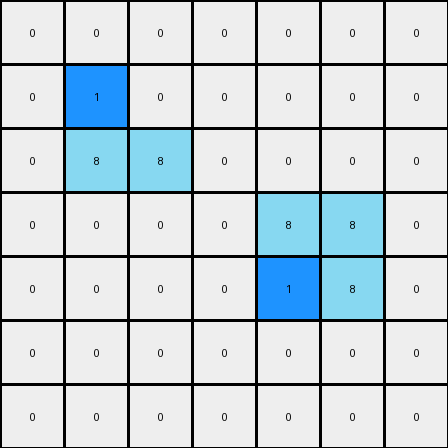
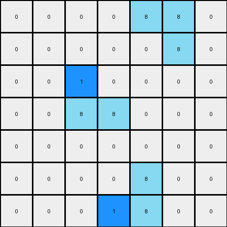

# 1-3aa6fb7a • 003 • refine_dreamer

---


Previous Code:
```python
"""
1.  **Identify Azure Objects:** Locate all contiguous regions (objects) of azure (8) pixels within the input grid.
2.  **Modify Azure Objects:** For each distinct azure object
    a. **Top Left**: Change a pixel inside the azure object to be blue (1)
    b. **Bottom Right**: change a pixel adjacent to the azure object to be blue (1).
"""

import numpy as np

def find_objects(grid, color):
    # Find objects of a specific color in the grid.
    visited = np.zeros_like(grid, dtype=bool)
    objects = []

    def dfs(row, col, current_object):
        if (
            row < 0
            or row >= grid.shape[0]
            or col < 0
            or col >= grid.shape[1]
            or visited[row, col]
            or grid[row, col] != color
        ):
            return
        visited[row, col] = True
        current_object.append((row, col))
        dfs(row + 1, col, current_object)
        dfs(row - 1, col, current_object)
        dfs(row, col + 1, current_object)
        dfs(row, col - 1, current_object)

    for row in range(grid.shape[0]):
        for col in range(grid.shape[1]):
            if grid[row, col] == color and not visited[row, col]:
                current_object = []
                dfs(row, col, current_object)
                objects.append(current_object)
    return objects

def transform(input_grid):
    # Initialize output_grid as a copy of input_grid
    output_grid = np.copy(input_grid)

    # Find azure objects
    azure_objects = find_objects(input_grid, 8)
    
    # Sort objects based on top-left corner coordinates to distinguish top-left and bottom-right
    azure_objects.sort(key=lambda obj: (min(y for x, y in obj), min(x for x, y in obj)))


    # Modify the objects based on their position
    if len(azure_objects) >= 1:
        #top left (replace inside)
        obj1 = azure_objects[0]
        
        #find object centroid
        row_coords, col_coords = zip(*obj1) # Unzip the coordinates
        centroid_row = int(np.mean(row_coords))
        centroid_col = int(np.mean(col_coords))

        output_grid[centroid_row, centroid_col] = 1

    if len(azure_objects) >= 2:
        #bottom right (replace adjacent)
        obj2 = azure_objects[1]
        
        #find object centroid and adjacent
        row_coords, col_coords = zip(*obj2)

        #find object centroid
        centroid_row = int(np.mean(row_coords))
        centroid_col = int(np.mean(col_coords))
        
        output_grid[centroid_row+1, centroid_col] = 1

    return output_grid
```

Train Set Results:

## Example 1:**

Input:
```
0 0 0 0 0 0 0
0 8 0 0 0 0 0
0 8 8 0 0 0 0
0 0 0 0 8 8 0
0 0 0 0 0 8 0
0 0 0 0 0 0 0
0 0 0 0 0 0 0
```
Expected Output:
```
0 0 0 0 0 0 0
0 8 1 0 0 0 0
0 8 8 0 0 0 0
0 0 0 0 8 8 0
0 0 0 0 1 8 0
0 0 0 0 0 0 0
0 0 0 0 0 0 0
```
Transformed Output:
```
0 0 0 0 0 0 0
0 1 0 0 0 0 0
0 8 8 0 0 0 0
0 0 0 0 8 8 0
0 0 0 0 1 8 0
0 0 0 0 0 0 0
0 0 0 0 0 0 0
```

match: False
pixels_off: 2
size_correct: True
color_palette_correct: True
correct_pixel_counts: False

## Example 2:**

Input:
```
0 0 0 0 8 8 0
0 0 0 0 0 8 0
0 0 8 0 0 0 0
0 0 8 8 0 0 0
0 0 0 0 0 0 0
0 0 0 0 8 0 0
0 0 0 8 8 0 0
```
Expected Output:
```
0 0 0 0 8 8 0
0 0 0 0 1 8 0
0 0 8 1 0 0 0
0 0 8 8 0 0 0
0 0 0 0 0 0 0
0 0 0 1 8 0 0
0 0 0 8 8 0 0
```
Transformed Output:
```
0 0 0 0 8 8 0
0 0 0 0 0 8 0
0 0 1 0 0 0 0
0 0 8 8 0 0 0
0 0 0 0 0 0 0
0 0 0 0 8 0 0
0 0 0 1 8 0 0
```

match: False
pixels_off: 5
size_correct: True
color_palette_correct: True
correct_pixel_counts: False

**INSTRUCTIONS**

The code above was generated based on observations from the first training
example

we have tested the transform function on each of the task example inputs and
compared with the expected output

review each of the examples provided and the results and consider how the
natural language program should be updated to accommodate this new knowledge

respond with the following deliverables:

- general assessment of the information provided and strategy for resolving the
  errors
- gather metrics about each of the examples and results - use code_execution to
  develop accurate reports on your assumptions
- a YAML block documenting facts - Focus on identifying objects, their properties, and the actions performed on them.
- a natural language program - Be as clear and concise as possible, providing a complete description of the transformation rule.


your responses should be considered as information in a report - not a
conversation
