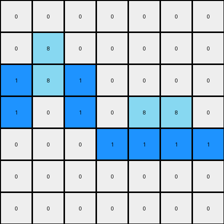
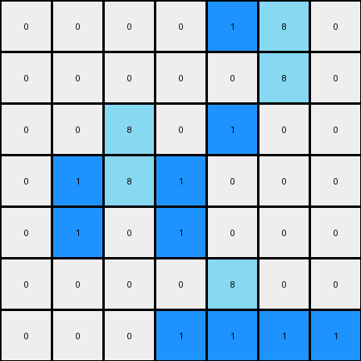

# 1-3aa6fb7a • 011 • refine_dreamer

---

Previous Code:
```python
"""
1.  **Identify:** Locate all azure (8) pixels within the input grid.
2.  **Select:** Determine specific azure pixels to receive adjacent blue pixels.
    There appears to be a rule that adjacent '8' values are treated as
    single objects
    And a diagonal relationships exist between existing '8' values and new
    '1' values, such that the new blue pixel completes an imaginary right
    triangle, where the right angle is a black pixel.

3.  **Introduce:** For the selected azure pixel, check if azure pixel already has an adjacent blue pixel. Add a blue (1) pixel one
    space diagonally, such that the existing azure pixel, a non-azure, non-blue
    pixel, and the new blue pixel form the vertices of a right triangle, where the
    non-azure, non-blue pixel is at the right angle.

4. The specific choice of which eligible '8' to modify seems arbitrary,
   unless we determine a spatial rule that explains this.
   It does appear that the left most and top most azure pixel gets preference.
"""

import numpy as np

def find_azure_pixels(grid):
    # Find coordinates of all azure pixels
    return np.argwhere(grid == 8)

def is_valid(grid, row, col):
    rows, cols = grid.shape
    return 0 <= row < rows and 0<= col < cols

def check_right_triangle(grid, r, c, r_azure, c_azure):
    if not is_valid(grid, r,c): return False

    # check it's the right angle
    if grid[r,c] == 1 or grid[r,c] == 8: return False

    # check opposite side from the azure for out of bounds
    row_diff = r - r_azure
    col_diff = c - c_azure
    if not is_valid(grid, r-row_diff, c-col_diff):
        return False

    # check that it makes a right angle and is a new pixel
    if abs(r - r_azure) + abs(c-c_azure) == 1: return False
    if abs(r - r_azure) > 1 or abs(c - c_azure) > 1: return False
    if grid[r - row_diff, c-col_diff] == 1: return False # already exists

    return True
    
def transform(input_grid):
    # Initialize output_grid as a copy of the input_grid
    output_grid = np.copy(input_grid)
    azure_pixels = find_azure_pixels(output_grid)

    # Iterate through azure pixels and apply transformation rule
    for r_azure, c_azure in azure_pixels:
      for r in range(r_azure -1, r_azure+2):
        for c in range(c_azure -1, c_azure+2):
            if check_right_triangle(output_grid, r,c, r_azure, c_azure):
                output_grid[r - (r-r_azure)*2, c - (c-c_azure)*2] = 1
                

    return output_grid
```

Train Set Results:

## Example 1:**

Input:
```
0 0 0 0 0 0 0
0 8 0 0 0 0 0
0 8 8 0 0 0 0
0 0 0 0 8 8 0
0 0 0 0 0 8 0
0 0 0 0 0 0 0
0 0 0 0 0 0 0
```
Expected Output:
```
0 0 0 0 0 0 0
0 8 1 0 0 0 0
0 8 8 0 0 0 0
0 0 0 0 8 8 0
0 0 0 0 1 8 0
0 0 0 0 0 0 0
0 0 0 0 0 0 0
```
Transformed Output:
```
0 0 0 0 0 0 0
0 8 0 0 0 0 0
1 8 1 0 0 0 0
1 0 1 0 8 8 0
0 0 0 1 1 1 1
0 0 0 0 0 0 0
0 0 0 0 0 0 0
```

match: False
pixels_off: 8
size_correct: True
color_palette_correct: True
correct_pixel_counts: False

## Example 2:**

Input:
```
0 0 0 0 8 8 0
0 0 0 0 0 8 0
0 0 8 0 0 0 0
0 0 8 8 0 0 0
0 0 0 0 0 0 0
0 0 0 0 8 0 0
0 0 0 8 8 0 0
```
Expected Output:
```
0 0 0 0 8 8 0
0 0 0 0 1 8 0
0 0 8 1 0 0 0
0 0 8 8 0 0 0
0 0 0 0 0 0 0
0 0 0 1 8 0 0
0 0 0 8 8 0 0
```
Transformed Output:
```
0 0 0 0 1 8 0
0 0 0 0 0 8 0
0 0 8 0 1 0 0
0 1 8 1 0 0 0
0 1 0 1 0 0 0
0 0 0 0 8 0 0
0 0 0 1 1 1 1
```

match: False
pixels_off: 13
size_correct: True
color_palette_correct: True
correct_pixel_counts: False
**INSTRUCTIONS**

The code above was generated based on observations from the first training
example

we have tested the transform function on each of the task example inputs and
compared with the expected output

review each of the examples provided and the results and consider how the
natural language program should be updated to accommodate this new knowledge

respond with the following deliverables:

- general assessment of the information provided and strategy for resolving the
  errors
- gather metrics about each of the examples and results - use code_execution to
  develop accurate reports on your assumptions
- a YAML block documenting facts - Focus on identifying objects, their properties, and the actions performed on them.
- a natural language program - Be as clear and concise as possible, providing a complete description of the transformation rule.


your responses should be considered as information in a report - not a
conversation
