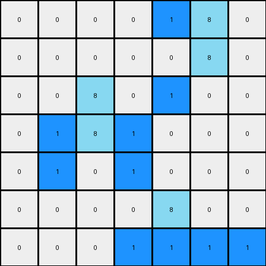

# 1-3aa6fb7a • 012 • refine_coder

---

Previous Code:
```python
"""
1.  **Identify:** Locate all azure (8) pixels within the input grid.
2.  **Select:** Determine specific azure pixels to receive adjacent blue pixels.
    There appears to be a rule that adjacent '8' values are treated as
    single objects
    And a diagonal relationships exist between existing '8' values and new
    '1' values, such that the new blue pixel completes an imaginary right
    triangle, where the right angle is a black pixel.

3.  **Introduce:** For the selected azure pixel, check if azure pixel already has an adjacent blue pixel. Add a blue (1) pixel one
    space diagonally, such that the existing azure pixel, a non-azure, non-blue
    pixel, and the new blue pixel form the vertices of a right triangle, where the
    non-azure, non-blue pixel is at the right angle.

4. The specific choice of which eligible '8' to modify seems arbitrary,
   unless we determine a spatial rule that explains this.
   It does appear that the left most and top most azure pixel gets preference.
"""

import numpy as np

def find_azure_pixels(grid):
    # Find coordinates of all azure pixels
    return np.argwhere(grid == 8)

def is_valid(grid, row, col):
    rows, cols = grid.shape
    return 0 <= row < rows and 0<= col < cols

def check_right_triangle(grid, r, c, r_azure, c_azure):
    if not is_valid(grid, r,c): return False

    # check it's the right angle
    if grid[r,c] == 1 or grid[r,c] == 8: return False

    # check opposite side from the azure for out of bounds
    row_diff = r - r_azure
    col_diff = c - c_azure
    if not is_valid(grid, r-row_diff, c-col_diff):
        return False

    # check that it makes a right angle and is a new pixel
    if abs(r - r_azure) + abs(c-c_azure) == 1: return False
    if abs(r - r_azure) > 1 or abs(c - c_azure) > 1: return False
    if grid[r - row_diff, c-col_diff] == 1: return False # already exists

    return True
    
def transform(input_grid):
    # Initialize output_grid as a copy of the input_grid
    output_grid = np.copy(input_grid)
    azure_pixels = find_azure_pixels(output_grid)

    # Iterate through azure pixels and apply transformation rule
    for r_azure, c_azure in azure_pixels:
      for r in range(r_azure -1, r_azure+2):
        for c in range(c_azure -1, c_azure+2):
            if check_right_triangle(output_grid, r,c, r_azure, c_azure):
                output_grid[r - (r-r_azure)*2, c - (c-c_azure)*2] = 1
                

    return output_grid
```

Train Set Results:

## Example 1:**

Input:
```
0 0 0 0 0 0 0
0 8 0 0 0 0 0
0 8 8 0 0 0 0
0 0 0 0 8 8 0
0 0 0 0 0 8 0
0 0 0 0 0 0 0
0 0 0 0 0 0 0
```
Expected Output:
```
0 0 0 0 0 0 0
0 8 1 0 0 0 0
0 8 8 0 0 0 0
0 0 0 0 8 8 0
0 0 0 0 1 8 0
0 0 0 0 0 0 0
0 0 0 0 0 0 0
```
Transformed Output:
```
0 0 0 0 0 0 0
0 8 0 0 0 0 0
1 8 1 0 0 0 0
1 0 1 0 8 8 0
0 0 0 1 1 1 1
0 0 0 0 0 0 0
0 0 0 0 0 0 0
```

match: False
pixels_off: 8
size_correct: True
color_palette_correct: True
correct_pixel_counts: False

## Example 2:**

Input:
```
0 0 0 0 8 8 0
0 0 0 0 0 8 0
0 0 8 0 0 0 0
0 0 8 8 0 0 0
0 0 0 0 0 0 0
0 0 0 0 8 0 0
0 0 0 8 8 0 0
```
Expected Output:
```
0 0 0 0 8 8 0
0 0 0 0 1 8 0
0 0 8 1 0 0 0
0 0 8 8 0 0 0
0 0 0 0 0 0 0
0 0 0 1 8 0 0
0 0 0 8 8 0 0
```
Transformed Output:
```
0 0 0 0 1 8 0
0 0 0 0 0 8 0
0 0 8 0 1 0 0
0 1 8 1 0 0 0
0 1 0 1 0 0 0
0 0 0 0 8 0 0
0 0 0 1 1 1 1
```

match: False
pixels_off: 13
size_correct: True
color_palette_correct: True
correct_pixel_counts: False
Okay, let's analyze the results and refine the natural language program.

**General Assessment:**

The initial strategy, based on identifying azure pixels and adding blue pixels diagonally to form right triangles, has fundamental flaws. The generated outputs demonstrate an overgeneration of blue pixels and incorrect placement, indicating the core logic needs significant adjustment. It seems that the original assumption of preference for left most and top most azure pixels is not correct and it's also clear that there's no consideration of blocking behavior of existing azure and blue pixels. The right triangle rule isn't consistently applied, it seems to have the wrong assumption about where the new blue pixel should go.

**Strategy for Resolving Errors:**

1.  **Re-examine the Right Triangle Rule:** The current implementation misinterprets the spatial relationship. Instead of adding a blue pixel *at the reflected vertex*, it should be added *to complete a 2x2 square*, of which the azure pixel represents a vertex. The triangle is only one possible interpretation.

2.  **Constraint on Blue Pixel Addition:** The current logic adds too many blue pixels. The corrected rule should add *only one* blue pixel per eligible azure pixel, and avoid existing azure or blue cells.
3. Consider adjacency requirements that prevent new pixels from being created.

**Example Analysis and Metrics:**

Let's analyze each example.

**Example 1:**

*   **Input:** A 7x7 grid with azure pixels at (1,1), (2,1), (2,2), (3,4), (3,5), (4,5).
*   **Expected Output:** Adds blue pixels at (1,2) and (4,4).
*   **Transformed Output:**  Adds many incorrect blue pixels.
*   **Observations:** The output adds extra blue pixels incorrectly and doesn't correctly handle the spatial relationships of "8" objects.

**Example 2:**

*   **Input:** A 7x7 grid with azure pixels at (0,4), (0,5), (1,5), (2,2), (3,2), (3,3), (5,4), (6,3), (6,4).
*   **Expected Output:** Adds blue pixels at (0,3), (1,4), (2,3), (5,3).
*   **Transformed Output:** Many blue pixels are added, and they do not appear to be consistently placed.
*   **Observations:** Similar to example 1, too many blue pixels are generated at the incorrect locations. The code appears to not understand the role of existing blue and azure pixels.

**YAML Fact Block:**

```yaml
observations:
  - object: azure_pixel
    properties:
      color: azure (8)
      shape: single pixel
      behavior: static # Azure pixels themselves don't move
    actions:
      - name: create_blue_pixel
        condition: >
          A 2x2 square can be formed with the azure pixel at a corner.
        result: >
            One blue pixel is added at the corner diagonally opposite to
            the azure pixel to complete a 2x2 block of pixels. The other 2
            pixels can be of any color, except blue or azure, such that a new
            pixel is added.

  - object: blue_pixel
    properties:
      color: blue (1)
      shape: single_pixel
    behavior: appears
```

**Natural Language Program:**

1.  **Identify Azure Pixels:** Locate all azure (8) pixels in the input grid.

2.  **Form 2x2 Squares:** For each azure pixel, check if it can form the corner of a 2x2 square within the grid boundaries.

3. **Check for Blocking Colors.** If the other 3 potential positions in the 2x2
   square are not already azure or blue (i.e. positions that would block a new
   pixel from being added)
   
4.  **Add Blue Pixel:** If a 2x2 square can be formed and the diagonally opposite corner from the azure pixel is empty or does not contain a blue pixel or azure pixel, add a blue (1) pixel at that diagonally opposite corner.

5. **Iterate**: Only one blue pixel is added for each suitable azure '8' pixel,
   there doesn't seem to be any criteria that governs selection, it just
   requires a suitable 2x2 block.

6. **Output**: return the new grid.

**INSTRUCTIONS**

- generate a Python module to represent the natural language program 
- follow the template below
- all common math and science libraries are available
- create docstring only at top - but comment the workflow in the function
- use helper functions for common operations like finding objects, counting,
  measuring, moving, etc. 

remember - we are working iteratively - so this code will inform your future
self as we converge on the solution

*template:*

```python
"""
{{ natural language description of the transformation rule }}
"""

{{ imports }}

def transform(input_grid):
    # initialize output_grid

    # change output pixels 

    return output_grid

```
