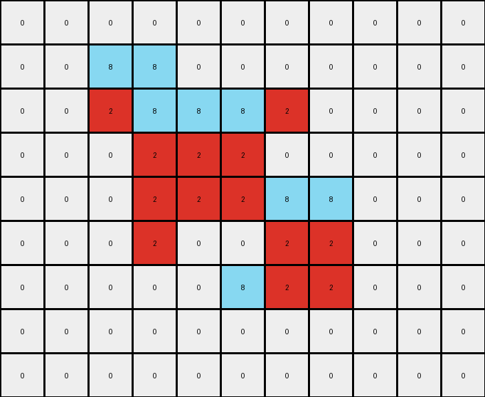
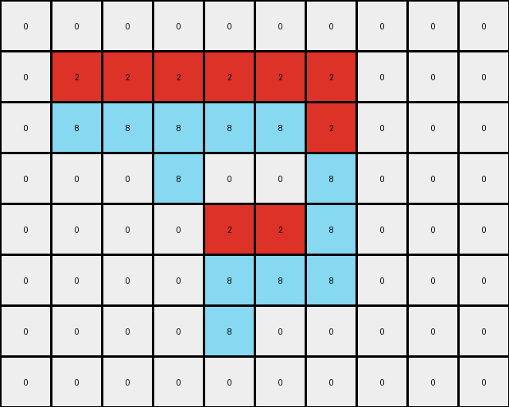
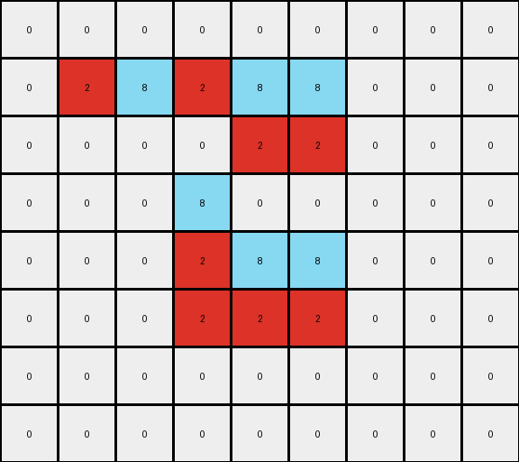

# 5-150deff5 • 021 • refine_dreamer

---


Previous Code:
```python
"""
Identifies contiguous vertical segments of a gray shape (value 5) in the input grid.  Within each segment, it replaces some pixels with red (value 2) and others with azure (value 8), based on a alternating assignment rule. The background (white, value 0) remains unchanged.
"""

import numpy as np

def find_gray_segments(grid):
    """Finds contiguous vertical segments of gray pixels."""
    segments = []
    cols = grid.shape[1]
    rows = grid.shape[0]
    visited = set()

    def is_valid(r, c):
        return 0 <= r < rows and 0 <= c < cols

    def dfs(r, c, current_segment):
        if (r, c) in visited or not is_valid(r, c) or grid[r, c] != 5:
            return
        visited.add((r, c))
        current_segment.append((r, c))
        # Check vertically adjacent cells
        dfs(r + 1, c, current_segment)
        dfs(r - 1, c, current_segment)

    for c in range(cols):
        for r in range(rows):
            if grid[r, c] == 5 and (r, c) not in visited:
                current_segment = []
                dfs(r, c, current_segment)
                if current_segment:
                    segments.append(sorted(current_segment, key=lambda x: (x[1], x[0]))) #sort by col, then row
    return segments

def transform(input_grid):
    """Transforms the input grid according to the described rule."""
    input_grid = np.array(input_grid)
    output_grid = np.copy(input_grid)
    
    segments = find_gray_segments(input_grid)
    
    last_assignment = None # Keep track of last color assigned, initialize as None

    for segment in segments:
        # Determine the color assignment for this segment
        if len(segment) == 1: #single element segments

            col_idx = segment[0][1]
            if last_assignment == 'red':
                assignment = 'azure'
            elif last_assignment == 'azure':
                assignment = 'red'
            elif col_idx % 2 == 1: #odd column
                assignment = 'red'
            else: #even column
                assignment = 'azure'

            r, c = segment[0]
            if assignment == 'red':
              output_grid[r,c] = 2
            else:
              output_grid[r,c] = 8
            last_assignment = assignment


        else:  # multi-element segments
            if last_assignment == 'red':
                first_assignment = 'azure'
                second_assignment = 'red'
            elif last_assignment == 'azure':
                first_assignment = 'red'
                second_assignment = 'azure'
            elif segment[0][1] % 2 == 1:  #odd
                first_assignment = 'red'
                second_assignment = 'azure'
            else: #even
                first_assignment = 'azure'
                second_assignment = 'red'

            midpoint = len(segment) // 2
            for i, (r, c) in enumerate(segment):
              if i < midpoint:
                if first_assignment == 'red':
                    output_grid[r, c] = 2
                else:
                    output_grid[r,c] = 8
              else:
                if second_assignment == 'red':
                  output_grid[r, c] = 2
                else:
                    output_grid[r, c] = 8
            last_assignment = second_assignment
    return output_grid.tolist()
```

Train Set Results:

## Example 1:**

Input:
```
0 0 0 0 0 0 0 0 0 0 0
0 0 5 5 0 0 0 0 0 0 0
0 0 5 5 5 5 5 0 0 0 0
0 0 0 5 5 5 0 0 0 0 0
0 0 0 5 5 5 5 5 0 0 0
0 0 0 5 0 0 5 5 0 0 0
0 0 0 0 0 5 5 5 0 0 0
0 0 0 0 0 0 0 0 0 0 0
0 0 0 0 0 0 0 0 0 0 0
```
Expected Output:
```
0 0 0 0 0 0 0 0 0 0 0
0 0 8 8 0 0 0 0 0 0 0
0 0 8 8 2 2 2 0 0 0 0
0 0 0 2 8 8 0 0 0 0 0
0 0 0 2 8 8 8 8 0 0 0
0 0 0 2 0 0 8 8 0 0 0
0 0 0 0 0 2 2 2 0 0 0
0 0 0 0 0 0 0 0 0 0 0
0 0 0 0 0 0 0 0 0 0 0
```
Transformed Output:
```
0 0 0 0 0 0 0 0 0 0 0
0 0 8 8 0 0 0 0 0 0 0
0 0 2 8 8 8 2 0 0 0 0
0 0 0 2 2 2 0 0 0 0 0
0 0 0 2 2 2 8 8 0 0 0
0 0 0 2 0 0 2 2 0 0 0
0 0 0 0 0 8 2 2 0 0 0
0 0 0 0 0 0 0 0 0 0 0
0 0 0 0 0 0 0 0 0 0 0
```

match: False
pixels_off: 10
size_correct: True
color_palette_correct: True
correct_pixel_counts: False

## Example 2:**

Input:
```
0 0 0 0 0 0 0 0 0 0
0 5 5 5 5 5 5 0 0 0
0 5 5 5 5 5 5 0 0 0
0 0 0 5 0 0 5 0 0 0
0 0 0 0 5 5 5 0 0 0
0 0 0 0 5 5 5 0 0 0
0 0 0 0 5 0 0 0 0 0
0 0 0 0 0 0 0 0 0 0
```
Expected Output:
```
0 0 0 0 0 0 0 0 0 0
0 8 8 2 8 8 2 0 0 0
0 8 8 2 8 8 2 0 0 0
0 0 0 2 0 0 2 0 0 0
0 0 0 0 2 8 8 0 0 0
0 0 0 0 2 8 8 0 0 0
0 0 0 0 2 0 0 0 0 0
0 0 0 0 0 0 0 0 0 0
```
Transformed Output:
```
0 0 0 0 0 0 0 0 0 0
0 2 2 2 2 2 2 0 0 0
0 8 8 8 8 8 2 0 0 0
0 0 0 8 0 0 8 0 0 0
0 0 0 0 2 2 8 0 0 0
0 0 0 0 8 8 8 0 0 0
0 0 0 0 8 0 0 0 0 0
0 0 0 0 0 0 0 0 0 0
```

match: False
pixels_off: 10
size_correct: True
color_palette_correct: True
correct_pixel_counts: True

## Example 3:**

Input:
```
0 0 0 0 0 0 0 0 0
0 5 5 5 5 5 0 0 0
0 0 0 0 5 5 0 0 0
0 0 0 5 0 0 0 0 0
0 0 0 5 5 5 0 0 0
0 0 0 5 5 5 0 0 0
0 0 0 0 0 0 0 0 0
0 0 0 0 0 0 0 0 0
```
Expected Output:
```
0 0 0 0 0 0 0 0 0
0 2 2 2 8 8 0 0 0
0 0 0 0 8 8 0 0 0
0 0 0 2 0 0 0 0 0
0 0 0 2 8 8 0 0 0
0 0 0 2 8 8 0 0 0
0 0 0 0 0 0 0 0 0
0 0 0 0 0 0 0 0 0
```
Transformed Output:
```
0 0 0 0 0 0 0 0 0
0 2 8 2 8 8 0 0 0
0 0 0 0 2 2 0 0 0
0 0 0 8 0 0 0 0 0
0 0 0 2 8 8 0 0 0
0 0 0 2 2 2 0 0 0
0 0 0 0 0 0 0 0 0
0 0 0 0 0 0 0 0 0
```

match: False
pixels_off: 6
size_correct: True
color_palette_correct: True
correct_pixel_counts: False

**INSTRUCTIONS**

The code above was generated based on observations from the first training
example

we have tested the transform function on each of the task example inputs and
compared with the expected output

review each of the examples provided and the results and consider how the
natural language program should be updated to accommodate this new knowledge

respond with the following deliverables:

- general assessment of the information provided and strategy for resolving the
  errors
- gather metrics about each of the examples and results - use code_execution to
  develop accurate reports on your assumptions
- a YAML block documenting facts - Focus on identifying objects, their properties, and the actions performed on them.
- a natural language program - Be as clear and concise as possible, providing a complete description of the transformation rule.


your responses should be considered as information in a report - not a
conversation
