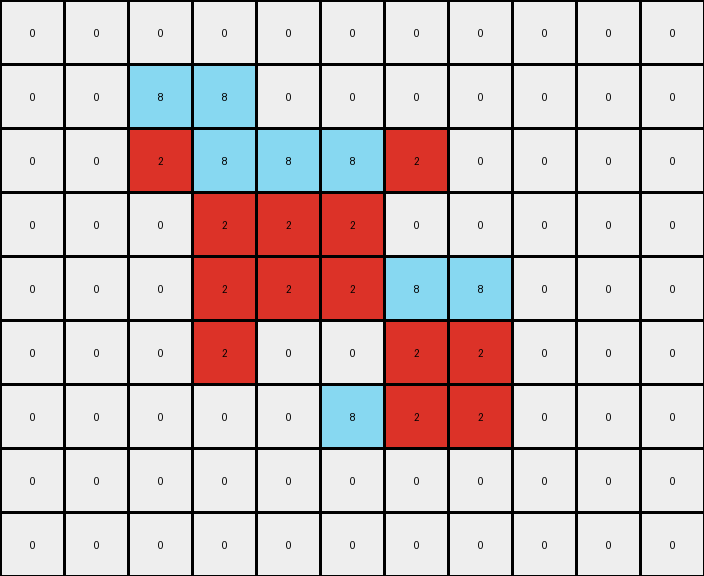
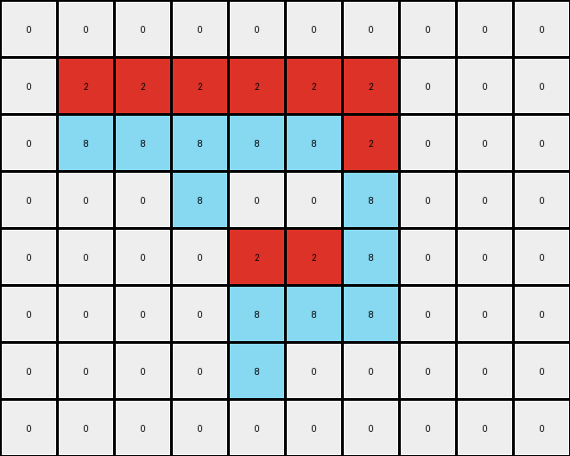
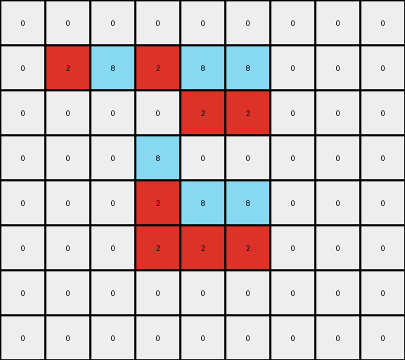

# 5-150deff5 • 022 • refine_coder

---

Previous Code:
```python
"""
Identifies contiguous vertical segments of a gray shape (value 5) in the input grid.  Within each segment, it replaces some pixels with red (value 2) and others with azure (value 8), based on a alternating assignment rule. The background (white, value 0) remains unchanged.
"""

import numpy as np

def find_gray_segments(grid):
    """Finds contiguous vertical segments of gray pixels."""
    segments = []
    cols = grid.shape[1]
    rows = grid.shape[0]
    visited = set()

    def is_valid(r, c):
        return 0 <= r < rows and 0 <= c < cols

    def dfs(r, c, current_segment):
        if (r, c) in visited or not is_valid(r, c) or grid[r, c] != 5:
            return
        visited.add((r, c))
        current_segment.append((r, c))
        # Check vertically adjacent cells
        dfs(r + 1, c, current_segment)
        dfs(r - 1, c, current_segment)

    for c in range(cols):
        for r in range(rows):
            if grid[r, c] == 5 and (r, c) not in visited:
                current_segment = []
                dfs(r, c, current_segment)
                if current_segment:
                    segments.append(sorted(current_segment, key=lambda x: (x[1], x[0]))) #sort by col, then row
    return segments

def transform(input_grid):
    """Transforms the input grid according to the described rule."""
    input_grid = np.array(input_grid)
    output_grid = np.copy(input_grid)
    
    segments = find_gray_segments(input_grid)
    
    last_assignment = None # Keep track of last color assigned, initialize as None

    for segment in segments:
        # Determine the color assignment for this segment
        if len(segment) == 1: #single element segments

            col_idx = segment[0][1]
            if last_assignment == 'red':
                assignment = 'azure'
            elif last_assignment == 'azure':
                assignment = 'red'
            elif col_idx % 2 == 1: #odd column
                assignment = 'red'
            else: #even column
                assignment = 'azure'

            r, c = segment[0]
            if assignment == 'red':
              output_grid[r,c] = 2
            else:
              output_grid[r,c] = 8
            last_assignment = assignment


        else:  # multi-element segments
            if last_assignment == 'red':
                first_assignment = 'azure'
                second_assignment = 'red'
            elif last_assignment == 'azure':
                first_assignment = 'red'
                second_assignment = 'azure'
            elif segment[0][1] % 2 == 1:  #odd
                first_assignment = 'red'
                second_assignment = 'azure'
            else: #even
                first_assignment = 'azure'
                second_assignment = 'red'

            midpoint = len(segment) // 2
            for i, (r, c) in enumerate(segment):
              if i < midpoint:
                if first_assignment == 'red':
                    output_grid[r, c] = 2
                else:
                    output_grid[r,c] = 8
              else:
                if second_assignment == 'red':
                  output_grid[r, c] = 2
                else:
                    output_grid[r, c] = 8
            last_assignment = second_assignment
    return output_grid.tolist()
```

Train Set Results:

## Example 1:**

Input:
```
0 0 0 0 0 0 0 0 0 0 0
0 0 5 5 0 0 0 0 0 0 0
0 0 5 5 5 5 5 0 0 0 0
0 0 0 5 5 5 0 0 0 0 0
0 0 0 5 5 5 5 5 0 0 0
0 0 0 5 0 0 5 5 0 0 0
0 0 0 0 0 5 5 5 0 0 0
0 0 0 0 0 0 0 0 0 0 0
0 0 0 0 0 0 0 0 0 0 0
```
Expected Output:
```
0 0 0 0 0 0 0 0 0 0 0
0 0 8 8 0 0 0 0 0 0 0
0 0 8 8 2 2 2 0 0 0 0
0 0 0 2 8 8 0 0 0 0 0
0 0 0 2 8 8 8 8 0 0 0
0 0 0 2 0 0 8 8 0 0 0
0 0 0 0 0 2 2 2 0 0 0
0 0 0 0 0 0 0 0 0 0 0
0 0 0 0 0 0 0 0 0 0 0
```
Transformed Output:
```
0 0 0 0 0 0 0 0 0 0 0
0 0 8 8 0 0 0 0 0 0 0
0 0 2 8 8 8 2 0 0 0 0
0 0 0 2 2 2 0 0 0 0 0
0 0 0 2 2 2 8 8 0 0 0
0 0 0 2 0 0 2 2 0 0 0
0 0 0 0 0 8 2 2 0 0 0
0 0 0 0 0 0 0 0 0 0 0
0 0 0 0 0 0 0 0 0 0 0
```

match: False
pixels_off: 10
size_correct: True
color_palette_correct: True
correct_pixel_counts: False

## Example 2:**

Input:
```
0 0 0 0 0 0 0 0 0 0
0 5 5 5 5 5 5 0 0 0
0 5 5 5 5 5 5 0 0 0
0 0 0 5 0 0 5 0 0 0
0 0 0 0 5 5 5 0 0 0
0 0 0 0 5 5 5 0 0 0
0 0 0 0 5 0 0 0 0 0
0 0 0 0 0 0 0 0 0 0
```
Expected Output:
```
0 0 0 0 0 0 0 0 0 0
0 8 8 2 8 8 2 0 0 0
0 8 8 2 8 8 2 0 0 0
0 0 0 2 0 0 2 0 0 0
0 0 0 0 2 8 8 0 0 0
0 0 0 0 2 8 8 0 0 0
0 0 0 0 2 0 0 0 0 0
0 0 0 0 0 0 0 0 0 0
```
Transformed Output:
```
0 0 0 0 0 0 0 0 0 0
0 2 2 2 2 2 2 0 0 0
0 8 8 8 8 8 2 0 0 0
0 0 0 8 0 0 8 0 0 0
0 0 0 0 2 2 8 0 0 0
0 0 0 0 8 8 8 0 0 0
0 0 0 0 8 0 0 0 0 0
0 0 0 0 0 0 0 0 0 0
```

match: False
pixels_off: 10
size_correct: True
color_palette_correct: True
correct_pixel_counts: True

## Example 3:**

Input:
```
0 0 0 0 0 0 0 0 0
0 5 5 5 5 5 0 0 0
0 0 0 0 5 5 0 0 0
0 0 0 5 0 0 0 0 0
0 0 0 5 5 5 0 0 0
0 0 0 5 5 5 0 0 0
0 0 0 0 0 0 0 0 0
0 0 0 0 0 0 0 0 0
```
Expected Output:
```
0 0 0 0 0 0 0 0 0
0 2 2 2 8 8 0 0 0
0 0 0 0 8 8 0 0 0
0 0 0 2 0 0 0 0 0
0 0 0 2 8 8 0 0 0
0 0 0 2 8 8 0 0 0
0 0 0 0 0 0 0 0 0
0 0 0 0 0 0 0 0 0
```
Transformed Output:
```
0 0 0 0 0 0 0 0 0
0 2 8 2 8 8 0 0 0
0 0 0 0 2 2 0 0 0
0 0 0 8 0 0 0 0 0
0 0 0 2 8 8 0 0 0
0 0 0 2 2 2 0 0 0
0 0 0 0 0 0 0 0 0
0 0 0 0 0 0 0 0 0
```

match: False
pixels_off: 6
size_correct: True
color_palette_correct: True
correct_pixel_counts: False
Okay, here's an assessment of the situation and a plan to move forward:

**General Assessment:**

The current code attempts to identify vertical segments of gray pixels and then replace them with alternating red and azure pixels. The logic for alternation seems overly complex and is based on incorrect assumptions about how the colors are assigned within and between segments. The results show mismatches in all three examples, indicating problems with the core color assignment logic. The code also has an unnecessary depth-first search (DFS) to find gray segments when a simple iteration would suffice, making it less efficient. The code has an incorrect strategy for how to handle single element segments.

**Strategy for Resolving Errors:**

1.  **Simplify Segment Finding:** Replace the DFS with a straightforward iteration through columns and rows to identify gray segments. This will improve efficiency and readability.

2.  **Correct Color Assignment:** Rethink the color assignment logic. The current logic involving `last_assignment` and column parity is not consistent with the observed examples. Observe the pattern in all 3 examples and build rules which handle those cases, such as:
    *   Within each vertical gray segment, there's a simple alternating pattern of red and azure.
    *   There's not a simple consistent pattern for the start color between columns.

3.  **Iterative Refinement:** Test the updated code after each significant change to ensure the modifications are moving towards the correct solution.

**Metrics and Observations:**

Here's a breakdown of each example, including metrics and observations:

*   **Example 1:**
    *   Pixels Off: 10
    *   Observations: The color assignment is consistently off. The top half of the segments should be azure, and the bottom red. The single element columns are inconsistent.

*   **Example 2:**
    *   Pixels Off: 10
    *   Observations: The top half assignment is incorrect and inconsistent.

*   **Example 3:**
    *   Pixels off: 6
    *    Observations: errors similar to examples 1 & 2

**YAML Block - Facts:**

```yaml
task_id: 020
objects:
  - id: gray_segments
    type: vertical_segment
    color: gray (5)
    properties:
      - contiguous: true
      - vertical: true
actions:
  - name: replace_color
    input: gray_segments
    parameters:
      - color1: red (2)
      - color2: azure (8)
    rule: "Alternating pattern within each segment, independent pattern between segments."

```

**Natural Language Program:**

1.  **Find Gray Segments:** Iterate through the input grid, column by column, and then row by row. Identify contiguous vertical segments of gray (value 5) pixels.

2.  **Color Replacement:** For each identified gray segment:
    *   Iterate through the pixels in the segment.
    *   Starting with the first pixel in the segment, assign colors in an alternating pattern of azure and red. For the segment, index the pixels starting at 0. Replace pixels with even indexes with azure, and odd indexes with red.

3.  **Background Preservation:** Leave all non-gray pixels (background) unchanged.

**INSTRUCTIONS**

- generate a Python module to represent the natural language program 
- follow the template below
- all common math and science libraries are available
- create docstring only at top - but comment the workflow in the function
- use helper functions for common operations like finding objects, counting,
  measuring, moving, etc. 

remember - we are working iteratively - so this code will inform your future
self as we converge on the solution

*template:*

```python
"""
{{ natural language description of the transformation rule }}
"""

{{ imports }}

def transform(input_grid):
    # initialize output_grid

    # change output pixels 

    return output_grid

```
