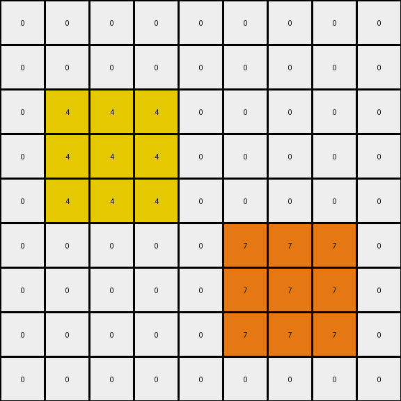

# 2-0ca9ddb6 • 003 • refine_dreamer

---


Previous Code:
```python
"""
1.  **Identify Key Pixels:** Locate the red (2) and blue (1) pixels within the input grid.
2.  **Create Yellow Region:** For the red (2) pixel, replace the pixels in the input to create a 3x3 square region centered on the location of the original red pixel. Change these pixels to yellow (4).
3.  **Create Orange Region:** For the blue (1) pixel, replace the pixels in the input to create a 3x3 square region centered on the location of the original blue pixel. Change the pixels to orange (7).
4. **Preserve:** any pixels not within the 3x3 regions of the red and blue pixel will be unchanged
5.  **Output:** The modified grid is the output grid.
"""

import numpy as np

def find_pixel(grid, color):
    # Find the coordinates of a specific color pixel.
    coords = np.where(grid == color)
    if len(coords[0]) > 0:
        return (coords[0][0], coords[1][0])  # Return first occurrence
    return None

def transform(input_grid):
    # Initialize output_grid as a copy of input_grid
    output_grid = np.copy(input_grid)

    # Find the red (2) pixel
    red_pixel_coords = find_pixel(input_grid, 2)
    if red_pixel_coords:
        # Create a 3x3 yellow (4) region around the red pixel
        row, col = red_pixel_coords
        for i in range(max(0, row - 1), min(output_grid.shape[0], row + 2)):
            for j in range(max(0, col - 1), min(output_grid.shape[1], col + 2)):
                output_grid[i, j] = 4

    # Find the blue (1) pixel
    blue_pixel_coords = find_pixel(input_grid, 1)
    if blue_pixel_coords:
        # Create a 3x3 orange (7) region around the blue pixel
        row, col = blue_pixel_coords
        for i in range(max(0, row - 1), min(output_grid.shape[0], row + 2)):
            for j in range(max(0, col - 1), min(output_grid.shape[1], col + 2)):
                output_grid[i, j] = 7

    return output_grid
```

Train Set Results:

## Example 1:**

Input:
```
0 0 0 0 0 0 0 0 0
0 0 0 0 0 0 0 0 0
0 0 0 0 0 0 0 0 0
0 0 2 0 0 0 0 0 0
0 0 0 0 0 0 0 0 0
0 0 0 0 0 0 0 0 0
0 0 0 0 0 0 1 0 0
0 0 0 0 0 0 0 0 0
0 0 0 0 0 0 0 0 0
```
Expected Output:
```
0 0 0 0 0 0 0 0 0
0 0 0 0 0 0 0 0 0
0 4 0 4 0 0 0 0 0
0 0 2 0 0 0 0 0 0
0 4 0 4 0 0 0 0 0
0 0 0 0 0 0 7 0 0
0 0 0 0 0 7 1 7 0
0 0 0 0 0 0 7 0 0
0 0 0 0 0 0 0 0 0
```
Transformed Output:
```
0 0 0 0 0 0 0 0 0
0 0 0 0 0 0 0 0 0
0 4 4 4 0 0 0 0 0
0 4 4 4 0 0 0 0 0
0 4 4 4 0 0 0 0 0
0 0 0 0 0 7 7 7 0
0 0 0 0 0 7 7 7 0
0 0 0 0 0 7 7 7 0
0 0 0 0 0 0 0 0 0
```

match: False
pixels_off: 10
size_correct: True
color_palette_correct: True
correct_pixel_counts: False

## Example 2:**

Input:
```
0 0 0 8 0 0 0 0 0
0 0 0 0 0 0 0 0 0
0 0 0 0 0 0 2 0 0
0 0 1 0 0 0 0 0 0
0 0 0 0 0 0 0 0 0
0 0 0 0 0 0 0 0 0
0 0 0 0 0 0 1 0 0
0 2 0 0 0 0 0 0 0
0 0 0 0 0 0 0 0 0
```
Expected Output:
```
0 0 0 8 0 0 0 0 0
0 0 0 0 0 4 0 4 0
0 0 7 0 0 0 2 0 0
0 7 1 7 0 4 0 4 0
0 0 7 0 0 0 0 0 0
0 0 0 0 0 0 7 0 0
4 0 4 0 0 7 1 7 0
0 2 0 0 0 0 7 0 0
4 0 4 0 0 0 0 0 0
```
Transformed Output:
```
0 0 0 8 0 0 0 0 0
0 0 0 0 0 4 4 4 0
0 7 7 7 0 4 4 4 0
0 7 7 7 0 4 4 4 0
0 7 7 7 0 0 0 0 0
0 0 0 0 0 0 0 0 0
0 0 0 0 0 0 1 0 0
0 2 0 0 0 0 0 0 0
0 0 0 0 0 0 0 0 0
```

match: False
pixels_off: 18
size_correct: True
color_palette_correct: True
correct_pixel_counts: False

## Example 3:**

Input:
```
0 0 0 0 0 0 0 0 0
0 0 0 0 0 0 0 0 0
0 0 2 0 0 0 0 0 0
0 0 0 0 0 0 0 0 0
0 0 0 0 0 0 0 0 0
0 0 0 0 0 0 6 0 0
0 0 0 0 0 0 0 0 0
0 0 0 1 0 0 0 0 0
0 0 0 0 0 0 0 0 0
```
Expected Output:
```
0 0 0 0 0 0 0 0 0
0 4 0 4 0 0 0 0 0
0 0 2 0 0 0 0 0 0
0 4 0 4 0 0 0 0 0
0 0 0 0 0 0 0 0 0
0 0 0 0 0 0 6 0 0
0 0 0 7 0 0 0 0 0
0 0 7 1 7 0 0 0 0
0 0 0 7 0 0 0 0 0
```
Transformed Output:
```
0 0 0 0 0 0 0 0 0
0 4 4 4 0 0 0 0 0
0 4 4 4 0 0 0 0 0
0 4 4 4 0 0 0 0 0
0 0 0 0 0 0 0 0 0
0 0 0 0 0 0 6 0 0
0 0 7 7 7 0 0 0 0
0 0 7 7 7 0 0 0 0
0 0 7 7 7 0 0 0 0
```

match: False
pixels_off: 10
size_correct: True
color_palette_correct: True
correct_pixel_counts: False

**INSTRUCTIONS**

The code above was generated based on observations from the first training
example

we have tested the transform function on each of the task example inputs and
compared with the expected output

review each of the examples provided and the results and consider how the
natural language program should be updated to accommodate this new knowledge

respond with the following deliverables:

- general assessment of the information provided and strategy for resolving the
  errors
- gather metrics about each of the examples and results - use code_execution to
  develop accurate reports on your assumptions
- a YAML block documenting facts - Focus on identifying objects, their properties, and the actions performed on them.
- a natural language program - Be as clear and concise as possible, providing a complete description of the transformation rule.


your responses should be considered as information in a report - not a
conversation
