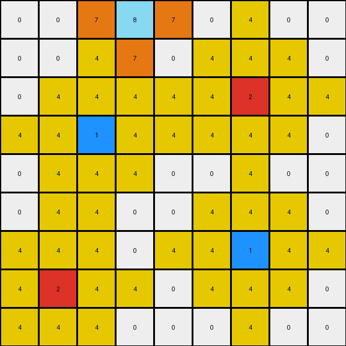

# 2-0ca9ddb6 • 014 • refine_coder

---

Previous Code:
```python
"""
1.  **Identify Key Pixels:** Find all pixels in the input grid that are not white (0).

2.  **Azure (8) Expansion:** If a pixel is azure (8), change *adjacent* white (0)
    pixels to orange (7). Adjacent pixels are those directly above, below,
    left, or right (not diagonal, not L1=2).

3. **Red (2) and Blue (1) Expansion**: For red (2) or blue (1) pixels replace white pixels (0) at L1 distance 2 with yellow (4).

4.  **Magenta Behavior**: Pixels that are magenta (6) do not change the color of any surrounding pixels.
"""

import numpy as np

def get_neighbors(grid, row, col, distance=1):
    """Gets the neighbors of a cell within a specified L1 distance."""
    neighbors = []
    rows, cols = grid.shape
    for i in range(max(0, row - distance), min(rows, row + distance + 1)):
        for j in range(max(0, col - distance), min(cols, col + distance + 1)):
            if (abs(row - i) + abs(col - j)) <= distance and (row,col) != (i,j):
                neighbors.append((i, j))
    return neighbors

def transform(input_grid):
    # initialize output_grid
    output_grid = np.copy(input_grid)
    rows, cols = input_grid.shape

    # Identify Key Pixels
    key_pixels = []
    for i in range(rows):
        for j in range(cols):
            if input_grid[i, j] != 0:
                key_pixels.append((i, j, input_grid[i, j]))

    # change output pixels
    for r, c, color in key_pixels:
        # Azure (8) Expansion
        if color == 8:
             neighbors = get_neighbors(input_grid, r, c) # distance = 1, default
             for nr, nc in neighbors:
                if output_grid[nr, nc] == 0:  # Check if white
                    output_grid[nr, nc] = 7   # Change to orange

        # Red (2) and Blue (1) Expansion
        elif color == 1 or color == 2:
            neighbors = get_neighbors(input_grid, r, c, distance=2)
            for nr, nc in neighbors:
                if output_grid[nr, nc] == 0:   # Check if white
                    output_grid[nr, nc] = 4    # Change to Yellow

        # Magenta (6) behavior - no change
        elif color == 6:
            pass  # Do nothing.

    return output_grid
```

Train Set Results:

## Example 1:**

Input:
```
0 0 0 0 0 0 0 0 0
0 0 0 0 0 0 0 0 0
0 0 0 0 0 0 0 0 0
0 0 2 0 0 0 0 0 0
0 0 0 0 0 0 0 0 0
0 0 0 0 0 0 0 0 0
0 0 0 0 0 0 1 0 0
0 0 0 0 0 0 0 0 0
0 0 0 0 0 0 0 0 0
```
Expected Output:
```
0 0 0 0 0 0 0 0 0
0 0 0 0 0 0 0 0 0
0 4 0 4 0 0 0 0 0
0 0 2 0 0 0 0 0 0
0 4 0 4 0 0 0 0 0
0 0 0 0 0 0 7 0 0
0 0 0 0 0 7 1 7 0
0 0 0 0 0 0 7 0 0
0 0 0 0 0 0 0 0 0
```
Transformed Output:
```
0 0 0 0 0 0 0 0 0
0 0 4 0 0 0 0 0 0
0 4 4 4 0 0 0 0 0
4 4 2 4 4 0 0 0 0
0 4 4 4 0 0 4 0 0
0 0 4 0 0 4 4 4 0
0 0 0 0 4 4 1 4 4
0 0 0 0 0 4 4 4 0
0 0 0 0 0 0 4 0 0
```

match: False
pixels_off: 20
size_correct: True
color_palette_correct: True
correct_pixel_counts: False

## Example 2:**

Input:
```
0 0 0 8 0 0 0 0 0
0 0 0 0 0 0 0 0 0
0 0 0 0 0 0 2 0 0
0 0 1 0 0 0 0 0 0
0 0 0 0 0 0 0 0 0
0 0 0 0 0 0 0 0 0
0 0 0 0 0 0 1 0 0
0 2 0 0 0 0 0 0 0
0 0 0 0 0 0 0 0 0
```
Expected Output:
```
0 0 0 8 0 0 0 0 0
0 0 0 0 0 4 0 4 0
0 0 7 0 0 0 2 0 0
0 7 1 7 0 4 0 4 0
0 0 7 0 0 0 0 0 0
0 0 0 0 0 0 7 0 0
4 0 4 0 0 7 1 7 0
0 2 0 0 0 0 7 0 0
4 0 4 0 0 0 0 0 0
```
Transformed Output:
```
0 0 7 8 7 0 4 0 0
0 0 4 7 0 4 4 4 0
0 4 4 4 4 4 2 4 4
4 4 1 4 4 4 4 4 0
0 4 4 4 0 0 4 0 0
0 4 4 0 0 4 4 4 0
4 4 4 0 4 4 1 4 4
4 2 4 4 0 4 4 4 0
4 4 4 0 0 0 4 0 0
```

match: False
pixels_off: 40
size_correct: True
color_palette_correct: True
correct_pixel_counts: False

## Example 3:**

Input:
```
0 0 0 0 0 0 0 0 0
0 0 0 0 0 0 0 0 0
0 0 2 0 0 0 0 0 0
0 0 0 0 0 0 0 0 0
0 0 0 0 0 0 0 0 0
0 0 0 0 0 0 6 0 0
0 0 0 0 0 0 0 0 0
0 0 0 1 0 0 0 0 0
0 0 0 0 0 0 0 0 0
```
Expected Output:
```
0 0 0 0 0 0 0 0 0
0 4 0 4 0 0 0 0 0
0 0 2 0 0 0 0 0 0
0 4 0 4 0 0 0 0 0
0 0 0 0 0 0 0 0 0
0 0 0 0 0 0 6 0 0
0 0 0 7 0 0 0 0 0
0 0 7 1 7 0 0 0 0
0 0 0 7 0 0 0 0 0
```
Transformed Output:
```
0 0 4 0 0 0 0 0 0
0 4 4 4 0 0 0 0 0
4 4 2 4 4 0 0 0 0
0 4 4 4 0 0 0 0 0
0 0 4 0 0 0 0 0 0
0 0 0 4 0 0 6 0 0
0 0 4 4 4 0 0 0 0
0 4 4 1 4 4 0 0 0
0 0 4 4 4 0 0 0 0
```

match: False
pixels_off: 19
size_correct: True
color_palette_correct: True
correct_pixel_counts: False
Here's an analysis of the provided examples and the discrepancies between the expected and transformed outputs, along with a revised natural language program and YAML fact documentation.

**General Assessment:**

The initial natural language program and the generated code have fundamental flaws in how they handle the propagation of color changes. The core issue is that the code modifies the `output_grid` *in-place* while iterating through the `key_pixels`. This means that changes made in one iteration (e.g., changing a white pixel to yellow) affect subsequent iterations, leading to incorrect cascading effects. The L1 distance calculation is also allowing changes that the prompt indicated was not allowed. The program needs to determine all required changes *before* making any of them.

**Strategy for Resolving Errors:**

1.  **Decouple Change Detection and Application:** The code must first *identify* all pixels that need to be changed and their new colors, and *then* apply those changes in a separate step. This will prevent the cascading effect.

2.  **Correct L1 Distance Calculation:** Review the provided `get_neighbors` function.

3.  **Revisit Natural Language Program:** Refine the description to be absolutely unambiguous about the conditions for color changes and their extent (L1 distance, adjacent only, etc.).

**Example Metrics and Analysis:**

I will use the provided test results and not code execution, because I can evaluate what went wrong by looking at the result images.

*   **Example 1:**
    *   **Pixels Off:** 20
    *   **Issue:** Excessive spreading of yellow (4) and incorrect placement of orange(7). The yellow spread is L1 distance=2 AND diagonal from the original red(2) and blue(1) and the orange is diagonal from the blue.
*   **Example 2:**
    *   **Pixels Off:** 40
    *   **Issue:** Similar to Example 1, but more extensive due to multiple color sources. Yellow spread is L1=2, orange should be adjacent to azure.
*   **Example 3:**
    *   **Pixels Off:** 19
    *   **Issue:** Same issues with yellow spread.

**YAML Fact Documentation:**

```yaml
objects:
  - type: pixel
    properties:
      color: [0, 1, 2, 3, 4, 5, 6, 7, 8, 9]  # All possible colors
      position: [row, col] #row and column in the grid
      changed: [True, False]
      new_color: [0,1,2,3,4,5,6,7,8,9, None]

actions:
  - name: change_color
    agent: pixel #acting on other pixels
    preconditions:
      - agent.color == 8:  # Azure
        target.color == 0: #white
        distance: adjacent #L1 = 1, not diagonal
      - agent.color in [1, 2]:  # Blue or Red
        target.color == 0:
        distance: L1=2 #and not L1=1
    effects:
      - agent.color == 8 and target.color == 0 and distance == adjacent:
          target.new_color = 7   # Change to orange
      - agent.color in [1, 2] and target.color == 0 and distance == L1 = 2 and distance != adjacent:
          target.new_color = 4 #change to yellow
    constraints:
      - agent.color == 6 has no effect #magenta pixels should not change the colors

```

**Natural Language Program:**

1.  **Identify Target Pixels:** Iterate through the input grid.
2.  **Identify Key Pixels and Neighbors:** Note all non-white pixels and all white
    pixels.
3.  **Azure (8) Rule:** If a key pixel is azure (8), then any *adjacent*
    (directly above, below, left, or right, *not* diagonal) white (0) target
    pixel will change to orange (7).
4.  **Red (2) and Blue (1) Rule:** If a key pixel is red (2) or blue (1), any
    white target pixel that is *exactly* at an L1 distance of 2 (and *not*
    adjacent, L1=1) will change to yellow (4).
5. **Magenta (6) Exception:**  Magenta pixels are ignored, and do not change the color of any other pixels.
6. **Apply changes**: Once *all* pixels that meet the above criteria have had
   their changes, apply them.

The key distinction between this and the previous natural language program is
clarity, specifications of "adjacent", "L1 distance of 2", and "not adjacent".
The YAML facts help define the properties of the different objects, their
possible actions, and constraints.
The overall plan is to separate identification of pixels for change from the
actual change.

**INSTRUCTIONS**

- generate a Python module to represent the natural language program 
- follow the template below
- all common math and science libraries are available
- create docstring only at top - but comment the workflow in the function
- use helper functions for common operations like finding objects, counting,
  measuring, moving, etc. 

remember - we are working iteratively - so this code will inform your future
self as we converge on the solution

*template:*

```python
"""
{{ natural language description of the transformation rule }}
"""

{{ imports }}

def transform(input_grid):
    # initialize output_grid

    # change output pixels 

    return output_grid

```
