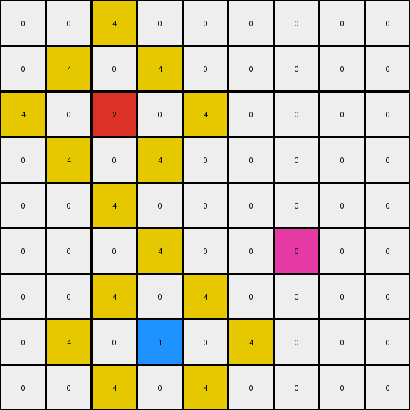

# 2-0ca9ddb6 • 015 • refine_dreamer

---

Previous Code:
```python
"""
1.  **Identify Target Pixels:** Iterate through the input grid.
2.  **Identify Key Pixels and Neighbors:** Note all non-white pixels and all white
    pixels.
3.  **Azure (8) Rule:** If a key pixel is azure (8), then any *adjacent*
    (directly above, below, left, or right, *not* diagonal) white (0) target
    pixel will change to orange (7).
4.  **Red (2) and Blue (1) Rule:** If a key pixel is red (2) or blue (1), any
    white target pixel that is *exactly* at an L1 distance of 2 (and *not*
    adjacent, L1=1) will change to yellow (4).
5. **Magenta (6) Exception:**  Magenta pixels are ignored, and do not change the color of any other pixels.
6. **Apply changes**: Once *all* pixels that meet the above criteria have had
   their changes, apply them.
"""

import numpy as np

def get_neighbors(grid, row, col, distance=1):
    """Gets the neighbors of a cell within a specified L1 distance."""
    neighbors = []
    rows, cols = grid.shape
    for i in range(max(0, row - distance), min(rows, row + distance + 1)):
        for j in range(max(0, col - distance), min(cols, col + distance + 1)):
            if (abs(row - i) + abs(col - j)) == distance and (row, col) != (i,j):
                neighbors.append((i, j))
    return neighbors

def transform(input_grid):
    # initialize output_grid
    output_grid = np.copy(input_grid)
    rows, cols = input_grid.shape

    # Identify Key Pixels and Target Pixels, and store changes
    changes = []  # List to store (row, col, new_color) tuples
    key_pixels = []
    for i in range(rows):
        for j in range(cols):
            if input_grid[i, j] != 0:
                key_pixels.append((i, j, input_grid[i, j]))

    # Determine Changes
    for r, c, color in key_pixels:
        # Azure (8) Rule
        if color == 8:
             neighbors = get_neighbors(input_grid, r, c, distance=1) # adjacent
             for nr, nc in neighbors:
                if input_grid[nr, nc] == 0:  # Check if white
                    changes.append((nr, nc, 7))   # Change to orange

        # Red (2) and Blue (1) Rule
        elif color == 1 or color == 2:
            neighbors = get_neighbors(input_grid, r, c, distance=2) # L1=2
            for nr, nc in neighbors:
                if input_grid[nr, nc] == 0:   # Check if white
                    changes.append((nr, nc, 4))    # Change to Yellow

        # Magenta (6) behavior - no change
        elif color == 6:
            pass  # Do nothing.

    # Apply changes
    for r, c, new_color in changes:
        output_grid[r, c] = new_color

    return output_grid
```

Train Set Results:

## Example 1:**

Input:
```
0 0 0 0 0 0 0 0 0
0 0 0 0 0 0 0 0 0
0 0 0 0 0 0 0 0 0
0 0 2 0 0 0 0 0 0
0 0 0 0 0 0 0 0 0
0 0 0 0 0 0 0 0 0
0 0 0 0 0 0 1 0 0
0 0 0 0 0 0 0 0 0
0 0 0 0 0 0 0 0 0
```
Expected Output:
```
0 0 0 0 0 0 0 0 0
0 0 0 0 0 0 0 0 0
0 4 0 4 0 0 0 0 0
0 0 2 0 0 0 0 0 0
0 4 0 4 0 0 0 0 0
0 0 0 0 0 0 7 0 0
0 0 0 0 0 7 1 7 0
0 0 0 0 0 0 7 0 0
0 0 0 0 0 0 0 0 0
```
Transformed Output:
```
0 0 0 0 0 0 0 0 0
0 0 4 0 0 0 0 0 0
0 4 0 4 0 0 0 0 0
4 0 2 0 4 0 0 0 0
0 4 0 4 0 0 4 0 0
0 0 4 0 0 4 0 4 0
0 0 0 0 4 0 1 0 4
0 0 0 0 0 4 0 4 0
0 0 0 0 0 0 4 0 0
```

match: False
pixels_off: 16
size_correct: True
color_palette_correct: True
correct_pixel_counts: False

## Example 2:**

Input:
```
0 0 0 8 0 0 0 0 0
0 0 0 0 0 0 0 0 0
0 0 0 0 0 0 2 0 0
0 0 1 0 0 0 0 0 0
0 0 0 0 0 0 0 0 0
0 0 0 0 0 0 0 0 0
0 0 0 0 0 0 1 0 0
0 2 0 0 0 0 0 0 0
0 0 0 0 0 0 0 0 0
```
Expected Output:
```
0 0 0 8 0 0 0 0 0
0 0 0 0 0 4 0 4 0
0 0 7 0 0 0 2 0 0
0 7 1 7 0 4 0 4 0
0 0 7 0 0 0 0 0 0
0 0 0 0 0 0 7 0 0
4 0 4 0 0 7 1 7 0
0 2 0 0 0 0 7 0 0
4 0 4 0 0 0 0 0 0
```
Transformed Output:
```
0 0 7 8 7 0 4 0 0
0 0 4 7 0 4 0 4 0
0 4 0 4 4 0 2 0 4
4 0 1 0 4 4 0 4 0
0 4 0 4 0 0 4 0 0
0 4 4 0 0 4 0 4 0
4 0 4 0 4 0 1 0 4
0 2 0 4 0 4 0 4 0
4 0 4 0 0 0 4 0 0
```

match: False
pixels_off: 32
size_correct: True
color_palette_correct: True
correct_pixel_counts: False

## Example 3:**

Input:
```
0 0 0 0 0 0 0 0 0
0 0 0 0 0 0 0 0 0
0 0 2 0 0 0 0 0 0
0 0 0 0 0 0 0 0 0
0 0 0 0 0 0 0 0 0
0 0 0 0 0 0 6 0 0
0 0 0 0 0 0 0 0 0
0 0 0 1 0 0 0 0 0
0 0 0 0 0 0 0 0 0
```
Expected Output:
```
0 0 0 0 0 0 0 0 0
0 4 0 4 0 0 0 0 0
0 0 2 0 0 0 0 0 0
0 4 0 4 0 0 0 0 0
0 0 0 0 0 0 0 0 0
0 0 0 0 0 0 6 0 0
0 0 0 7 0 0 0 0 0
0 0 7 1 7 0 0 0 0
0 0 0 7 0 0 0 0 0
```
Transformed Output:
```
0 0 4 0 0 0 0 0 0
0 4 0 4 0 0 0 0 0
4 0 2 0 4 0 0 0 0
0 4 0 4 0 0 0 0 0
0 0 4 0 0 0 0 0 0
0 0 0 4 0 0 6 0 0
0 0 4 0 4 0 0 0 0
0 4 0 1 0 4 0 0 0
0 0 4 0 4 0 0 0 0
```

match: False
pixels_off: 15
size_correct: True
color_palette_correct: True
correct_pixel_counts: False
**INSTRUCTIONS**

The code above was generated based on observations from the first training
example

we have tested the transform function on each of the task example inputs and
compared with the expected output

review each of the examples provided and the results and consider how the
natural language program should be updated to accommodate this new knowledge

respond with the following deliverables:

- general assessment of the information provided and strategy for resolving the
  errors
- gather metrics about each of the examples and results - use code_execution to
  develop accurate reports on your assumptions
- a YAML block documenting facts - Focus on identifying objects, their properties, and the actions performed on them.
- a natural language program - Be as clear and concise as possible, providing a complete description of the transformation rule.


your responses should be considered as information in a report - not a
conversation
