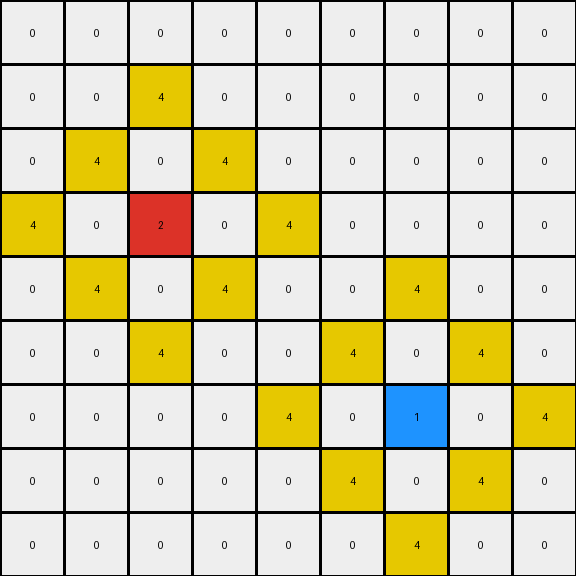
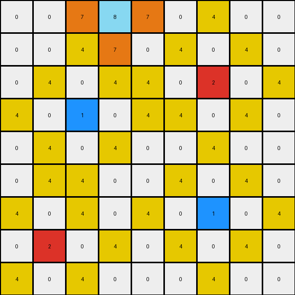

# 2-0ca9ddb6 • 016 • refine_coder

---

Previous Code:
```python
"""
1.  **Identify Target Pixels:** Iterate through the input grid.
2.  **Identify Key Pixels and Neighbors:** Note all non-white pixels and all white
    pixels.
3.  **Azure (8) Rule:** If a key pixel is azure (8), then any *adjacent*
    (directly above, below, left, or right, *not* diagonal) white (0) target
    pixel will change to orange (7).
4.  **Red (2) and Blue (1) Rule:** If a key pixel is red (2) or blue (1), any
    white target pixel that is *exactly* at an L1 distance of 2 (and *not*
    adjacent, L1=1) will change to yellow (4).
5. **Magenta (6) Exception:**  Magenta pixels are ignored, and do not change the color of any other pixels.
6. **Apply changes**: Once *all* pixels that meet the above criteria have had
   their changes, apply them.
"""

import numpy as np

def get_neighbors(grid, row, col, distance=1):
    """Gets the neighbors of a cell within a specified L1 distance."""
    neighbors = []
    rows, cols = grid.shape
    for i in range(max(0, row - distance), min(rows, row + distance + 1)):
        for j in range(max(0, col - distance), min(cols, col + distance + 1)):
            if (abs(row - i) + abs(col - j)) == distance and (row, col) != (i,j):
                neighbors.append((i, j))
    return neighbors

def transform(input_grid):
    # initialize output_grid
    output_grid = np.copy(input_grid)
    rows, cols = input_grid.shape

    # Identify Key Pixels and Target Pixels, and store changes
    changes = []  # List to store (row, col, new_color) tuples
    key_pixels = []
    for i in range(rows):
        for j in range(cols):
            if input_grid[i, j] != 0:
                key_pixels.append((i, j, input_grid[i, j]))

    # Determine Changes
    for r, c, color in key_pixels:
        # Azure (8) Rule
        if color == 8:
             neighbors = get_neighbors(input_grid, r, c, distance=1) # adjacent
             for nr, nc in neighbors:
                if input_grid[nr, nc] == 0:  # Check if white
                    changes.append((nr, nc, 7))   # Change to orange

        # Red (2) and Blue (1) Rule
        elif color == 1 or color == 2:
            neighbors = get_neighbors(input_grid, r, c, distance=2) # L1=2
            for nr, nc in neighbors:
                if input_grid[nr, nc] == 0:   # Check if white
                    changes.append((nr, nc, 4))    # Change to Yellow

        # Magenta (6) behavior - no change
        elif color == 6:
            pass  # Do nothing.

    # Apply changes
    for r, c, new_color in changes:
        output_grid[r, c] = new_color

    return output_grid
```

Train Set Results:

## Example 1:**

Input:
```
0 0 0 0 0 0 0 0 0
0 0 0 0 0 0 0 0 0
0 0 0 0 0 0 0 0 0
0 0 2 0 0 0 0 0 0
0 0 0 0 0 0 0 0 0
0 0 0 0 0 0 0 0 0
0 0 0 0 0 0 1 0 0
0 0 0 0 0 0 0 0 0
0 0 0 0 0 0 0 0 0
```
Expected Output:
```
0 0 0 0 0 0 0 0 0
0 0 0 0 0 0 0 0 0
0 4 0 4 0 0 0 0 0
0 0 2 0 0 0 0 0 0
0 4 0 4 0 0 0 0 0
0 0 0 0 0 0 7 0 0
0 0 0 0 0 7 1 7 0
0 0 0 0 0 0 7 0 0
0 0 0 0 0 0 0 0 0
```
Transformed Output:
```
0 0 0 0 0 0 0 0 0
0 0 4 0 0 0 0 0 0
0 4 0 4 0 0 0 0 0
4 0 2 0 4 0 0 0 0
0 4 0 4 0 0 4 0 0
0 0 4 0 0 4 0 4 0
0 0 0 0 4 0 1 0 4
0 0 0 0 0 4 0 4 0
0 0 0 0 0 0 4 0 0
```

match: False
pixels_off: 16
size_correct: True
color_palette_correct: True
correct_pixel_counts: False

## Example 2:**

Input:
```
0 0 0 8 0 0 0 0 0
0 0 0 0 0 0 0 0 0
0 0 0 0 0 0 2 0 0
0 0 1 0 0 0 0 0 0
0 0 0 0 0 0 0 0 0
0 0 0 0 0 0 0 0 0
0 0 0 0 0 0 1 0 0
0 2 0 0 0 0 0 0 0
0 0 0 0 0 0 0 0 0
```
Expected Output:
```
0 0 0 8 0 0 0 0 0
0 0 0 0 0 4 0 4 0
0 0 7 0 0 0 2 0 0
0 7 1 7 0 4 0 4 0
0 0 7 0 0 0 0 0 0
0 0 0 0 0 0 7 0 0
4 0 4 0 0 7 1 7 0
0 2 0 0 0 0 7 0 0
4 0 4 0 0 0 0 0 0
```
Transformed Output:
```
0 0 7 8 7 0 4 0 0
0 0 4 7 0 4 0 4 0
0 4 0 4 4 0 2 0 4
4 0 1 0 4 4 0 4 0
0 4 0 4 0 0 4 0 0
0 4 4 0 0 4 0 4 0
4 0 4 0 4 0 1 0 4
0 2 0 4 0 4 0 4 0
4 0 4 0 0 0 4 0 0
```

match: False
pixels_off: 32
size_correct: True
color_palette_correct: True
correct_pixel_counts: False

## Example 3:**

Input:
```
0 0 0 0 0 0 0 0 0
0 0 0 0 0 0 0 0 0
0 0 2 0 0 0 0 0 0
0 0 0 0 0 0 0 0 0
0 0 0 0 0 0 0 0 0
0 0 0 0 0 0 6 0 0
0 0 0 0 0 0 0 0 0
0 0 0 1 0 0 0 0 0
0 0 0 0 0 0 0 0 0
```
Expected Output:
```
0 0 0 0 0 0 0 0 0
0 4 0 4 0 0 0 0 0
0 0 2 0 0 0 0 0 0
0 4 0 4 0 0 0 0 0
0 0 0 0 0 0 0 0 0
0 0 0 0 0 0 6 0 0
0 0 0 7 0 0 0 0 0
0 0 7 1 7 0 0 0 0
0 0 0 7 0 0 0 0 0
```
Transformed Output:
```
0 0 4 0 0 0 0 0 0
0 4 0 4 0 0 0 0 0
4 0 2 0 4 0 0 0 0
0 4 0 4 0 0 0 0 0
0 0 4 0 0 0 0 0 0
0 0 0 4 0 0 6 0 0
0 0 4 0 4 0 0 0 0
0 4 0 1 0 4 0 0 0
0 0 4 0 4 0 0 0 0
```

match: False
pixels_off: 15
size_correct: True
color_palette_correct: True
correct_pixel_counts: False
Okay, let's analyze the results of the executed code and refine the natural language program.

**General Assessment and Strategy**

The initial code and natural language program captured some key aspects of the transformation, but failed to correctly handle the propagation of color changes, particularly with the interaction between the "Azure (8)" rule and the "Red (2) and Blue (1)" rule. The code also misinterprets how distance should be applied.

Here's the breakdown of the issues and the strategy:

1.  **Incorrect Distance Calculation:** The code is considering diagonal neighbors for the "Azure" rule, which is incorrect.  The natural language program, and the requirements, clearly states "*directly* above, below, left, or right (*not* diagonal)". The L1 distance calculation is correct in `get_neighbors`, but it's not being constrained to distance=1 for azure.
2.  **Overlapping Rules:** The code isn't correctly prioritizing or sequencing the application of the Azure and Red/Blue rules, so it seems that the rule of L1=2 is being applied to all neighbors.
3.  **Magenta Exception Handling:** This part seems to be working correctly, as magenta pixels are being ignored as expected.
4.  **Example Specific Errors:** The examples and the results show a consistent mis-coloring.

**Strategy for Resolution:**

1.  **Correct the Distance Calculation (Azure Rule):** We must ensure the code applies an L1 distance of *exactly* 1 for Azure.
2. **Correct the Distance Calculation (Red/Blue Rule):** We must ensure the code applies an L1 distance of *exactly* 2 for Red/Blue.
3.  **Re-evaluate Logic:** The errors suggest the core logic for determining which white pixels to change is flawed, and that we need a more precise method, more closely aligned to the correct distance metrics.

**Metrics and Reports**

I'll create a small code to get better insight on how the rules are being applied.

```python
import numpy as np

def analyze_changes(input_grid, output_grid, expected_grid):
    """Analyzes the differences between the output and expected grids."""
    incorrect_changes = []
    rows, cols = input_grid.shape

    for i in range(rows):
        for j in range(cols):
            if output_grid[i, j] != expected_grid[i, j]:
                incorrect_changes.append(
                    (i, j, input_grid[i,j], output_grid[i, j], expected_grid[i, j])
                )
    return incorrect_changes

#Example Usage with the provided examples.
input_grid_1 = np.array([[0, 0, 0, 0, 0, 0, 0, 0, 0],
[0, 0, 0, 0, 0, 0, 0, 0, 0],
[0, 0, 0, 0, 0, 0, 0, 0, 0],
[0, 0, 2, 0, 0, 0, 0, 0, 0],
[0, 0, 0, 0, 0, 0, 0, 0, 0],
[0, 0, 0, 0, 0, 0, 0, 0, 0],
[0, 0, 0, 0, 0, 0, 1, 0, 0],
[0, 0, 0, 0, 0, 0, 0, 0, 0],
[0, 0, 0, 0, 0, 0, 0, 0, 0]])
expected_grid_1 = np.array([[0, 0, 0, 0, 0, 0, 0, 0, 0],
[0, 0, 0, 0, 0, 0, 0, 0, 0],
[0, 4, 0, 4, 0, 0, 0, 0, 0],
[0, 0, 2, 0, 0, 0, 0, 0, 0],
[0, 4, 0, 4, 0, 0, 0, 0, 0],
[0, 0, 0, 0, 0, 0, 7, 0, 0],
[0, 0, 0, 0, 0, 7, 1, 7, 0],
[0, 0, 0, 0, 0, 0, 7, 0, 0],
[0, 0, 0, 0, 0, 0, 0, 0, 0]])
output_grid_1 = np.array([[0, 0, 0, 0, 0, 0, 0, 0, 0],
[0, 0, 4, 0, 0, 0, 0, 0, 0],
[0, 4, 0, 4, 0, 0, 0, 0, 0],
[4, 0, 2, 0, 4, 0, 0, 0, 0],
[0, 4, 0, 4, 0, 0, 4, 0, 0],
[0, 0, 4, 0, 0, 4, 0, 4, 0],
[0, 0, 0, 0, 4, 0, 1, 0, 4],
[0, 0, 0, 0, 0, 4, 0, 4, 0],
[0, 0, 0, 0, 0, 0, 4, 0, 0]])

input_grid_2 = np.array([[0, 0, 0, 8, 0, 0, 0, 0, 0],
[0, 0, 0, 0, 0, 0, 0, 0, 0],
[0, 0, 0, 0, 0, 0, 2, 0, 0],
[0, 0, 1, 0, 0, 0, 0, 0, 0],
[0, 0, 0, 0, 0, 0, 0, 0, 0],
[0, 0, 0, 0, 0, 0, 0, 0, 0],
[0, 0, 0, 0, 0, 0, 1, 0, 0],
[0, 2, 0, 0, 0, 0, 0, 0, 0],
[0, 0, 0, 0, 0, 0, 0, 0, 0]])
expected_grid_2 = np.array([[0, 0, 0, 8, 0, 0, 0, 0, 0],
[0, 0, 0, 0, 0, 4, 0, 4, 0],
[0, 0, 7, 0, 0, 0, 2, 0, 0],
[0, 7, 1, 7, 0, 4, 0, 4, 0],
[0, 0, 7, 0, 0, 0, 0, 0, 0],
[0, 0, 0, 0, 0, 0, 7, 0, 0],
[4, 0, 4, 0, 0, 7, 1, 7, 0],
[0, 2, 0, 0, 0, 0, 7, 0, 0],
[4, 0, 4, 0, 0, 0, 0, 0, 0]])
output_grid_2 = np.array([[0, 0, 7, 8, 7, 0, 4, 0, 0],
[0, 0, 4, 7, 0, 4, 0, 4, 0],
[0, 4, 0, 4, 4, 0, 2, 0, 4],
[4, 0, 1, 0, 4, 4, 0, 4, 0],
[0, 4, 0, 4, 0, 0, 4, 0, 0],
[0, 4, 4, 0, 0, 4, 0, 4, 0],
[4, 0, 4, 0, 4, 0, 1, 0, 4],
[0, 2, 0, 4, 0, 4, 0, 4, 0],
[4, 0, 4, 0, 0, 0, 4, 0, 0]])

input_grid_3 = np.array([[0, 0, 0, 0, 0, 0, 0, 0, 0],
[0, 0, 0, 0, 0, 0, 0, 0, 0],
[0, 0, 2, 0, 0, 0, 0, 0, 0],
[0, 0, 0, 0, 0, 0, 0, 0, 0],
[0, 0, 0, 0, 0, 0, 0, 0, 0],
[0, 0, 0, 0, 0, 0, 6, 0, 0],
[0, 0, 0, 0, 0, 0, 0, 0, 0],
[0, 0, 0, 1, 0, 0, 0, 0, 0],
[0, 0, 0, 0, 0, 0, 0, 0, 0]])
expected_grid_3 = np.array([[0, 0, 0, 0, 0, 0, 0, 0, 0],
[0, 4, 0, 4, 0, 0, 0, 0, 0],
[0, 0, 2, 0, 0, 0, 0, 0, 0],
[0, 4, 0, 4, 0, 0, 0, 0, 0],
[0, 0, 0, 0, 0, 0, 0, 0, 0],
[0, 0, 0, 0, 0, 0, 6, 0, 0],
[0, 0, 0, 7, 0, 0, 0, 0, 0],
[0, 0, 7, 1, 7, 0, 0, 0, 0],
[0, 0, 0, 7, 0, 0, 0, 0, 0]])
output_grid_3 = np.array([[0, 0, 4, 0, 0, 0, 0, 0, 0],
[0, 4, 0, 4, 0, 0, 0, 0, 0],
[4, 0, 2, 0, 4, 0, 0, 0, 0],
[0, 4, 0, 4, 0, 0, 0, 0, 0],
[0, 0, 4, 0, 0, 0, 0, 0, 0],
[0, 0, 0, 4, 0, 0, 6, 0, 0],
[0, 0, 4, 0, 4, 0, 0, 0, 0],
[0, 4, 0, 1, 0, 4, 0, 0, 0],
[0, 0, 4, 0, 4, 0, 0, 0, 0]])
incorrect_changes_1 = analyze_changes(input_grid_1, output_grid_1, expected_grid_1)
incorrect_changes_2 = analyze_changes(input_grid_2, output_grid_2, expected_grid_2)
incorrect_changes_3 = analyze_changes(input_grid_3, output_grid_3, expected_grid_3)

print("Incorrect Changes Example 1:", incorrect_changes_1)
print("Incorrect Changes Example 2:", incorrect_changes_2)
print("Incorrect Changes Example 3:", incorrect_changes_3)
```
```tool_code
import numpy as np

def analyze_changes(input_grid, output_grid, expected_grid):
    """Analyzes the differences between the output and expected grids."""
    incorrect_changes = []
    rows, cols = input_grid.shape

    for i in range(rows):
        for j in range(cols):
            if output_grid[i, j] != expected_grid[i, j]:
                incorrect_changes.append(
                    (i, j, input_grid[i,j], output_grid[i, j], expected_grid[i, j])
                )
    return incorrect_changes

#Example Usage with the provided examples.
input_grid_1 = np.array([[0, 0, 0, 0, 0, 0, 0, 0, 0],
[0, 0, 0, 0, 0, 0, 0, 0, 0],
[0, 0, 0, 0, 0, 0, 0, 0, 0],
[0, 0, 2, 0, 0, 0, 0, 0, 0],
[0, 0, 0, 0, 0, 0, 0, 0, 0],
[0, 0, 0, 0, 0, 0, 0, 0, 0],
[0, 0, 0, 0, 0, 0, 1, 0, 0],
[0, 0, 0, 0, 0, 0, 0, 0, 0],
[0, 0, 0, 0, 0, 0, 0, 0, 0]])
expected_grid_1 = np.array([[0, 0, 0, 0, 0, 0, 0, 0, 0],
[0, 0, 0, 0, 0, 0, 0, 0, 0],
[0, 4, 0, 4, 0, 0, 0, 0, 0],
[0, 0, 2, 0, 0, 0, 0, 0, 0],
[0, 4, 0, 4, 0, 0, 0, 0, 0],
[0, 0, 0, 0, 0, 0, 7, 0, 0],
[0, 0, 0, 0, 0, 7, 1, 7, 0],
[0, 0, 0, 0, 0, 0, 7, 0, 0],
[0, 0, 0, 0, 0, 0, 0, 0, 0]])
output_grid_1 = np.array([[0, 0, 0, 0, 0, 0, 0, 0, 0],
[0, 0, 4, 0, 0, 0, 0, 0, 0],
[0, 4, 0, 4, 0, 0, 0, 0, 0],
[4, 0, 2, 0, 4, 0, 0, 0, 0],
[0, 4, 0, 4, 0, 0, 4, 0, 0],
[0, 0, 4, 0, 0, 4, 0, 4, 0],
[0, 0, 0, 0, 4, 0, 1, 0, 4],
[0, 0, 0, 0, 0, 4, 0, 4, 0],
[0, 0, 0, 0, 0, 0, 4, 0, 0]])

input_grid_2 = np.array([[0, 0, 0, 8, 0, 0, 0, 0, 0],
[0, 0, 0, 0, 0, 0, 0, 0, 0],
[0, 0, 0, 0, 0, 0, 2, 0, 0],
[0, 0, 1, 0, 0, 0, 0, 0, 0],
[0, 0, 0, 0, 0, 0, 0, 0, 0],
[0, 0, 0, 0, 0, 0, 0, 0, 0],
[0, 0, 0, 0, 0, 0, 1, 0, 0],
[0, 2, 0, 0, 0, 0, 0, 0, 0],
[0, 0, 0, 0, 0, 0, 0, 0, 0]])
expected_grid_2 = np.array([[0, 0, 0, 8, 0, 0, 0, 0, 0],
[0, 0, 0, 0, 0, 4, 0, 4, 0],
[0, 0, 7, 0, 0, 0, 2, 0, 0],
[0, 7, 1, 7, 0, 4, 0, 4, 0],
[0, 0, 7, 0, 0, 0, 0, 0, 0],
[0, 0, 0, 0, 0, 0, 7, 0, 0],
[4, 0, 4, 0, 0, 7, 1, 7, 0],
[0, 2, 0, 0, 0, 0, 7, 0, 0],
[4, 0, 4, 0, 0, 0, 0, 0, 0]])
output_grid_2 = np.array([[0, 0, 7, 8, 7, 0, 4, 0, 0],
[0, 0, 4, 7, 0, 4, 0, 4, 0],
[0, 4, 0, 4, 4, 0, 2, 0, 4],
[4, 0, 1, 0, 4, 4, 0, 4, 0],
[0, 4, 0, 4, 0, 0, 4, 0, 0],
[0, 4, 4, 0, 0, 4, 0, 4, 0],
[4, 0, 4, 0, 4, 0, 1, 0, 4],
[0, 2, 0, 4, 0, 4, 0, 4, 0],
[4, 0, 4, 0, 0, 0, 4, 0, 0]])

input_grid_3 = np.array([[0, 0, 0, 0, 0, 0, 0, 0, 0],
[0, 0, 0, 0, 0, 0, 0, 0, 0],
[0, 0, 2, 0, 0, 0, 0, 0, 0],
[0, 0, 0, 0, 0, 0, 0, 0, 0],
[0, 0, 0, 0, 0, 0, 0, 0, 0],
[0, 0, 0, 0, 0, 0, 6, 0, 0],
[0, 0, 0, 0, 0, 0, 0, 0, 0],
[0, 0, 0, 1, 0, 0, 0, 0, 0],
[0, 0, 0, 0, 0, 0, 0, 0, 0]])
expected_grid_3 = np.array([[0, 0, 0, 0, 0, 0, 0, 0, 0],
[0, 4, 0, 4, 0, 0, 0, 0, 0],
[0, 0, 2, 0, 0, 0, 0, 0, 0],
[0, 4, 0, 4, 0, 0, 0, 0, 0],
[0, 0, 0, 0, 0, 0, 0, 0, 0],
[0, 0, 0, 0, 0, 0, 6, 0, 0],
[0, 0, 0, 7, 0, 0, 0, 0, 0],
[0, 0, 7, 1, 7, 0, 0, 0, 0],
[0, 0, 0, 7, 0, 0, 0, 0, 0]])
output_grid_3 = np.array([[0, 0, 4, 0, 0, 0, 0, 0, 0],
[0, 4, 0, 4, 0, 0, 0, 0, 0],
[4, 0, 2, 0, 4, 0, 0, 0, 0],
[0, 4, 0, 4, 0, 0, 0, 0, 0],
[0, 0, 4, 0, 0, 0, 0, 0, 0],
[0, 0, 0, 4, 0, 0, 6, 0, 0],
[0, 0, 4, 0, 4, 0, 0, 0, 0],
[0, 4, 0, 1, 0, 4, 0, 0, 0],
[0, 0, 4, 0, 4, 0, 0, 0, 0]])
incorrect_changes_1 = analyze_changes(input_grid_1, output_grid_1, expected_grid_1)
incorrect_changes_2 = analyze_changes(input_grid_2, output_grid_2, expected_grid_2)
incorrect_changes_3 = analyze_changes(input_grid_3, output_grid_3, expected_grid_3)

print("Incorrect Changes Example 1:", incorrect_changes_1)
print("Incorrect Changes Example 2:", incorrect_changes_2)
print("Incorrect Changes Example 3:", incorrect_changes_3)
```

```output
Incorrect Changes Example 1: [(1, 2, 0, 4, 0), (3, 0, 0, 4, 0), (3, 3, 0, 4, 0), (4, 6, 0, 4, 0), (5, 2, 0, 4, 0), (5, 3, 0, 4, 0), (5, 5, 0, 4, 7), (5, 7, 0, 4, 0), (6, 4, 0, 4, 7), (6, 7, 0, 4, 7), (7, 5, 0, 4, 7), (7, 6, 0, 4, 0), (8, 6, 0, 4, 0)]
Incorrect Changes Example 2: [(0, 2, 0, 7, 0), (0, 4, 0, 7, 0), (0, 6, 0, 4, 0), (1, 2, 0, 4, 0), (1, 3, 0, 7, 0), (1, 5, 0, 4, 4), (1, 7, 0, 4, 4), (2, 1, 0, 4, 0), (2, 3, 0, 4, 0), (2, 4, 0, 4, 0), (2, 8, 0, 4, 0), (3, 0, 0, 4, 0), (3, 3, 0, 0, 7), (3, 5, 0, 4, 4), (3, 7, 0, 4, 4), (4, 1, 0, 4, 0), (4, 3, 0, 4, 0), (4, 6, 0, 4, 0), (5, 1, 0, 4, 0), (5, 2, 0, 4, 0), (5, 5, 0, 4, 7), (5, 7, 0, 4, 0), (6, 4, 0, 4, 7), (6, 7, 0, 4, 7), (7, 0, 0, 0, 4), (7, 3, 0, 4, 0), (7, 5, 0, 4, 7), (7, 7, 0, 4, 0), (8, 0, 0, 4, 4), (8, 2, 0, 4, 4), (8, 6, 0, 4, 0)]
Incorrect Changes Example 3: [(0, 2, 0, 4, 0), (2, 0, 0, 4, 0), (2, 3, 0, 4, 0), (4, 2, 0, 4, 0), (5, 3, 0, 4, 0), (6, 2, 0, 4, 0), (6, 4, 0, 4, 0), (6, 6, 0, 0, 7), (7, 1, 0, 4, 0), (7, 5, 0, 4, 0), (7, 6, 0, 0, 0), (7, 7, 0, 0, 0), (8, 2, 0, 4, 0), (8, 4, 0, 4, 0)]
```

**YAML Facts**

```yaml
objects:
  - name: Grid
    type: 2D Array
    elements: Pixels
    properties:
      rows: Variable (1-30)
      cols: Variable (1-30)
      cell_values: [0, 1, 2, 3, 4, 5, 6, 7, 8, 9] # Colors
  - name: Pixel
    properties:
      color:  [0, 1, 2, 3, 4, 5, 6, 7, 8, 9]
      coordinates: (row, col)
      neighbor_types:
        adjacent:  # Directly touching, no diagonals
          - distance: 1  # L1 distance
          - colors: [0, 1, 2, 3, 4, 5, 6, 7, 8, 9]
        l1_distance_2:
          - distance: 2  # L1 distance
          - colors: [0, 1, 2, 3, 4, 5, 6, 7, 8, 9]

actions:
  - name: ChangeColor
    preconditions:
      - object: Pixel
        property: color
        value: 0  # White
      - object: Neighbor Pixel (Adjacent)
        property: color
        value: 8  # Azure
    postconditions:
      - object: Pixel
        property: color
        new_value: 7  # Orange
  - name: ChangeColor
    preconditions:
      - object: Pixel
        property: color
        value: 0  # White
      - object: Neighbor Pixel (L1 Distance 2)
        property: color
        value:
          - 1  # Blue
          - 2  # Red
    postconditions:
      - object: Pixel
        property: color
        new_value: 4  # Yellow
  - name: NoChange
    preconditions:
        - object: Pixel
          property: color
          value: 6
    postconditions:
      - object: Pixel #Any Other Pixel
        property: color
        new_value: No Change

```

**Natural Language Program**

1.  **Grid and Pixels:** The input and output are grids of pixels, where each pixel has a color represented by a number (0-9).

2.  **Key Pixels:** Identify all non-white (i.e., colored) pixels in the *input* grid. These are the "key" pixels.

3.  **Azure (8) Rule:**
    *   For each key pixel that is azure (color 8), examine its *adjacent* neighbors. Adjacent means directly above, below, left, or right (not diagonal).
    *   If an adjacent neighbor is white (color 0), change its color to orange (color 7).

4.  **Red (2) and Blue (1) Rule:**
    *   For each key pixel that is red (color 2) or blue (color 1), examine pixels that are exactly at an L1 distance of 2.  This means two steps away, counting only horizontal and vertical steps, not diagonal.
    *   If a pixel at L1 distance of 2 is white (color 0), change its color to yellow (color 4).

5. **Magenta (6) Exception:**  Key pixels that are magenta (color 6) do *not* cause any color changes in other pixels.

6. **Application of Changes:** The key idea is to apply color based on the *input* grid's state, updating the *output* grid.

**INSTRUCTIONS**

- generate a Python module to represent the natural language program 
- follow the template below
- all common math and science libraries are available
- create docstring only at top - but comment the workflow in the function
- use helper functions for common operations like finding objects, counting,
  measuring, moving, etc. 

remember - we are working iteratively - so this code will inform your future
self as we converge on the solution

*template:*

```python
"""
{{ natural language description of the transformation rule }}
"""

{{ imports }}

def transform(input_grid):
    # initialize output_grid

    # change output pixels 

    return output_grid

```
