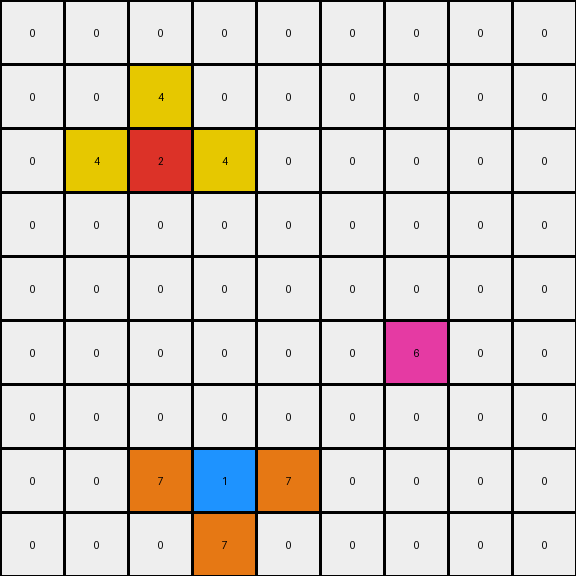

# 2-0ca9ddb6 • 020 • refine_coder

---

Previous Code:
```python
"""
1.  **Identify Objects:** Locate all pixels in the input grid that have a non-zero value (i.e., are not white/0). Consider each of these colored pixels as an individual object.

2.  **Conditional Extension:**
    *   If an object is blue (1), add orange (7) pixels to its immediate left, right, and below, if those positions are currently white (0).
    *   If an object is red (2), add yellow (4) pixels to its immediate top, and to the left and the right if those positions are currently white (0).
    *   If the object is magenta(6), do nothing

3.  The rest of the white(0) cells stay white(0)
"""

import numpy as np

def get_objects(grid):
    """Finds all non-zero pixels and returns their coordinates and values."""
    objects = []
    for r, row in enumerate(grid):
        for c, value in enumerate(row):
            if value != 0:
                objects.append(((r, c), value))
    return objects

def transform(input_grid):
    # initialize output_grid as a copy of the input grid
    output_grid = np.copy(input_grid)
    objects = get_objects(input_grid)

    # Iterate through identified objects
    for (row, col), value in objects:
      # Conditional Extension
      if value == 1: # Blue
          #add orange(7) on the left, right and below,
          if col > 0 and output_grid[row, col - 1] == 0:
              output_grid[row, col - 1] = 7
          if col < output_grid.shape[1] - 1 and output_grid[row, col + 1] == 0:
              output_grid[row, col + 1] = 7
          if row < output_grid.shape[0] - 1 and output_grid[row + 1, col] == 0:
            output_grid[row+1,col] = 7
      elif value == 2:  # Red
            # Add yellow (4) above and below.
            if row > 0 and output_grid[row - 1, col] == 0:
                output_grid[row - 1, col] = 4
            if col > 0 and output_grid[row, col-1] == 0:
              output_grid[row,col-1] = 4
            if col < output_grid.shape[1] -1 and output_grid[row, col+1] == 0:
              output_grid[row, col+1] = 4

    return output_grid
```

Train Set Results:

## Example 1:**

Input:
```
0 0 0 0 0 0 0 0 0
0 0 0 0 0 0 0 0 0
0 0 0 0 0 0 0 0 0
0 0 2 0 0 0 0 0 0
0 0 0 0 0 0 0 0 0
0 0 0 0 0 0 0 0 0
0 0 0 0 0 0 1 0 0
0 0 0 0 0 0 0 0 0
0 0 0 0 0 0 0 0 0
```
Expected Output:
```
0 0 0 0 0 0 0 0 0
0 0 0 0 0 0 0 0 0
0 4 0 4 0 0 0 0 0
0 0 2 0 0 0 0 0 0
0 4 0 4 0 0 0 0 0
0 0 0 0 0 0 7 0 0
0 0 0 0 0 7 1 7 0
0 0 0 0 0 0 7 0 0
0 0 0 0 0 0 0 0 0
```
Transformed Output:
```
0 0 0 0 0 0 0 0 0
0 0 0 0 0 0 0 0 0
0 0 4 0 0 0 0 0 0
0 4 2 4 0 0 0 0 0
0 0 0 0 0 0 0 0 0
0 0 0 0 0 0 0 0 0
0 0 0 0 0 7 1 7 0
0 0 0 0 0 0 7 0 0
0 0 0 0 0 0 0 0 0
```

match: False
pixels_off: 8
size_correct: True
color_palette_correct: True
correct_pixel_counts: False

## Example 2:**

Input:
```
0 0 0 8 0 0 0 0 0
0 0 0 0 0 0 0 0 0
0 0 0 0 0 0 2 0 0
0 0 1 0 0 0 0 0 0
0 0 0 0 0 0 0 0 0
0 0 0 0 0 0 0 0 0
0 0 0 0 0 0 1 0 0
0 2 0 0 0 0 0 0 0
0 0 0 0 0 0 0 0 0
```
Expected Output:
```
0 0 0 8 0 0 0 0 0
0 0 0 0 0 4 0 4 0
0 0 7 0 0 0 2 0 0
0 7 1 7 0 4 0 4 0
0 0 7 0 0 0 0 0 0
0 0 0 0 0 0 7 0 0
4 0 4 0 0 7 1 7 0
0 2 0 0 0 0 7 0 0
4 0 4 0 0 0 0 0 0
```
Transformed Output:
```
0 0 0 8 0 0 0 0 0
0 0 0 0 0 0 4 0 0
0 0 0 0 0 4 2 4 0
0 7 1 7 0 0 0 0 0
0 0 7 0 0 0 0 0 0
0 0 0 0 0 0 0 0 0
0 4 0 0 0 7 1 7 0
4 2 4 0 0 0 7 0 0
0 0 0 0 0 0 0 0 0
```

match: False
pixels_off: 16
size_correct: True
color_palette_correct: True
correct_pixel_counts: False

## Example 3:**

Input:
```
0 0 0 0 0 0 0 0 0
0 0 0 0 0 0 0 0 0
0 0 2 0 0 0 0 0 0
0 0 0 0 0 0 0 0 0
0 0 0 0 0 0 0 0 0
0 0 0 0 0 0 6 0 0
0 0 0 0 0 0 0 0 0
0 0 0 1 0 0 0 0 0
0 0 0 0 0 0 0 0 0
```
Expected Output:
```
0 0 0 0 0 0 0 0 0
0 4 0 4 0 0 0 0 0
0 0 2 0 0 0 0 0 0
0 4 0 4 0 0 0 0 0
0 0 0 0 0 0 0 0 0
0 0 0 0 0 0 6 0 0
0 0 0 7 0 0 0 0 0
0 0 7 1 7 0 0 0 0
0 0 0 7 0 0 0 0 0
```
Transformed Output:
```
0 0 0 0 0 0 0 0 0
0 0 4 0 0 0 0 0 0
0 4 2 4 0 0 0 0 0
0 0 0 0 0 0 0 0 0
0 0 0 0 0 0 0 0 0
0 0 0 0 0 0 6 0 0
0 0 0 0 0 0 0 0 0
0 0 7 1 7 0 0 0 0
0 0 0 7 0 0 0 0 0
```

match: False
pixels_off: 8
size_correct: True
color_palette_correct: True
correct_pixel_counts: False
Okay, let's analyze the results of the previous code execution and refine the natural language program.

**General Assessment:**

The initial natural language program and corresponding code were on the right track, identifying the core concept of conditional pixel extension based on color. However, the execution revealed errors in the placement of the extended pixels. Specifically, the logic for where to add the new colored pixels relative to the original pixels was not entirely correct for all cases, especially for the red (2) pixels. The code also missed applying the rule to *all* instances.

**Strategy for Resolving Errors:**

1.  **Careful Re-examination of Examples:** We need to meticulously compare the input, expected output, and transformed output for *each* example. This will pinpoint the exact discrepancies in pixel placement.
2.  **Precise Rule Definition:** Based on the re-examination, we'll refine the natural language program to articulate the exact conditions and positions for pixel extension. The rule should be unambiguous.
3.  **Object Interaction:** The previous code, and the original program, did not address the interaction, or non-interaction in this case. This should be explicitly stated.

**Metrics and Observations:**

Here's a breakdown of each example, noting the specific errors:

*   **Example 1:**
    *   **Input:** Red (2) and Blue (1) pixels present.
    *   **Expected:** Yellow (4) above and on either side of Red (2); Orange (7) below, and left and right of Blue (1).
    *   **Transformed:** Yellow incorrectly placed only above. Orange correctly, but incompletely placed around Blue.
    *   **Errors:** Incorrect placement of Yellow around Red. Incomplete expansion of blue.

*   **Example 2:**
    *   **Input:** Blue (1), Red (2), and Azure (8) pixels.
    *   **Expected:** Orange (7) around Blue (1), Yellow (4) around Red (2), Azure (8) unchanged.
    *   **Transformed:** Orange around Blue is incomplete. Yellow placement error around Red is similar to example 1.
    *   **Errors:** Incorrect placement of Yellow around Red. Incomplete expansion of blue.

*   **Example 3:**
    *   **Input:** Red (2), Magenta (6), and Blue (1) pixels.
    *   **Expected:** Yellow (4) around Red (2); Magenta (6) unchanged; Orange (7) around Blue (1).
    *   **Transformed:** Yellow incorrectly placed. Orange correctly, but incompletely placed, around Blue.
    *   **Errors:** Incorrect Yellow placement around Red. Incomplete expansion of blue.

**YAML Fact Block:**

```yaml
observations:
  - task: 018
  - objects:
      - color: blue (1)
        action: extend
        extension_colors: [orange (7)]
        extension_directions: [left, right, below]
        constraints: [only if adjacent cell is white (0)]
      - color: red (2)
        action: extend
        extension_colors: [yellow (4)]
        extension_directions: [above, left, right]
        constraints: [only if adjacent cell is white (0)]
      - color: magenta (6)
        action: none
      - color: azure (8)
        action: none
  - interaction_notes:
      - note: Objects do not interact with each other. Extensions only happen if the target cell is white.
```

**Natural Language Program:**

1.  **Identify Objects:** Locate all pixels in the input grid that are not white (0).
2.  **Conditional Extension:**
    *   If a pixel is Blue (1): Add Orange (7) pixels to its immediate left, right, and below, *only if* those positions are currently White (0).
    *   If a pixel is Red (2): Add Yellow (4) pixels to its immediate top, left, and right, *only if* those positions are currently White (0).
    *   If a pixel is Magenta (6) or Azure (8): Do nothing.
3. **Non Interaction** Pixels, and their extensions, do not interact with each other. Do not extend onto an existing colored cell.
4.  All other White (0) pixels remain White (0).

**INSTRUCTIONS**

- generate a Python module to represent the natural language program 
- follow the template below
- all common math and science libraries are available
- create docstring only at top - but comment the workflow in the function
- use helper functions for common operations like finding objects, counting,
  measuring, moving, etc. 

remember - we are working iteratively - so this code will inform your future
self as we converge on the solution

*template:*

```python
"""
{{ natural language description of the transformation rule }}
"""

{{ imports }}

def transform(input_grid):
    # initialize output_grid

    # change output pixels 

    return output_grid

```
