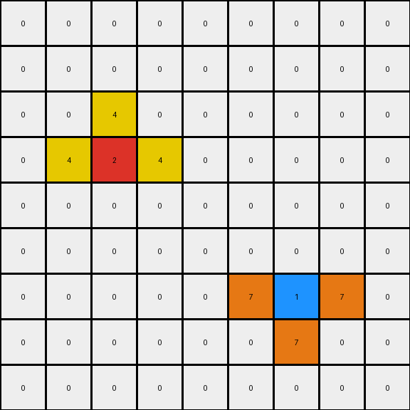
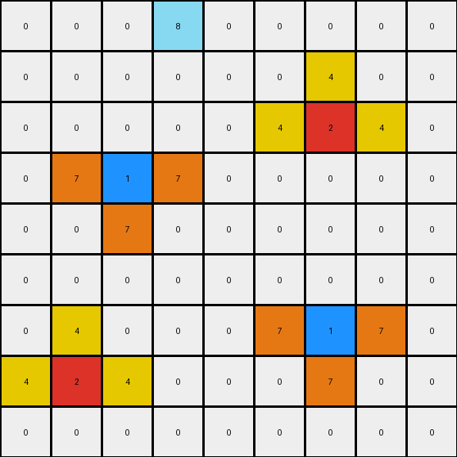
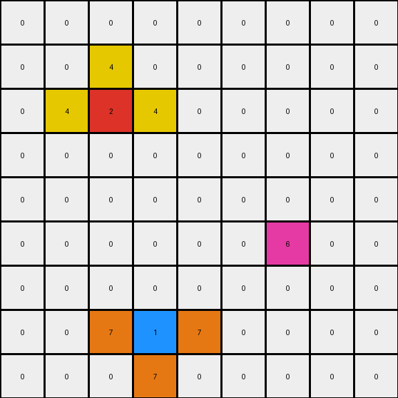

# 2-0ca9ddb6 • 021 • refine_dreamer

---


Previous Code:
```python
"""
1.  **Identify Objects:** Locate all pixels in the input grid that are not white (0).
2.  **Conditional Extension:**
    *   If a pixel is Blue (1): Add Orange (7) pixels to its immediate left, right, and below, *only if* those positions are currently White (0).
    *   If a pixel is Red (2): Add Yellow (4) pixels to its immediate top, left, and right, *only if* those positions are currently White (0).
    *   If a pixel is Magenta (6) or Azure (8): Do nothing.
3. **Non Interaction** Pixels, and their extensions, do not interact with each other. Do not extend onto an existing colored cell.
4.  All other White (0) pixels remain White (0).
"""

import numpy as np

def get_objects(grid):
    """Finds all non-zero pixels and returns their coordinates and values."""
    objects = []
    for r, row in enumerate(grid):
        for c, value in enumerate(row):
            if value != 0:
                objects.append(((r, c), value))
    return objects

def transform(input_grid):
    # initialize output_grid as a copy of the input grid
    output_grid = np.copy(input_grid)
    objects = get_objects(input_grid)

    # Iterate through identified objects
    for (row, col), value in objects:
      # Conditional Extension
      if value == 1: # Blue
          #add orange(7) on the left, right and below,
          if col > 0 and output_grid[row, col - 1] == 0:
              output_grid[row, col - 1] = 7
          if col < output_grid.shape[1] - 1 and output_grid[row, col + 1] == 0:
              output_grid[row, col + 1] = 7
          if row < output_grid.shape[0] - 1 and output_grid[row + 1, col] == 0:
            output_grid[row+1,col] = 7
      elif value == 2:  # Red
            # Add yellow (4) above, left and right
            if row > 0 and output_grid[row - 1, col] == 0:
                output_grid[row - 1, col] = 4
            if col > 0 and output_grid[row, col-1] == 0:
              output_grid[row,col-1] = 4
            if col < output_grid.shape[1] -1 and output_grid[row, col+1] == 0:
              output_grid[row, col+1] = 4
      # Magenta (6) and Azure(8) remain unchanged

    return output_grid
```

Train Set Results:

## Example 1:**

Input:
```
0 0 0 0 0 0 0 0 0
0 0 0 0 0 0 0 0 0
0 0 0 0 0 0 0 0 0
0 0 2 0 0 0 0 0 0
0 0 0 0 0 0 0 0 0
0 0 0 0 0 0 0 0 0
0 0 0 0 0 0 1 0 0
0 0 0 0 0 0 0 0 0
0 0 0 0 0 0 0 0 0
```
Expected Output:
```
0 0 0 0 0 0 0 0 0
0 0 0 0 0 0 0 0 0
0 4 0 4 0 0 0 0 0
0 0 2 0 0 0 0 0 0
0 4 0 4 0 0 0 0 0
0 0 0 0 0 0 7 0 0
0 0 0 0 0 7 1 7 0
0 0 0 0 0 0 7 0 0
0 0 0 0 0 0 0 0 0
```
Transformed Output:
```
0 0 0 0 0 0 0 0 0
0 0 0 0 0 0 0 0 0
0 0 4 0 0 0 0 0 0
0 4 2 4 0 0 0 0 0
0 0 0 0 0 0 0 0 0
0 0 0 0 0 0 0 0 0
0 0 0 0 0 7 1 7 0
0 0 0 0 0 0 7 0 0
0 0 0 0 0 0 0 0 0
```

match: False
pixels_off: 8
size_correct: True
color_palette_correct: True
correct_pixel_counts: False

## Example 2:**

Input:
```
0 0 0 8 0 0 0 0 0
0 0 0 0 0 0 0 0 0
0 0 0 0 0 0 2 0 0
0 0 1 0 0 0 0 0 0
0 0 0 0 0 0 0 0 0
0 0 0 0 0 0 0 0 0
0 0 0 0 0 0 1 0 0
0 2 0 0 0 0 0 0 0
0 0 0 0 0 0 0 0 0
```
Expected Output:
```
0 0 0 8 0 0 0 0 0
0 0 0 0 0 4 0 4 0
0 0 7 0 0 0 2 0 0
0 7 1 7 0 4 0 4 0
0 0 7 0 0 0 0 0 0
0 0 0 0 0 0 7 0 0
4 0 4 0 0 7 1 7 0
0 2 0 0 0 0 7 0 0
4 0 4 0 0 0 0 0 0
```
Transformed Output:
```
0 0 0 8 0 0 0 0 0
0 0 0 0 0 0 4 0 0
0 0 0 0 0 4 2 4 0
0 7 1 7 0 0 0 0 0
0 0 7 0 0 0 0 0 0
0 0 0 0 0 0 0 0 0
0 4 0 0 0 7 1 7 0
4 2 4 0 0 0 7 0 0
0 0 0 0 0 0 0 0 0
```

match: False
pixels_off: 16
size_correct: True
color_palette_correct: True
correct_pixel_counts: False

## Example 3:**

Input:
```
0 0 0 0 0 0 0 0 0
0 0 0 0 0 0 0 0 0
0 0 2 0 0 0 0 0 0
0 0 0 0 0 0 0 0 0
0 0 0 0 0 0 0 0 0
0 0 0 0 0 0 6 0 0
0 0 0 0 0 0 0 0 0
0 0 0 1 0 0 0 0 0
0 0 0 0 0 0 0 0 0
```
Expected Output:
```
0 0 0 0 0 0 0 0 0
0 4 0 4 0 0 0 0 0
0 0 2 0 0 0 0 0 0
0 4 0 4 0 0 0 0 0
0 0 0 0 0 0 0 0 0
0 0 0 0 0 0 6 0 0
0 0 0 7 0 0 0 0 0
0 0 7 1 7 0 0 0 0
0 0 0 7 0 0 0 0 0
```
Transformed Output:
```
0 0 0 0 0 0 0 0 0
0 0 4 0 0 0 0 0 0
0 4 2 4 0 0 0 0 0
0 0 0 0 0 0 0 0 0
0 0 0 0 0 0 0 0 0
0 0 0 0 0 0 6 0 0
0 0 0 0 0 0 0 0 0
0 0 7 1 7 0 0 0 0
0 0 0 7 0 0 0 0 0
```

match: False
pixels_off: 8
size_correct: True
color_palette_correct: True
correct_pixel_counts: False

**INSTRUCTIONS**

The code above was generated based on observations from the first training
example

we have tested the transform function on each of the task example inputs and
compared with the expected output

review each of the examples provided and the results and consider how the
natural language program should be updated to accommodate this new knowledge

respond with the following deliverables:

- general assessment of the information provided and strategy for resolving the
  errors
- gather metrics about each of the examples and results - use code_execution to
  develop accurate reports on your assumptions
- a YAML block documenting facts - Focus on identifying objects, their properties, and the actions performed on them.
- a natural language program - Be as clear and concise as possible, providing a complete description of the transformation rule.


your responses should be considered as information in a report - not a
conversation
