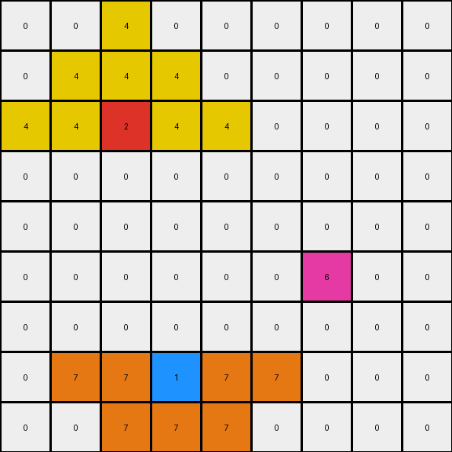

# 2-0ca9ddb6 • 023 • refine_dreamer

---


Previous Code:
```python
"""
1.  **Identify Seed Pixels:** Find all pixels in the input grid that are not white (0). These are the "seed" pixels.

2.  **Conditional Expansion - Seed Pixel Rules**
    *   If a seed pixel is Blue (1): Add Orange (7) pixels to its immediate left, right, and below positions, *but only if* those positions are currently White (0) in the *output* grid.
    *   If a seed pixel is Red (2): Add Yellow (4) pixels to its immediate top, left, and right positions, *but only if* those positions are currently White (0) in the *output* grid.
    *   If a seed pixel is Magenta (6) or Azure (8): Do nothing.

3. **Iterative Expansion:**
   * After applying the seed pixel rules above, extend around the *newly added* colors as follows:
   * If extending a blue(1) -> orange(7) area: add orange (7) to any *newly added* orange pixel's immediate left, right, and below positions, *but only if* those positions are currently White(0). Do not extend orange(7) up.
   * If extending a red(2) -> yellow(4) area: add yellow(4) to any *newly added* yellow pixel's immediate top, left and right, *but only if* those positions are currently White (0). Do not extend yellow(4) down.

4. **Do not extend colors onto other colors**
    *   All pixels that are added must extend on to an existing white (0) space.
    *   Do not extend a color onto a space if another color is present, either in the original grid or placed as an extension.

5.  All other White (0) pixels in the original input should remain White (0) if not modified by the above rule.
"""

import numpy as np

def get_seed_pixels(grid):
    """Finds all non-zero pixels and returns their coordinates and values."""
    seed_pixels = []
    for r, row in enumerate(grid):
        for c, value in enumerate(row):
            if value != 0:
                seed_pixels.append(((r, c), value))
    return seed_pixels

def transform(input_grid):
    # initialize output_grid as a copy of the input grid
    output_grid = np.copy(input_grid)
    seed_pixels = get_seed_pixels(input_grid)

    # Conditional Expansion - Seed Pixel Rules
    new_pixels = []
    for (row, col), value in seed_pixels:
        if value == 1:  # Blue
            # Add Orange (7) to the left, right, and below
            neighbors = [(row, col - 1), (row, col + 1), (row + 1, col)]
            for r, c in neighbors:
                if 0 <= r < output_grid.shape[0] and 0 <= c < output_grid.shape[1] and output_grid[r, c] == 0:
                    output_grid[r, c] = 7
                    new_pixels.append(((r,c),7)) # track newly added pixel
        elif value == 2:  # Red
            # Add Yellow (4) to the top, left, and right
            neighbors = [(row - 1, col), (row, col - 1), (row, col + 1)]
            for r, c in neighbors:
                if 0 <= r < output_grid.shape[0] and 0 <= c < output_grid.shape[1] and output_grid[r, c] == 0:
                    output_grid[r, c] = 4
                    new_pixels.append(((r,c), 4)) # track newly added pixel

    # Iterative Expansion
    for (row,col), value in new_pixels:
        if value == 7: # newly added orange
            neighbors = [(row, col - 1), (row, col + 1), (row + 1, col)]
            for r, c in neighbors:
                if 0 <= r < output_grid.shape[0] and 0 <= c < output_grid.shape[1] and output_grid[r, c] == 0:
                    output_grid[r,c] = 7
        elif value == 4:  # newly added yellow
            neighbors = [(row - 1, col), (row, col - 1), (row, col + 1)]
            for r, c in neighbors:
                if 0 <= r < output_grid.shape[0] and 0 <= c < output_grid.shape[1] and output_grid[r, c] == 0:
                    output_grid[r, c] = 4


    return output_grid
```

Train Set Results:

## Example 1:**

Input:
```
0 0 0 0 0 0 0 0 0
0 0 0 0 0 0 0 0 0
0 0 0 0 0 0 0 0 0
0 0 2 0 0 0 0 0 0
0 0 0 0 0 0 0 0 0
0 0 0 0 0 0 0 0 0
0 0 0 0 0 0 1 0 0
0 0 0 0 0 0 0 0 0
0 0 0 0 0 0 0 0 0
```
Expected Output:
```
0 0 0 0 0 0 0 0 0
0 0 0 0 0 0 0 0 0
0 4 0 4 0 0 0 0 0
0 0 2 0 0 0 0 0 0
0 4 0 4 0 0 0 0 0
0 0 0 0 0 0 7 0 0
0 0 0 0 0 7 1 7 0
0 0 0 0 0 0 7 0 0
0 0 0 0 0 0 0 0 0
```
Transformed Output:
```
0 0 0 0 0 0 0 0 0
0 0 4 0 0 0 0 0 0
0 4 4 4 0 0 0 0 0
4 4 2 4 4 0 0 0 0
0 0 0 0 0 0 0 0 0
0 0 0 0 0 0 0 0 0
0 0 0 0 7 7 1 7 7
0 0 0 0 0 7 7 7 0
0 0 0 0 0 0 7 0 0
```

match: False
pixels_off: 14
size_correct: True
color_palette_correct: True
correct_pixel_counts: False

## Example 2:**

Input:
```
0 0 0 8 0 0 0 0 0
0 0 0 0 0 0 0 0 0
0 0 0 0 0 0 2 0 0
0 0 1 0 0 0 0 0 0
0 0 0 0 0 0 0 0 0
0 0 0 0 0 0 0 0 0
0 0 0 0 0 0 1 0 0
0 2 0 0 0 0 0 0 0
0 0 0 0 0 0 0 0 0
```
Expected Output:
```
0 0 0 8 0 0 0 0 0
0 0 0 0 0 4 0 4 0
0 0 7 0 0 0 2 0 0
0 7 1 7 0 4 0 4 0
0 0 7 0 0 0 0 0 0
0 0 0 0 0 0 7 0 0
4 0 4 0 0 7 1 7 0
0 2 0 0 0 0 7 0 0
4 0 4 0 0 0 0 0 0
```
Transformed Output:
```
0 0 0 8 0 0 4 0 0
0 0 0 0 0 4 4 4 0
0 0 0 0 4 4 2 4 4
7 7 1 7 7 0 0 0 0
0 7 7 7 0 0 0 0 0
0 4 7 0 0 0 0 0 0
4 4 4 0 7 7 1 7 7
4 2 4 4 0 7 7 7 0
0 0 0 0 0 0 7 0 0
```

match: False
pixels_off: 27
size_correct: True
color_palette_correct: True
correct_pixel_counts: False

## Example 3:**

Input:
```
0 0 0 0 0 0 0 0 0
0 0 0 0 0 0 0 0 0
0 0 2 0 0 0 0 0 0
0 0 0 0 0 0 0 0 0
0 0 0 0 0 0 0 0 0
0 0 0 0 0 0 6 0 0
0 0 0 0 0 0 0 0 0
0 0 0 1 0 0 0 0 0
0 0 0 0 0 0 0 0 0
```
Expected Output:
```
0 0 0 0 0 0 0 0 0
0 4 0 4 0 0 0 0 0
0 0 2 0 0 0 0 0 0
0 4 0 4 0 0 0 0 0
0 0 0 0 0 0 0 0 0
0 0 0 0 0 0 6 0 0
0 0 0 7 0 0 0 0 0
0 0 7 1 7 0 0 0 0
0 0 0 7 0 0 0 0 0
```
Transformed Output:
```
0 0 4 0 0 0 0 0 0
0 4 4 4 0 0 0 0 0
4 4 2 4 4 0 0 0 0
0 0 0 0 0 0 0 0 0
0 0 0 0 0 0 0 0 0
0 0 0 0 0 0 6 0 0
0 0 0 0 0 0 0 0 0
0 7 7 1 7 7 0 0 0
0 0 7 7 7 0 0 0 0
```

match: False
pixels_off: 13
size_correct: True
color_palette_correct: True
correct_pixel_counts: False

**INSTRUCTIONS**

The code above was generated based on observations from the first training
example

we have tested the transform function on each of the task example inputs and
compared with the expected output

review each of the examples provided and the results and consider how the
natural language program should be updated to accommodate this new knowledge

respond with the following deliverables:

- general assessment of the information provided and strategy for resolving the
  errors
- gather metrics about each of the examples and results - use code_execution to
  develop accurate reports on your assumptions
- a YAML block documenting facts - Focus on identifying objects, their properties, and the actions performed on them.
- a natural language program - Be as clear and concise as possible, providing a complete description of the transformation rule.


your responses should be considered as information in a report - not a
conversation
