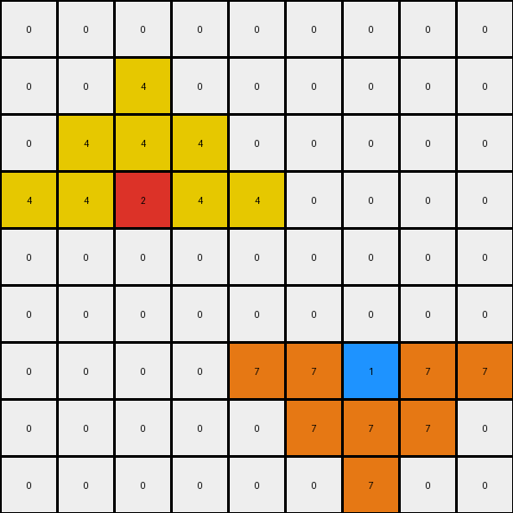
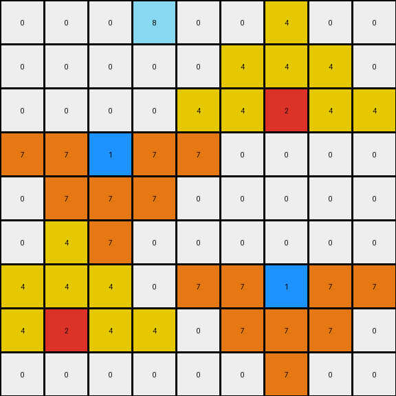

# 2-0ca9ddb6 • 024 • refine_coder

---

Previous Code:
```python
"""
1.  **Identify Seed Pixels:** Find all pixels in the input grid that are not white (0). These are the "seed" pixels.

2.  **Conditional Expansion - Seed Pixel Rules**
    *   If a seed pixel is Blue (1): Add Orange (7) pixels to its immediate left, right, and below positions, *but only if* those positions are currently White (0) in the *output* grid.
    *   If a seed pixel is Red (2): Add Yellow (4) pixels to its immediate top, left, and right positions, *but only if* those positions are currently White (0) in the *output* grid.
    *   If a seed pixel is Magenta (6) or Azure (8): Do nothing.

3. **Iterative Expansion:**
   * After applying the seed pixel rules above, extend around the *newly added* colors as follows:
   * If extending a blue(1) -> orange(7) area: add orange (7) to any *newly added* orange pixel's immediate left, right, and below positions, *but only if* those positions are currently White(0). Do not extend orange(7) up.
   * If extending a red(2) -> yellow(4) area: add yellow(4) to any *newly added* yellow pixel's immediate top, left and right, *but only if* those positions are currently White (0). Do not extend yellow(4) down.

4. **Do not extend colors onto other colors**
    *   All pixels that are added must extend on to an existing white (0) space.
    *   Do not extend a color onto a space if another color is present, either in the original grid or placed as an extension.

5.  All other White (0) pixels in the original input should remain White (0) if not modified by the above rule.
"""

import numpy as np

def get_seed_pixels(grid):
    """Finds all non-zero pixels and returns their coordinates and values."""
    seed_pixels = []
    for r, row in enumerate(grid):
        for c, value in enumerate(row):
            if value != 0:
                seed_pixels.append(((r, c), value))
    return seed_pixels

def transform(input_grid):
    # initialize output_grid as a copy of the input grid
    output_grid = np.copy(input_grid)
    seed_pixels = get_seed_pixels(input_grid)

    # Conditional Expansion - Seed Pixel Rules
    new_pixels = []
    for (row, col), value in seed_pixels:
        if value == 1:  # Blue
            # Add Orange (7) to the left, right, and below
            neighbors = [(row, col - 1), (row, col + 1), (row + 1, col)]
            for r, c in neighbors:
                if 0 <= r < output_grid.shape[0] and 0 <= c < output_grid.shape[1] and output_grid[r, c] == 0:
                    output_grid[r, c] = 7
                    new_pixels.append(((r,c),7)) # track newly added pixel
        elif value == 2:  # Red
            # Add Yellow (4) to the top, left, and right
            neighbors = [(row - 1, col), (row, col - 1), (row, col + 1)]
            for r, c in neighbors:
                if 0 <= r < output_grid.shape[0] and 0 <= c < output_grid.shape[1] and output_grid[r, c] == 0:
                    output_grid[r, c] = 4
                    new_pixels.append(((r,c), 4)) # track newly added pixel

    # Iterative Expansion
    for (row,col), value in new_pixels:
        if value == 7: # newly added orange
            neighbors = [(row, col - 1), (row, col + 1), (row + 1, col)]
            for r, c in neighbors:
                if 0 <= r < output_grid.shape[0] and 0 <= c < output_grid.shape[1] and output_grid[r, c] == 0:
                    output_grid[r,c] = 7
        elif value == 4:  # newly added yellow
            neighbors = [(row - 1, col), (row, col - 1), (row, col + 1)]
            for r, c in neighbors:
                if 0 <= r < output_grid.shape[0] and 0 <= c < output_grid.shape[1] and output_grid[r, c] == 0:
                    output_grid[r, c] = 4


    return output_grid
```

Train Set Results:

## Example 1:**

Input:
```
0 0 0 0 0 0 0 0 0
0 0 0 0 0 0 0 0 0
0 0 0 0 0 0 0 0 0
0 0 2 0 0 0 0 0 0
0 0 0 0 0 0 0 0 0
0 0 0 0 0 0 0 0 0
0 0 0 0 0 0 1 0 0
0 0 0 0 0 0 0 0 0
0 0 0 0 0 0 0 0 0
```
Expected Output:
```
0 0 0 0 0 0 0 0 0
0 0 0 0 0 0 0 0 0
0 4 0 4 0 0 0 0 0
0 0 2 0 0 0 0 0 0
0 4 0 4 0 0 0 0 0
0 0 0 0 0 0 7 0 0
0 0 0 0 0 7 1 7 0
0 0 0 0 0 0 7 0 0
0 0 0 0 0 0 0 0 0
```
Transformed Output:
```
0 0 0 0 0 0 0 0 0
0 0 4 0 0 0 0 0 0
0 4 4 4 0 0 0 0 0
4 4 2 4 4 0 0 0 0
0 0 0 0 0 0 0 0 0
0 0 0 0 0 0 0 0 0
0 0 0 0 7 7 1 7 7
0 0 0 0 0 7 7 7 0
0 0 0 0 0 0 7 0 0
```

match: False
pixels_off: 14
size_correct: True
color_palette_correct: True
correct_pixel_counts: False

## Example 2:**

Input:
```
0 0 0 8 0 0 0 0 0
0 0 0 0 0 0 0 0 0
0 0 0 0 0 0 2 0 0
0 0 1 0 0 0 0 0 0
0 0 0 0 0 0 0 0 0
0 0 0 0 0 0 0 0 0
0 0 0 0 0 0 1 0 0
0 2 0 0 0 0 0 0 0
0 0 0 0 0 0 0 0 0
```
Expected Output:
```
0 0 0 8 0 0 0 0 0
0 0 0 0 0 4 0 4 0
0 0 7 0 0 0 2 0 0
0 7 1 7 0 4 0 4 0
0 0 7 0 0 0 0 0 0
0 0 0 0 0 0 7 0 0
4 0 4 0 0 7 1 7 0
0 2 0 0 0 0 7 0 0
4 0 4 0 0 0 0 0 0
```
Transformed Output:
```
0 0 0 8 0 0 4 0 0
0 0 0 0 0 4 4 4 0
0 0 0 0 4 4 2 4 4
7 7 1 7 7 0 0 0 0
0 7 7 7 0 0 0 0 0
0 4 7 0 0 0 0 0 0
4 4 4 0 7 7 1 7 7
4 2 4 4 0 7 7 7 0
0 0 0 0 0 0 7 0 0
```

match: False
pixels_off: 27
size_correct: True
color_palette_correct: True
correct_pixel_counts: False

## Example 3:**

Input:
```
0 0 0 0 0 0 0 0 0
0 0 0 0 0 0 0 0 0
0 0 2 0 0 0 0 0 0
0 0 0 0 0 0 0 0 0
0 0 0 0 0 0 0 0 0
0 0 0 0 0 0 6 0 0
0 0 0 0 0 0 0 0 0
0 0 0 1 0 0 0 0 0
0 0 0 0 0 0 0 0 0
```
Expected Output:
```
0 0 0 0 0 0 0 0 0
0 4 0 4 0 0 0 0 0
0 0 2 0 0 0 0 0 0
0 4 0 4 0 0 0 0 0
0 0 0 0 0 0 0 0 0
0 0 0 0 0 0 6 0 0
0 0 0 7 0 0 0 0 0
0 0 7 1 7 0 0 0 0
0 0 0 7 0 0 0 0 0
```
Transformed Output:
```
0 0 4 0 0 0 0 0 0
0 4 4 4 0 0 0 0 0
4 4 2 4 4 0 0 0 0
0 0 0 0 0 0 0 0 0
0 0 0 0 0 0 0 0 0
0 0 0 0 0 0 6 0 0
0 0 0 0 0 0 0 0 0
0 7 7 1 7 7 0 0 0
0 0 7 7 7 0 0 0 0
```

match: False
pixels_off: 13
size_correct: True
color_palette_correct: True
correct_pixel_counts: False
Okay, let's analyze the results and refine the natural language program.

**General Assessment:**

The initial strategy of identifying "seed" pixels and expanding them based on color-specific rules has merit. However, the iterative expansion logic is flawed. It appears to be adding pixels in all allowed directions *simultaneously* during the iteration on `new_pixels`, rather than in a truly iterative, layer-by-layer fashion, causing "bleeding" of colors beyond what the outputs intend. Specifically, the transformed output grows colors around the entire perimeter of newly placed colors in a single pass, instead of a staged expansion.

**Strategy for Resolving Errors:**

1.  **Correct Iterative Expansion:** The core issue is the way the `new_pixels` are handled. The iterative expansion should happen in distinct steps. After placing the initial extensions around the seed pixels, we need to treat *only* those new pixels as seeds for the *next* step. This prevents "over-expansion" in a single iteration. We need to iterate on the newly added colors only and not extend based on the input colors.

2.  **Refine Neighbor Selection:** Verify neighbors should ensure that expansion occurs only on to white pixels.

**Metrics and Observations:**

Here's a breakdown of each example, incorporating observations:

*   **Example 1:**
    *   Input has seed pixels: Red (2) and Blue (1).
    *   Expected output shows a limited expansion of Yellow (4) around Red and Orange (7) around Blue.
    *   Transformed output shows excessive expansion, particularly around the initial extensions.
    *   Errors: "Bleeding" of colors. The extension is occurring in single passes, not iteratively building out.
*   **Example 2:**
    *   Input has seed pixels: Azure (8), Red (2), Blue (1), and Blue(1).
    *   Expected output: Azure(8) does not expand, Red(2) expands up left, and right with Yellow, Blue expands down, left, right with orange(7)
    *   Transformed output: Shows interaction errors. The colors are expanding too aggressively again.
    *    Errors: "Bleeding", colors expanding onto non-white areas.
*   **Example 3:**
    *   Input has seed pixels: Red(2), Magenta(6) and Blue(1)
    *   Expected output: Red(2) exapnds as expected, Magenta(6) no change as expected. Blue(1) limited extension
    *   Transformed output: Magenta has no change as expected but Red and Blue expanding too far
    *   Errors: "Bleeding" of the Red/Yellow and Blue/Orange expansion

**YAML Facts:**

```yaml
task: 022
objects:
  - type: pixel
    properties:
      colors: [0, 1, 2, 4, 6, 7, 8]  # Colors present in inputs/outputs
      seed_colors: [1, 2, 6, 8]   # Colors that initiate a transformation
      expansion_colors: {1: 7, 2: 4}  # Mapping of seed color to expansion color
      expansion_directions:
        1: [down, left, right]  # Blue expands to Orange in these directions
        2: [up, left, right]    # Red expands to Yellow in these directions
        6: []  # stays
        8: []  # Stays
      constraints: [expands_onto_white_only] #pixel can only expand where an existing white(0) pixel exists.
actions:
  - name: expand_seed_pixels
    description: Seed pixels initiate color expansions based on their color.
  - name: iterative_expansion
    description: Newly added expansion colors continue to expand, one layer at a time, but ONLY onto white(0).
```

**Natural Language Program:**

1.  **Identify Seed Pixels:** Locate all non-white (non-0) pixels in the input grid. These are the "seed" pixels.

2.  **Initial Expansion (Seed Pixel Rules):**
    *   If a seed pixel is Blue (1): Add Orange (7) pixels to its immediate left, right, and below positions, *but only if* those positions are currently White (0) in the *output* grid.
    *   If a seed pixel is Red (2): Add Yellow (4) pixels to its immediate top, left, and right positions, *but only if* those positions are currently White (0) in the *output* grid.
    *   If a seed pixel is Magenta (6) or Azure (8): Do nothing.

3.  **Iterative Expansion (Layer-by-Layer):**
    *   **Step 1:** Consider *only* the Orange (7) and Yellow(4) pixels added in the *Initial Expansion*.
        * If an added pixel is Orange (7): add an Orange(7) pixel to its immediate left, right and below, *but only if* those positions are currently White(0) in the output grid.
        * If an added pixel is Yellow(4): add an Yellow(4) pixel to its immediate top, left, and right, *but only if* those positions are currently white(0) in the output grid.
    *  **Step 2 and beyond:** Repeat Step 1, but for each iteration, *only* consider the colored pixels added in the *immediately preceding* step. Continue until no new pixels are added.

4.  **Expansion Constraints:**
    *   New pixels can only be added to positions that are currently White (0) in the output grid.
    *   Colors *never* expand onto other non-white colors, whether those colors are from the original input or added during expansion.

5. **Preservation:**
  * White (0) pixels not modified remain white(0).

**INSTRUCTIONS**

- generate a Python module to represent the natural language program 
- follow the template below
- all common math and science libraries are available
- create docstring only at top - but comment the workflow in the function
- use helper functions for common operations like finding objects, counting,
  measuring, moving, etc. 

remember - we are working iteratively - so this code will inform your future
self as we converge on the solution

*template:*

```python
"""
{{ natural language description of the transformation rule }}
"""

{{ imports }}

def transform(input_grid):
    # initialize output_grid

    # change output pixels 

    return output_grid

```
