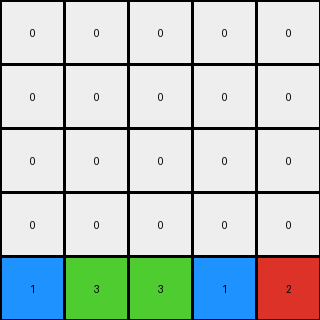

# 3-1e0a9b12 • 004 • refine_coder

---

Previous Code:
```python
"""
The transformation moves all non-zero pixels to the last row of the output grid, preserving their original order from top to bottom, left to right, and fills the rest of the grid with zeros.
"""

import numpy as np

def transform(input_grid):
    """
    Transforms the input grid by moving all non-zero pixels to the last row,
    preserving their order, and filling the rest with zeros.
    """
    rows = len(input_grid)
    cols = len(input_grid[0])
    output_grid = np.zeros_like(input_grid)

    # 1. Identify and Order Non-Zero Pixels
    non_zero_pixels = []
    for r in range(rows):
        for c in range(cols):
            if input_grid[r][c] != 0:
                non_zero_pixels.append(input_grid[r][c])

    # 2. Fill last row with Non-Zero Pixels
    last_row_index = rows - 1
    for i in range(len(non_zero_pixels)):
        if i < cols:
          output_grid[last_row_index][i] = non_zero_pixels[i]

    return output_grid
```

Train Set Results:

## Example 1:**

Input:
```
0 4 0 9
0 0 0 0
0 4 6 0
1 0 0 0
```
Expected Output:
```
0 0 0 0
0 0 0 0
0 4 0 0
1 4 6 9
```
Transformed Output:
```
0 0 0 0
0 0 0 0
0 0 0 0
4 9 4 6
```

match: False
pixels_off: 5
size_correct: True
color_palette_correct: True
correct_pixel_counts: False

## Example 2:**

Input:
```
0 0 0 0 0 9
0 0 0 8 0 0
0 0 0 0 0 0
4 0 0 0 0 0
4 0 7 8 0 0
4 0 7 0 0 0
```
Expected Output:
```
0 0 0 0 0 0
0 0 0 0 0 0
0 0 0 0 0 0
4 0 0 0 0 0
4 0 7 8 0 0
4 0 7 8 0 9
```
Transformed Output:
```
0 0 0 0 0 0
0 0 0 0 0 0
0 0 0 0 0 0
0 0 0 0 0 0
0 0 0 0 0 0
9 8 4 4 7 8
```

match: False
pixels_off: 10
size_correct: True
color_palette_correct: True
correct_pixel_counts: False

## Example 3:**

Input:
```
0 0 0 1 0
0 3 0 0 0
0 3 0 1 2
6 0 0 0 0
0 3 0 0 0
```
Expected Output:
```
0 0 0 0 0
0 0 0 0 0
0 3 0 0 0
0 3 0 1 0
6 3 0 1 2
```
Transformed Output:
```
0 0 0 0 0
0 0 0 0 0
0 0 0 0 0
0 0 0 0 0
1 3 3 1 2
```

match: False
pixels_off: 5
size_correct: True
color_palette_correct: True
correct_pixel_counts: False
Here's an analysis of the provided information and a plan to refine the natural language program and the code:

**General Assessment:**

The initial natural language program and the resulting code were too simplistic. While it correctly identified the non-zero pixels and attempted to move them, it failed to account for the spatial relationships and specific transformations occurring in the examples. The code only considers placing non-zero pixels in the *last* row. The examples show, this is not always the case. The order is correct (top to bottom, left to right) but the placement is not correct, and it seems like the objects are being "stacked" in the output grids, from the bottom.

The strategy is to shift to a focus on identifying not just the non-zero pixels, but also try to define a rule to transform non-zero pixels to the bottom-most non-zero pixel in each column, but preserve rows above that bottom-most non-zero pixel.

**Example Metrics and Analysis:**

Here's a breakdown of each example, incorporating observations and quantitative metrics:

*Example 1:*

*   **Input:** 4x4 grid, non-zero pixels: 4, 9, 4, 6, 1
*   **Expected Output:** Shows a stacking effect. Non-zero pixels are moved down within their columns.
*   **Transformed Output:** Non-zero pixels are placed only at the bottom row. Pixels moved incorrectly.
*   **Observations:** The code's logic of only using the last row is incorrect.

*Example 2:*

*   **Input:** 6x6 grid, non-zero pixels: 9, 8, 4, 4, 7, 8, 4, 7
*   **Expected Output:** Shows vertical stacking within columns.  The last two rows have the same spatial arrangement of non-zero pixels and zeros, with pixel 9 at the bottom of the last column
*   **Transformed Output:** Places all non-zero pixels on the last row, ignoring the column-wise stacking.
*   **Observations:** Confirms the error in the initial approach. The transformation maintains relative vertical positioning within each column.

*Example 3:*

*   **Input:** 5x5 grid, non-zero pixels: 1, 3, 3, 1, 2, 6, 3
*   **Expected Output:** Non-zero pixels are stacked at the bottom of the grid.
*   **Transformed Output:** Only fills last row.
*   **Observations:** Column-wise transformation is apparent.

**YAML Fact Block:**

```yaml
examples:
  - example_id: 1
    objects:
      - value: 4
        original_position: [0, 1]
        transformed_position: [3, 1]
      - value: 9
        original_position: [0, 3]
        transformed_position: [3, 3]
      - value: 4
        original_position: [2, 1]
        transformed_position: [3, 1]
      - value: 6
        original_position: [2, 2]
        transformed_position: [3, 2]
      - value: 1
        original_position: [3, 0]
        transformed_position: [3, 0]
    transformations:
      - description: "Non-zero pixels are moved down within their columns to stack at the bottom of the grid."
  - example_id: 2
    objects:
       - value: 9
         original_position: [0, 5]
         transformed_position: [5, 5]
       - value: 8
         original_position: [1, 3]
         transformed_position: [5, 3]
       - value: 4
         original_position: [3, 0]
         transformed_position: [5, 0]
       - value: 4
         original_position: [4, 0]
         transformed_position: [5, 0]
       - value: 7
         original_position: [4, 2]
         transformed_position: [5, 2]
       - value: 8
         original_position: [4, 3]
         transformed_position: [5, 3]
       - value: 4
         original_position: [5, 0]
         transformed_position: [5, 0]
       - value: 7
         original_position: [5, 2]
         transformed_position: [5, 2]
    transformations:
      - description: "Non-zero pixels move to stack at the bottom, within their columns."
  - example_id: 3
    objects:
       - value: 1
         original_position: [0, 3]
         transformed_position: [4, 3]
       - value: 3
         original_position: [1, 1]
         transformed_position: [4, 1]
       - value: 3
         original_position: [2, 1]
         transformed_position: [4, 1]
       - value: 1
         original_position: [2, 3]
         transformed_position: [4, 3]
       - value: 2
         original_position: [2, 4]
         transformed_position: [4, 4]
       - value: 6
         original_position: [3, 0]
         transformed_position: [4, 0]
       - value: 3
         original_position: [4, 1]
         transformed_position: [4, 1]
    transformations:
      - description: "Non-zero pixels move to stack at the bottom, within their columns."

```

**Natural Language Program:**

1.  **Identify Non-Zero Pixels:** Find all pixels in the input grid that have a value other than zero.
2.  **Column-wise Stacking:** For each column, identify the non-zero pixels.
3. **Stack at Bottom:** Transform the input by stacking all the non-zero pixels within their column from the original position to the bottom of the output grid.
4.  **Preserve Order:** Maintain the original top-to-bottom, then left-to-right order of non-zero pixels when stacking.
5.  **Fill Remaining:** Fill any remaining cells in the output grid with zeros.

In essence, the transformation rule involves a column-wise stacking of non-zero pixels to the bottom of the grid, preserving the relative vertical order of the elements within each column.

**INSTRUCTIONS**

- generate a Python module to represent the natural language program 
- follow the template below
- all common math and science libraries are available
- create docstring only at top - but comment the workflow in the function
- use helper functions for common operations like finding objects, counting,
  measuring, moving, etc. 

remember - we are working iteratively - so this code will inform your future
self as we converge on the solution

*template:*

```python
"""
{{ natural language description of the transformation rule }}
"""

{{ imports }}

def transform(input_grid):
    # initialize output_grid

    # change output pixels 

    return output_grid

```
