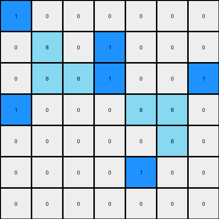

# 1-3aa6fb7a • 013 • refine_dreamer

---


Previous Code:
```python
"""
1.  **Identify Azure Pixels:** Locate all azure (8) pixels in the input grid.

2.  **Form 2x2 Squares:** For each azure pixel, check if it can form the corner of a 2x2 square within the grid boundaries.

3. **Check for Blocking Colors.** If the other 3 potential positions in the 2x2
   square are not already azure or blue (i.e. positions that would block a new
   pixel from being added)
   
4.  **Add Blue Pixel:** If a 2x2 square can be formed and the diagonally opposite corner from the azure pixel is empty or does not contain a blue pixel or azure pixel, add a blue (1) pixel at that diagonally opposite corner.

5. **Iterate**: Only one blue pixel is added for each suitable azure '8' pixel,
   there doesn't seem to be any criteria that governs selection, it just
   requires a suitable 2x2 block.

6. **Output**: return the new grid.
"""

import numpy as np

def find_azure_pixels(grid):
    # Find coordinates of all azure pixels
    return np.argwhere(grid == 8)

def is_valid(grid, row, col):
    rows, cols = grid.shape
    return 0 <= row < rows and 0<= col < cols

def can_form_2x2_square(grid, r_azure, c_azure, r_check, c_check):
     # check opposite side from the azure for out of bounds

    if not is_valid(grid, r_check, c_check):
        return False

    # check if it is blocking color
    if grid[r_check, c_check] == 1 or grid[r_check, c_check] == 8: return False
    
    row_diff = r_azure - r_check
    col_diff = c_azure - c_check

    # must be diagonal
    if abs(row_diff) != 1 or abs(col_diff) != 1: return False

    r1 = r_azure - row_diff
    c1 = c_azure
    if not is_valid(grid, r1, c1) or grid[r1,c1] == 1 or grid[r1, c1] == 8: return False
        
    r2 = r_azure
    c2 = c_azure - col_diff
    if not is_valid(grid, r2, c2) or grid[r2, c2] == 1 or grid[r2,c2] == 8: return False
    
    return True

def transform(input_grid):
    # Initialize output_grid as a copy of the input_grid
    output_grid = np.copy(input_grid)
    azure_pixels = find_azure_pixels(output_grid)

    # Iterate through azure pixels and apply transformation rule
    for r_azure, c_azure in azure_pixels:
        for r_check in [r_azure -1, r_azure + 1]:
            for c_check in [c_azure -1, c_azure + 1]:
                if can_form_2x2_square(output_grid, r_azure, c_azure, r_check, c_check):
                    output_grid[r_check, c_check] = 1
                    break # only create one
            else:
                continue
            break


    return output_grid
```

Train Set Results:

## Example 1:**

Input:
```
0 0 0 0 0 0 0
0 8 0 0 0 0 0
0 8 8 0 0 0 0
0 0 0 0 8 8 0
0 0 0 0 0 8 0
0 0 0 0 0 0 0
0 0 0 0 0 0 0
```
Expected Output:
```
0 0 0 0 0 0 0
0 8 1 0 0 0 0
0 8 8 0 0 0 0
0 0 0 0 8 8 0
0 0 0 0 1 8 0
0 0 0 0 0 0 0
0 0 0 0 0 0 0
```
Transformed Output:
```
1 0 0 0 0 0 0
0 8 0 1 0 0 0
0 8 8 1 0 0 1
1 0 0 0 8 8 0
0 0 0 0 0 8 0
0 0 0 0 1 0 0
0 0 0 0 0 0 0
```

match: False
pixels_off: 8
size_correct: True
color_palette_correct: True
correct_pixel_counts: False

## Example 2:**

Input:
```
0 0 0 0 8 8 0
0 0 0 0 0 8 0
0 0 8 0 0 0 0
0 0 8 8 0 0 0
0 0 0 0 0 0 0
0 0 0 0 8 0 0
0 0 0 8 8 0 0
```
Expected Output:
```
0 0 0 0 8 8 0
0 0 0 0 1 8 0
0 0 8 1 0 0 0
0 0 8 8 0 0 0
0 0 0 0 0 0 0
0 0 0 1 8 0 0
0 0 0 8 8 0 0
```
Transformed Output:
```
0 0 0 0 8 8 0
0 1 0 1 0 8 0
0 0 8 0 1 0 0
0 0 8 8 0 0 0
0 1 0 0 1 0 0
0 0 1 0 8 0 0
0 0 0 8 8 0 0
```

match: False
pixels_off: 9
size_correct: True
color_palette_correct: True
correct_pixel_counts: False

**INSTRUCTIONS**

The code above was generated based on observations from the first training
example

we have tested the transform function on each of the task example inputs and
compared with the expected output

review each of the examples provided and the results and consider how the
natural language program should be updated to accommodate this new knowledge

respond with the following deliverables:

- general assessment of the information provided and strategy for resolving the
  errors
- gather metrics about each of the examples and results - use code_execution to
  develop accurate reports on your assumptions
- a YAML block documenting facts - Focus on identifying objects, their properties, and the actions performed on them.
- a natural language program - Be as clear and concise as possible, providing a complete description of the transformation rule.


your responses should be considered as information in a report - not a
conversation
