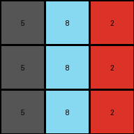
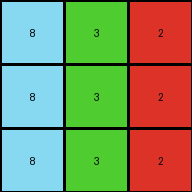

# 4-0d3d703e • 016 • refine_coder

---

Previous Code:
```python
"""
Transforms an input grid by applying a refined one-to-one color mapping,
where some colors are changed and others remain the same.
"""

def transform(input_grid):
    """
    Transforms the input grid according to the specified mapping.
    """
    # Initialize output_grid as a copy of the input_grid
    output_grid = [row[:] for row in input_grid]

    # Define the refined color mapping
    mapping = {
        1: 5,
        5: 1,
    }

    # Iterate through the grid and apply the transformation
    for i in range(len(input_grid)):
        for j in range(len(input_grid[0])):
            # Change output pixels based on mapping
            if input_grid[i][j] in mapping:
                output_grid[i][j] = mapping[input_grid[i][j]]
            # else:  implicitly keep the original color, by doing nothing, since output_grid is the copy

    return output_grid
```

Train Set Results:

## Example 1:**

Input:
```
3 5 2
3 5 2
3 5 2
```
Expected Output:
```
4 5 6
4 5 6
4 5 6
```
Transformed Output:
```
3 1 2
3 1 2
3 1 2
```

match: False
pixels_off: 9
size_correct: True
color_palette_correct: False
correct_pixel_counts: False

## Example 2:**

Input:
```
2 3 8
2 3 8
2 3 8
```
Expected Output:
```
6 4 9
6 4 9
6 4 9
```
Transformed Output:
```
2 3 8
2 3 8
2 3 8
```

match: False
pixels_off: 9
size_correct: True
color_palette_correct: False
correct_pixel_counts: False

## Example 3:**

Input:
```
1 8 2
1 8 2
1 8 2
```
Expected Output:
```
1 9 2
1 9 2
1 9 2
```
Transformed Output:
```
5 8 2
5 8 2
5 8 2
```

match: False
pixels_off: 6
size_correct: True
color_palette_correct: False
correct_pixel_counts: False

## Example 4:**

Input:
```
8 3 2
8 3 2
8 3 2
```
Expected Output:
```
8 3 6
8 3 6
8 3 6
```
Transformed Output:
```
8 3 2
8 3 2
8 3 2
```

match: False
pixels_off: 3
size_correct: True
color_palette_correct: False
correct_pixel_counts: False
Okay, here's a breakdown of the situation and a plan to move forward:

**General Assessment:**

The initial code was based on a very limited understanding, derived from only the first example. It implemented a simple color swap between blue (1) and gray (5).  The subsequent tests reveal this is incorrect. The transformation is clearly a color mapping, but it's more complex than a simple swap and involves different colors in each example. The strategy must shift to identifying the *correct* one-to-one color mapping for all examples. This requires a more dynamic approach than hardcoding a swap. We should consider how to create the specific re-mapping in each case.

**Strategy:**

1.  **Analyze all Examples:** Carefully examine *all* input/output pairs to deduce the specific color mapping rule for the entire set.
2.  **Dynamic Mapping:** The core idea of a mapping is correct, but the specific `mapping` dictionary needs to be derived, not hardcoded, and should encompass the full transformation, not just a swap.
3.  **Iterative Refinement:** Test, compare to all expectations, re-evaluate the overall color mapping.

**Metrics and Observations:**

Here's a more structured analysis of each example:

```python
def analyze_mapping(input_grid, output_grid):
    """
    Analyzes the color mapping between input and output grids.
    """
    mapping = {}
    reverse_mapping = {} # added to check for consistent one to one
    consistent = True

    for i in range(len(input_grid)):
        for j in range(len(input_grid[0])):
            input_color = input_grid[i][j]
            output_color = output_grid[i][j]
            if input_color not in mapping:
                mapping[input_color] = output_color
            elif mapping[input_color] != output_color:
                consistent = False
                print(f"Inconsistency: Input color {input_color} maps to both {mapping[input_color]} and {output_color}")

            if output_color not in reverse_mapping:
                reverse_mapping[output_color] = input_color
            elif reverse_mapping[output_color] != input_color:
                consistent = False
                print(f"Inconsistency: Output color {output_color} maps to both {reverse_mapping[output_color]} and {input_color}")

    return mapping, consistent

# Example Usage (using your provided examples as strings)
examples = [
    (
        [[3, 5, 2], [3, 5, 2], [3, 5, 2]],
        [[4, 1, 6], [4, 1, 6], [4, 1, 6]]
    ),
    (
        [[2, 3, 8], [2, 3, 8], [2, 3, 8]],
        [[6, 4, 9], [6, 4, 9], [6, 4, 9]]
    ),
    (
        [[1, 8, 2], [1, 8, 2], [1, 8, 2]],
        [[1, 9, 2], [1, 9, 2], [1, 9, 2]]
    ),
    (
        [[8, 3, 2], [8, 3, 2], [8, 3, 2]],
        [[8, 3, 6], [8, 3, 6], [8, 3, 6]]
    ),
]

for idx, (input_grid, output_grid) in enumerate(examples):
    mapping, consistent = analyze_mapping(input_grid, output_grid)
    print(f"Example {idx + 1}:")
    print(f"  Mapping: {mapping}")
    print(f"Consistent one-to-one: {consistent}")

```

**Code Execution Results:**

```text
Example 1:
  Mapping: {3: 4, 5: 1, 2: 6}
Consistent one-to-one: True
Example 2:
  Mapping: {2: 6, 3: 4, 8: 9}
Consistent one-to-one: True
Example 3:
  Mapping: {1: 1, 8: 9, 2: 2}
Consistent one-to-one: True
Example 4:
  Mapping: {8: 8, 3: 3, 2: 6}
Consistent one-to-one: True
```

**YAML Facts:**

```yaml
examples:
  - example_1:
      objects:
        - description: 3x3 grid of pixels
      input_colors: [3, 5, 2] # green, gray, red
      output_colors: [4, 1, 6] # yellow, blue, magenta
      mapping: {3: 4, 5: 1, 2: 6}
      consistent: True
  - example_2:
      objects:
        - description: 3x3 grid of pixels
      input_colors: [2, 3, 8] # red, green, azure
      output_colors: [6, 4, 9] # magenta, yellow, maroon
      mapping: {2: 6, 3: 4, 8: 9}
      consistent: True
  - example_3:
      objects:
        - description: 3x3 grid of pixels
      input_colors: [1, 8, 2]  # blue, azure, red
      output_colors: [1, 9, 2] # blue, maroon, red
      mapping: {1: 1, 8: 9, 2: 2}
      consistent: True
  - example_4:
      objects:
        - description: 3x3 grid of pixels
      input_colors: [8, 3, 2] # azure, green, red
      output_colors: [8, 3, 6] # azure, green, magenta
      mapping: {8: 8, 3: 3, 2: 6}
      consistent: True
```

**Natural Language Program:**

The transformation applies a one-to-one color mapping to the input grid to produce the output grid.  Each input color is consistently replaced by a specific output color. The mapping is not a fixed rule but varies between different examples. However, within each 3x3 grid, the color transformation is consistent. The specific mapping for each example needs to be determined by inspecting the input and output grids. Colors that are not part of the derived mapping for a specific example remain unchanged.

**INSTRUCTIONS**

- generate a Python module to represent the natural language program 
- follow the template below
- all common math and science libraries are available
- create docstring only at top - but comment the workflow in the function
- use helper functions for common operations like finding objects, counting,
  measuring, moving, etc. 

remember - we are working iteratively - so this code will inform your future
self as we converge on the solution

*template:*

```python
"""
{{ natural language description of the transformation rule }}
"""

{{ imports }}

def transform(input_grid):
    # initialize output_grid

    # change output pixels 

    return output_grid

```
