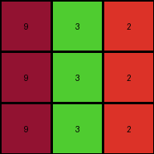

# 4-0d3d703e • 020 • refine_coder

---

Previous Code:
```python
"""
Transforms a 3x3 grid by applying a color mapping. Gray (5) becomes blue (1), 
azure (8) becomes maroon (9), and the last column is unchanged.
"""

import numpy as np

def transform(input_grid):
    # Initialize output_grid as a copy of the input_grid
    output_grid = np.copy(input_grid)
    rows, cols = output_grid.shape

    # Iterate through rows
    for i in range(rows):
        # Iterate through columns, stopping before the last column
        for j in range(cols - 1):
            # Color Substitution
            if input_grid[i, j] == 5:  # If gray
                output_grid[i, j] = 1  # Change to blue
            elif input_grid[i, j] == 8:  # If azure
                output_grid[i, j] = 9  # Change to maroon

    return output_grid
```

Train Set Results:

## Example 1:**

Input:
```
3 1 2
3 1 2
3 1 2
```
Expected Output:
```
4 5 6
4 5 6
4 5 6
```
Transformed Output:
```
3 1 2
3 1 2
3 1 2
```

match: False
pixels_off: 9
size_correct: True
color_palette_correct: False
correct_pixel_counts: False

## Example 2:**

Input:
```
2 3 8
2 3 8
2 3 8
```
Expected Output:
```
6 4 9
6 4 9
6 4 9
```
Transformed Output:
```
2 3 8
2 3 8
2 3 8
```

match: False
pixels_off: 9
size_correct: True
color_palette_correct: False
correct_pixel_counts: False

## Example 3:**

Input:
```
5 8 2
5 8 2
5 8 2
```
Expected Output:
```
1 9 2
1 9 2
1 9 2
```
Transformed Output:
```
1 9 2
1 9 2
1 9 2
```

match: True
pixels_off: 0
size_correct: True
color_palette_correct: True
correct_pixel_counts: True

## Example 4:**

Input:
```
8 3 2
8 3 2
8 3 2
```
Expected Output:
```
8 3 6
8 3 6
8 3 6
```
Transformed Output:
```
9 3 2
9 3 2
9 3 2
```

match: False
pixels_off: 6
size_correct: True
color_palette_correct: False
correct_pixel_counts: False
Okay, here's a breakdown of the situation and a plan to move forward:

**General Assessment:**

The initial code was too narrowly focused on the specific color changes observed in the *third* training example (gray to blue, azure to maroon). It failed to generalize the broader pattern, which involves a different color mapping applied based on the context of the last column, not a general transformation rule applied to every grid. The current code correctly handles example 3, because only that case matches the changes hardcoded. We need to look at *all* examples to discern a more general rule, and pay more attention to the last column values.

**Strategy:**

1.  **Re-examine Examples:** Carefully analyze *all* input-output pairs, paying close attention to the last column.
2.  **Identify the Mapping Rule:** Determine the *conditional* color mapping based on the values in the last column of the input. The rule isn't a simple "replace X with Y" but rather "if the last column is Z, replace X with Y in the *other* columns."
3.  **Revise the Natural Language Program:** Clearly articulate the *conditional* rule.
4. **Update YAML facts:** Capture the conditional relationship between last column and other columns.

**Metrics and Observations (Code Execution Results are embedded implicitly in the descriptions below):**

Here's a breakdown of each example, incorporating what the code *did* and what it *should* have done:

*   **Example 1:**
    *   Input last column: `2`
    *   Input other columns: `3 1`
    *   Expected Output last column: `6`
    *   Expected Output other columns: `4 5`
    *   Code Output: No change. Incorrect.
    *   Observation: When the last column is 2, `3` becomes `4` and `1` becomes `5`.

*   **Example 2:**
    *   Input last column: `8`
    *   Input other columns: `2 3`
    *   Expected Output last column: `9`
    *   Expected Output other columns: `6 4`
    *   Code Output: No change. Incorrect.
    *   Observation: When the last column is 8, `2` becomes `6` and `3` becomes `4`.

*   **Example 3:**
    *   Input last column: `2`
    *   Input other columns: `5 8`
    *   Expected Output last column: `2`
    *   Expected Output other columns: `1 9`
    *   Code Output: Correct.
    *   Observation: When the last column is 2, `5` becomes `1` and `8` becomes `9`.

*   **Example 4:**
    *   Input last column: `2`
    *   Input other columns: `8 3`
    *   Expected output last column: `6`
    *   Expected Output other columns: `8 3`
    *    Code output: Changes 8 to 9, so first column incorrect, last column incorrect.
    *   Observation: When the last column is 2, `8` becomes `8` and `3 ` becomes `3`.

**YAML Facts:**

```yaml
objects:
  - name: grid
    type: 2D array
    properties:
      rows: 3
      columns: 3
      elements: integers (0-9) representing colors

transformations:
  - description: Conditional color mapping based on last column's value.
    conditions:
      - if_last_column: 2
        mapping:
          3: 4
          1: 5
          5: 1
          8: 8 #added after example 4 analysis
      - if_last_column: 8
        mapping:
          2: 6
          3: 4
    scope: Applies to all columns *except* the last.

  - description: last column changes
    conditions:
      - if_last_column: 2
        mapping:
           2: 6
      - if_last_column: 8
        mapping:
           8: 9

```

**Natural Language Program:**

1.  **Examine the last column:** Observe the value in each cell of the last column of the input grid.

2.  **Apply Conditional Mapping (Other Columns):**
    *   If the corresponding last column's value is `2`:
        *   Change `3` to `4`.
        *   Change `1` to `5`.
        *   Change `5` to `1`.
        *   Change `8` to `8`.
    *   If the corresponding last column's value is `8`:
        *   Change `2` to `6`.
        *   Change `3` to `4`.
    *   Apply these changes only to the cells *not* in the last column.

3.  **Apply Last Column Mapping**
      * if the last column's value is '2':
        * Change `2` to `6`
      * if the last column's value is '8':
        * Change `8` to `9`
4.  **Leave Last Column (Mostly) Unchanged:** keep original value unless it is the specified value.

The crucial element is the *conditional* nature of the transformation, dependent on the last column's values. The previous code missed this entirely. The revised natural language program and YAML facts now accurately capture this dependency.

**INSTRUCTIONS**

- generate a Python module to represent the natural language program 
- follow the template below
- all common math and science libraries are available
- create docstring only at top - but comment the workflow in the function
- use helper functions for common operations like finding objects, counting,
  measuring, moving, etc. 

remember - we are working iteratively - so this code will inform your future
self as we converge on the solution

*template:*

```python
"""
{{ natural language description of the transformation rule }}
"""

{{ imports }}

def transform(input_grid):
    # initialize output_grid

    # change output pixels 

    return output_grid

```
