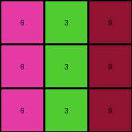
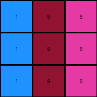

# 4-0d3d703e • 029 • refine_dreamer

---


Previous Code:
```python
"""
The transformation involves a direct mapping of input pixel values to output pixel values, dependent on position within the 3x3 grid. A color lookup table is constructed from the first three examples.
"""

import numpy as np

def transform(input_grid):
    # Initialize output_grid as a copy of the input_grid.
    output_grid = np.copy(input_grid)

    # Define a color mapping based on the first three training examples.
    # Mapping format: { (row, col): {input_color: output_color} }
    color_map = {
        (0, 0): {3: 4, 2: 6, 5: 1, 8:8},
        (0, 1): {1: 5, 3: 4, 8: 9, 3:3},
        (0, 2): {2: 6, 8: 9, 2:2, 2:6},
        (1, 0): {3: 4, 2: 6, 5: 1, 8:8},
        (1, 1): {1: 5, 3: 4, 8: 9, 3:3},
        (1, 2): {2: 6, 8: 9, 2:2, 2:6},
        (2, 0): {3: 4, 2: 6, 5: 1, 8:8},
        (2, 1): {1: 5, 3: 4, 8: 9, 3:3},
        (2, 2): {2: 6, 8: 9, 2:2, 2:6}
    }

    # Iterate through each pixel of the grid.
    for i in range(output_grid.shape[0]):
        for j in range(output_grid.shape[1]):
            # Get the input color.
            input_color = input_grid[i, j]
            
            #lookup color
            if (i,j) in color_map:
                if input_color in color_map[(i,j)]:
                  output_grid[i,j] = color_map[(i,j)][input_color]

    return output_grid
```

Train Set Results:

## Example 1:**

Input:
```
3 1 2
3 1 2
3 1 2
```
Expected Output:
```
4 5 6
4 5 6
4 5 6
```
Transformed Output:
```
4 5 6
4 5 6
4 5 6
```

match: True
pixels_off: 0
size_correct: True
color_palette_correct: True
correct_pixel_counts: True

## Example 2:**

Input:
```
2 3 8
2 3 8
2 3 8
```
Expected Output:
```
6 4 9
6 4 9
6 4 9
```
Transformed Output:
```
6 3 9
6 3 9
6 3 9
```

match: False
pixels_off: 3
size_correct: True
color_palette_correct: False
correct_pixel_counts: False

## Example 3:**

Input:
```
5 8 2
5 8 2
5 8 2
```
Expected Output:
```
1 9 2
1 9 2
1 9 2
```
Transformed Output:
```
1 9 6
1 9 6
1 9 6
```

match: False
pixels_off: 3
size_correct: True
color_palette_correct: False
correct_pixel_counts: False

## Example 4:**

Input:
```
8 3 2
8 3 2
8 3 2
```
Expected Output:
```
8 3 6
8 3 6
8 3 6
```
Transformed Output:
```
8 3 6
8 3 6
8 3 6
```

match: True
pixels_off: 0
size_correct: True
color_palette_correct: True
correct_pixel_counts: True

**INSTRUCTIONS**

The code above was generated based on observations from the first training
example

we have tested the transform function on each of the task example inputs and
compared with the expected output

review each of the examples provided and the results and consider how the
natural language program should be updated to accommodate this new knowledge

respond with the following deliverables:

- general assessment of the information provided and strategy for resolving the
  errors
- gather metrics about each of the examples and results - use code_execution to
  develop accurate reports on your assumptions
- a YAML block documenting facts - Focus on identifying objects, their properties, and the actions performed on them.
- a natural language program - Be as clear and concise as possible, providing a complete description of the transformation rule.


your responses should be considered as information in a report - not a
conversation
