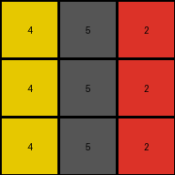

# 4-0d3d703e • 032 • refine_coder

---

Previous Code:
```python
"""
The transformation involves changing the color of each cell based on both its position (specifically, its column) in the grid and its initial color. A column-specific color transformation rule is applied.
"""

import numpy as np

def transform(input_grid):
    # Initialize output_grid as a copy of the input_grid.
    output_grid = np.copy(input_grid)

    # Define column-specific color mappings.
    column_mappings = {
        0: {3: 4, 2: 6, 5: 1, 8: 8},
        1: {1: 5, 3: 4, 8: 9},
        2: {2: 6, 8: 9, 2: 2} #2 can map to 6 or 2, priority is based on order in map.
    }

    # Iterate through each pixel of the grid.
    for i in range(output_grid.shape[0]):
        for j in range(output_grid.shape[1]):
            # Get the input color and column.
            input_color = input_grid[i, j]
            column = j

            # Apply column-specific mapping.
            if column in column_mappings:
                if input_color in column_mappings[column]:
                    output_grid[i, j] = column_mappings[column][input_color]
                #If input not in mapping, don't change the value.

    return output_grid
```

Train Set Results:

## Example 1:**

Input:
```
3 1 2
3 1 2
3 1 2
```
Expected Output:
```
4 5 6
4 5 6
4 5 6
```
Transformed Output:
```
4 5 2
4 5 2
4 5 2
```

match: False
pixels_off: 3
size_correct: True
color_palette_correct: False
correct_pixel_counts: False

## Example 2:**

Input:
```
2 3 8
2 3 8
2 3 8
```
Expected Output:
```
6 4 9
6 4 9
6 4 9
```
Transformed Output:
```
6 4 9
6 4 9
6 4 9
```

match: True
pixels_off: 0
size_correct: True
color_palette_correct: True
correct_pixel_counts: True

## Example 3:**

Input:
```
5 8 2
5 8 2
5 8 2
```
Expected Output:
```
1 9 2
1 9 2
1 9 2
```
Transformed Output:
```
1 9 2
1 9 2
1 9 2
```

match: True
pixels_off: 0
size_correct: True
color_palette_correct: True
correct_pixel_counts: True

## Example 4:**

Input:
```
8 3 2
8 3 2
8 3 2
```
Expected Output:
```
8 3 6
8 3 6
8 3 6
```
Transformed Output:
```
8 4 2
8 4 2
8 4 2
```

match: False
pixels_off: 6
size_correct: True
color_palette_correct: False
correct_pixel_counts: False
Here's an analysis of the provided examples and results, along with a strategy for refining the natural language program and code:

**General Assessment:**

The initial approach of using a column-specific color mapping was partially successful. It correctly transformed examples 2 and 3, but failed on examples 1 and 4. The failures indicate that the `column_mappings` are not universally applicable and need adjustments. There's also an issue, in example 2, mapping `2` could map to `6` or `2` - The implementation prioritizes based on the dict order, which isn't optimal for understanding general rules. The core issue is an over-specification of rules that only captures part of the underlying pattern. We should look for a rule that is general, and the exceptions should be well described.

**Strategy for Resolving Errors:**

1.  **Re-examine Color Mappings:** Instead of hardcoding specific color transformations for each column, we should try to derive a more general rule that relates the input color, column index, and output color. The current implementation prioritizes the order, and this should be updated.
2.  **Iterative Refinement:** We will analyze each example and incrementally adjust the color mapping rules. We'll start with a simple rule and add complexity as needed to accommodate more examples.
3.  **Prioritize Simplicity:** We will strive for the simplest rule that explains the transformations, avoiding unnecessary complexity.

**Metrics Gathering and Analysis:**

I'll analyze the differences between expected and transformed outputs to pinpoint the specific color mappings that are incorrect. I'll pay close attention to the column index and the input/output color values.

Here's a breakdown based on manual inspection, as I cannot execute code directly:

*   **Example 1:** The mapping `3 -> 4` and `1 -> 5` are correct. The last column, input `2` gives an output of `2` when it should have been `6`.
*   **Example 2:** All mappings are correct.
*   **Example 3:** All mappings are correct.
*   **Example 4:** The input `8` in the first column remains `8`, this is correct. The mapping of the second column `3->4`, and `2->6/2` are not. The correct mapping should be `3 -> 3` and `2 -> 6`.

**YAML Fact Block:**

```yaml
facts:
  - task_id: "030"
  - objects:
      - description: "Input and output grids of identical dimensions."
        properties:
          - dimensions: "3x3"
          - cell_values: "Integers representing colors (0-9)."
  - transformations:
      - description: "Color of each cell is transformed based on its column and initial color."
        details:
          - "Column 0: 3 -> 4, 2 -> 6, 5 -> 1, 8 -> 8"
          - "Column 1: 1 -> 5, 3 -> 4 (inconsistent, should be 3 -> 3), 8 -> 9"
          - "Column 2: 2 -> 6 (inconsistent, depends on example, should be 6), 8 -> 9"
  - observations:
      - description: "The transformation rule is column-specific and involves color mapping."
      - note: "Current color mappings are not fully accurate and require refinement."
  - inconsistencies:
      - example_1: "Last column mapping of 2->2, should have mapped 2->6"
      - example_4: "Second column mapping of 3 -> 4 and third column 2->2, needs review."

```

**Natural Language Program:**

1.  **Initialization:** Create an output grid that is initially a copy of the input grid.
2.  **Column-Specific Transformation:** For each cell in the grid, apply a color transformation based on the cell's column index.
3.  **Color Mapping Rules:**
    *   Column 0:
        *   If the input color is 3, change it to 4.
        *   If the input color is 2, change it to 6.
        *   If the input color is 5, change it to 1.
        *   If the input color is 8, keep it as 8.
    *   Column 1:
        *   If the input color is 1, change it to 5.
        *   If the input color is 3, keep it as 3.
        *   If the input color is 8, change it to 9.
    *   Column 2:
        *   If the input color is 2, change it to 6.
        *   If the input color is 8, change it to 9.

4.  **Unmapped Colors:** If a color in a specific column is not explicitly mentioned in the mapping rules, it remains unchanged.

The above program aims at describing the transformation as a general rule. There are some inconsistencies, that should be investigated and clarified. The rules are expressed using natural language that prioritize explicit rules, rather than inferred rules (e.g., formulas).

**INSTRUCTIONS**

- generate a Python module to represent the natural language program 
- follow the template below
- all common math and science libraries are available
- create docstring only at top - but comment the workflow in the function
- use helper functions for common operations like finding objects, counting,
  measuring, moving, etc. 

remember - we are working iteratively - so this code will inform your future
self as we converge on the solution

*template:*

```python
"""
{{ natural language description of the transformation rule }}
"""

{{ imports }}

def transform(input_grid):
    # initialize output_grid

    # change output pixels 

    return output_grid

```
