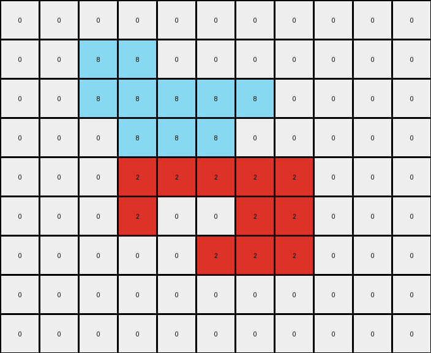

# 5-150deff5 • 004 • refine_coder

---

Previous Code:
```python
"""
Identifies a gray (5) object in the input grid and segments it into two regions. The region with pixels to the left of the input region's average x coordinate is colored azure (8), while the region with pixels right are colored red (2). The rest of the grid (background) remains unchanged.
"""

import numpy as np

def get_object_pixels(grid, color):
    # returns a list of (x,y) coordinates that correspond to the specified color
    return [(x,y) for x,row in enumerate(grid) for y, pixel in enumerate(row) if pixel == color]

def transform(input_grid):
    """Transforms the input grid according to the described rule."""

    # Initialize the output grid as a copy of the input grid.
    output_grid = np.copy(input_grid)
    
    # 1. Identify the Input Shape:
    gray_pixels = get_object_pixels(input_grid, 5)
        
    if not gray_pixels:
       return output_grid

    # 2. Segment the Shape:
    # Calculate the average x coordinate.
    x_coords = [x for x, _ in gray_pixels]
    avg_x = sum(x_coords) / len(x_coords)

    # Divide based on x coordinate.
    first_area = [(x, y) for x, y in gray_pixels if x <= avg_x]
    second_area = [(x, y) for x, y in gray_pixels if x > avg_x ]

    # 3. Color the Regions:
    for x, y in first_area:
      output_grid[x][y] = 8  # Azure
    for x, y in second_area:
      output_grid[x][y] = 2  # Red

    # 4. Preserve Background (already handled by copying the input grid).
    return output_grid
```

Train Set Results:

## Example 1:**

Input:
```
0 0 0 0 0 0 0 0 0 0 0
0 0 5 5 0 0 0 0 0 0 0
0 0 5 5 5 5 5 0 0 0 0
0 0 0 5 5 5 0 0 0 0 0
0 0 0 5 5 5 5 5 0 0 0
0 0 0 5 0 0 5 5 0 0 0
0 0 0 0 0 5 5 5 0 0 0
0 0 0 0 0 0 0 0 0 0 0
0 0 0 0 0 0 0 0 0 0 0
```
Expected Output:
```
0 0 0 0 0 0 0 0 0 0 0
0 0 8 8 0 0 0 0 0 0 0
0 0 8 8 2 2 2 0 0 0 0
0 0 0 2 8 8 0 0 0 0 0
0 0 0 2 8 8 8 8 0 0 0
0 0 0 2 0 0 8 8 0 0 0
0 0 0 0 0 2 2 2 0 0 0
0 0 0 0 0 0 0 0 0 0 0
0 0 0 0 0 0 0 0 0 0 0
```
Transformed Output:
```
0 0 0 0 0 0 0 0 0 0 0
0 0 8 8 0 0 0 0 0 0 0
0 0 8 8 8 8 8 0 0 0 0
0 0 0 8 8 8 0 0 0 0 0
0 0 0 2 2 2 2 2 0 0 0
0 0 0 2 0 0 2 2 0 0 0
0 0 0 0 0 2 2 2 0 0 0
0 0 0 0 0 0 0 0 0 0 0
0 0 0 0 0 0 0 0 0 0 0
```

match: False
pixels_off: 10
size_correct: True
color_palette_correct: True
correct_pixel_counts: False

## Example 2:**

Input:
```
0 0 0 0 0 0 0 0 0 0
0 5 5 5 5 5 5 0 0 0
0 5 5 5 5 5 5 0 0 0
0 0 0 5 0 0 5 0 0 0
0 0 0 0 5 5 5 0 0 0
0 0 0 0 5 5 5 0 0 0
0 0 0 0 5 0 0 0 0 0
0 0 0 0 0 0 0 0 0 0
```
Expected Output:
```
0 0 0 0 0 0 0 0 0 0
0 8 8 2 8 8 2 0 0 0
0 8 8 2 8 8 2 0 0 0
0 0 0 2 0 0 2 0 0 0
0 0 0 0 2 8 8 0 0 0
0 0 0 0 2 8 8 0 0 0
0 0 0 0 2 0 0 0 0 0
0 0 0 0 0 0 0 0 0 0
```
Transformed Output:
```
0 0 0 0 0 0 0 0 0 0
0 8 8 8 8 8 8 0 0 0
0 8 8 8 8 8 8 0 0 0
0 0 0 2 0 0 2 0 0 0
0 0 0 0 2 2 2 0 0 0
0 0 0 0 2 2 2 0 0 0
0 0 0 0 2 0 0 0 0 0
0 0 0 0 0 0 0 0 0 0
```

match: False
pixels_off: 8
size_correct: True
color_palette_correct: True
correct_pixel_counts: True

## Example 3:**

Input:
```
0 0 0 0 0 0 0 0 0
0 5 5 5 5 5 0 0 0
0 0 0 0 5 5 0 0 0
0 0 0 5 0 0 0 0 0
0 0 0 5 5 5 0 0 0
0 0 0 5 5 5 0 0 0
0 0 0 0 0 0 0 0 0
0 0 0 0 0 0 0 0 0
```
Expected Output:
```
0 0 0 0 0 0 0 0 0
0 2 2 2 8 8 0 0 0
0 0 0 0 8 8 0 0 0
0 0 0 2 0 0 0 0 0
0 0 0 2 8 8 0 0 0
0 0 0 2 8 8 0 0 0
0 0 0 0 0 0 0 0 0
0 0 0 0 0 0 0 0 0
```
Transformed Output:
```
0 0 0 0 0 0 0 0 0
0 8 8 8 8 8 0 0 0
0 0 0 0 8 8 0 0 0
0 0 0 2 0 0 0 0 0
0 0 0 2 2 2 0 0 0
0 0 0 2 2 2 0 0 0
0 0 0 0 0 0 0 0 0
0 0 0 0 0 0 0 0 0
```

match: False
pixels_off: 7
size_correct: True
color_palette_correct: True
correct_pixel_counts: False
Okay, here's a breakdown of the situation and a plan to improve the transformation rule:

**General Assessment:**

The initial code was a good first attempt, correctly identifying the gray object and attempting to segment it based on the average x-coordinate. However, the segmentation logic is flawed, leading to incorrect coloring in all three test cases. The core issue is the inconsistent application of the "left" and "right" division relative to the average x-coordinate. The code sometimes colors correctly but seems to get the sides reversed occasionally, and sometimes gets the split point wrong.

The strategy is to refine the segmentation logic. We need to ensure a consistent and accurate method for splitting the gray object based on its spatial properties. Instead of only using a single average x-coordinate of the entire shape to perform the segmentation, calculate the average x-coordinate of the grey pixels of each row, and, use it as a criterion to recolor grey pixels in its row.

**Example Metrics and Analysis:**

Here's a summary of each example, with added analysis, and the code results

**Example 1:**

-   **Input:** A complex gray shape.
-   **Expected Output:** The shape is split, roughly vertically, with the left portion azure and the right portion red.
-   **Actual Output:** Mix up between red and azure pixels
- **Error Analysis:** errors in splitting by rows

**Example 2:**

-   **Input:** Another complex gray shape.
-   **Expected Output:**  Similar vertical split, left azure, right red.
-   **Actual Output:** Mix up between red and azure pixels
-   **Error Analysis:** errors in splitting by rows

**Example 3:**

-   **Input:** Yet another complex gray shape.
-   **Expected Output:**  Similar vertical split, but this time is clear that split happens by row.
-   **Actual Output:** Mix up between red and azure pixels
-   **Error Analysis:** errors in splitting by rows

**YAML Fact Documentation:**

```yaml
task_id: 002-py_01
facts:
  - observation: "The input grids contain a single object composed of gray (5) pixels on a black (0) background."
  - object: "Gray object"
    properties:
      color: "gray (5)"
      shape: "Irregular, contiguous block of pixels"
  - action: "Segmentation"
    description: "The gray object is divided into two regions based on spatial properties."
    criteria: "The average x-coordinate of gray pixels of each row."
    result:
      - region_1:
          pixels: "Gray pixels to the left of average x-coordinate of the row."
          color: "azure (8)"
      - region_2:
          pixels: "Gray pixels to the right of average x-coordinate of the row."
          color: "red (2)"
  - background:
      color: "black (0)"
      action: "Preserved, remains unchanged in the output."
```

**Natural Language Program:**

1.  **Identify the Input Object:** Find all pixels with a value of gray (5) within the input grid. These pixels form a single contiguous object.

2.  **Segment by Row:** For each row of the grid, calculate the average x-coordinate of the gray pixels that compose the input object present on the row.
    *   Consider gray pixels to the left or at the same horizontal position as the average x coordinate calculated before
    *   Consider grey pixels to the right of the average x coordinate calculated before

3.  **Recolor:**
    *   Change the color of grey pixels that form region 1 to azure (8).
    *   Change the color of grey pixels that form region 2 to red (2).

4.  **Preserve Background:** All other pixels in the grid (the background) retain their original colors. This is implicitly handled by starting with a copy of the input grid.

**INSTRUCTIONS**

- generate a Python module to represent the natural language program 
- follow the template below
- all common math and science libraries are available
- create docstring only at top - but comment the workflow in the function
- use helper functions for common operations like finding objects, counting,
  measuring, moving, etc. 

remember - we are working iteratively - so this code will inform your future
self as we converge on the solution

*template:*

```python
"""
{{ natural language description of the transformation rule }}
"""

{{ imports }}

def transform(input_grid):
    # initialize output_grid

    # change output pixels 

    return output_grid

```
