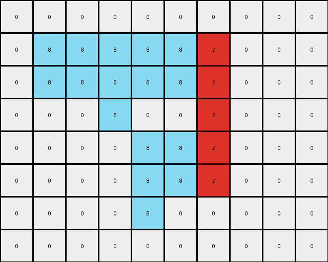
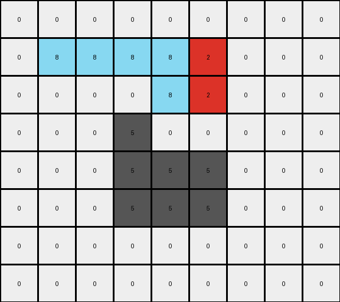

# 5-150deff5 • 011 • refine_dreamer

---


Previous Code:
```python
"""
Identifies a contiguous shape of gray (5) pixels in the input grid and replaces these pixels with azure (8) and red (2) in the output grid, based on their position within the shape. Azure is used for leftmost, top and center, while red is on the right.
"""

import numpy as np

def get_contiguous_shape(grid, color):
    # Find the coordinates of all pixels matching the specified color.
    coords = np.argwhere(grid == color)
    if len(coords) == 0:
      return []

    # Start with the first coordinate as the seed.
    shape = [tuple(coords[0])]
    
    # Use a set for faster lookup
    remaining_coords = set(map(tuple, coords[1:]))

    # Iteratively expand the shape by adding adjacent coordinates.
    i = 0
    while i < len(shape):
      current_coord = shape[i]
      
      neighbors_to_add = []
      for neighbor in remaining_coords:
        diff = np.abs(np.array(current_coord) - np.array(neighbor))
        if np.sum(diff) == 1:  # Check for adjacency (Manhattan distance of 1)
          neighbors_to_add.append(neighbor)
      
      for neighbor in neighbors_to_add:
        shape.append(neighbor)
        remaining_coords.remove(neighbor)
      
      i += 1
    
    return shape

def transform(input_grid):
    input_grid = np.array(input_grid)
    output_grid = input_grid.copy()
    shape_color = 5
    shape_coords = get_contiguous_shape(input_grid, shape_color)

    if not shape_coords:
        return output_grid

    #find rightmost x
    x_coords = [x[1] for x in shape_coords]
    rightmost_x = max(x_coords)
    
    for r, c in shape_coords:
        if c == rightmost_x:
            output_grid[r, c] = 2
        else:
            output_grid[r,c] = 8

    return output_grid.tolist()
```

Train Set Results:

## Example 1:**

Input:
```
0 0 0 0 0 0 0 0 0 0 0
0 0 5 5 0 0 0 0 0 0 0
0 0 5 5 5 5 5 0 0 0 0
0 0 0 5 5 5 0 0 0 0 0
0 0 0 5 5 5 5 5 0 0 0
0 0 0 5 0 0 5 5 0 0 0
0 0 0 0 0 5 5 5 0 0 0
0 0 0 0 0 0 0 0 0 0 0
0 0 0 0 0 0 0 0 0 0 0
```
Expected Output:
```
0 0 0 0 0 0 0 0 0 0 0
0 0 8 8 0 0 0 0 0 0 0
0 0 8 8 2 2 2 0 0 0 0
0 0 0 2 8 8 0 0 0 0 0
0 0 0 2 8 8 8 8 0 0 0
0 0 0 2 0 0 8 8 0 0 0
0 0 0 0 0 2 2 2 0 0 0
0 0 0 0 0 0 0 0 0 0 0
0 0 0 0 0 0 0 0 0 0 0
```
Transformed Output:
```
0 0 0 0 0 0 0 0 0 0 0
0 0 8 8 0 0 0 0 0 0 0
0 0 8 8 8 8 8 0 0 0 0
0 0 0 8 8 8 0 0 0 0 0
0 0 0 8 8 8 8 2 0 0 0
0 0 0 8 0 0 8 2 0 0 0
0 0 0 0 0 8 8 2 0 0 0
0 0 0 0 0 0 0 0 0 0 0
0 0 0 0 0 0 0 0 0 0 0
```

match: False
pixels_off: 10
size_correct: True
color_palette_correct: True
correct_pixel_counts: False

## Example 2:**

Input:
```
0 0 0 0 0 0 0 0 0 0
0 5 5 5 5 5 5 0 0 0
0 5 5 5 5 5 5 0 0 0
0 0 0 5 0 0 5 0 0 0
0 0 0 0 5 5 5 0 0 0
0 0 0 0 5 5 5 0 0 0
0 0 0 0 5 0 0 0 0 0
0 0 0 0 0 0 0 0 0 0
```
Expected Output:
```
0 0 0 0 0 0 0 0 0 0
0 8 8 2 8 8 2 0 0 0
0 8 8 2 8 8 2 0 0 0
0 0 0 2 0 0 2 0 0 0
0 0 0 0 2 8 8 0 0 0
0 0 0 0 2 8 8 0 0 0
0 0 0 0 2 0 0 0 0 0
0 0 0 0 0 0 0 0 0 0
```
Transformed Output:
```
0 0 0 0 0 0 0 0 0 0
0 8 8 8 8 8 2 0 0 0
0 8 8 8 8 8 2 0 0 0
0 0 0 8 0 0 2 0 0 0
0 0 0 0 8 8 2 0 0 0
0 0 0 0 8 8 2 0 0 0
0 0 0 0 8 0 0 0 0 0
0 0 0 0 0 0 0 0 0 0
```

match: False
pixels_off: 8
size_correct: True
color_palette_correct: True
correct_pixel_counts: False

## Example 3:**

Input:
```
0 0 0 0 0 0 0 0 0
0 5 5 5 5 5 0 0 0
0 0 0 0 5 5 0 0 0
0 0 0 5 0 0 0 0 0
0 0 0 5 5 5 0 0 0
0 0 0 5 5 5 0 0 0
0 0 0 0 0 0 0 0 0
0 0 0 0 0 0 0 0 0
```
Expected Output:
```
0 0 0 0 0 0 0 0 0
0 2 2 2 8 8 0 0 0
0 0 0 0 8 8 0 0 0
0 0 0 2 0 0 0 0 0
0 0 0 2 8 8 0 0 0
0 0 0 2 8 8 0 0 0
0 0 0 0 0 0 0 0 0
0 0 0 0 0 0 0 0 0
```
Transformed Output:
```
0 0 0 0 0 0 0 0 0
0 8 8 8 8 2 0 0 0
0 0 0 0 8 2 0 0 0
0 0 0 5 0 0 0 0 0
0 0 0 5 5 5 0 0 0
0 0 0 5 5 5 0 0 0
0 0 0 0 0 0 0 0 0
0 0 0 0 0 0 0 0 0
```

match: False
pixels_off: 12
size_correct: True
color_palette_correct: False
correct_pixel_counts: False

**INSTRUCTIONS**

The code above was generated based on observations from the first training
example

we have tested the transform function on each of the task example inputs and
compared with the expected output

review each of the examples provided and the results and consider how the
natural language program should be updated to accommodate this new knowledge

respond with the following deliverables:

- general assessment of the information provided and strategy for resolving the
  errors
- gather metrics about each of the examples and results - use code_execution to
  develop accurate reports on your assumptions
- a YAML block documenting facts - Focus on identifying objects, their properties, and the actions performed on them.
- a natural language program - Be as clear and concise as possible, providing a complete description of the transformation rule.


your responses should be considered as information in a report - not a
conversation
