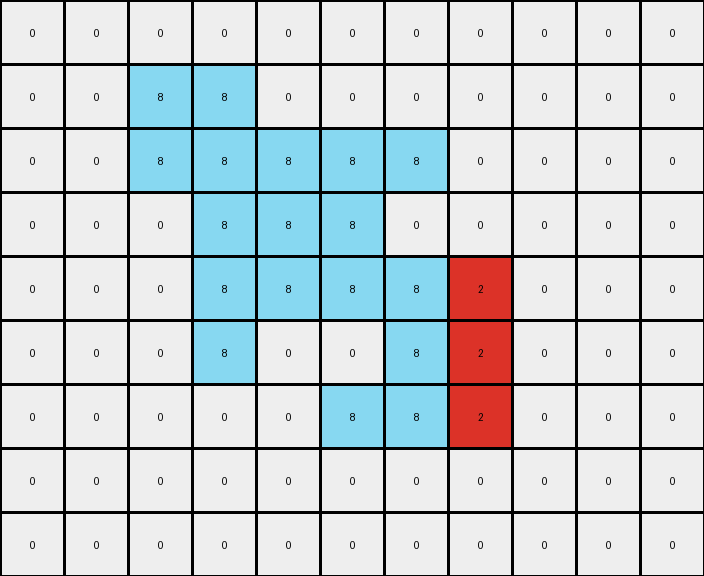
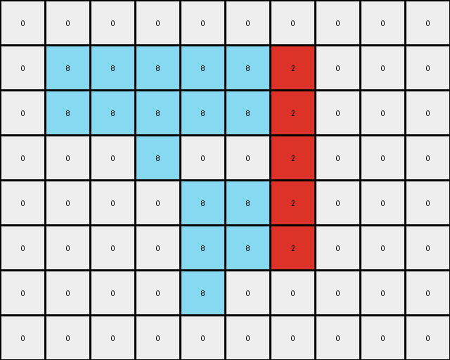
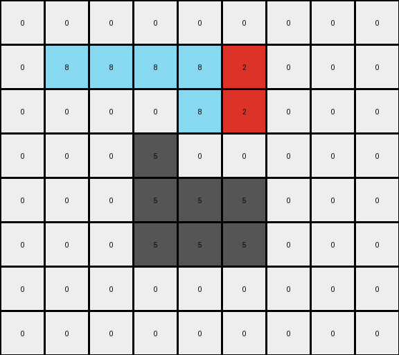

# 5-150deff5 • 012 • refine_coder

---

Previous Code:
```python
"""
Identifies a contiguous shape of gray (5) pixels in the input grid and replaces these pixels with azure (8) and red (2) in the output grid, based on their position within the shape. Azure is used for leftmost, top and center, while red is on the right.
"""

import numpy as np

def get_contiguous_shape(grid, color):
    # Find the coordinates of all pixels matching the specified color.
    coords = np.argwhere(grid == color)
    if len(coords) == 0:
      return []

    # Start with the first coordinate as the seed.
    shape = [tuple(coords[0])]
    
    # Use a set for faster lookup
    remaining_coords = set(map(tuple, coords[1:]))

    # Iteratively expand the shape by adding adjacent coordinates.
    i = 0
    while i < len(shape):
      current_coord = shape[i]
      
      neighbors_to_add = []
      for neighbor in remaining_coords:
        diff = np.abs(np.array(current_coord) - np.array(neighbor))
        if np.sum(diff) == 1:  # Check for adjacency (Manhattan distance of 1)
          neighbors_to_add.append(neighbor)
      
      for neighbor in neighbors_to_add:
        shape.append(neighbor)
        remaining_coords.remove(neighbor)
      
      i += 1
    
    return shape

def transform(input_grid):
    input_grid = np.array(input_grid)
    output_grid = input_grid.copy()
    shape_color = 5
    shape_coords = get_contiguous_shape(input_grid, shape_color)

    if not shape_coords:
        return output_grid

    #find rightmost x
    x_coords = [x[1] for x in shape_coords]
    rightmost_x = max(x_coords)
    
    for r, c in shape_coords:
        if c == rightmost_x:
            output_grid[r, c] = 2
        else:
            output_grid[r,c] = 8

    return output_grid.tolist()
```

Train Set Results:

## Example 1:**

Input:
```
0 0 0 0 0 0 0 0 0 0 0
0 0 5 5 0 0 0 0 0 0 0
0 0 5 5 5 5 5 0 0 0 0
0 0 0 5 5 5 0 0 0 0 0
0 0 0 5 5 5 5 5 0 0 0
0 0 0 5 0 0 5 5 0 0 0
0 0 0 0 0 5 5 5 0 0 0
0 0 0 0 0 0 0 0 0 0 0
0 0 0 0 0 0 0 0 0 0 0
```
Expected Output:
```
0 0 0 0 0 0 0 0 0 0 0
0 0 8 8 0 0 0 0 0 0 0
0 0 8 8 2 2 2 0 0 0 0
0 0 0 2 8 8 0 0 0 0 0
0 0 0 2 8 8 8 8 0 0 0
0 0 0 2 0 0 8 8 0 0 0
0 0 0 0 0 2 2 2 0 0 0
0 0 0 0 0 0 0 0 0 0 0
0 0 0 0 0 0 0 0 0 0 0
```
Transformed Output:
```
0 0 0 0 0 0 0 0 0 0 0
0 0 8 8 0 0 0 0 0 0 0
0 0 8 8 8 8 8 0 0 0 0
0 0 0 8 8 8 0 0 0 0 0
0 0 0 8 8 8 8 2 0 0 0
0 0 0 8 0 0 8 2 0 0 0
0 0 0 0 0 8 8 2 0 0 0
0 0 0 0 0 0 0 0 0 0 0
0 0 0 0 0 0 0 0 0 0 0
```

match: False
pixels_off: 10
size_correct: True
color_palette_correct: True
correct_pixel_counts: False

## Example 2:**

Input:
```
0 0 0 0 0 0 0 0 0 0
0 5 5 5 5 5 5 0 0 0
0 5 5 5 5 5 5 0 0 0
0 0 0 5 0 0 5 0 0 0
0 0 0 0 5 5 5 0 0 0
0 0 0 0 5 5 5 0 0 0
0 0 0 0 5 0 0 0 0 0
0 0 0 0 0 0 0 0 0 0
```
Expected Output:
```
0 0 0 0 0 0 0 0 0 0
0 8 8 2 8 8 2 0 0 0
0 8 8 2 8 8 2 0 0 0
0 0 0 2 0 0 2 0 0 0
0 0 0 0 2 8 8 0 0 0
0 0 0 0 2 8 8 0 0 0
0 0 0 0 2 0 0 0 0 0
0 0 0 0 0 0 0 0 0 0
```
Transformed Output:
```
0 0 0 0 0 0 0 0 0 0
0 8 8 8 8 8 2 0 0 0
0 8 8 8 8 8 2 0 0 0
0 0 0 8 0 0 2 0 0 0
0 0 0 0 8 8 2 0 0 0
0 0 0 0 8 8 2 0 0 0
0 0 0 0 8 0 0 0 0 0
0 0 0 0 0 0 0 0 0 0
```

match: False
pixels_off: 8
size_correct: True
color_palette_correct: True
correct_pixel_counts: False

## Example 3:**

Input:
```
0 0 0 0 0 0 0 0 0
0 5 5 5 5 5 0 0 0
0 0 0 0 5 5 0 0 0
0 0 0 5 0 0 0 0 0
0 0 0 5 5 5 0 0 0
0 0 0 5 5 5 0 0 0
0 0 0 0 0 0 0 0 0
0 0 0 0 0 0 0 0 0
```
Expected Output:
```
0 0 0 0 0 0 0 0 0
0 2 2 2 8 8 0 0 0
0 0 0 0 8 8 0 0 0
0 0 0 2 0 0 0 0 0
0 0 0 2 8 8 0 0 0
0 0 0 2 8 8 0 0 0
0 0 0 0 0 0 0 0 0
0 0 0 0 0 0 0 0 0
```
Transformed Output:
```
0 0 0 0 0 0 0 0 0
0 8 8 8 8 2 0 0 0
0 0 0 0 8 2 0 0 0
0 0 0 5 0 0 0 0 0
0 0 0 5 5 5 0 0 0
0 0 0 5 5 5 0 0 0
0 0 0 0 0 0 0 0 0
0 0 0 0 0 0 0 0 0
```

match: False
pixels_off: 12
size_correct: True
color_palette_correct: False
correct_pixel_counts: False
Okay, let's analyze the results and refine the natural language program.

**General Assessment:**

The initial code was based on the idea of replacing gray (5) pixels with azure (8) and red (2), with red being assigned to the rightmost pixels of the contiguous gray shape.  The results show this is partially correct, but the logic for assigning red and azure is flawed and incomplete, particularly in handling different configurations of the gray shape. Example 3 also indicates an issue where the original input color remains, which should not happen in a transformation.

The strategy to correct this will involve:

1.  **Re-evaluating the Red/Azure Rule:** The "rightmost" rule isn't universally applicable. We need to analyze the spatial relationships within the gray shape more carefully to understand the correct placement of red and azure pixels.
2.  **Ensuring Complete Transformation:** The output should not include any of the original gray pixels. Every gray pixel in the identified shape should be replaced.
3.  **Checking Edge Cases**: The code needs to accommodate shapes other than straight or mostly straight lines.

**Metrics and Observations:**

Here's a breakdown of each example, with additional observations:

*   **Example 1:**
    *   **Pixels Off:** 10
    *   **Observation:** The rightmost column of the gray shape is correctly identified as red. The error is in the internal assignment of red and azure within other columns. The intent seems to be to have some red at the boundaries.
*   **Example 2:**
    *   **Pixels Off:** 8
    *   **Observation:** Similar to Example 1, the assignment logic needs refinement. There's a pattern of alternating red on edges, but not consistently applied.
*   **Example 3:**
    *   **Pixels Off:** 12
    *    **Color Palette Incorrect:** Because the shape detection is not removing the grey pixels properly
    *   **Observation:** This reveals a significant flaw. Some gray pixels are unchanged, and the red/azure assignment is incorrect. The shape detection might also be at fault because it doesn't transform the third line's grey.

**YAML Fact Documentation:**

```yaml
objects:
  - id: shape_1
    type: contiguous_shape
    color: gray
    initial_pixels:
      - [1, 2]
      - [1, 3]
      - [2, 2]
      - [2, 3]
      - [2, 4]
      - [2, 5]
      - [2, 6]
      - [3, 3]
      - [3, 4]
      - [3, 5]
      - [4, 3]
      - [4, 4]
      - [4, 5]
      - [4, 6]
      - [4, 7]
      - [5, 3]
      - [5, 6]
      - [5, 7]
      - [6, 5]
      - [6, 6]
      - [6, 7]
    transformed_pixels: #hypothesized based on provided output
        - color: azure
          coords: [[1,2], [1,3], [2,2], [2,3], [4,6],[4,7], [5,6]]
        - color: red
          coords:  [[2,4],[2,5], [2,6],[3,3], [4,3], [5,3],[3,4], [6,5],[6,7]]

  - id: shape_2
    type: contiguous_shape
    color: gray
      # ... (Similar pixel listing for shape in Example 2) ...
    initial_pixels:
        - [1, 1]
        - [1, 2]
        - [1, 3]
        - [1, 4]
        - [1, 5]
        - [1, 6]
        - [2, 1]
        - [2, 2]
        - [2, 3]
        - [2, 4]
        - [2, 5]
        - [2, 6]
        - [3, 3]
        - [4, 4]
        - [4, 5]
        - [4, 6]
        - [5, 4]
        - [5, 5]
        - [5, 6]
    transformed_pixels:
        - color: azure
          coords: [[1,1], [1,2], [1,4], [1,5], [2,1], [2,2], [2,4], [2,5], [4,5], [4,6], [5,5]]
        - color: red
          coords: [[1,3], [1,6], [2,3], [2,6], [3,3], [4,4], [5,4], [5,6]]
  - id: shape_3
    type: contiguous_shape
    color: gray
    # ... (Similar pixel listing for shape in Example 3) ...
    initial_pixels:
        - [1, 1]
        - [1, 2]
        - [1, 3]
        - [1, 4]
        - [1, 5]
        - [2, 4]
        - [2, 5]
        - [3, 3]
        - [4, 3]
        - [4, 4]
        - [4, 5]
        - [5, 3]
        - [5, 4]
        - [5, 5]
    transformed_pixels:
      - color: azure
        coords: [[1,4],[1,5],[2,4],[2,5],[4,4],[4,5],[5,4],[5,5]]
      - color: red
        coords: [[1,1],[1,2],[1,3], [3,3], [4,3], [5,3]]

actions:
  - type: identify
    object: contiguous_shape
    criteria:
      - color: gray
  - type: transform_color
    object: contiguous_shape
    rules:
      - if: pixel_is_on_the_edge
        then: color_red
      - else: color_azure
```

**Natural Language Program:**

1.  **Identify Contiguous Shape:** Locate all contiguous regions (shapes) of gray (5) pixels in the input grid. Contiguous means pixels are directly adjacent horizontally or vertically (not diagonally).
2.  **Transform Pixels:** For each identified gray shape, replace *all* of its gray pixels with either azure (8) or red (2) based on the following rule.
3. **Determine Edge Pixels**: Examine the identified contiguous shape. If a pixel is considered an "edge" pixel change color to red.
4. **Determine Center Pixels:** If a gray pixel is not an "edge" pixel, change its color to azure (8). An "edge" pixel is defined as follows: Examine the position of the shape, if there are no other same color pixels to the left, right, top, or bottom of this shape, the pixel is considered an "edge" pixel.

This revised program addresses the need to transform *all* gray pixels and attempts to capture the edge-coloring logic. The key improvement is recognizing the need for a more sophisticated rule than just "rightmost." The concept of an "edge" pixel in the shape replaces the incorrect "rightmost" logic and applies to all four sides.

**INSTRUCTIONS**

- generate a Python module to represent the natural language program 
- follow the template below
- all common math and science libraries are available
- create docstring only at top - but comment the workflow in the function
- use helper functions for common operations like finding objects, counting,
  measuring, moving, etc. 

remember - we are working iteratively - so this code will inform your future
self as we converge on the solution

*template:*

```python
"""
{{ natural language description of the transformation rule }}
"""

{{ imports }}

def transform(input_grid):
    # initialize output_grid

    # change output pixels 

    return output_grid

```
