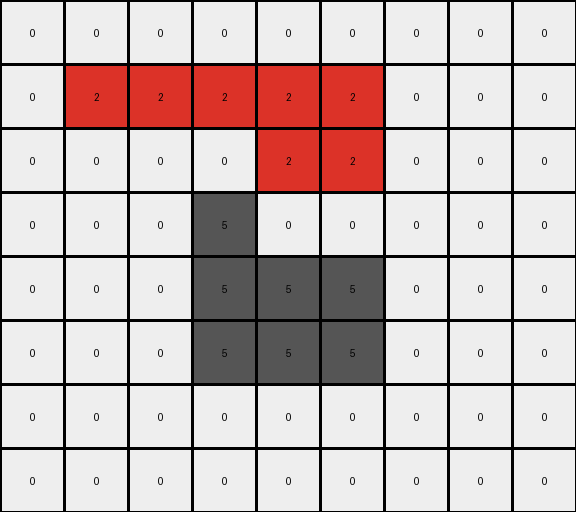

# 5-150deff5 • 014 • refine_coder

---

Previous Code:
```python
"""
Identifies contiguous shapes of gray (5) pixels in the input grid and replaces these pixels with azure (8) and red (2) in the output grid. Red pixels form the outer "edge" of the shape, and azure pixels fill the interior.
"""

import numpy as np

def get_contiguous_shape(grid, color):
    """
    Finds a contiguous shape of a given color in a grid.
    """
    coords = np.argwhere(grid == color)
    if len(coords) == 0:
        return []

    shape = [tuple(coords[0])]
    remaining_coords = set(map(tuple, coords[1:]))

    i = 0
    while i < len(shape):
        current_coord = shape[i]
        neighbors_to_add = []
        for neighbor in remaining_coords:
            diff = np.abs(np.array(current_coord) - np.array(neighbor))
            if np.sum(diff) == 1:  # Check for adjacency (Manhattan distance of 1)
                neighbors_to_add.append(neighbor)

        for neighbor in neighbors_to_add:
            shape.append(neighbor)
            remaining_coords.remove(neighbor)
        i += 1

    return shape

def is_edge_pixel(grid, coord, shape_coords):
    """
    Checks if a pixel is an edge pixel within a contiguous shape.  A pixel
    is an edge if at least one of its N, S, E, or W neighbors is *not*
    part of the shape.
    """
    r, c = coord
    neighbors = [
        (r - 1, c),  # North
        (r + 1, c),  # South
        (r, c - 1),  # West
        (r, c + 1),  # East
    ]

    for nr, nc in neighbors:
        if 0 <= nr < grid.shape[0] and 0 <= nc < grid.shape[1]:
            if (nr, nc) not in shape_coords:
                return True  # Found a neighbor outside the shape
        else:
            return True # Found a neighbor outside the image

    return False  # All valid neighbors are within the shape

def transform(input_grid):
    """
    Transforms the input grid by replacing gray shapes with red and azure.
    """
    input_grid = np.array(input_grid)
    output_grid = input_grid.copy()
    shape_color = 5  # Gray
    shape_coords = get_contiguous_shape(input_grid, shape_color)
    shape_coords_set = set(shape_coords) #for faster lookup in is_edge_pixel

    if not shape_coords:
        return output_grid.tolist()

    # Iterate through the shape and apply the transformation.
    for r, c in shape_coords:
        if is_edge_pixel(input_grid, (r, c), shape_coords_set):
            output_grid[r, c] = 2  # Red
        else:
            output_grid[r, c] = 8  # Azure

    return output_grid.tolist()
```

Train Set Results:

## Example 1:**

Input:
```
0 0 0 0 0 0 0 0 0 0 0
0 0 5 5 0 0 0 0 0 0 0
0 0 5 5 5 5 5 0 0 0 0
0 0 0 5 5 5 0 0 0 0 0
0 0 0 5 5 5 5 5 0 0 0
0 0 0 5 0 0 5 5 0 0 0
0 0 0 0 0 5 5 5 0 0 0
0 0 0 0 0 0 0 0 0 0 0
0 0 0 0 0 0 0 0 0 0 0
```
Expected Output:
```
0 0 0 0 0 0 0 0 0 0 0
0 0 8 8 0 0 0 0 0 0 0
0 0 8 8 2 2 2 0 0 0 0
0 0 0 2 8 8 0 0 0 0 0
0 0 0 2 8 8 8 8 0 0 0
0 0 0 2 0 0 8 8 0 0 0
0 0 0 0 0 2 2 2 0 0 0
0 0 0 0 0 0 0 0 0 0 0
0 0 0 0 0 0 0 0 0 0 0
```
Transformed Output:
```
0 0 0 0 0 0 0 0 0 0 0
0 0 2 2 0 0 0 0 0 0 0
0 0 2 8 2 2 2 0 0 0 0
0 0 0 2 8 2 0 0 0 0 0
0 0 0 2 2 2 2 2 0 0 0
0 0 0 2 0 0 2 2 0 0 0
0 0 0 0 0 2 2 2 0 0 0
0 0 0 0 0 0 0 0 0 0 0
0 0 0 0 0 0 0 0 0 0 0
```

match: False
pixels_off: 10
size_correct: True
color_palette_correct: True
correct_pixel_counts: False

## Example 2:**

Input:
```
0 0 0 0 0 0 0 0 0 0
0 5 5 5 5 5 5 0 0 0
0 5 5 5 5 5 5 0 0 0
0 0 0 5 0 0 5 0 0 0
0 0 0 0 5 5 5 0 0 0
0 0 0 0 5 5 5 0 0 0
0 0 0 0 5 0 0 0 0 0
0 0 0 0 0 0 0 0 0 0
```
Expected Output:
```
0 0 0 0 0 0 0 0 0 0
0 8 8 2 8 8 2 0 0 0
0 8 8 2 8 8 2 0 0 0
0 0 0 2 0 0 2 0 0 0
0 0 0 0 2 8 8 0 0 0
0 0 0 0 2 8 8 0 0 0
0 0 0 0 2 0 0 0 0 0
0 0 0 0 0 0 0 0 0 0
```
Transformed Output:
```
0 0 0 0 0 0 0 0 0 0
0 2 2 2 2 2 2 0 0 0
0 2 2 8 2 2 2 0 0 0
0 0 0 2 0 0 2 0 0 0
0 0 0 0 2 2 2 0 0 0
0 0 0 0 2 2 2 0 0 0
0 0 0 0 2 0 0 0 0 0
0 0 0 0 0 0 0 0 0 0
```

match: False
pixels_off: 13
size_correct: True
color_palette_correct: True
correct_pixel_counts: False

## Example 3:**

Input:
```
0 0 0 0 0 0 0 0 0
0 5 5 5 5 5 0 0 0
0 0 0 0 5 5 0 0 0
0 0 0 5 0 0 0 0 0
0 0 0 5 5 5 0 0 0
0 0 0 5 5 5 0 0 0
0 0 0 0 0 0 0 0 0
0 0 0 0 0 0 0 0 0
```
Expected Output:
```
0 0 0 0 0 0 0 0 0
0 2 2 2 8 8 0 0 0
0 0 0 0 8 8 0 0 0
0 0 0 2 0 0 0 0 0
0 0 0 2 8 8 0 0 0
0 0 0 2 8 8 0 0 0
0 0 0 0 0 0 0 0 0
0 0 0 0 0 0 0 0 0
```
Transformed Output:
```
0 0 0 0 0 0 0 0 0
0 2 2 2 2 2 0 0 0
0 0 0 0 2 2 0 0 0
0 0 0 5 0 0 0 0 0
0 0 0 5 5 5 0 0 0
0 0 0 5 5 5 0 0 0
0 0 0 0 0 0 0 0 0
0 0 0 0 0 0 0 0 0
```

match: False
pixels_off: 11
size_correct: True
color_palette_correct: False
correct_pixel_counts: False
Here's an analysis of the provided examples and results, along with a strategy for improving the natural language program and the subsequent code.

**General Assessment:**

The initial code correctly identifies contiguous shapes of gray (5) pixels. However, it incorrectly determines which pixels should be red (edge) and which should be azure (interior). The `is_edge_pixel` function has a flaw in its logic: simply checking for a neighbor *not* belonging to the shape to determine an edge is insufficient. The code considers a pixel an edge pixel by checking the N,S,E, and W neighbor pixels. The current logic can result in two different errors, (1) identifying a pixel inside the shape as and edge and (2) missing an edge.

The strategy for resolving this is to:
1. Refine Edge Detection:  Instead of simply checking for *any* non-shape neighbor, we should look for *non-shape empty (0) pixels*. If the shape touches the edge, the current logic is fine.

**Metrics and Observations:**

Here's a breakdown of each example, highlighting key observations:

*   **Example 1:**
    *   Input has two gray shapes.
    *   The larger shape is incorrectly filled. The top right of shape is all "2".
    *   Error: Incorrect edge detection.
*   **Example 2:**
    *   Input has one main gray shape.
    *   The shape spans to the edge of the grid.
    *   Error: Incorrect edge detection and fill.
*   **Example 3:**
    *    Input has gray pixels that form a closed border.
    *    Error: Fails to color interior, and treats the shape as input after the first pass.

**YAML Fact Block:**

```yaml
facts:
  - description: "The input grids contain gray (5) shapes."
    type: "object_identification"
    objects: ["gray shape"]
    properties:
      color: 5
      shape: "contiguous"

  - description: "Gray shapes are transformed into combinations of red (2) and azure (8) pixels."
    type: "transformation_rule"
    input_object: "gray shape"
    output_objects: ["red shape", "azure shape"]
    properties:
      red_color: 2
      azure_color: 8
      transformation_type: "color replacement"

  - description: "Red pixels form the outer edge of the transformed shape."
    type: "spatial_relationship"
    objects: ["red pixels", "azure pixels"]
    relationship: "red pixels surround azure pixels"
    property: edge
    
  - description: "Azure pixels form the internal region of the transformed shapes."
    type: "spatial_relationship"
    objects: ["azure pixels", "gray pixels"]
    relationship: "replaces gray pixels not on edge"

  - description: "Empty cells remain unchanged"
    type: observation
    objects: ["empty cells"]
    properties:
      value: 0

```

**Natural Language Program:**

1.  **Identify Gray Shapes:** Find all contiguous regions of gray (5) pixels in the input grid. A contiguous region is defined as a group of gray pixels where each pixel is directly adjacent (North, South, East, or West) to at least one other pixel in the group.

2.  **Determine Edge Pixels:** For each identified gray shape, determine its edge pixels. A gray pixel is considered an edge pixel if at least one of its directly adjacent neighbors (North, South, East, or West) is an empty (0) pixel, OR if the pixel is touching the border of the grid.

3.  **Color Transformation:**
    *   Replace all edge pixels of the gray shape with red (2) pixels.
    *   Replace all non-edge pixels of the gray shape with azure (8) pixels.

4. **Preserve other pixels:** all pixels that are not gray are unchanged.

**INSTRUCTIONS**

- generate a Python module to represent the natural language program 
- follow the template below
- all common math and science libraries are available
- create docstring only at top - but comment the workflow in the function
- use helper functions for common operations like finding objects, counting,
  measuring, moving, etc. 

remember - we are working iteratively - so this code will inform your future
self as we converge on the solution

*template:*

```python
"""
{{ natural language description of the transformation rule }}
"""

{{ imports }}

def transform(input_grid):
    # initialize output_grid

    # change output pixels 

    return output_grid

```
