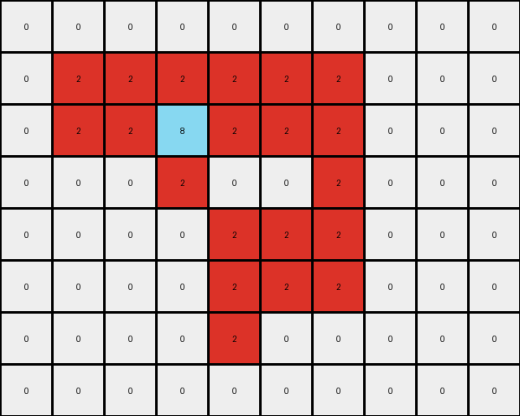

# 5-150deff5 • 016 • refine_coder

---

Previous Code:
```python
"""
Identifies contiguous shapes of gray (5) pixels in the input grid and replaces these pixels with azure (8) and red (2) in the output grid. Red pixels form the outer "edge" of the shape, and azure pixels fill the interior. Edge pixels are adjacent to empty (0) pixels or the border of the input.
"""

import numpy as np

def get_contiguous_shape(grid, color):
    """
    Finds a contiguous shape of a given color in a grid.
    """
    coords = np.argwhere(grid == color)
    if len(coords) == 0:
        return []

    shape = [tuple(coords[0])]
    remaining_coords = set(map(tuple, coords[1:]))

    i = 0
    while i < len(shape):
        current_coord = shape[i]
        neighbors_to_add = []
        for neighbor in remaining_coords:
            diff = np.abs(np.array(current_coord) - np.array(neighbor))
            if np.sum(diff) == 1:  # Check for adjacency (Manhattan distance of 1)
                neighbors_to_add.append(neighbor)

        for neighbor in neighbors_to_add:
            shape.append(neighbor)
            remaining_coords.remove(neighbor)
        i += 1

    return shape

def is_edge_pixel(grid, coord, shape_coords):
    """
    Checks if a pixel is an edge pixel within a contiguous shape.  A pixel
    is an edge if at least one of its N, S, E, or W neighbors is a 0 *or*
    is outside the grid
    """
    r, c = coord
    neighbors = [
        (r - 1, c),  # North
        (r + 1, c),  # South
        (r, c - 1),  # West
        (r, c + 1),  # East
    ]

    for nr, nc in neighbors:
        if 0 <= nr < grid.shape[0] and 0 <= nc < grid.shape[1]:
            if grid[nr, nc] == 0: #check if neighbor is empty
                return True
        else:
            return True # Found a neighbor outside the image

    return False  # All valid neighbors are within the shape and not 0


def transform(input_grid):
    """
    Transforms the input grid by replacing gray shapes with red and azure.
    """
    input_grid = np.array(input_grid)
    output_grid = input_grid.copy()
    shape_color = 5  # Gray
    shape_coords = get_contiguous_shape(input_grid, shape_color)
    shape_coords_set = set(shape_coords) #for faster lookup in is_edge_pixel

    if not shape_coords:
        return output_grid.tolist()

    # Iterate through the shape and apply the transformation.
    for r, c in shape_coords:
        if is_edge_pixel(input_grid, (r, c), shape_coords_set):
            output_grid[r, c] = 2  # Red
        else:
            output_grid[r, c] = 8  # Azure

    return output_grid.tolist()
```

Train Set Results:

## Example 1:**

Input:
```
0 0 0 0 0 0 0 0 0 0 0
0 0 5 5 0 0 0 0 0 0 0
0 0 5 5 5 5 5 0 0 0 0
0 0 0 5 5 5 0 0 0 0 0
0 0 0 5 5 5 5 5 0 0 0
0 0 0 5 0 0 5 5 0 0 0
0 0 0 0 0 5 5 5 0 0 0
0 0 0 0 0 0 0 0 0 0 0
0 0 0 0 0 0 0 0 0 0 0
```
Expected Output:
```
0 0 0 0 0 0 0 0 0 0 0
0 0 8 8 0 0 0 0 0 0 0
0 0 8 8 2 2 2 0 0 0 0
0 0 0 2 8 8 0 0 0 0 0
0 0 0 2 8 8 8 8 0 0 0
0 0 0 2 0 0 8 8 0 0 0
0 0 0 0 0 2 2 2 0 0 0
0 0 0 0 0 0 0 0 0 0 0
0 0 0 0 0 0 0 0 0 0 0
```
Transformed Output:
```
0 0 0 0 0 0 0 0 0 0 0
0 0 2 2 0 0 0 0 0 0 0
0 0 2 8 2 2 2 0 0 0 0
0 0 0 2 8 2 0 0 0 0 0
0 0 0 2 2 2 2 2 0 0 0
0 0 0 2 0 0 2 2 0 0 0
0 0 0 0 0 2 2 2 0 0 0
0 0 0 0 0 0 0 0 0 0 0
0 0 0 0 0 0 0 0 0 0 0
```

match: False
pixels_off: 10
size_correct: True
color_palette_correct: True
correct_pixel_counts: False

## Example 2:**

Input:
```
0 0 0 0 0 0 0 0 0 0
0 5 5 5 5 5 5 0 0 0
0 5 5 5 5 5 5 0 0 0
0 0 0 5 0 0 5 0 0 0
0 0 0 0 5 5 5 0 0 0
0 0 0 0 5 5 5 0 0 0
0 0 0 0 5 0 0 0 0 0
0 0 0 0 0 0 0 0 0 0
```
Expected Output:
```
0 0 0 0 0 0 0 0 0 0
0 8 8 2 8 8 2 0 0 0
0 8 8 2 8 8 2 0 0 0
0 0 0 2 0 0 2 0 0 0
0 0 0 0 2 8 8 0 0 0
0 0 0 0 2 8 8 0 0 0
0 0 0 0 2 0 0 0 0 0
0 0 0 0 0 0 0 0 0 0
```
Transformed Output:
```
0 0 0 0 0 0 0 0 0 0
0 2 2 2 2 2 2 0 0 0
0 2 2 8 2 2 2 0 0 0
0 0 0 2 0 0 2 0 0 0
0 0 0 0 2 2 2 0 0 0
0 0 0 0 2 2 2 0 0 0
0 0 0 0 2 0 0 0 0 0
0 0 0 0 0 0 0 0 0 0
```

match: False
pixels_off: 13
size_correct: True
color_palette_correct: True
correct_pixel_counts: False

## Example 3:**

Input:
```
0 0 0 0 0 0 0 0 0
0 5 5 5 5 5 0 0 0
0 0 0 0 5 5 0 0 0
0 0 0 5 0 0 0 0 0
0 0 0 5 5 5 0 0 0
0 0 0 5 5 5 0 0 0
0 0 0 0 0 0 0 0 0
0 0 0 0 0 0 0 0 0
```
Expected Output:
```
0 0 0 0 0 0 0 0 0
0 2 2 2 8 8 0 0 0
0 0 0 0 8 8 0 0 0
0 0 0 2 0 0 0 0 0
0 0 0 2 8 8 0 0 0
0 0 0 2 8 8 0 0 0
0 0 0 0 0 0 0 0 0
0 0 0 0 0 0 0 0 0
```
Transformed Output:
```
0 0 0 0 0 0 0 0 0
0 2 2 2 2 2 0 0 0
0 0 0 0 2 2 0 0 0
0 0 0 5 0 0 0 0 0
0 0 0 5 5 5 0 0 0
0 0 0 5 5 5 0 0 0
0 0 0 0 0 0 0 0 0
0 0 0 0 0 0 0 0 0
```

match: False
pixels_off: 11
size_correct: True
color_palette_correct: False
correct_pixel_counts: False
Okay, let's analyze the results of the previous code execution and refine the natural language program.

**General Assessment:**

The initial code correctly identifies contiguous gray (5) shapes. However, the edge detection logic (`is_edge_pixel`) and the subsequent coloring of edge and interior pixels are flawed. The code incorrectly identifies edge pixels in several cases, leading to miscolored outputs. The primary issue appears to be the handling of diagonal connections within the shape, which is causing the 'edge' to not be what is expected and the interior fill to leak or be incomplete. Example 3 has a critical error where the original gray color appears in the result, indicating an unexpected shape was returned.

**Strategy for Resolving Errors:**

1.  **Re-evaluate Edge Detection:** The current `is_edge_pixel` function only considers direct (North, South, East, West) neighbors. It does *not* consider an edge pixel in relation to the *shape*. The is edge pixel function needs the shape context to know which pixels are inside the shape.
2.  **Revisit Shape Identification** the shape detection algorithm seems to have returned gray pixels in example 3 that it should not have. This indicates that there is an issue with the way the shape is identified.
3.  **Iterative Refinement:** Test the updated logic on all training examples after each modification to ensure corrections and avoid regressions.

**Metrics and Observations:**

Here's a breakdown of each example, including a summary of the discrepancies:

*   **Example 1:** The output incorrectly colors some interior pixels as red (2) instead of azure (8).  Specifically the edge detection seems to stop at diagonal corners and leave interior sections red.

*   **Example 2:** Similar to Example 1, the edge detection is failing to consider the whole shape, it only identifies the outer edge correctly and leaves too much red.

*   **Example 3:** The code fails to replace gray pixels appropriately. It keeps the original 5 color of some pixels and also fails to find all parts of the shape.

**YAML Fact Block:**

```yaml
task: 014
objects:
  - id: shape_1
    type: contiguous_shape
    color: gray (5)
    properties:
      - can_be_filled: true
      - has_edges: true
actions:
  - action: identify
    target: shape_1
    description: Find all contiguous shapes of gray pixels.
  - action: determine_edge
    target: shape_1
    description: Identify edge pixels within the shape. Edge pixels neighbor empty(0) pixels or image edge, non-edge pixels are 'interior'.
  - action: transform
    target: shape_1
    description: >
        Color edge pixels red (2).
        Color interior pixels azure (8).
```

**Natural Language Program:**

1.  **Find Contiguous Shapes:** Identify all contiguous regions (shapes) of gray (5) pixels in the input grid. Contiguous means connected horizontally or vertically.
2.  **Identify Edge Pixels:** For each identified gray shape, determine its edge pixels. A pixel is considered an edge pixel if it is part of the shape and at least one of its immediate neighbors (up, down, left, or right) is either a background pixel (0) or outside the bounds of the grid, *and* it is part of the gray shape.
3. **Identify Inner Pixels:** For each identified gray shape, determine the inner pixels. Inner pixels are gray shape pixels that are *not* edge pixels
4.  **Color Transformation:**
    *   Replace the color of all edge pixels of the gray shape with red (2).
    *   Replace the color of all inner pixels of the gray shape with azure (8).
5.  **Output:** Return the modified grid. All pixels that were not part of any gray shape should remain unchanged.

**INSTRUCTIONS**

- generate a Python module to represent the natural language program 
- follow the template below
- all common math and science libraries are available
- create docstring only at top - but comment the workflow in the function
- use helper functions for common operations like finding objects, counting,
  measuring, moving, etc. 

remember - we are working iteratively - so this code will inform your future
self as we converge on the solution

*template:*

```python
"""
{{ natural language description of the transformation rule }}
"""

{{ imports }}

def transform(input_grid):
    # initialize output_grid

    # change output pixels 

    return output_grid

```
