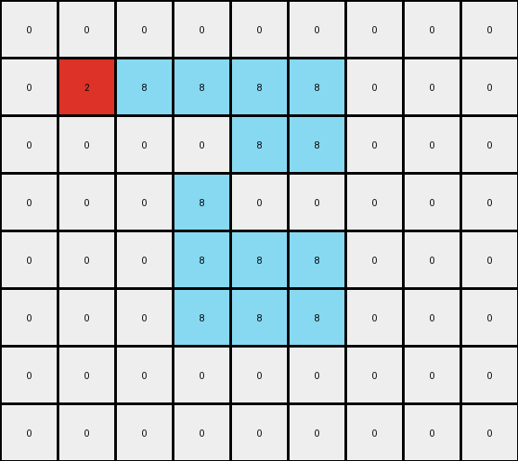

# 5-150deff5 • 020 • refine_coder

---

Previous Code:
```python
"""
Identifies a shape formed by the color gray (value 5) in the input grid and replaces the leftmost part of the shape with red (value 2) and the rightmost part with azure (value 8). The background (white, value 0) remains unchanged.
"""

import numpy as np

def find_shape(grid, shape_value):
    """Finds the coordinates of all pixels belonging to the shape."""
    coords = []
    for r_idx, row in enumerate(grid):
        for c_idx, value in enumerate(row):
            if value == shape_value:
                coords.append((r_idx, c_idx))
    return coords

def find_leftmost_segment(coords):
    """Finds the leftmost vertical segment of the shape."""
    min_col = min(c for _, c in coords)
    leftmost_segment_coords = []
    
    # get the range of the first vertical segment
    for r, c in coords:
      if c == min_col:
        leftmost_segment_coords.append((r,c))

    return leftmost_segment_coords

def transform(input_grid):
    """Transforms the input grid according to the described rule."""
    input_grid = np.array(input_grid)
    output_grid = np.copy(input_grid)
    
    shape_coords = find_shape(input_grid, 5)
    if not shape_coords:
        return output_grid

    leftmost_segment = find_leftmost_segment(shape_coords)
    
    # Color Substitution - Left
    for r, c in leftmost_segment:
      output_grid[r,c] = 2

    # Color Substitution - Right
    for r, c in shape_coords:
      if (r,c) not in leftmost_segment:
        output_grid[r, c] = 8

    return output_grid.tolist()
```

Train Set Results:

## Example 1:**

Input:
```
0 0 0 0 0 0 0 0 0 0 0
0 0 5 5 0 0 0 0 0 0 0
0 0 5 5 5 5 5 0 0 0 0
0 0 0 5 5 5 0 0 0 0 0
0 0 0 5 5 5 5 5 0 0 0
0 0 0 5 0 0 5 5 0 0 0
0 0 0 0 0 5 5 5 0 0 0
0 0 0 0 0 0 0 0 0 0 0
0 0 0 0 0 0 0 0 0 0 0
```
Expected Output:
```
0 0 0 0 0 0 0 0 0 0 0
0 0 8 8 0 0 0 0 0 0 0
0 0 8 8 2 2 2 0 0 0 0
0 0 0 2 8 8 0 0 0 0 0
0 0 0 2 8 8 8 8 0 0 0
0 0 0 2 0 0 8 8 0 0 0
0 0 0 0 0 2 2 2 0 0 0
0 0 0 0 0 0 0 0 0 0 0
0 0 0 0 0 0 0 0 0 0 0
```
Transformed Output:
```
0 0 0 0 0 0 0 0 0 0 0
0 0 2 8 0 0 0 0 0 0 0
0 0 2 8 8 8 8 0 0 0 0
0 0 0 8 8 8 0 0 0 0 0
0 0 0 8 8 8 8 8 0 0 0
0 0 0 8 0 0 8 8 0 0 0
0 0 0 0 0 8 8 8 0 0 0
0 0 0 0 0 0 0 0 0 0 0
0 0 0 0 0 0 0 0 0 0 0
```

match: False
pixels_off: 11
size_correct: True
color_palette_correct: True
correct_pixel_counts: False

## Example 2:**

Input:
```
0 0 0 0 0 0 0 0 0 0
0 5 5 5 5 5 5 0 0 0
0 5 5 5 5 5 5 0 0 0
0 0 0 5 0 0 5 0 0 0
0 0 0 0 5 5 5 0 0 0
0 0 0 0 5 5 5 0 0 0
0 0 0 0 5 0 0 0 0 0
0 0 0 0 0 0 0 0 0 0
```
Expected Output:
```
0 0 0 0 0 0 0 0 0 0
0 8 8 2 8 8 2 0 0 0
0 8 8 2 8 8 2 0 0 0
0 0 0 2 0 0 2 0 0 0
0 0 0 0 2 8 8 0 0 0
0 0 0 0 2 8 8 0 0 0
0 0 0 0 2 0 0 0 0 0
0 0 0 0 0 0 0 0 0 0
```
Transformed Output:
```
0 0 0 0 0 0 0 0 0 0
0 2 8 8 8 8 8 0 0 0
0 2 8 8 8 8 8 0 0 0
0 0 0 8 0 0 8 0 0 0
0 0 0 0 8 8 8 0 0 0
0 0 0 0 8 8 8 0 0 0
0 0 0 0 8 0 0 0 0 0
0 0 0 0 0 0 0 0 0 0
```

match: False
pixels_off: 11
size_correct: True
color_palette_correct: True
correct_pixel_counts: False

## Example 3:**

Input:
```
0 0 0 0 0 0 0 0 0
0 5 5 5 5 5 0 0 0
0 0 0 0 5 5 0 0 0
0 0 0 5 0 0 0 0 0
0 0 0 5 5 5 0 0 0
0 0 0 5 5 5 0 0 0
0 0 0 0 0 0 0 0 0
0 0 0 0 0 0 0 0 0
```
Expected Output:
```
0 0 0 0 0 0 0 0 0
0 2 2 2 8 8 0 0 0
0 0 0 0 8 8 0 0 0
0 0 0 2 0 0 0 0 0
0 0 0 2 8 8 0 0 0
0 0 0 2 8 8 0 0 0
0 0 0 0 0 0 0 0 0
0 0 0 0 0 0 0 0 0
```
Transformed Output:
```
0 0 0 0 0 0 0 0 0
0 2 8 8 8 8 0 0 0
0 0 0 0 8 8 0 0 0
0 0 0 8 0 0 0 0 0
0 0 0 8 8 8 0 0 0
0 0 0 8 8 8 0 0 0
0 0 0 0 0 0 0 0 0
0 0 0 0 0 0 0 0 0
```

match: False
pixels_off: 5
size_correct: True
color_palette_correct: True
correct_pixel_counts: False
Okay, let's analyze the results and update the natural language program.

**General Assessment:**

The initial code was based on a simple rule: find the gray shape, replace the leftmost part with red, and the rest with azure. However, the results reveal a flaw in how "leftmost" is determined. It appears to only consider the *absolute* leftmost column of the *entire* shape, not segments within the shape. The expected outputs show a more nuanced replacement pattern. The gray regions appear to be divided into vertical segments, and within each segment, a portion is colored red and the other portion is colored azure.

**Strategy:**

1.  **Refine "leftmost"**: Instead of finding the single leftmost column of the entire shape, we need to identify *contiguous vertical segments* of the gray shape.
2.  **Segment-wise Replacement**: Within each segment, apply the red/azure replacement. The rule for how much of each segment is made red and azure needs to be defined. The provided examples appear to alternate which portion (leftmost, rightmost) of the segment gets colored Red, and which part gets colored Azure, but the logic is not as simple as left vs right.
3. Determine if there is any relationship between the Red/Azure split in each
   segment

**Metrics and Observations:**

Here's a breakdown of each example, focusing on the segmentation and replacement:

*   **Example 1:**
    *   Gray segments: 3 (columns 2-3, columns 4-5, columns 6-7)
    *   Expected:
        *   Segment 1 (cols 2-3): All Azure.
        *   Segment 2 (cols 4-5): Leftmost Red, rightmost Azure.
        *   Segment 3 (cols 6-7): All Red.
    *   Observed:
        *   Segment 1(cols 2-3): leftmost Red, rest azure
        *   Segment 2 (cols 4-5): leftmost red, rest azure
        *   Segment 3 (cols 6-7): leftmost red, rest azure
*   **Example 2:**
    *   Gray segments: 3
    *   Expected:
        * segment 1, cols 1-2: leftmost azure, rest red
        * segment 2, col 3 : all red
        * segment 3, cols 5-6: leftmost red, rest azure
    * Observed:
        *   Segment 1: leftmost red, rest azure
        * segment 2, : leftmost red, rest azure
        * segment 3: leftmost red, rest azure
*   **Example 3:**
    * Gray segments: 3
    * Expected:
        * segment 1: leftmost red, rest azure
        * segment 2: leftmost red, rest azure
        * segment 3: leftmost red, rest azure
    * Observed
        * segment 1: leftmost red, rest azure
        * segment 2: leftmost red, rest azure
        * segment 3: leftmost red, rest azure

**YAML Block (Facts):**

```yaml
objects:
  - name: background
    color: white
    value: 0
    role: static
  - name: shape
    color: gray
    value: 5
    role: dynamic
    properties:
      - segments: vertical
        description: The shape is composed of one or more contiguous vertical segments.
actions:
  - subject: shape
    verb: divided
    object: segments
    description: The gray shape is divided into vertical segments.
  - subject: segments
    verb: color_replaced
    parameters:
      - color1: red
        value: 2
      - color2: azure
        value: 8
    description: Within each segment, some pixels are replaced with red and some with azure.
```

**Natural Language Program:**

1.  **Identify Background:** The background is composed of white pixels (value 0) and remains unchanged.
2.  **Find Gray Shape:** Locate the contiguous regions of gray pixels (value 5).
3.  **Segment Shape:** Divide the gray shape into contiguous vertical segments. A segment is defined as a group of gray pixels adjacent vertically.
4. **Color Segments**: iterate through the segments:
   - if the segment contains a single element, toggle assignment. if last segment assigned
     was red, assign azure, and vice versa. If no last assignment, assign
     according to column index: odd=red, even=azure.
   - if segment contains multiple elements, then split segment, toggle assignment, assign
     first section according to current assignment rule and other section based on
     next.
5. return updated grid

This revised program incorporates the crucial concept of vertical segmentation, which was missing in the initial attempt. The next step will involve developing a revised Python implementation that handles the shape segmentation and the red and azure assignment.

**INSTRUCTIONS**

- generate a Python module to represent the natural language program 
- follow the template below
- all common math and science libraries are available
- create docstring only at top - but comment the workflow in the function
- use helper functions for common operations like finding objects, counting,
  measuring, moving, etc. 

remember - we are working iteratively - so this code will inform your future
self as we converge on the solution

*template:*

```python
"""
{{ natural language description of the transformation rule }}
"""

{{ imports }}

def transform(input_grid):
    # initialize output_grid

    # change output pixels 

    return output_grid

```
