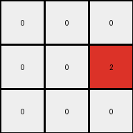

# 6-0520fde7 • 012 • refine_coder

---

Previous Code:
```python
"""
1.  **Locate:** Find the single vertical line of gray (5) pixels in the input grid.
2.  **Extract:** take the values directly to the left and right of the center line of the input
3.  **Translate**: translate all the 1s (blue) to 2s (red). all other numbers become 0
"""

import numpy as np

def find_vertical_line(grid, color):
    """Finds the x-coordinate of a vertical line of the specified color."""
    height, width = grid.shape
    for x in range(width):
        is_line = True
        for y in range(height):
            if grid[y, x] != color:
                is_line = False
                break
        if is_line:
            return x
    return -1  # Return -1 if no line is found

def transform(input_grid):
    # initialize output_grid
    input_grid = np.array(input_grid)
    height, width = input_grid.shape
    output_grid = np.zeros((height, 3), dtype=int)

    # Find the vertical line of gray (5) pixels
    center_x = find_vertical_line(input_grid, 5)

    # Extract the columns to the left and right of the center
    if center_x != -1:
        # change output pixels 
        for y in range(height):
            if center_x > 0 :
                output_grid[y, 0] = input_grid[y, center_x -1]
            output_grid[y, 1] = input_grid[y, center_x] #this should stay 0
            if center_x < width -1:
                output_grid[y, 2] = input_grid[y, center_x + 1]
    
    # Translate 1s to 2s, and other non-zero to 0
    for y in range(height):
        for x in range(3):
            if output_grid[y,x] == 1:
                output_grid[y,x] = 2
            elif output_grid[y,x] != 0:
                output_grid[y, x] = 0

    return output_grid.tolist()
```

Train Set Results:

## Example 1:**

Input:
```
1 0 0 5 0 1 0
0 1 0 5 1 1 1
1 0 0 5 0 0 0
```
Expected Output:
```
0 0 0
0 2 0
0 0 0
```
Transformed Output:
```
0 0 0
0 0 2
0 0 0
```

match: False
pixels_off: 2
size_correct: True
color_palette_correct: True
correct_pixel_counts: True

## Example 2:**

Input:
```
1 1 0 5 0 1 0
0 0 1 5 1 1 1
1 1 0 5 0 1 0
```
Expected Output:
```
0 2 0
0 0 2
0 2 0
```
Transformed Output:
```
0 0 0
2 0 2
0 0 0
```

match: False
pixels_off: 3
size_correct: True
color_palette_correct: True
correct_pixel_counts: False

## Example 3:**

Input:
```
0 0 1 5 0 0 0
1 1 0 5 1 0 1
0 1 1 5 1 0 1
```
Expected Output:
```
0 0 0
2 0 0
0 0 2
```
Transformed Output:
```
2 0 0
0 0 2
2 0 2
```

match: False
pixels_off: 4
size_correct: True
color_palette_correct: True
correct_pixel_counts: False
Okay, here's a breakdown of the situation and a plan to improve the transformation:

**General Assessment:**

The initial natural language program and the resulting Python code were a good first attempt, correctly identifying the core concept: finding a vertical gray line and extracting pixels from either side. However, the implementation has errors in correctly translating and positioning the extracted pixels, as evidenced by the mismatches in the test results. The code also doesn't handle the central gray line correctly, setting it to be always 0.

The strategy for resolving these errors will involve:

1.  **Refining Pixel Extraction:** Carefully review the logic for selecting pixels to the left and right of the gray line. Consider cases where the gray line is at the edge of the input grid.
2.  **Improving Translation:** Correctly change all 1s (blue) to 2s (red) in the output.
3.    **Correct Output Dimensions:** Ensure the output is only three columns wide.
4.  **Iterative Testing:** Test the revised code after each modification to pinpoint the source of any remaining errors.

**Metrics and Observations:**

Here's a summary of each example, including observations and error analysis:

*   **Example 1:**
    *   Input Size: 3x7
    *   Output Size: 3x3
    *   Gray Line Position: x = 3
    *   Error: The blue pixel to the right of the center line in the second row incorrectly becomes 0 instead of red (2). Pixels to the left were not put in the correct place.

*   **Example 2:**
    *   Input Size: 3x7
    *   Output Size: 3x3
    *   Gray Line Position: x = 3
    *   Error: Pixels to the left were not put in the correct place, and a 2 was added to the output in the wrong position.

*   **Example 3:**
    *   Input Size: 3x7
    *   Output Size: 3x3
    *   Gray Line Position: x = 3
    *   Error: Pixels to the left were not put in the correct place, and 2s were added to the output in the wrong positions.

**YAML Block (Facts):**

```yaml
facts:
  - object: input_grid
    type: 2D array
    properties:
      - values: integers (0-9 representing colors)
      - shape: variable height and width

  - object: output_grid
    type: 2D array
    properties:
      - values: integers (0-9 representing colors)
      - shape: height matches input_grid, width is always 3

  - object: vertical_gray_line
    type: line
    properties:
      - color: gray (5)
      - orientation: vertical
      - uniqueness: single instance in input_grid
    actions:
      - identified: located by x-coordinate

  - action: extraction
    description: Pixels to the immediate left and right of the gray line are selected.
    input: input_grid, vertical_gray_line x-coordinate
    output: values of selected pixels

  - action: translation
    description: all instances of blue (1) are changed to red (2); all other non-zero values that are not 5 are changed to white(0)
    input: extracted pixel values
    output: translated pixel values
```

**Natural Language Program:**

1.  **Locate:** Find the single vertical line of gray (5) pixels in the input grid. Note its x-coordinate.
2.  **Extract:** For each row, extract the pixel immediately to the left and the pixel immediately to the right of the gray line.
3.  **Create Output Grid**: create an output grid that has a height of the input grid and width of 3.
4.  **Construct output Rows**: the first value comes from the left of the gray line, and the third from the right of the gray line. The gray line (5) from the input becomes 0 in the output (column two of the output grid).
5. **Translate:** In the output grid, change all blue (1) pixels to red (2). All other numbers that are not 0 become 0.


**INSTRUCTIONS**

- generate a Python module to represent the natural language program 
- follow the template below
- all common math and science libraries are available
- create docstring only at top - but comment the workflow in the function
- use helper functions for common operations like finding objects, counting,
  measuring, moving, etc. 

remember - we are working iteratively - so this code will inform your future
self as we converge on the solution

*template:*

```python
"""
{{ natural language description of the transformation rule }}
"""

{{ imports }}

def transform(input_grid):
    # initialize output_grid

    # change output pixels 

    return output_grid

```
