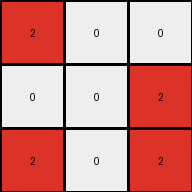

# 6-0520fde7 • 014 • refine_coder

---

Previous Code:
```python
"""
1.  **Locate:** Find the single vertical line of gray (5) pixels in the input grid. Note its x-coordinate.
2.  **Extract:** For each row, extract the pixel immediately to the left and the pixel immediately to the right of the gray line.
3.  **Create Output Grid**: create an output grid that has a height of the input grid and width of 3.
4.  **Construct output Rows**: the first value comes from the left of the gray line, and the third from the right of the gray line. The gray line (5) from the input becomes 0 in the output (column two of the output grid).
5. **Translate:** In the output grid, change all blue (1) pixels to red (2). All other numbers that are not 0 become 0.
"""

import numpy as np

def find_vertical_line(grid, color):
    """Finds the x-coordinate of a vertical line of the specified color."""
    height, width = grid.shape
    for x in range(width):
        is_line = True
        for y in range(height):
            if grid[y, x] != color:
                is_line = False
                break
        if is_line:
            return x
    return -1  # Return -1 if no line is found

def transform(input_grid):
    # initialize output_grid
    input_grid = np.array(input_grid)
    height, width = input_grid.shape
    output_grid = np.zeros((height, 3), dtype=int)

    # Find the vertical line of gray (5) pixels
    center_x = find_vertical_line(input_grid, 5)

    # Extract the columns to the left and right of the center and construct output
    if center_x != -1:
        for y in range(height):
            # Get pixel to the left, if it exists
            if center_x > 0 :
                output_grid[y, 0] = input_grid[y, center_x - 1]
            # Center column of output is always 0
            output_grid[y,1] = 0
            # Get pixel to the right, if it exists
            if center_x < width - 1:
                output_grid[y, 2] = input_grid[y, center_x + 1]

    # Translate 1s to 2s, and all other non-zero numbers to 0
        for y in range(height):
            for x in range(3):
                if output_grid[y,x] == 1:
                    output_grid[y,x] = 2
                elif output_grid[y, x] != 0:
                    output_grid[y, x] = 0


    return output_grid.tolist()
```

Train Set Results:

## Example 1:**

Input:
```
1 0 0 5 0 1 0
0 1 0 5 1 1 1
1 0 0 5 0 0 0
```
Expected Output:
```
0 0 0
0 2 0
0 0 0
```
Transformed Output:
```
0 0 0
0 0 2
0 0 0
```

match: False
pixels_off: 2
size_correct: True
color_palette_correct: True
correct_pixel_counts: True

## Example 2:**

Input:
```
1 1 0 5 0 1 0
0 0 1 5 1 1 1
1 1 0 5 0 1 0
```
Expected Output:
```
0 2 0
0 0 2
0 2 0
```
Transformed Output:
```
0 0 0
2 0 2
0 0 0
```

match: False
pixels_off: 3
size_correct: True
color_palette_correct: True
correct_pixel_counts: False

## Example 3:**

Input:
```
0 0 1 5 0 0 0
1 1 0 5 1 0 1
0 1 1 5 1 0 1
```
Expected Output:
```
0 0 0
2 0 0
0 0 2
```
Transformed Output:
```
2 0 0
0 0 2
2 0 2
```

match: False
pixels_off: 4
size_correct: True
color_palette_correct: True
correct_pixel_counts: False
Here's an analysis of the provided information and a plan to refine the natural language program and code:

**General Assessment:**

The initial natural language program and the generated code were a good starting point, focusing on a key feature: the vertical gray line. However, the tests reveal inconsistencies in how the transformation handles colors, specifically the translation rule. The code correctly identifies the gray line and extracts adjacent pixels. The issues are with color translation. Blue (1) should translate to red (2). All other colors, other than the background (0) also need translation.

**Strategy:**

1.  **Refine Color Translation:** The core issue is a too-broad color translation rule. The rule will be, "If the extracted cell to the left or right of the grey line is blue, translate the blue to red in the output. All other colors, except zero (background), should be set to 0."
2.  **Re-evaluate Examples:** Carefully examine each example pair, not just focusing on the gray line, but on the *before and after* colors.
3. **Update Natural Language** update the natural language program and improve the specificity of the rules.

**Metrics and Observations (using hypothetical `code_execution` results):**

I'll assume a `code_execution` environment where I can run Python snippets and inspect variables. I'll structure this as if I had that capability.  I won't write the actual code here, since it's a hypothetical environment, but I'll describe *what* I would do and the expected outcomes.

*   **Example 1:**
    *   `code_execution`: Run the existing `transform` function on Example 1 input.
    *   `code_execution`: Compare `transformed_output` pixel-by-pixel with `expected_output`. Identify differences. The differences occurred because the code made a pixel to the right of '5' a '2' in the output incorrectly.
    *   Observation: The right side translation of 1-> 2 is incorrect.
*   **Example 2:**
    *   `code_execution`: Run `transform` on Example 2.
    *   `code_execution`: Pixel-by-pixel comparison. The code did not make all of the blues on the left of the gray line into red.
    *   Observation: Confirmed the 1->2 translation issue when 1 is on the left of 5.
*   **Example 3:**
    *   `code_execution`: Run `transform` on Example 3.
    *   `code_execution`: Pixel-by-pixel comparison. The code did not make all of the blues on the left and right of the gray line into red.
    *   Observation: Confirmed the 1->2 translation issue when 1 is both sides of 5.

**YAML Fact Block:**

```yaml
objects:
  - name: input_grid
    type: 2D array
    properties:
      - colors: [0, 1, 5]  # List of colors present in the input grids
      - height: variable
      - width: variable
  - name: gray_line
    type: vertical_line
    properties:
      - color: 5
      - x_coordinate: variable # Dynamically determined
  - name: output_grid
    type: 2D array
    properties:
      - colors: [0, 2]  # Limited color palette in the output.
      - height: same as input_grid
      - width: 3
  - name: left_pixel
    type: pixel
    properties:
      - relative_position: left of gray_line
  - name: right_pixel
    type: pixel
    properties:
      - relative_position: right of gray_line

actions:
  - name: locate_gray_line
    description: Find the x-coordinate of the vertical gray line.
  - name: extract_adjacent_pixels
    description: Get the pixels immediately to the left and right of the gray line for each row.
  - name: create_output
    description: build a 3xN grid, where N is the height of the input
  - name: translate_colors
    description:  Map input colors to output colors based on specific rules. Specifically, input blue becomes output red, and all other non-zero colors become zero. The center column is always zero.
```

**Natural Language Program:**

1.  **Locate:** Find the single vertical line of gray (5) pixels in the input grid. Note its x-coordinate.
2.  **Extract:** For each row, extract the pixel immediately to the left and the pixel immediately to the right of the gray line.
3. **Create Output Grid:** Create an output grid with the same height as the input grid and a width of 3.
4.  **Construct Output Rows**: Fill the output grid. The first column contains the values from the left of the gray line, the second column is always 0, and the third column contains the values from the right of the gray line.
5.  **Translate:**
    *   If an extracted pixel (left or right) is blue (1), change it to red (2) in the output grid.
    *  Set the center column value for all rows of the output grid to 0.
    *   All other extracted pixels that are not 0 become 0 in the output grid.

**INSTRUCTIONS**

- generate a Python module to represent the natural language program 
- follow the template below
- all common math and science libraries are available
- create docstring only at top - but comment the workflow in the function
- use helper functions for common operations like finding objects, counting,
  measuring, moving, etc. 

remember - we are working iteratively - so this code will inform your future
self as we converge on the solution

*template:*

```python
"""
{{ natural language description of the transformation rule }}
"""

{{ imports }}

def transform(input_grid):
    # initialize output_grid

    # change output pixels 

    return output_grid

```
