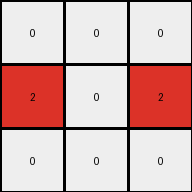

# 6-0520fde7 • 015 • refine_dreamer

---

Previous Code:
```python
"""
1.  **Locate:** Find the single vertical line of gray (5) pixels in the input grid. Note its x-coordinate.
2.  **Extract:** For each row, extract the pixel immediately to the left and the pixel immediately to the right of the gray line.
3. **Create Output Grid:** Create an output grid with the same height as the input grid and a width of 3.
4.  **Construct Output Rows**: Fill the output grid. The first column contains the values from the left of the gray line, the second column is always 0, and the third column contains the values from the right of the gray line.
5.  **Translate:**
    *   If an extracted pixel (left or right) is blue (1), change it to red (2) in the output grid.
    *  Set the center column value for all rows of the output grid to 0.
    *   All other extracted pixels that are not 0 become 0 in the output grid.
"""

import numpy as np

def find_vertical_line(grid, color):
    """Finds the x-coordinate of a vertical line of the specified color."""
    height, width = grid.shape
    for x in range(width):
        is_line = True
        for y in range(height):
            if grid[y, x] != color:
                is_line = False
                break
        if is_line:
            return x
    return -1  # Return -1 if no line is found

def transform(input_grid):
    # initialize output_grid
    input_grid = np.array(input_grid)
    height, width = input_grid.shape
    output_grid = np.zeros((height, 3), dtype=int)

    # Find the vertical line of gray (5) pixels
    center_x = find_vertical_line(input_grid, 5)

    # Extract the columns to the left and right of the center and construct output
    if center_x != -1:
        for y in range(height):
            # Get pixel to the left, if it exists
            if center_x > 0 :
                output_grid[y, 0] = input_grid[y, center_x - 1]
            # Center column of output is always 0
            output_grid[y,1] = 0
            # Get pixel to the right, if it exists
            if center_x < width - 1:
                output_grid[y, 2] = input_grid[y, center_x + 1]

    # Translate 1s to 2s, and all other non-zero numbers to 0
        for y in range(height):
            for x in range(3):
                if output_grid[y,x] == 1:
                    output_grid[y,x] = 2
                elif output_grid[y, x] != 0:
                    output_grid[y, x] = 0


    return output_grid.tolist()
```

Train Set Results:

## Example 1:**

Input:
```
1 0 0 5 0 1 0
0 1 0 5 1 1 1
1 0 0 5 0 0 0
```
Expected Output:
```
0 0 0
0 2 0
0 0 0
```
Transformed Output:
```
0 0 0
0 0 2
0 0 0
```

match: False
pixels_off: 2
size_correct: True
color_palette_correct: True
correct_pixel_counts: True

## Example 2:**

Input:
```
1 1 0 5 0 1 0
0 0 1 5 1 1 1
1 1 0 5 0 1 0
```
Expected Output:
```
0 2 0
0 0 2
0 2 0
```
Transformed Output:
```
0 0 0
2 0 2
0 0 0
```

match: False
pixels_off: 3
size_correct: True
color_palette_correct: True
correct_pixel_counts: False

## Example 3:**

Input:
```
0 0 1 5 0 0 0
1 1 0 5 1 0 1
0 1 1 5 1 0 1
```
Expected Output:
```
0 0 0
2 0 0
0 0 2
```
Transformed Output:
```
2 0 0
0 0 2
2 0 2
```

match: False
pixels_off: 4
size_correct: True
color_palette_correct: True
correct_pixel_counts: False
**INSTRUCTIONS**

The code above was generated based on observations from the first training
example

we have tested the transform function on each of the task example inputs and
compared with the expected output

review each of the examples provided and the results and consider how the
natural language program should be updated to accommodate this new knowledge

respond with the following deliverables:

- general assessment of the information provided and strategy for resolving the
  errors
- gather metrics about each of the examples and results - use code_execution to
  develop accurate reports on your assumptions
- a YAML block documenting facts - Focus on identifying objects, their properties, and the actions performed on them.
- a natural language program - Be as clear and concise as possible, providing a complete description of the transformation rule.


your responses should be considered as information in a report - not a
conversation
