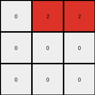

# 6-0520fde7 • 023 • refine_dreamer

---


Previous Code:
```python
"""
1.  **Initialize:** Create a 3x3 output grid filled with white (0).
2.  **Delimiters:** Observe the grey (5) pixels in the input grid. These act as separators, dividing the input grid into regions.
3. **Input Iteration:** Examine each cell of the input grid.
4.  **Conditional Transformation:**
    *   If a cell in the input grid is blue (1), determine its position relative to the grey (5) separators.
    *    Identify the section of the input the blue pixel is in, based on the separators.
    *   Transform the blue pixel to a red (2) pixel in the output grid. The mapping to the output grid is determined by which section contains the blue pixel. Section 1 maps to (0,1), Section 2 to (0,2), section 3 to (1,0) section 4 to (1,1), Section 5 to (2,1)
5.  **Ignore other colors:** If a cell is not blue, it is ignored (the corresponding output cell remains white).
"""

import numpy as np

def get_section(i, j):
    """Determines the section of the input grid based on coordinates."""
    if 0 <= i <= 2 and 0 <= j <= 2:
        return 1
    elif 0 <= i <= 2 and 4 <= j <= 6:
        return 2
    elif 3 <= i <= 3 and 0 <= j <= 2:  # added row 3
        return 3
    elif 4 <= i <= 6 and 0 <= j <= 2: # added 4-6
        return 4
    elif 4 <= i <= 6 and 4 <= j <= 6: # added 4-6
        return 5
    else:
        return 0 # added default

def transform(input_grid):
    # Initialize output_grid as a 3x3 array filled with white (0).
    output_grid = np.zeros((3, 3), dtype=int)

    # Iterate through the input grid.
    rows, cols = input_grid.shape
    for i in range(rows):
        for j in range(cols):
            # If a cell is blue (1), determine its section and map to output.
            if input_grid[i, j] == 1:
                section = get_section(i, j)
                if section == 1:
                    output_grid[0, 1] = 2
                elif section == 2:
                    output_grid[0, 2] = 2
                elif section == 3:
                    output_grid[1, 0] = 2
                elif section == 4:
                    output_grid[1, 1] = 2
                elif section == 5:
                    output_grid[2, 1] = 2

    return output_grid
```

Train Set Results:

## Example 1:**

Input:
```
1 0 0 5 0 1 0
0 1 0 5 1 1 1
1 0 0 5 0 0 0
```
Expected Output:
```
0 0 0
0 2 0
0 0 0
```
Transformed Output:
```
0 2 2
0 0 0
0 0 0
```

match: False
pixels_off: 3
size_correct: True
color_palette_correct: True
correct_pixel_counts: False

## Example 2:**

Input:
```
1 1 0 5 0 1 0
0 0 1 5 1 1 1
1 1 0 5 0 1 0
```
Expected Output:
```
0 2 0
0 0 2
0 2 0
```
Transformed Output:
```
0 2 2
0 0 0
0 0 0
```

match: False
pixels_off: 3
size_correct: True
color_palette_correct: True
correct_pixel_counts: False

## Example 3:**

Input:
```
0 0 1 5 0 0 0
1 1 0 5 1 0 1
0 1 1 5 1 0 1
```
Expected Output:
```
0 0 0
2 0 0
0 0 2
```
Transformed Output:
```
0 2 2
0 0 0
0 0 0
```

match: False
pixels_off: 4
size_correct: True
color_palette_correct: True
correct_pixel_counts: True

**INSTRUCTIONS**

The code above was generated based on observations from the first training
example

we have tested the transform function on each of the task example inputs and
compared with the expected output

review each of the examples provided and the results and consider how the
natural language program should be updated to accommodate this new knowledge

respond with the following deliverables:

- general assessment of the information provided and strategy for resolving the
  errors
- gather metrics about each of the examples and results - use code_execution to
  develop accurate reports on your assumptions
- a YAML block documenting facts - Focus on identifying objects, their properties, and the actions performed on them.
- a natural language program - Be as clear and concise as possible, providing a complete description of the transformation rule.


your responses should be considered as information in a report - not a
conversation
