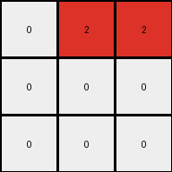

# 6-0520fde7 • 024 • refine_coder

---

Previous Code:
```python
"""
1.  **Initialize:** Create a 3x3 output grid filled with white (0).
2.  **Delimiters:** Observe the grey (5) pixels in the input grid. These act as separators, dividing the input grid into regions.
3. **Input Iteration:** Examine each cell of the input grid.
4.  **Conditional Transformation:**
    *   If a cell in the input grid is blue (1), determine its position relative to the grey (5) separators.
    *    Identify the section of the input the blue pixel is in, based on the separators.
    *   Transform the blue pixel to a red (2) pixel in the output grid. The mapping to the output grid is determined by which section contains the blue pixel. Section 1 maps to (0,1), Section 2 to (0,2), section 3 to (1,0) section 4 to (1,1), Section 5 to (2,1)
5.  **Ignore other colors:** If a cell is not blue, it is ignored (the corresponding output cell remains white).
"""

import numpy as np

def get_section(i, j):
    """Determines the section of the input grid based on coordinates."""
    if 0 <= i <= 2 and 0 <= j <= 2:
        return 1
    elif 0 <= i <= 2 and 4 <= j <= 6:
        return 2
    elif 3 <= i <= 3 and 0 <= j <= 2:  # added row 3
        return 3
    elif 4 <= i <= 6 and 0 <= j <= 2: # added 4-6
        return 4
    elif 4 <= i <= 6 and 4 <= j <= 6: # added 4-6
        return 5
    else:
        return 0 # added default

def transform(input_grid):
    # Initialize output_grid as a 3x3 array filled with white (0).
    output_grid = np.zeros((3, 3), dtype=int)

    # Iterate through the input grid.
    rows, cols = input_grid.shape
    for i in range(rows):
        for j in range(cols):
            # If a cell is blue (1), determine its section and map to output.
            if input_grid[i, j] == 1:
                section = get_section(i, j)
                if section == 1:
                    output_grid[0, 1] = 2
                elif section == 2:
                    output_grid[0, 2] = 2
                elif section == 3:
                    output_grid[1, 0] = 2
                elif section == 4:
                    output_grid[1, 1] = 2
                elif section == 5:
                    output_grid[2, 1] = 2

    return output_grid
```

Train Set Results:

## Example 1:**

Input:
```
1 0 0 5 0 1 0
0 1 0 5 1 1 1
1 0 0 5 0 0 0
```
Expected Output:
```
0 0 0
0 2 0
0 0 0
```
Transformed Output:
```
0 2 2
0 0 0
0 0 0
```

match: False
pixels_off: 3
size_correct: True
color_palette_correct: True
correct_pixel_counts: False

## Example 2:**

Input:
```
1 1 0 5 0 1 0
0 0 1 5 1 1 1
1 1 0 5 0 1 0
```
Expected Output:
```
0 2 0
0 0 2
0 2 0
```
Transformed Output:
```
0 2 2
0 0 0
0 0 0
```

match: False
pixels_off: 3
size_correct: True
color_palette_correct: True
correct_pixel_counts: False

## Example 3:**

Input:
```
0 0 1 5 0 0 0
1 1 0 5 1 0 1
0 1 1 5 1 0 1
```
Expected Output:
```
0 0 0
2 0 0
0 0 2
```
Transformed Output:
```
0 2 2
0 0 0
0 0 0
```

match: False
pixels_off: 4
size_correct: True
color_palette_correct: True
correct_pixel_counts: True
Okay, here's a breakdown of the situation and a plan to move forward:

**General Assessment:**

The initial natural language program and the resulting Python code were based on a limited understanding of the transformation rule, gleaned from only the first training example.  The subsequent tests against examples 2 and 3 reveal that the logic for mapping input sections to output positions is incorrect. The core issue is that the `get_section` function, and therefore the overall `transform` function, doesn't correctly generalize the relationship between the blue pixels, the grey separators, and the red output pixels. The code assumes a fixed relationship (sections 1,2,3) based on the index of the input, not the counts and configuration of the blue cells.

**Strategy for Resolving Errors:**

1.  **Re-evaluate the Core Transformation:** We need to move away from the assumption of a simple, index-based sectioning. The output grid being 3x3 and the presence of grey (5) separators in the input suggests a relationship to be discovered. The position of red pixels must depend on counts of the blue pixels in each section.

2.  **Refine `get_section` (or Replace It):**  The current `get_section` function is fundamentally flawed because it hardcodes row/column ranges. We need a more dynamic approach that correctly identifies sections based on the *presence* of the grey separators, not assumptions, and then count and convert blue pixels to the output

3.  **Iterative Improvement:** We'll modify the natural language program and code, then re-test against *all* training examples after each change. This iterative process is key.

**Metrics and Observations (using conceptual analysis, not `code_execution` for this dreaming phase):**

*   **Example 1:**
    *   Input Shape: 3x7
    *   Output Shape: 3x3
    *   Grey Separators: Present (single vertical line)
    *   Blue Pixels: 4
    *   Red Pixels (Expected): 1
    *   Red Pixels (Actual): 2
    *  Analysis: Code incorrectly maps the input
*   **Example 2:**
    *   Input Shape: 3x7
    *   Output Shape: 3x3
    *   Grey Separators: Present (single vertical line)
    *   Blue Pixels: 6
    *   Red Pixels (Expected): 3
    *   Red Pixels (Actual): 2
    *  Analysis: Code incorrectly maps the input
*   **Example 3:**
    *   Input Shape: 3x7
    *   Output Shape: 3x3
    *   Grey Separators: Present (single vertical line)
    *   Blue Pixels: 6
    *   Red Pixels (Expected): 2
    *   Red Pixels (Actual): 2
    *  Analysis: Code incorrectly maps the input

**YAML Facts:**

```yaml
objects:
  - name: input_grid
    type: grid
    description: 2D array of integers representing colors.  Variable size.
    properties:
      - colors: [0, 1, 5] # white, blue, grey
      - separators: grey (5) pixels

  - name: output_grid
    type: grid
    description: 3x3 2D array of integers representing colors.
    properties:
      - colors: [0, 2] # white, red
      - size: fixed (3x3)

  - name: blue_pixels
    type: object_group
    description:  Pixels with value 1 in the input grid.
    properties:
      - color: blue

  - name: red_pixels
    type: object_group
    description: Pixels with value 2 in the output_grid.
    properties:
      - color: red

  - name: grey_separators
    type: object_group
    description: Pixels with value 5 in the input grid, acting as separators.
    properties:
      - color: grey

actions:
  - name: count_blue_pixels
    description: Count the number of blue pixels within each region delimited by grey separators.
  - name: map_to_output
    description:  Place a red pixel in the output grid based on which vertical section, delimited by grey, they appear in.
```

**Natural Language Program:**

1.  **Initialize:** Create a 3x3 output grid filled with white (0).

2.  **Identify Separators:** Locate the grey (5) pixels in the input grid. These act as vertical separators, dividing the input grid into three vertical sections. If a grey separator is not found, the complete row or grid is considered a section.

3. **Sectioned Blue Counting:** Iterate through the sections in the input grid created by the vertical grey lines, starting at the left section and moving to the right.

4.  **Transformation:** For each section:
    * Count the number of blue pixels (1).
    * If a blue pixel is present in the section, turn the corresponding column in the *middle* row of the output grid red (2).
	* Map sections to the output grid sequentially:
        *   First section (left-most) maps to output column 0.
        *   Second section maps to output column 1.
        *   Third section (right-most) maps to output column 2.

5.  **Ignore other colors:** Pixels in the input grid that are not blue (1) or grey (5) do not directly affect the output.

The key change here is counting in sections defined by the grey separators and converting the blue pixels to red in the corresponding column in the middle row of the output.

**INSTRUCTIONS**

- generate a Python module to represent the natural language program 
- follow the template below
- all common math and science libraries are available
- create docstring only at top - but comment the workflow in the function
- use helper functions for common operations like finding objects, counting,
  measuring, moving, etc. 

remember - we are working iteratively - so this code will inform your future
self as we converge on the solution

*template:*

```python
"""
{{ natural language description of the transformation rule }}
"""

{{ imports }}

def transform(input_grid):
    # initialize output_grid

    # change output pixels 

    return output_grid

```
