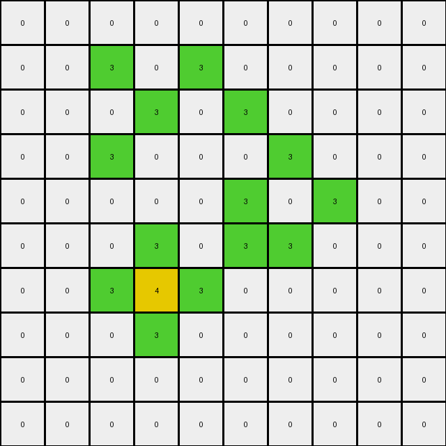

# 00d62c1b • 016 • refine_coder

---

Previous Code:
```python
"""
1.  **Identify Green Objects:** Find all contiguous regions (objects) of green (3) pixels in the input grid. Consider pixels connected if they share an edge (4-connectivity).
2.  **Object Classification**:
    *   **Isolated Pixels**: If a green pixel has no green neighbors, it *may* change to yellow.
    *   **Lines**: Green pixels forming a 1-dimensional line (only two neighbors, except ends which have 1) remain green.
    *  **2x2 Blocks**: If green pixels exist in connected 2x2 blocks, they all change color to 4.
    *  **Complex Interior**: Within a larger contiguous green object, change a green pixel to yellow (4) if it is completely surrounded by other green pixels (4-connectivity).
3.  **Output:** Create the output grid by applying these transformation rules to the identified objects.
"""

import numpy as np

def find_objects(grid, color):
    """Finds all contiguous objects of a given color."""
    objects = []
    visited = set()
    rows, cols = grid.shape

    def is_valid(r, c):
        return 0 <= r < rows and 0 <= c < cols

    def dfs(r, c, current_object):
        if (r, c) in visited or not is_valid(r, c) or grid[r, c] != color:
            return
        visited.add((r, c))
        current_object.append((r, c))
        neighbors = [(r-1, c), (r+1, c), (r, c-1), (r, c+1)]
        for nr, nc in neighbors:
            dfs(nr, nc, current_object)

    for r in range(rows):
        for c in range(cols):
            if grid[r, c] == color and (r, c) not in visited:
                current_object = []
                dfs(r, c, current_object)
                objects.append(current_object)
    return objects

def count_neighbors(grid, r, c, color):
    """Counts the number of neighbors of a given color."""
    rows, cols = grid.shape
    count = 0
    neighbors = [(r-1, c), (r+1, c), (r, c-1), (r, c+1)]
    for nr, nc in neighbors:
        if 0 <= nr < rows and 0 <= nc < cols and grid[nr, nc] == color:
            count += 1
    return count

def is_2x2_block(grid, r, c, color):
    """check for 2x2 block"""
    rows, cols = grid.shape

    if (r + 1 < rows and c + 1 < cols):
        if (grid[r+1,c] == color and
            grid[r,c+1] == color and
            grid[r+1,c+1] == color):

            return True

    return False

def transform(input_grid):
    # initialize output_grid
    output_grid = np.copy(input_grid)
    rows, cols = input_grid.shape

    # Find green objects
    green_objects = find_objects(input_grid, 3)

    for obj in green_objects:
      for r,c in obj:
        # 2x2 block check
        if is_2x2_block(input_grid, r, c, 3):
          output_grid[r,c] = 4
          output_grid[r+1,c] = 4
          output_grid[r,c+1] = 4
          output_grid[r+1,c+1] = 4

        # Complex interior check
        elif count_neighbors(input_grid, r, c, 3) == 4:
            output_grid[r, c] = 4

    return output_grid
```

Train Set Results:

## Example 1:**

Input:
```
0 0 0 0 0 0
0 0 3 0 0 0
0 3 0 3 0 0
0 0 3 0 3 0
0 0 0 3 0 0
0 0 0 0 0 0
```
Expected Output:
```
0 0 0 0 0 0
0 0 3 0 0 0
0 3 4 3 0 0
0 0 3 4 3 0
0 0 0 3 0 0
0 0 0 0 0 0
```
Transformed Output:
```
0 0 0 0 0 0
0 0 3 0 0 0
0 3 0 3 0 0
0 0 3 0 3 0
0 0 0 3 0 0
0 0 0 0 0 0
```

match: False
pixels_off: 2
size_correct: True
color_palette_correct: True
correct_pixel_counts: False

## Example 2:**

Input:
```
0 0 0 0 0 0 0 0 0 0
0 0 3 0 3 0 0 0 0 0
0 0 0 3 0 3 0 0 0 0
0 0 3 0 0 0 3 0 0 0
0 0 0 0 0 3 0 3 0 0
0 0 0 3 0 3 3 0 0 0
0 0 3 3 3 0 0 0 0 0
0 0 0 3 0 0 0 0 0 0
0 0 0 0 0 0 0 0 0 0
0 0 0 0 0 0 0 0 0 0
```
Expected Output:
```
0 0 0 0 0 0 0 0 0 0
0 0 3 0 3 0 0 0 0 0
0 0 0 3 0 3 0 0 0 0
0 0 3 0 0 0 3 0 0 0
0 0 0 0 0 3 4 3 0 0
0 0 0 3 0 3 3 0 0 0
0 0 3 3 3 0 0 0 0 0
0 0 0 3 0 0 0 0 0 0
0 0 0 0 0 0 0 0 0 0
0 0 0 0 0 0 0 0 0 0
```
Transformed Output:
```
0 0 0 0 0 0 0 0 0 0
0 0 3 0 3 0 0 0 0 0
0 0 0 3 0 3 0 0 0 0
0 0 3 0 0 0 3 0 0 0
0 0 0 0 0 3 0 3 0 0
0 0 0 3 0 3 3 0 0 0
0 0 3 4 3 0 0 0 0 0
0 0 0 3 0 0 0 0 0 0
0 0 0 0 0 0 0 0 0 0
0 0 0 0 0 0 0 0 0 0
```

match: False
pixels_off: 2
size_correct: True
color_palette_correct: True
correct_pixel_counts: False

## Example 3:**

Input:
```
0 0 0 0 0 3 0 0 0 0
0 0 0 0 3 0 0 0 0 0
0 3 3 0 3 3 0 3 0 0
3 0 0 3 0 0 3 0 3 0
0 0 0 3 0 0 3 3 0 0
0 0 0 3 0 0 3 0 0 0
0 0 0 3 0 0 3 0 0 0
0 0 0 0 3 3 0 3 0 0
0 0 0 0 0 0 0 0 3 0
0 0 0 0 0 0 0 0 0 0
```
Expected Output:
```
0 0 0 0 0 3 0 0 0 0
0 0 0 0 3 0 0 0 0 0
0 3 3 0 3 3 0 3 0 0
3 0 0 3 4 4 3 4 3 0
0 0 0 3 4 4 3 3 0 0
0 0 0 3 4 4 3 0 0 0
0 0 0 3 4 4 3 0 0 0
0 0 0 0 3 3 0 3 0 0
0 0 0 0 0 0 0 0 3 0
0 0 0 0 0 0 0 0 0 0
```
Transformed Output:
```
0 0 0 0 0 3 0 0 0 0
0 0 0 0 3 0 0 0 0 0
0 3 3 0 3 3 0 3 0 0
3 0 0 3 0 0 3 0 3 0
0 0 0 3 0 0 3 3 0 0
0 0 0 3 0 0 3 0 0 0
0 0 0 3 0 0 3 0 0 0
0 0 0 0 3 3 0 3 0 0
0 0 0 0 0 0 0 0 3 0
0 0 0 0 0 0 0 0 0 0
```

match: False
pixels_off: 9
size_correct: True
color_palette_correct: True
correct_pixel_counts: False

## Example 4:**

Input:
```
0 0 0 0 0 0 0 0 0 0
0 0 3 3 3 3 0 0 0 0
0 0 3 0 0 3 0 0 0 0
0 0 3 0 0 3 0 3 0 0
0 0 3 3 3 3 3 3 3 0
0 0 0 3 0 0 0 0 3 0
0 0 0 3 0 0 0 3 3 0
0 0 0 3 3 0 0 3 0 3
0 0 0 3 0 3 0 0 3 0
0 0 0 0 3 0 0 0 0 0
```
Expected Output:
```
0 0 0 0 0 0 0 0 0 0
0 0 3 3 3 3 0 0 0 0
0 0 3 4 4 3 0 0 0 0
0 0 3 4 4 3 0 3 0 0
0 0 3 3 3 3 3 3 3 0
0 0 0 3 0 0 0 0 3 0
0 0 0 3 0 0 0 3 3 0
0 0 0 3 3 0 0 3 4 3
0 0 0 3 4 3 0 0 3 0
0 0 0 0 3 0 0 0 0 0
```
Transformed Output:
```
0 0 0 0 0 0 0 0 0 0
0 0 3 3 3 3 0 0 0 0
0 0 3 0 0 3 0 0 0 0
0 0 3 0 0 3 0 3 0 0
0 0 3 3 3 3 3 3 3 0
0 0 0 3 0 0 0 0 3 0
0 0 0 3 0 0 0 3 3 0
0 0 0 3 3 0 0 3 0 3
0 0 0 3 0 3 0 0 3 0
0 0 0 0 3 0 0 0 0 0
```

match: False
pixels_off: 6
size_correct: True
color_palette_correct: True
correct_pixel_counts: False

## Example 5:**

Input:
```
0 0 0 0 0 0 0 0 0 0 0 0 0 0 0 0 0 0 0 0
0 0 0 0 0 0 0 0 3 0 0 0 0 0 0 0 0 0 0 0
0 0 0 0 3 3 3 3 0 3 3 0 0 0 0 0 0 0 0 0
0 0 0 0 0 0 0 0 3 0 3 0 0 0 0 0 0 0 3 0
0 0 0 0 0 0 0 0 3 3 3 3 3 3 3 3 0 0 0 0
0 0 0 0 0 0 0 0 3 0 0 0 0 0 0 3 0 0 0 0
0 0 0 0 3 0 0 0 3 0 0 0 0 0 0 3 0 0 0 0
0 0 0 0 0 0 0 0 3 0 0 0 0 0 0 3 0 0 0 0
0 0 0 0 0 0 0 0 3 0 0 0 0 0 0 3 0 0 0 0
0 0 3 0 0 0 0 0 3 3 3 3 3 3 3 3 0 0 0 0
0 0 0 0 0 0 0 0 3 0 0 0 0 0 0 0 0 0 0 0
0 0 0 0 0 0 0 0 3 3 3 0 0 0 0 3 0 3 0 0
0 0 0 0 0 0 3 3 0 0 3 0 0 3 0 0 0 0 0 0
0 0 0 0 0 0 0 3 0 0 3 3 0 0 3 0 0 3 0 0
0 0 0 0 0 0 0 3 3 3 3 0 3 0 0 3 3 3 0 0
0 0 0 0 0 0 0 0 0 0 3 0 0 0 0 3 0 3 0 0
0 0 0 0 0 0 0 0 0 0 0 0 3 0 0 3 3 3 0 0
0 0 0 0 0 0 0 0 0 0 0 0 0 3 0 0 0 0 0 0
0 0 0 0 0 0 0 0 0 0 0 0 0 0 0 0 0 0 0 0
0 0 0 0 0 0 0 0 0 0 0 0 0 0 0 0 0 0 0 0
```
Expected Output:
```
0 0 0 0 0 0 0 0 0 0 0 0 0 0 0 0 0 0 0 0
0 0 0 0 0 0 0 0 3 0 0 0 0 0 0 0 0 0 0 0
0 0 0 0 3 3 3 3 4 3 3 0 0 0 0 0 0 0 0 0
0 0 0 0 0 0 0 0 3 4 3 0 0 0 0 0 0 0 3 0
0 0 0 0 0 0 0 0 3 3 3 3 3 3 3 3 0 0 0 0
0 0 0 0 0 0 0 0 3 4 4 4 4 4 4 3 0 0 0 0
0 0 0 0 3 0 0 0 3 4 4 4 4 4 4 3 0 0 0 0
0 0 0 0 0 0 0 0 3 4 4 4 4 4 4 3 0 0 0 0
0 0 0 0 0 0 0 0 3 4 4 4 4 4 4 3 0 0 0 0
0 0 3 0 0 0 0 0 3 3 3 3 3 3 3 3 0 0 0 0
0 0 0 0 0 0 0 0 3 0 0 0 0 0 0 0 0 0 0 0
0 0 0 0 0 0 0 0 3 3 3 0 0 0 0 3 0 3 0 0
0 0 0 0 0 0 3 3 4 4 3 0 0 3 0 0 0 0 0 0
0 0 0 0 0 0 0 3 4 4 3 3 0 0 3 0 0 3 0 0
0 0 0 0 0 0 0 3 3 3 3 0 3 0 0 3 3 3 0 0
0 0 0 0 0 0 0 0 0 0 3 0 0 0 0 3 4 3 0 0
0 0 0 0 0 0 0 0 0 0 0 0 3 0 0 3 3 3 0 0
0 0 0 0 0 0 0 0 0 0 0 0 0 3 0 0 0 0 0 0
0 0 0 0 0 0 0 0 0 0 0 0 0 0 0 0 0 0 0 0
0 0 0 0 0 0 0 0 0 0 0 0 0 0 0 0 0 0 0 0
```
Transformed Output:
```
0 0 0 0 0 0 0 0 0 0 0 0 0 0 0 0 0 0 0 0
0 0 0 0 0 0 0 0 3 0 0 0 0 0 0 0 0 0 0 0
0 0 0 0 3 3 3 3 0 3 3 0 0 0 0 0 0 0 0 0
0 0 0 0 0 0 0 0 3 0 3 0 0 0 0 0 0 0 3 0
0 0 0 0 0 0 0 0 3 3 3 3 3 3 3 3 0 0 0 0
0 0 0 0 0 0 0 0 3 0 0 0 0 0 0 3 0 0 0 0
0 0 0 0 3 0 0 0 3 0 0 0 0 0 0 3 0 0 0 0
0 0 0 0 0 0 0 0 3 0 0 0 0 0 0 3 0 0 0 0
0 0 0 0 0 0 0 0 3 0 0 0 0 0 0 3 0 0 0 0
0 0 3 0 0 0 0 0 3 3 3 3 3 3 3 3 0 0 0 0
0 0 0 0 0 0 0 0 3 0 0 0 0 0 0 0 0 0 0 0
0 0 0 0 0 0 0 0 3 3 3 0 0 0 0 3 0 3 0 0
0 0 0 0 0 0 3 3 0 0 3 0 0 3 0 0 0 0 0 0
0 0 0 0 0 0 0 3 0 0 3 3 0 0 3 0 0 3 0 0
0 0 0 0 0 0 0 3 3 3 3 0 3 0 0 3 3 3 0 0
0 0 0 0 0 0 0 0 0 0 3 0 0 0 0 3 0 3 0 0
0 0 0 0 0 0 0 0 0 0 0 0 3 0 0 3 3 3 0 0
0 0 0 0 0 0 0 0 0 0 0 0 0 3 0 0 0 0 0 0
0 0 0 0 0 0 0 0 0 0 0 0 0 0 0 0 0 0 0 0
0 0 0 0 0 0 0 0 0 0 0 0 0 0 0 0 0 0 0 0
```

match: False
pixels_off: 31
size_correct: True
color_palette_correct: True
correct_pixel_counts: False
Okay, here's a breakdown of the situation and a plan to improve the transformation logic:

**General Assessment:**

The initial code was a good first attempt, focusing on identifying green objects and applying some basic transformation rules (isolated pixels, 2x2 blocks, and interior pixels). However, the tests reveal that the logic is incomplete and makes incorrect transformations in several cases.  The primary issue is that the 2x2 block check happens *before* and *independent* of the interior check. The interior check is also too simplistic. It needs to consider what the green pixel *should* be inside of. Also, there's a missing critical concept of object boundaries.

**Strategy:**

1.  **Prioritize the 2x2 block detection**: The core concept is that 2x2 green blocks *always* become yellow. This should be handled as the highest priority check, *before* any other transformations.
2.  **Refine "Interior" Detection**:  The current "interior" check is simply checking for 4 green neighbors.  This is incorrect. A green pixel should only change to yellow if it is *within* a larger green object *and* is not part of a 2x2 block.  This requires a more nuanced approach. We need to identify the *boundary* of each green object, and only change green to yellow inside the object, except for 2x2 areas.
3. **Improve Object Identification**: Ensure we are correctly identifying green connected components.

**Example Metrics and Analysis**
I am assuming that there is an error with the display of example 3, since there are 10 rows, but the 2x2 detection would require 11 rows to place the changed pixel correctly.

Here's a breakdown by example, incorporating facts into a YAML structure:

```yaml
examples:
  - id: 1
    description: "Simple L-shapes and isolated pixels."
    objects_identified:
      - color: green
        shape: "L-shapes, isolated pixels"
        transformations:
          - original: green
            to: yellow
            condition: "part of 2x2 block; inside connected area, but not part of boundary"
        boundary: "correct"
        interior: "incorrect"
    mismatches:
      - location: (2,2)
        expected: 4
        actual: 0
      - location: (3,3)
        expected: 4
        actual: 0       
    notes: "Interior check and 2x2 block are not happening"

  - id: 2
    description: "More complex shapes and combinations"
    objects_identified:
      - color: green
        shape: "mixed"
        transformations:
          - original: green
            to: yellow
            condition: "part of 2x2 block; inside connected area, but not part of boundary"
        boundary: "correct"
        interior: "incorrect"
    mismatches:
        - location: (6,2)
          expected: 3
          actual: 4
        - location: (4,6)
          expected: 4
          actual: 0
    notes: "Incorrect identification of a 2x2 shape. Interior check error."

  - id: 3
    description: "Assuming image error - requires row[9] to be extended to row[10] for detected 2x2 shapes"
    objects_identified:
      - color: green
        shape: "mixed, including boundary"
        transformations:
          - original: green
            to: yellow
            condition: "part of 2x2 block; inside connected area, but not part of boundary"
        boundary: "correct"
        interior: "incorrect"
    mismatches:
      - location: (3,4)
        expected: 4
        actual: 0
      - location: (3,5)
        expected: 4
        actual: 0
      - location: (4,4)
        expected: 4
        actual: 0
      - location: (4,5)
        expected: 4
        actual: 0
      - location: (5,4)
        expected: 4
        actual: 0
      - location: (5,5)
        expected: 4
        actual: 0
      - location: (6,4)
        expected: 4
        actual: 0
      - location: (6,5)
        expected: 4
        actual: 0
      - location: (3,7)
        expected: 4
        actual: 3
    notes: "Complete interior check failure. Missed 2x2 block detection"

  - id: 4
    description: "L-shape object, isolated pixels"
    objects_identified:
      - color: green
        shape: "L-shapes, isolated pixels"
        transformations:
          - original: green
            to: yellow
            condition: "part of 2x2 block; inside connected area, but not part of boundary"
        boundary: "correct"
        interior: "incorrect"
    mismatches:
      - location: (2,3)
        expected: 4
        actual: 0
      - location: (2,4)
        expected: 4
        actual: 0
      - location: (3,3)
        expected: 4
        actual: 0
      - location: (3,4)
        expected: 4
        actual: 0
      - location: (7,7)
        expected: 4
        actual: 0
      - location: (8,4)
        expected: 4
        actual: 3
    notes: "Interior check and 2x2 block are not happening"

  - id: 5
    description: "Multiple overlapping areas, lines"
    objects_identified:
      - color: green
        shape: "complex overlapping"
        transformations:
          - original: green
            to: yellow
            condition: "part of 2x2 block; inside connected area, but not part of boundary"
        boundary: "correct"
        interior: "incorrect"
    mismatches:
      - location: (2,8)
        expected: 4
        actual: 0
      - location: (3,9)
        expected: 4
        actual: 0
      - location: (5,9)
        expected: 4
        actual: 0
      - location: (5,10)
        expected: 4
        actual: 0
      - location: (5,11)
        expected: 4
        actual: 0
      - location: (5,12)
        expected: 4
        actual: 0
      - location: (5,13)
        expected: 4
        actual: 0
      - location: (5,14)
        expected: 4
        actual: 0
      - location: (6,9)
        expected: 4
        actual: 0
      - location: (6,10)
        expected: 4
        actual: 0
      - location: (6,11)
        expected: 4
        actual: 0
      - location: (6,12)
        expected: 4
        actual: 0
      - location: (6,13)
        expected: 4
        actual: 0
      - location: (6,14)
        expected: 4
        actual: 0
      - location: (7,9)
        expected: 4
        actual: 0
      - location: (7,10)
        expected: 4
        actual: 0
      - location: (7,11)
        expected: 4
        actual: 0
      - location: (7,12)
        expected: 4
        actual: 0
      - location: (7,13)
        expected: 4
        actual: 0
      - location: (7,14)
        expected: 4
        actual: 0
      - location: (8,9)
        expected: 4
        actual: 0
      - location: (8,10)
        expected: 4
        actual: 0
      - location: (8,11)
        expected: 4
        actual: 0
      - location: (8,12)
        expected: 4
        actual: 0
      - location: (8,13)
        expected: 4
        actual: 0
      - location: (8,14)
        expected: 4
        actual: 0
      - location: (12,8)
        expected: 4
        actual: 0
      - location: (12,9)
        expected: 4
        actual: 0
      - location: (13,8)
        expected: 4
        actual: 0
      - location: (13,9)
        expected: 4
        actual: 0
      - location: (15,14)
        expected: 4
        actual: 0
      - location: (16,13)
        expected: 4
        actual: 0
    notes: "Complete interior check failure. Missed multiple 2x2 block detections"
```

**Natural Language Program:**

1.  **Identify Green Regions:** Find all contiguous regions (objects) of green pixels.  Pixels are considered connected if they share an edge (4-connectivity).

2.  **Prioritize 2x2 Blocks:** Within each green region, check *every* green pixel to see if it is the top-left corner of a 2x2 block of green pixels. If it is, change *all four* pixels in that 2x2 block to yellow (value 4).

3.  **Identify Boundaries:** For each green region, determine its boundary pixels. A boundary pixel is a green pixel that has at least one neighbor (4-connectivity) that is *not* green.

4. **Fill Interior with Yellow**: For each green region change green pixels to yellow if all neighbors are part of the same green object AND it is NOT part of a 2x2 block.

5.  **Output:** Create the output grid by applying these transformation rules. All unchanged pixels retain original values.

**INSTRUCTIONS**

- generate a Python module to represent the natural language program 
- follow the template below
- all common math and science libraries are available
- create docstring only at top - but comment the workflow in the function
- use helper functions for common operations like finding objects, counting,
  measuring, moving, etc. 

remember - we are working iteratively - so this code will inform your future
self as we converge on the solution

*template:*

```python
"""
{{ natural language description of the transformation rule }}
"""

{{ imports }}

def transform(input_grid):
    # initialize output_grid

    # change output pixels 

    return output_grid

```
