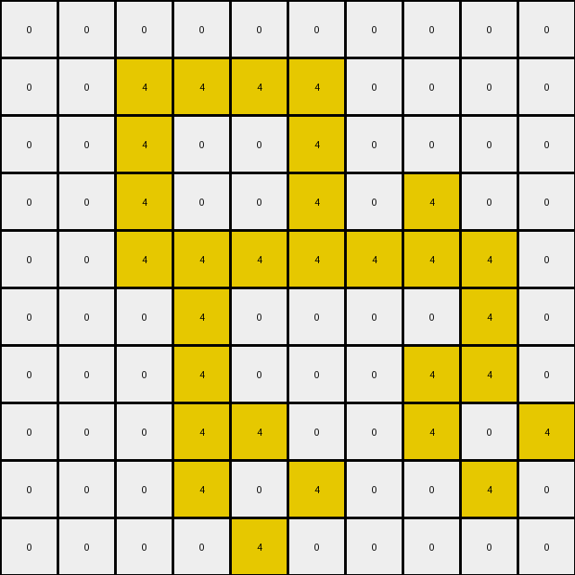

# 00d62c1b • 021 • refine_dreamer

---


Previous Code:
```python
"""
1.  **Input:** A grid of pixels with colors representing values (0-9).

2.  **Identify Green Regions:** Find all contiguous regions of green (color value 3) pixels within the grid.

3.  **Determine Inner Region for Each Green Region:**
    *   For each contiguous green region:
        *   Start an "outer edge flood fill" using the background color (0 in most examples), beginning from outside the bounds of the entire grid.
        *   The area *not* filled by this flood fill represents the interior of the green shape, including the green pixels themselves.
        *   Intersect the original green region with this "inner" area. This intersection defines the "inner region."

4.  **Transform Inner Regions:** Change the color of all pixels within each identified "inner region" from green (3) to yellow (4).

5.  **Output:** The modified grid with the transformed inner regions.
"""

import numpy as np

def find_contiguous_regions(grid, color):
    """Finds contiguous regions of a specific color in the grid."""
    visited = np.zeros_like(grid, dtype=bool)
    regions = []

    def dfs(row, col):
        """Depth-first search to explore a contiguous region."""
        if (
            row < 0
            or row >= grid.shape[0]
            or col < 0
            or col >= grid.shape[1]
            or visited[row, col]
            or grid[row, col] != color
        ):
            return []

        visited[row, col] = True
        region = [(row, col)]

        region.extend(dfs(row + 1, col))
        region.extend(dfs(row - 1, col))
        region.extend(dfs(row, col + 1))
        region.extend(dfs(row, col - 1))
        return region

    for row in range(grid.shape[0]):
        for col in range(grid.shape[1]):
            if not visited[row, col] and grid[row, col] == color:
                regions.append(dfs(row, col))

    return regions

def flood_fill(grid, start_row, start_col, fill_color):
    """Performs a flood fill on the grid starting from (start_row, start_col) with fill_color."""
    rows, cols = grid.shape
    filled_grid = grid.copy()
    stack = [(start_row, start_col)]
    original_color = grid[start_row, start_col]


    if original_color == fill_color:
        return filled_grid

    while stack:
        r, c = stack.pop()
        if 0 <= r < rows and 0 <= c < cols and filled_grid[r,c] == original_color:
            filled_grid[r, c] = fill_color
            stack.extend([(r + 1, c), (r - 1, c), (r, c + 1), (r, c - 1)])
    return filled_grid

def determine_inner_region(grid, green_region):
    """Determines the inner region of a green region using flood fill."""
    
    # Create a slightly larger grid for flood filling from outside
    rows, cols = grid.shape
    large_grid = np.zeros((rows + 2, cols + 2), dtype=int)
    
    # Determine the background color by checking pixels around the region
    background_color = 0  # Default to 0
    
    # Place the original grid in the center of the large grid
    large_grid[1:rows+1, 1:cols+1] = grid
    
    # Convert green_region coordinates to the large grid coordinates
    large_green_region = [(r + 1, c + 1) for r, c in green_region]
    
    
    # Flood fill from the outside of the enlarged grid.
    filled_large_grid = flood_fill(large_grid, 0, 0, -1)  # Use -1 as temporary fill color
    
    inner_region = []
    for r, c in large_green_region:
        if filled_large_grid[r,c] != -1:
             inner_region.append((r-1,c-1)) # back to original coordinates

    return inner_region

def transform(input_grid):
    # initialize output_grid
    output_grid = np.copy(input_grid)
    
    # identify green regions
    green_regions = find_contiguous_regions(output_grid, 3)
        
    # check enclosure
    for region in green_regions:
        inner_region = determine_inner_region(output_grid, region)
        # paint inner region
        for row, col in inner_region:
            output_grid[row, col] = 4
    
    return output_grid
```

Train Set Results:

## Example 1:**

Input:
```
0 0 0 0 0 0
0 0 3 0 0 0
0 3 0 3 0 0
0 0 3 0 3 0
0 0 0 3 0 0
0 0 0 0 0 0
```
Expected Output:
```
0 0 0 0 0 0
0 0 3 0 0 0
0 3 4 3 0 0
0 0 3 4 3 0
0 0 0 3 0 0
0 0 0 0 0 0
```
Transformed Output:
```
0 0 0 0 0 0
0 0 4 0 0 0
0 4 0 4 0 0
0 0 4 0 4 0
0 0 0 4 0 0
0 0 0 0 0 0
```

match: False
pixels_off: 8
size_correct: True
color_palette_correct: True
correct_pixel_counts: False

## Example 2:**

Input:
```
0 0 0 0 0 0 0 0 0 0
0 0 3 0 3 0 0 0 0 0
0 0 0 3 0 3 0 0 0 0
0 0 3 0 0 0 3 0 0 0
0 0 0 0 0 3 0 3 0 0
0 0 0 3 0 3 3 0 0 0
0 0 3 3 3 0 0 0 0 0
0 0 0 3 0 0 0 0 0 0
0 0 0 0 0 0 0 0 0 0
0 0 0 0 0 0 0 0 0 0
```
Expected Output:
```
0 0 0 0 0 0 0 0 0 0
0 0 3 0 3 0 0 0 0 0
0 0 0 3 0 3 0 0 0 0
0 0 3 0 0 0 3 0 0 0
0 0 0 0 0 3 4 3 0 0
0 0 0 3 0 3 3 0 0 0
0 0 3 3 3 0 0 0 0 0
0 0 0 3 0 0 0 0 0 0
0 0 0 0 0 0 0 0 0 0
0 0 0 0 0 0 0 0 0 0
```
Transformed Output:
```
0 0 0 0 0 0 0 0 0 0
0 0 4 0 4 0 0 0 0 0
0 0 0 4 0 4 0 0 0 0
0 0 4 0 0 0 4 0 0 0
0 0 0 0 0 4 0 4 0 0
0 0 0 4 0 4 4 0 0 0
0 0 4 4 4 0 0 0 0 0
0 0 0 4 0 0 0 0 0 0
0 0 0 0 0 0 0 0 0 0
0 0 0 0 0 0 0 0 0 0
```

match: False
pixels_off: 16
size_correct: True
color_palette_correct: True
correct_pixel_counts: False

## Example 3:**

Input:
```
0 0 0 0 0 3 0 0 0 0
0 0 0 0 3 0 0 0 0 0
0 3 3 0 3 3 0 3 0 0
3 0 0 3 0 0 3 0 3 0
0 0 0 3 0 0 3 3 0 0
0 0 0 3 0 0 3 0 0 0
0 0 0 3 0 0 3 0 0 0
0 0 0 0 3 3 0 3 0 0
0 0 0 0 0 0 0 0 3 0
0 0 0 0 0 0 0 0 0 0
```
Expected Output:
```
0 0 0 0 0 3 0 0 0 0
0 0 0 0 3 0 0 0 0 0
0 3 3 0 3 3 0 3 0 0
3 0 0 3 4 4 3 4 3 0
0 0 0 3 4 4 3 3 0 0
0 0 0 3 4 4 3 0 0 0
0 0 0 3 4 4 3 0 0 0
0 0 0 0 3 3 0 3 0 0
0 0 0 0 0 0 0 0 3 0
0 0 0 0 0 0 0 0 0 0
```
Transformed Output:
```
0 0 0 0 0 4 0 0 0 0
0 0 0 0 4 0 0 0 0 0
0 4 4 0 4 4 0 4 0 0
4 0 0 4 0 0 4 0 4 0
0 0 0 4 0 0 4 4 0 0
0 0 0 4 0 0 4 0 0 0
0 0 0 4 0 0 4 0 0 0
0 0 0 0 4 4 0 4 0 0
0 0 0 0 0 0 0 0 4 0
0 0 0 0 0 0 0 0 0 0
```

match: False
pixels_off: 31
size_correct: True
color_palette_correct: True
correct_pixel_counts: False

## Example 4:**

Input:
```
0 0 0 0 0 0 0 0 0 0
0 0 3 3 3 3 0 0 0 0
0 0 3 0 0 3 0 0 0 0
0 0 3 0 0 3 0 3 0 0
0 0 3 3 3 3 3 3 3 0
0 0 0 3 0 0 0 0 3 0
0 0 0 3 0 0 0 3 3 0
0 0 0 3 3 0 0 3 0 3
0 0 0 3 0 3 0 0 3 0
0 0 0 0 3 0 0 0 0 0
```
Expected Output:
```
0 0 0 0 0 0 0 0 0 0
0 0 3 3 3 3 0 0 0 0
0 0 3 4 4 3 0 0 0 0
0 0 3 4 4 3 0 3 0 0
0 0 3 3 3 3 3 3 3 0
0 0 0 3 0 0 0 0 3 0
0 0 0 3 0 0 0 3 3 0
0 0 0 3 3 0 0 3 4 3
0 0 0 3 4 3 0 0 3 0
0 0 0 0 3 0 0 0 0 0
```
Transformed Output:
```
0 0 0 0 0 0 0 0 0 0
0 0 4 4 4 4 0 0 0 0
0 0 4 0 0 4 0 0 0 0
0 0 4 0 0 4 0 4 0 0
0 0 4 4 4 4 4 4 4 0
0 0 0 4 0 0 0 0 4 0
0 0 0 4 0 0 0 4 4 0
0 0 0 4 4 0 0 4 0 4
0 0 0 4 0 4 0 0 4 0
0 0 0 0 4 0 0 0 0 0
```

match: False
pixels_off: 35
size_correct: True
color_palette_correct: True
correct_pixel_counts: False

## Example 5:**

Input:
```
0 0 0 0 0 0 0 0 0 0 0 0 0 0 0 0 0 0 0 0
0 0 0 0 0 0 0 0 3 0 0 0 0 0 0 0 0 0 0 0
0 0 0 0 3 3 3 3 0 3 3 0 0 0 0 0 0 0 0 0
0 0 0 0 0 0 0 0 3 0 3 0 0 0 0 0 0 0 3 0
0 0 0 0 0 0 0 0 3 3 3 3 3 3 3 3 0 0 0 0
0 0 0 0 0 0 0 0 3 0 0 0 0 0 0 3 0 0 0 0
0 0 0 0 3 0 0 0 3 0 0 0 0 0 0 3 0 0 0 0
0 0 0 0 0 0 0 0 3 0 0 0 0 0 0 3 0 0 0 0
0 0 0 0 0 0 0 0 3 0 0 0 0 0 0 3 0 0 0 0
0 0 3 0 0 0 0 0 3 3 3 3 3 3 3 3 0 0 0 0
0 0 0 0 0 0 0 0 3 0 0 0 0 0 0 0 0 0 0 0
0 0 0 0 0 0 0 0 3 3 3 0 0 0 0 3 0 3 0 0
0 0 0 0 0 0 3 3 0 0 3 0 0 3 0 0 0 0 0 0
0 0 0 0 0 0 0 3 0 0 3 3 0 0 3 0 0 3 0 0
0 0 0 0 0 0 0 3 3 3 3 0 3 0 0 3 3 3 0 0
0 0 0 0 0 0 0 0 0 0 3 0 0 0 0 3 0 3 0 0
0 0 0 0 0 0 0 0 0 0 0 0 3 0 0 3 3 3 0 0
0 0 0 0 0 0 0 0 0 0 0 0 0 3 0 0 0 0 0 0
0 0 0 0 0 0 0 0 0 0 0 0 0 0 0 0 0 0 0 0
0 0 0 0 0 0 0 0 0 0 0 0 0 0 0 0 0 0 0 0
```
Expected Output:
```
0 0 0 0 0 0 0 0 0 0 0 0 0 0 0 0 0 0 0 0
0 0 0 0 0 0 0 0 3 0 0 0 0 0 0 0 0 0 0 0
0 0 0 0 3 3 3 3 4 3 3 0 0 0 0 0 0 0 0 0
0 0 0 0 0 0 0 0 3 4 3 0 0 0 0 0 0 0 3 0
0 0 0 0 0 0 0 0 3 3 3 3 3 3 3 3 0 0 0 0
0 0 0 0 0 0 0 0 3 4 4 4 4 4 4 3 0 0 0 0
0 0 0 0 3 0 0 0 3 4 4 4 4 4 4 3 0 0 0 0
0 0 0 0 0 0 0 0 3 4 4 4 4 4 4 3 0 0 0 0
0 0 0 0 0 0 0 0 3 4 4 4 4 4 4 3 0 0 0 0
0 0 3 0 0 0 0 0 3 3 3 3 3 3 3 3 0 0 0 0
0 0 0 0 0 0 0 0 3 0 0 0 0 0 0 0 0 0 0 0
0 0 0 0 0 0 0 0 3 3 3 0 0 0 0 3 0 3 0 0
0 0 0 0 0 0 3 3 4 4 3 0 0 3 0 0 0 0 0 0
0 0 0 0 0 0 0 3 4 4 3 3 0 0 3 0 0 3 0 0
0 0 0 0 0 0 0 3 3 3 3 0 3 0 0 3 3 3 0 0
0 0 0 0 0 0 0 0 0 0 3 0 0 0 0 3 4 3 0 0
0 0 0 0 0 0 0 0 0 0 0 0 3 0 0 3 3 3 0 0
0 0 0 0 0 0 0 0 0 0 0 0 0 3 0 0 0 0 0 0
0 0 0 0 0 0 0 0 0 0 0 0 0 0 0 0 0 0 0 0
0 0 0 0 0 0 0 0 0 0 0 0 0 0 0 0 0 0 0 0
```
Transformed Output:
```
0 0 0 0 0 0 0 0 0 0 0 0 0 0 0 0 0 0 0 0
0 0 0 0 0 0 0 0 4 0 0 0 0 0 0 0 0 0 0 0
0 0 0 0 4 4 4 4 0 4 4 0 0 0 0 0 0 0 0 0
0 0 0 0 0 0 0 0 4 0 4 0 0 0 0 0 0 0 4 0
0 0 0 0 0 0 0 0 4 4 4 4 4 4 4 4 0 0 0 0
0 0 0 0 0 0 0 0 4 0 0 0 0 0 0 4 0 0 0 0
0 0 0 0 4 0 0 0 4 0 0 0 0 0 0 4 0 0 0 0
0 0 0 0 0 0 0 0 4 0 0 0 0 0 0 4 0 0 0 0
0 0 0 0 0 0 0 0 4 0 0 0 0 0 0 4 0 0 0 0
0 0 4 0 0 0 0 0 4 4 4 4 4 4 4 4 0 0 0 0
0 0 0 0 0 0 0 0 4 0 0 0 0 0 0 0 0 0 0 0
0 0 0 0 0 0 0 0 4 4 4 0 0 0 0 4 0 4 0 0
0 0 0 0 0 0 4 4 0 0 4 0 0 4 0 0 0 0 0 0
0 0 0 0 0 0 0 4 0 0 4 4 0 0 4 0 0 4 0 0
0 0 0 0 0 0 0 4 4 4 4 0 4 0 0 4 4 4 0 0
0 0 0 0 0 0 0 0 0 0 4 0 0 0 0 4 0 4 0 0
0 0 0 0 0 0 0 0 0 0 0 0 4 0 0 4 4 4 0 0
0 0 0 0 0 0 0 0 0 0 0 0 0 4 0 0 0 0 0 0
0 0 0 0 0 0 0 0 0 0 0 0 0 0 0 0 0 0 0 0
0 0 0 0 0 0 0 0 0 0 0 0 0 0 0 0 0 0 0 0
```

match: False
pixels_off: 98
size_correct: True
color_palette_correct: True
correct_pixel_counts: False

**INSTRUCTIONS**

The code above was generated based on observations from the first training
example

we have tested the transform function on each of the task example inputs and
compared with the expected output

review each of the examples provided and the results and consider how the
natural language program should be updated to accommodate this new knowledge

respond with the following deliverables:

- general assessment of the information provided and strategy for resolving the
  errors
- gather metrics about each of the examples and results - use code_execution to
  develop accurate reports on your assumptions
- a YAML block documenting facts - Focus on identifying objects, their properties, and the actions performed on them.
- a natural language program - Be as clear and concise as possible, providing a complete description of the transformation rule.


your responses should be considered as information in a report - not a
conversation
