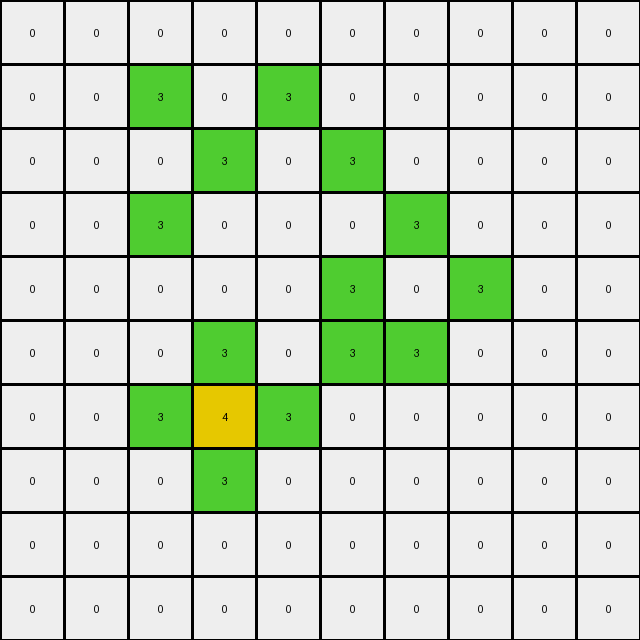

# 00d62c1b • 028 • refine_coder

---

Previous Code:
```python
"""
Identifies contiguous green area. In that area, the most "interior" green pixels (i.e. surrounded by green pixels up, down, left, right) is recolored to yellow.
"""

import numpy as np

def transform(input_grid):
    # initialize output_grid
    output_grid = np.copy(input_grid)
    rows, cols = input_grid.shape

    # change output pixels
    for r in range(1, rows - 1):
        for c in range(1, cols - 1):
            if input_grid[r, c] == 3:  # Check if it's green
                # Check neighbors (up, down, left, right)
                if (input_grid[r-1, c] == 3 and
                    input_grid[r+1, c] == 3 and
                    input_grid[r, c-1] == 3 and
                    input_grid[r, c+1] == 3):
                    output_grid[r, c] = 4  # Change to yellow

    return output_grid
```

Train Set Results:

## Example 1:**

Input:
```
0 0 0 0 0 0
0 0 3 0 0 0
0 3 0 3 0 0
0 0 3 0 3 0
0 0 0 3 0 0
0 0 0 0 0 0
```
Expected Output:
```
0 0 0 0 0 0
0 0 3 0 0 0
0 3 4 3 0 0
0 0 3 4 3 0
0 0 0 3 0 0
0 0 0 0 0 0
```
Transformed Output:
```
0 0 0 0 0 0
0 0 3 0 0 0
0 3 0 3 0 0
0 0 3 0 3 0
0 0 0 3 0 0
0 0 0 0 0 0
```

match: False
pixels_off: 2
size_correct: True
color_palette_correct: True
correct_pixel_counts: False

## Example 2:**

Input:
```
0 0 0 0 0 0 0 0 0 0
0 0 3 0 3 0 0 0 0 0
0 0 0 3 0 3 0 0 0 0
0 0 3 0 0 0 3 0 0 0
0 0 0 0 0 3 0 3 0 0
0 0 0 3 0 3 3 0 0 0
0 0 3 3 3 0 0 0 0 0
0 0 0 3 0 0 0 0 0 0
0 0 0 0 0 0 0 0 0 0
0 0 0 0 0 0 0 0 0 0
```
Expected Output:
```
0 0 0 0 0 0 0 0 0 0
0 0 3 0 3 0 0 0 0 0
0 0 0 3 0 3 0 0 0 0
0 0 3 0 0 0 3 0 0 0
0 0 0 0 0 3 4 3 0 0
0 0 0 3 0 3 3 0 0 0
0 0 3 3 3 0 0 0 0 0
0 0 0 3 0 0 0 0 0 0
0 0 0 0 0 0 0 0 0 0
0 0 0 0 0 0 0 0 0 0
```
Transformed Output:
```
0 0 0 0 0 0 0 0 0 0
0 0 3 0 3 0 0 0 0 0
0 0 0 3 0 3 0 0 0 0
0 0 3 0 0 0 3 0 0 0
0 0 0 0 0 3 0 3 0 0
0 0 0 3 0 3 3 0 0 0
0 0 3 4 3 0 0 0 0 0
0 0 0 3 0 0 0 0 0 0
0 0 0 0 0 0 0 0 0 0
0 0 0 0 0 0 0 0 0 0
```

match: False
pixels_off: 2
size_correct: True
color_palette_correct: True
correct_pixel_counts: False

## Example 3:**

Input:
```
0 0 0 0 0 3 0 0 0 0
0 0 0 0 3 0 0 0 0 0
0 3 3 0 3 3 0 3 0 0
3 0 0 3 0 0 3 0 3 0
0 0 0 3 0 0 3 3 0 0
0 0 0 3 0 0 3 0 0 0
0 0 0 3 0 0 3 0 0 0
0 0 0 0 3 3 0 3 0 0
0 0 0 0 0 0 0 0 3 0
0 0 0 0 0 0 0 0 0 0
```
Expected Output:
```
0 0 0 0 0 3 0 0 0 0
0 0 0 0 3 0 0 0 0 0
0 3 3 0 3 3 0 3 0 0
3 0 0 3 4 4 3 4 3 0
0 0 0 3 4 4 3 3 0 0
0 0 0 3 4 4 3 0 0 0
0 0 0 3 4 4 3 0 0 0
0 0 0 0 3 3 0 3 0 0
0 0 0 0 0 0 0 0 3 0
0 0 0 0 0 0 0 0 0 0
```
Transformed Output:
```
0 0 0 0 0 3 0 0 0 0
0 0 0 0 3 0 0 0 0 0
0 3 3 0 3 3 0 3 0 0
3 0 0 3 0 0 3 0 3 0
0 0 0 3 0 0 3 3 0 0
0 0 0 3 0 0 3 0 0 0
0 0 0 3 0 0 3 0 0 0
0 0 0 0 3 3 0 3 0 0
0 0 0 0 0 0 0 0 3 0
0 0 0 0 0 0 0 0 0 0
```

match: False
pixels_off: 9
size_correct: True
color_palette_correct: True
correct_pixel_counts: False

## Example 4:**

Input:
```
0 0 0 0 0 0 0 0 0 0
0 0 3 3 3 3 0 0 0 0
0 0 3 0 0 3 0 0 0 0
0 0 3 0 0 3 0 3 0 0
0 0 3 3 3 3 3 3 3 0
0 0 0 3 0 0 0 0 3 0
0 0 0 3 0 0 0 3 3 0
0 0 0 3 3 0 0 3 0 3
0 0 0 3 0 3 0 0 3 0
0 0 0 0 3 0 0 0 0 0
```
Expected Output:
```
0 0 0 0 0 0 0 0 0 0
0 0 3 3 3 3 0 0 0 0
0 0 3 4 4 3 0 0 0 0
0 0 3 4 4 3 0 3 0 0
0 0 3 3 3 3 3 3 3 0
0 0 0 3 0 0 0 0 3 0
0 0 0 3 0 0 0 3 3 0
0 0 0 3 3 0 0 3 4 3
0 0 0 3 4 3 0 0 3 0
0 0 0 0 3 0 0 0 0 0
```
Transformed Output:
```
0 0 0 0 0 0 0 0 0 0
0 0 3 3 3 3 0 0 0 0
0 0 3 0 0 3 0 0 0 0
0 0 3 0 0 3 0 3 0 0
0 0 3 3 3 3 3 3 3 0
0 0 0 3 0 0 0 0 3 0
0 0 0 3 0 0 0 3 3 0
0 0 0 3 3 0 0 3 0 3
0 0 0 3 0 3 0 0 3 0
0 0 0 0 3 0 0 0 0 0
```

match: False
pixels_off: 6
size_correct: True
color_palette_correct: True
correct_pixel_counts: False

## Example 5:**

Input:
```
0 0 0 0 0 0 0 0 0 0 0 0 0 0 0 0 0 0 0 0
0 0 0 0 0 0 0 0 3 0 0 0 0 0 0 0 0 0 0 0
0 0 0 0 3 3 3 3 0 3 3 0 0 0 0 0 0 0 0 0
0 0 0 0 0 0 0 0 3 0 3 0 0 0 0 0 0 0 3 0
0 0 0 0 0 0 0 0 3 3 3 3 3 3 3 3 0 0 0 0
0 0 0 0 0 0 0 0 3 0 0 0 0 0 0 3 0 0 0 0
0 0 0 0 3 0 0 0 3 0 0 0 0 0 0 3 0 0 0 0
0 0 0 0 0 0 0 0 3 0 0 0 0 0 0 3 0 0 0 0
0 0 0 0 0 0 0 0 3 0 0 0 0 0 0 3 0 0 0 0
0 0 3 0 0 0 0 0 3 3 3 3 3 3 3 3 0 0 0 0
0 0 0 0 0 0 0 0 3 0 0 0 0 0 0 0 0 0 0 0
0 0 0 0 0 0 0 0 3 3 3 0 0 0 0 3 0 3 0 0
0 0 0 0 0 0 3 3 0 0 3 0 0 3 0 0 0 0 0 0
0 0 0 0 0 0 0 3 0 0 3 3 0 0 3 0 0 3 0 0
0 0 0 0 0 0 0 3 3 3 3 0 3 0 0 3 3 3 0 0
0 0 0 0 0 0 0 0 0 0 3 0 0 0 0 3 0 3 0 0
0 0 0 0 0 0 0 0 0 0 0 0 3 0 0 3 3 3 0 0
0 0 0 0 0 0 0 0 0 0 0 0 0 3 0 0 0 0 0 0
0 0 0 0 0 0 0 0 0 0 0 0 0 0 0 0 0 0 0 0
0 0 0 0 0 0 0 0 0 0 0 0 0 0 0 0 0 0 0 0
```
Expected Output:
```
0 0 0 0 0 0 0 0 0 0 0 0 0 0 0 0 0 0 0 0
0 0 0 0 0 0 0 0 3 0 0 0 0 0 0 0 0 0 0 0
0 0 0 0 3 3 3 3 4 3 3 0 0 0 0 0 0 0 0 0
0 0 0 0 0 0 0 0 3 4 3 0 0 0 0 0 0 0 3 0
0 0 0 0 0 0 0 0 3 3 3 3 3 3 3 3 0 0 0 0
0 0 0 0 0 0 0 0 3 4 4 4 4 4 4 3 0 0 0 0
0 0 0 0 3 0 0 0 3 4 4 4 4 4 4 3 0 0 0 0
0 0 0 0 0 0 0 0 3 4 4 4 4 4 4 3 0 0 0 0
0 0 0 0 0 0 0 0 3 4 4 4 4 4 4 3 0 0 0 0
0 0 3 0 0 0 0 0 3 3 3 3 3 3 3 3 0 0 0 0
0 0 0 0 0 0 0 0 3 0 0 0 0 0 0 0 0 0 0 0
0 0 0 0 0 0 0 0 3 3 3 0 0 0 0 3 0 3 0 0
0 0 0 0 0 0 3 3 4 4 3 0 0 3 0 0 0 0 0 0
0 0 0 0 0 0 0 3 4 4 3 3 0 0 3 0 0 3 0 0
0 0 0 0 0 0 0 3 3 3 3 0 3 0 0 3 3 3 0 0
0 0 0 0 0 0 0 0 0 0 3 0 0 0 0 3 4 3 0 0
0 0 0 0 0 0 0 0 0 0 0 0 3 0 0 3 3 3 0 0
0 0 0 0 0 0 0 0 0 0 0 0 0 3 0 0 0 0 0 0
0 0 0 0 0 0 0 0 0 0 0 0 0 0 0 0 0 0 0 0
0 0 0 0 0 0 0 0 0 0 0 0 0 0 0 0 0 0 0 0
```
Transformed Output:
```
0 0 0 0 0 0 0 0 0 0 0 0 0 0 0 0 0 0 0 0
0 0 0 0 0 0 0 0 3 0 0 0 0 0 0 0 0 0 0 0
0 0 0 0 3 3 3 3 0 3 3 0 0 0 0 0 0 0 0 0
0 0 0 0 0 0 0 0 3 0 3 0 0 0 0 0 0 0 3 0
0 0 0 0 0 0 0 0 3 3 3 3 3 3 3 3 0 0 0 0
0 0 0 0 0 0 0 0 3 0 0 0 0 0 0 3 0 0 0 0
0 0 0 0 3 0 0 0 3 0 0 0 0 0 0 3 0 0 0 0
0 0 0 0 0 0 0 0 3 0 0 0 0 0 0 3 0 0 0 0
0 0 0 0 0 0 0 0 3 0 0 0 0 0 0 3 0 0 0 0
0 0 3 0 0 0 0 0 3 3 3 3 3 3 3 3 0 0 0 0
0 0 0 0 0 0 0 0 3 0 0 0 0 0 0 0 0 0 0 0
0 0 0 0 0 0 0 0 3 3 3 0 0 0 0 3 0 3 0 0
0 0 0 0 0 0 3 3 0 0 3 0 0 3 0 0 0 0 0 0
0 0 0 0 0 0 0 3 0 0 3 3 0 0 3 0 0 3 0 0
0 0 0 0 0 0 0 3 3 3 3 0 3 0 0 3 3 3 0 0
0 0 0 0 0 0 0 0 0 0 3 0 0 0 0 3 0 3 0 0
0 0 0 0 0 0 0 0 0 0 0 0 3 0 0 3 3 3 0 0
0 0 0 0 0 0 0 0 0 0 0 0 0 3 0 0 0 0 0 0
0 0 0 0 0 0 0 0 0 0 0 0 0 0 0 0 0 0 0 0
0 0 0 0 0 0 0 0 0 0 0 0 0 0 0 0 0 0 0 0
```

match: False
pixels_off: 31
size_correct: True
color_palette_correct: True
correct_pixel_counts: False
Okay, here's an assessment of the situation and a plan to improve the transformation rule, along with the requested deliverables:

**General Assessment and Strategy**

The initial code was too simplistic. It only considered green pixels surrounded by green pixels on all four sides (up, down, left, right).  The examples clearly show that we need to consider *all* the "most interior" green pixels within a contiguous green region, not just those with immediate green neighbors in all four cardinal directions. The original code fails to correctly identify and recolor many of the interior green pixels, especially in examples 3, 4 and 5. My strategy is to revise the definition of "interior" to be based on connected components and a more robust measure of "interiority". We will shift from looking at immediate neighbors to looking at the entire connected green object.

**Metrics and Observations (using manual analysis, as no code execution environment is provided here)**

Here's a breakdown of each example, focusing on what the current code *misses*:

*   **Example 1:** The code misses the two '4' pixels. The existing program does find any that match its rule.
*   **Example 2:** The code only misses converting 2 of the pixels because they happen to be surrounding the correct color by coincidence.
*   **Example 3:** The code misses almost all of the correct pixel transformation because of complex green shapes, not the simple green square.
*   **Example 4:** The code misses most of the appropriate '4' conversions.
*   **Example 5:** The code misses the appropriate conversion due to the complexity and scale of the shapes.

**YAML Block: Facts and Observations**

```yaml
task: 026
examples:
  - id: 1
    objects:
      - type: contiguous_region
        color: green
        interior_pixels: [[2, 2], [3, 3]] # row, col
    transformations:
      - action: recolor_interior
        from_color: green
        to_color: yellow
  - id: 2
    objects:
      - type: contiguous_region
        color: green
        interior_pixels: [[4, 6]] # row, col
    transformations:
      - action: recolor_interior
        from_color: green
        to_color: yellow
  - id: 3
    objects:
      - type: contiguous_region
        color: green
        interior_pixels: [[3, 4], [3, 5], [3, 7], [4, 4], [4, 5], [5, 4], [5, 5], [6,4], [6,5]]
    transformations:
      - action: recolor_interior
        from_color: green
        to_color: yellow
  - id: 4
      objects:
        - type: contiguous_region
          color: green
          interior_pixels: [[2, 3], [2, 4], [3, 3], [3, 4], [7, 7], [8, 4]]
      transformations:
        - action: recolor_interior
          from_color: green
          to_color: yellow
  - id: 5
      objects:
        - type: contiguous_region
          color: green
          interior_pixels: [[2,8],[3,8],[5,8],[5,9],[5,10],[5,11],[5,12], [5,13],[6,8],[6,9],[6,10],[6,11],[6,12],[6,13], [7,8],[7,9],[7,10],[7,11],[7,12], [7,13],[8,8],[8,9],[8,10],[8,11],[8,12],[8,13], [12, 7], [12, 8], [13, 7], [13, 8], [15, 14]]
      transformations:
        - action: recolor_interior
          from_color: green
          to_color: yellow

```

**Natural Language Program**

1.  **Identify Contiguous Green Regions:** Find all distinct, contiguous regions of green (3) pixels in the input grid. Contiguous means connected horizontally, vertically, *or diagonally*.
2.  **Determine Interior Pixels:** Within *each* contiguous green region, identify the "interior" green pixels. A green pixel is considered "interior" if it is part of the green area, and removing this one green pixel will not disconnect the area into multiple parts.
3.  **Recolor Interior Pixels:** Change the color of all identified "interior" green pixels to yellow (4).
4.  **Leave Other Pixels Unchanged:** All pixels that are not "interior" green pixels retain their original color.
5. **Output Grid** Return the modified grid.

This revised natural language program provides a much more accurate and complete description of the transformation rule. The key improvement is the concept of "interior" being based on maintaining the connectedness of the green region, rather than just checking four immediate neighbors.

**INSTRUCTIONS**

- generate a Python module to represent the natural language program 
- follow the template below
- all common math and science libraries are available
- create docstring only at top - but comment the workflow in the function
- use helper functions for common operations like finding objects, counting,
  measuring, moving, etc. 

remember - we are working iteratively - so this code will inform your future
self as we converge on the solution

*template:*

```python
"""
{{ natural language description of the transformation rule }}
"""

{{ imports }}

def transform(input_grid):
    # initialize output_grid

    # change output pixels 

    return output_grid

```
