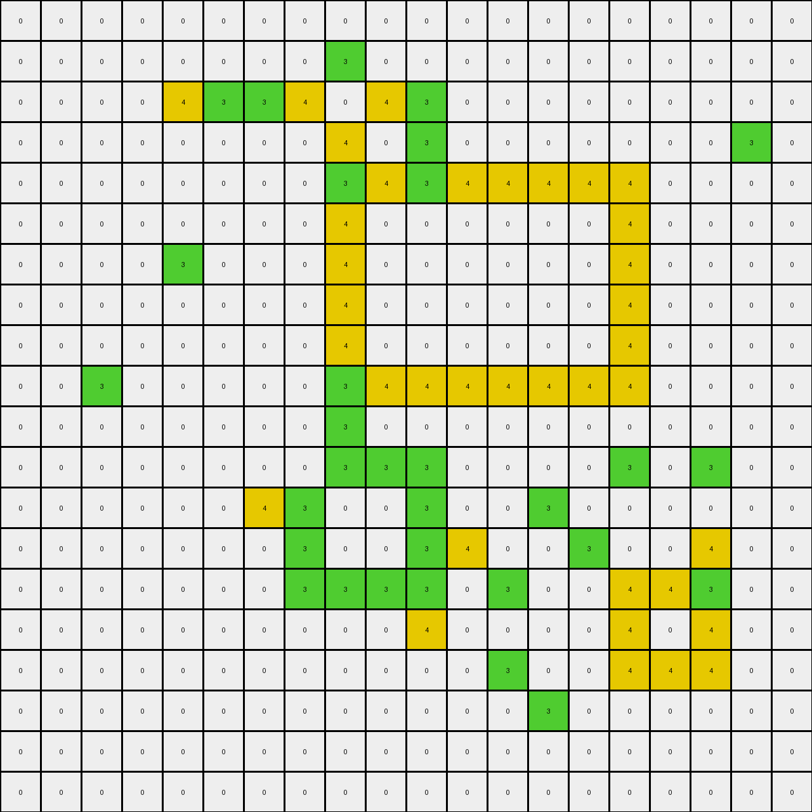

# 00d62c1b • 029 • refine_dreamer

---

Previous Code:
```python
"""
Identifies contiguous green areas. Within each area, the "interior" green pixels (those whose removal would not disconnect the area) are recolored to yellow.
"""

import numpy as np
from scipy.ndimage import label, generate_binary_structure

def get_contiguous_regions(grid, color):
    """
    Finds contiguous regions of a specific color in the grid.
    Returns a list of masks, one for each region.
    """
    color_mask = (grid == color)
    labeled_array, num_features = label(color_mask)
    regions = []
    for i in range(1, num_features + 1):  # Iterate through each labeled region
        regions.append(labeled_array == i)
    return regions

def is_interior(region_mask, row, col):
    """
    Checks if removing the pixel at (row, col) would disconnect the region.
    """
    # Create a copy of the mask and remove the pixel
    temp_mask = region_mask.copy()
    temp_mask[row, col] = False

    # Label the remaining pixels
    labeled_array, num_features = label(temp_mask)

    # If the number of features increased, it's an interior pixel
    return num_features == 1

def transform(input_grid):
    # initialize output_grid
    output_grid = np.copy(input_grid)
    rows, cols = input_grid.shape

    # Find all contiguous green regions
    green_regions = get_contiguous_regions(input_grid, 3)

    # change output pixels
    for region_mask in green_regions:
        for r in range(rows):
            for c in range(cols):
                if region_mask[r, c]:  # If it's part of the current green region
                    if is_interior(region_mask, r, c):
                        output_grid[r, c] = 4 # Change to yellow

    return output_grid
```

Train Set Results:

## Example 1:**

Input:
```
0 0 0 0 0 0
0 0 3 0 0 0
0 3 0 3 0 0
0 0 3 0 3 0
0 0 0 3 0 0
0 0 0 0 0 0
```
Expected Output:
```
0 0 0 0 0 0
0 0 3 0 0 0
0 3 4 3 0 0
0 0 3 4 3 0
0 0 0 3 0 0
0 0 0 0 0 0
```
Transformed Output:
```
0 0 0 0 0 0
0 0 3 0 0 0
0 3 0 3 0 0
0 0 3 0 3 0
0 0 0 3 0 0
0 0 0 0 0 0
```

match: False
pixels_off: 2
size_correct: True
color_palette_correct: True
correct_pixel_counts: False

## Example 2:**

Input:
```
0 0 0 0 0 0 0 0 0 0
0 0 3 0 3 0 0 0 0 0
0 0 0 3 0 3 0 0 0 0
0 0 3 0 0 0 3 0 0 0
0 0 0 0 0 3 0 3 0 0
0 0 0 3 0 3 3 0 0 0
0 0 3 3 3 0 0 0 0 0
0 0 0 3 0 0 0 0 0 0
0 0 0 0 0 0 0 0 0 0
0 0 0 0 0 0 0 0 0 0
```
Expected Output:
```
0 0 0 0 0 0 0 0 0 0
0 0 3 0 3 0 0 0 0 0
0 0 0 3 0 3 0 0 0 0
0 0 3 0 0 0 3 0 0 0
0 0 0 0 0 3 4 3 0 0
0 0 0 3 0 3 3 0 0 0
0 0 3 3 3 0 0 0 0 0
0 0 0 3 0 0 0 0 0 0
0 0 0 0 0 0 0 0 0 0
0 0 0 0 0 0 0 0 0 0
```
Transformed Output:
```
0 0 0 0 0 0 0 0 0 0
0 0 3 0 3 0 0 0 0 0
0 0 0 3 0 3 0 0 0 0
0 0 3 0 0 0 3 0 0 0
0 0 0 0 0 4 0 3 0 0
0 0 0 4 0 3 4 0 0 0
0 0 4 3 4 0 0 0 0 0
0 0 0 4 0 0 0 0 0 0
0 0 0 0 0 0 0 0 0 0
0 0 0 0 0 0 0 0 0 0
```

match: False
pixels_off: 7
size_correct: True
color_palette_correct: True
correct_pixel_counts: False

## Example 3:**

Input:
```
0 0 0 0 0 3 0 0 0 0
0 0 0 0 3 0 0 0 0 0
0 3 3 0 3 3 0 3 0 0
3 0 0 3 0 0 3 0 3 0
0 0 0 3 0 0 3 3 0 0
0 0 0 3 0 0 3 0 0 0
0 0 0 3 0 0 3 0 0 0
0 0 0 0 3 3 0 3 0 0
0 0 0 0 0 0 0 0 3 0
0 0 0 0 0 0 0 0 0 0
```
Expected Output:
```
0 0 0 0 0 3 0 0 0 0
0 0 0 0 3 0 0 0 0 0
0 3 3 0 3 3 0 3 0 0
3 0 0 3 4 4 3 4 3 0
0 0 0 3 4 4 3 3 0 0
0 0 0 3 4 4 3 0 0 0
0 0 0 3 4 4 3 0 0 0
0 0 0 0 3 3 0 3 0 0
0 0 0 0 0 0 0 0 3 0
0 0 0 0 0 0 0 0 0 0
```
Transformed Output:
```
0 0 0 0 0 3 0 0 0 0
0 0 0 0 4 0 0 0 0 0
0 4 4 0 3 4 0 3 0 0
3 0 0 4 0 0 4 0 3 0
0 0 0 3 0 0 3 4 0 0
0 0 0 3 0 0 3 0 0 0
0 0 0 4 0 0 4 0 0 0
0 0 0 0 4 4 0 3 0 0
0 0 0 0 0 0 0 0 3 0
0 0 0 0 0 0 0 0 0 0
```

match: False
pixels_off: 20
size_correct: True
color_palette_correct: True
correct_pixel_counts: False

## Example 4:**

Input:
```
0 0 0 0 0 0 0 0 0 0
0 0 3 3 3 3 0 0 0 0
0 0 3 0 0 3 0 0 0 0
0 0 3 0 0 3 0 3 0 0
0 0 3 3 3 3 3 3 3 0
0 0 0 3 0 0 0 0 3 0
0 0 0 3 0 0 0 3 3 0
0 0 0 3 3 0 0 3 0 3
0 0 0 3 0 3 0 0 3 0
0 0 0 0 3 0 0 0 0 0
```
Expected Output:
```
0 0 0 0 0 0 0 0 0 0
0 0 3 3 3 3 0 0 0 0
0 0 3 4 4 3 0 0 0 0
0 0 3 4 4 3 0 3 0 0
0 0 3 3 3 3 3 3 3 0
0 0 0 3 0 0 0 0 3 0
0 0 0 3 0 0 0 3 3 0
0 0 0 3 3 0 0 3 4 3
0 0 0 3 4 3 0 0 3 0
0 0 0 0 3 0 0 0 0 0
```
Transformed Output:
```
0 0 0 0 0 0 0 0 0 0
0 0 4 4 4 4 0 0 0 0
0 0 4 0 0 4 0 0 0 0
0 0 4 0 0 4 0 4 0 0
0 0 4 3 4 3 3 3 3 0
0 0 0 3 0 0 0 0 3 0
0 0 0 3 0 0 0 3 3 0
0 0 0 3 4 0 0 4 0 3
0 0 0 4 0 3 0 0 3 0
0 0 0 0 3 0 0 0 0 0
```

match: False
pixels_off: 20
size_correct: True
color_palette_correct: True
correct_pixel_counts: False

## Example 5:**

Input:
```
0 0 0 0 0 0 0 0 0 0 0 0 0 0 0 0 0 0 0 0
0 0 0 0 0 0 0 0 3 0 0 0 0 0 0 0 0 0 0 0
0 0 0 0 3 3 3 3 0 3 3 0 0 0 0 0 0 0 0 0
0 0 0 0 0 0 0 0 3 0 3 0 0 0 0 0 0 0 3 0
0 0 0 0 0 0 0 0 3 3 3 3 3 3 3 3 0 0 0 0
0 0 0 0 0 0 0 0 3 0 0 0 0 0 0 3 0 0 0 0
0 0 0 0 3 0 0 0 3 0 0 0 0 0 0 3 0 0 0 0
0 0 0 0 0 0 0 0 3 0 0 0 0 0 0 3 0 0 0 0
0 0 0 0 0 0 0 0 3 0 0 0 0 0 0 3 0 0 0 0
0 0 3 0 0 0 0 0 3 3 3 3 3 3 3 3 0 0 0 0
0 0 0 0 0 0 0 0 3 0 0 0 0 0 0 0 0 0 0 0
0 0 0 0 0 0 0 0 3 3 3 0 0 0 0 3 0 3 0 0
0 0 0 0 0 0 3 3 0 0 3 0 0 3 0 0 0 0 0 0
0 0 0 0 0 0 0 3 0 0 3 3 0 0 3 0 0 3 0 0
0 0 0 0 0 0 0 3 3 3 3 0 3 0 0 3 3 3 0 0
0 0 0 0 0 0 0 0 0 0 3 0 0 0 0 3 0 3 0 0
0 0 0 0 0 0 0 0 0 0 0 0 3 0 0 3 3 3 0 0
0 0 0 0 0 0 0 0 0 0 0 0 0 3 0 0 0 0 0 0
0 0 0 0 0 0 0 0 0 0 0 0 0 0 0 0 0 0 0 0
0 0 0 0 0 0 0 0 0 0 0 0 0 0 0 0 0 0 0 0
```
Expected Output:
```
0 0 0 0 0 0 0 0 0 0 0 0 0 0 0 0 0 0 0 0
0 0 0 0 0 0 0 0 3 0 0 0 0 0 0 0 0 0 0 0
0 0 0 0 3 3 3 3 4 3 3 0 0 0 0 0 0 0 0 0
0 0 0 0 0 0 0 0 3 4 3 0 0 0 0 0 0 0 3 0
0 0 0 0 0 0 0 0 3 3 3 3 3 3 3 3 0 0 0 0
0 0 0 0 0 0 0 0 3 4 4 4 4 4 4 3 0 0 0 0
0 0 0 0 3 0 0 0 3 4 4 4 4 4 4 3 0 0 0 0
0 0 0 0 0 0 0 0 3 4 4 4 4 4 4 3 0 0 0 0
0 0 0 0 0 0 0 0 3 4 4 4 4 4 4 3 0 0 0 0
0 0 3 0 0 0 0 0 3 3 3 3 3 3 3 3 0 0 0 0
0 0 0 0 0 0 0 0 3 0 0 0 0 0 0 0 0 0 0 0
0 0 0 0 0 0 0 0 3 3 3 0 0 0 0 3 0 3 0 0
0 0 0 0 0 0 3 3 4 4 3 0 0 3 0 0 0 0 0 0
0 0 0 0 0 0 0 3 4 4 3 3 0 0 3 0 0 3 0 0
0 0 0 0 0 0 0 3 3 3 3 0 3 0 0 3 3 3 0 0
0 0 0 0 0 0 0 0 0 0 3 0 0 0 0 3 4 3 0 0
0 0 0 0 0 0 0 0 0 0 0 0 3 0 0 3 3 3 0 0
0 0 0 0 0 0 0 0 0 0 0 0 0 3 0 0 0 0 0 0
0 0 0 0 0 0 0 0 0 0 0 0 0 0 0 0 0 0 0 0
0 0 0 0 0 0 0 0 0 0 0 0 0 0 0 0 0 0 0 0
```
Transformed Output:
```
0 0 0 0 0 0 0 0 0 0 0 0 0 0 0 0 0 0 0 0
0 0 0 0 0 0 0 0 3 0 0 0 0 0 0 0 0 0 0 0
0 0 0 0 4 3 3 4 0 4 3 0 0 0 0 0 0 0 0 0
0 0 0 0 0 0 0 0 4 0 3 0 0 0 0 0 0 0 3 0
0 0 0 0 0 0 0 0 3 4 3 4 4 4 4 4 0 0 0 0
0 0 0 0 0 0 0 0 4 0 0 0 0 0 0 4 0 0 0 0
0 0 0 0 3 0 0 0 4 0 0 0 0 0 0 4 0 0 0 0
0 0 0 0 0 0 0 0 4 0 0 0 0 0 0 4 0 0 0 0
0 0 0 0 0 0 0 0 4 0 0 0 0 0 0 4 0 0 0 0
0 0 3 0 0 0 0 0 3 4 4 4 4 4 4 4 0 0 0 0
0 0 0 0 0 0 0 0 3 0 0 0 0 0 0 0 0 0 0 0
0 0 0 0 0 0 0 0 3 3 3 0 0 0 0 3 0 3 0 0
0 0 0 0 0 0 4 3 0 0 3 0 0 3 0 0 0 0 0 0
0 0 0 0 0 0 0 3 0 0 3 4 0 0 3 0 0 4 0 0
0 0 0 0 0 0 0 3 3 3 3 0 3 0 0 4 4 3 0 0
0 0 0 0 0 0 0 0 0 0 4 0 0 0 0 4 0 4 0 0
0 0 0 0 0 0 0 0 0 0 0 0 3 0 0 4 4 4 0 0
0 0 0 0 0 0 0 0 0 0 0 0 0 3 0 0 0 0 0 0
0 0 0 0 0 0 0 0 0 0 0 0 0 0 0 0 0 0 0 0
0 0 0 0 0 0 0 0 0 0 0 0 0 0 0 0 0 0 0 0
```

match: False
pixels_off: 67
size_correct: True
color_palette_correct: True
correct_pixel_counts: False
**INSTRUCTIONS**

The code above was generated based on observations from the first training
example

we have tested the transform function on each of the task example inputs and
compared with the expected output

review each of the examples provided and the results and consider how the
natural language program should be updated to accommodate this new knowledge

respond with the following deliverables:

- general assessment of the information provided and strategy for resolving the
  errors
- gather metrics about each of the examples and results - use code_execution to
  develop accurate reports on your assumptions
- a YAML block documenting facts - Focus on identifying objects, their properties, and the actions performed on them.
- a natural language program - Be as clear and concise as possible, providing a complete description of the transformation rule.


your responses should be considered as information in a report - not a
conversation
