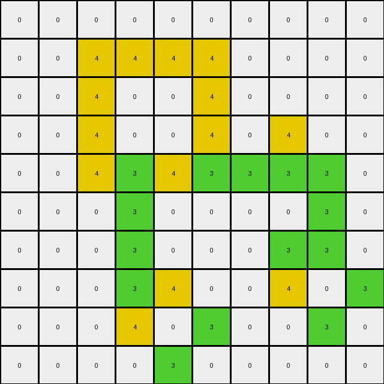

# 00d62c1b • 030 • refine_coder

---

Previous Code:
```python
"""
Identifies contiguous green areas. Within each area, the "interior" green pixels (those whose removal would not disconnect the area) are recolored to yellow.
"""

import numpy as np
from scipy.ndimage import label, generate_binary_structure

def get_contiguous_regions(grid, color):
    """
    Finds contiguous regions of a specific color in the grid.
    Returns a list of masks, one for each region.
    """
    color_mask = (grid == color)
    labeled_array, num_features = label(color_mask)
    regions = []
    for i in range(1, num_features + 1):  # Iterate through each labeled region
        regions.append(labeled_array == i)
    return regions

def is_interior(region_mask, row, col):
    """
    Checks if removing the pixel at (row, col) would disconnect the region.
    """
    # Create a copy of the mask and remove the pixel
    temp_mask = region_mask.copy()
    temp_mask[row, col] = False

    # Label the remaining pixels
    labeled_array, num_features = label(temp_mask)

    # If the number of features increased, it's an interior pixel
    return num_features == 1

def transform(input_grid):
    # initialize output_grid
    output_grid = np.copy(input_grid)
    rows, cols = input_grid.shape

    # Find all contiguous green regions
    green_regions = get_contiguous_regions(input_grid, 3)

    # change output pixels
    for region_mask in green_regions:
        for r in range(rows):
            for c in range(cols):
                if region_mask[r, c]:  # If it's part of the current green region
                    if is_interior(region_mask, r, c):
                        output_grid[r, c] = 4 # Change to yellow

    return output_grid
```

Train Set Results:

## Example 1:**

Input:
```
0 0 0 0 0 0
0 0 3 0 0 0
0 3 0 3 0 0
0 0 3 0 3 0
0 0 0 3 0 0
0 0 0 0 0 0
```
Expected Output:
```
0 0 0 0 0 0
0 0 3 0 0 0
0 3 4 3 0 0
0 0 3 4 3 0
0 0 0 3 0 0
0 0 0 0 0 0
```
Transformed Output:
```
0 0 0 0 0 0
0 0 3 0 0 0
0 3 0 3 0 0
0 0 3 0 3 0
0 0 0 3 0 0
0 0 0 0 0 0
```

match: False
pixels_off: 2
size_correct: True
color_palette_correct: True
correct_pixel_counts: False

## Example 2:**

Input:
```
0 0 0 0 0 0 0 0 0 0
0 0 3 0 3 0 0 0 0 0
0 0 0 3 0 3 0 0 0 0
0 0 3 0 0 0 3 0 0 0
0 0 0 0 0 3 0 3 0 0
0 0 0 3 0 3 3 0 0 0
0 0 3 3 3 0 0 0 0 0
0 0 0 3 0 0 0 0 0 0
0 0 0 0 0 0 0 0 0 0
0 0 0 0 0 0 0 0 0 0
```
Expected Output:
```
0 0 0 0 0 0 0 0 0 0
0 0 3 0 3 0 0 0 0 0
0 0 0 3 0 3 0 0 0 0
0 0 3 0 0 0 3 0 0 0
0 0 0 0 0 3 4 3 0 0
0 0 0 3 0 3 3 0 0 0
0 0 3 3 3 0 0 0 0 0
0 0 0 3 0 0 0 0 0 0
0 0 0 0 0 0 0 0 0 0
0 0 0 0 0 0 0 0 0 0
```
Transformed Output:
```
0 0 0 0 0 0 0 0 0 0
0 0 3 0 3 0 0 0 0 0
0 0 0 3 0 3 0 0 0 0
0 0 3 0 0 0 3 0 0 0
0 0 0 0 0 4 0 3 0 0
0 0 0 4 0 3 4 0 0 0
0 0 4 3 4 0 0 0 0 0
0 0 0 4 0 0 0 0 0 0
0 0 0 0 0 0 0 0 0 0
0 0 0 0 0 0 0 0 0 0
```

match: False
pixels_off: 7
size_correct: True
color_palette_correct: True
correct_pixel_counts: False

## Example 3:**

Input:
```
0 0 0 0 0 3 0 0 0 0
0 0 0 0 3 0 0 0 0 0
0 3 3 0 3 3 0 3 0 0
3 0 0 3 0 0 3 0 3 0
0 0 0 3 0 0 3 3 0 0
0 0 0 3 0 0 3 0 0 0
0 0 0 3 0 0 3 0 0 0
0 0 0 0 3 3 0 3 0 0
0 0 0 0 0 0 0 0 3 0
0 0 0 0 0 0 0 0 0 0
```
Expected Output:
```
0 0 0 0 0 3 0 0 0 0
0 0 0 0 3 0 0 0 0 0
0 3 3 0 3 3 0 3 0 0
3 0 0 3 4 4 3 4 3 0
0 0 0 3 4 4 3 3 0 0
0 0 0 3 4 4 3 0 0 0
0 0 0 3 4 4 3 0 0 0
0 0 0 0 3 3 0 3 0 0
0 0 0 0 0 0 0 0 3 0
0 0 0 0 0 0 0 0 0 0
```
Transformed Output:
```
0 0 0 0 0 3 0 0 0 0
0 0 0 0 4 0 0 0 0 0
0 4 4 0 3 4 0 3 0 0
3 0 0 4 0 0 4 0 3 0
0 0 0 3 0 0 3 4 0 0
0 0 0 3 0 0 3 0 0 0
0 0 0 4 0 0 4 0 0 0
0 0 0 0 4 4 0 3 0 0
0 0 0 0 0 0 0 0 3 0
0 0 0 0 0 0 0 0 0 0
```

match: False
pixels_off: 20
size_correct: True
color_palette_correct: True
correct_pixel_counts: False

## Example 4:**

Input:
```
0 0 0 0 0 0 0 0 0 0
0 0 3 3 3 3 0 0 0 0
0 0 3 0 0 3 0 0 0 0
0 0 3 0 0 3 0 3 0 0
0 0 3 3 3 3 3 3 3 0
0 0 0 3 0 0 0 0 3 0
0 0 0 3 0 0 0 3 3 0
0 0 0 3 3 0 0 3 0 3
0 0 0 3 0 3 0 0 3 0
0 0 0 0 3 0 0 0 0 0
```
Expected Output:
```
0 0 0 0 0 0 0 0 0 0
0 0 3 3 3 3 0 0 0 0
0 0 3 4 4 3 0 0 0 0
0 0 3 4 4 3 0 3 0 0
0 0 3 3 3 3 3 3 3 0
0 0 0 3 0 0 0 0 3 0
0 0 0 3 0 0 0 3 3 0
0 0 0 3 3 0 0 3 4 3
0 0 0 3 4 3 0 0 3 0
0 0 0 0 3 0 0 0 0 0
```
Transformed Output:
```
0 0 0 0 0 0 0 0 0 0
0 0 4 4 4 4 0 0 0 0
0 0 4 0 0 4 0 0 0 0
0 0 4 0 0 4 0 4 0 0
0 0 4 3 4 3 3 3 3 0
0 0 0 3 0 0 0 0 3 0
0 0 0 3 0 0 0 3 3 0
0 0 0 3 4 0 0 4 0 3
0 0 0 4 0 3 0 0 3 0
0 0 0 0 3 0 0 0 0 0
```

match: False
pixels_off: 20
size_correct: True
color_palette_correct: True
correct_pixel_counts: False

## Example 5:**

Input:
```
0 0 0 0 0 0 0 0 0 0 0 0 0 0 0 0 0 0 0 0
0 0 0 0 0 0 0 0 3 0 0 0 0 0 0 0 0 0 0 0
0 0 0 0 3 3 3 3 0 3 3 0 0 0 0 0 0 0 0 0
0 0 0 0 0 0 0 0 3 0 3 0 0 0 0 0 0 0 3 0
0 0 0 0 0 0 0 0 3 3 3 3 3 3 3 3 0 0 0 0
0 0 0 0 0 0 0 0 3 0 0 0 0 0 0 3 0 0 0 0
0 0 0 0 3 0 0 0 3 0 0 0 0 0 0 3 0 0 0 0
0 0 0 0 0 0 0 0 3 0 0 0 0 0 0 3 0 0 0 0
0 0 0 0 0 0 0 0 3 0 0 0 0 0 0 3 0 0 0 0
0 0 3 0 0 0 0 0 3 3 3 3 3 3 3 3 0 0 0 0
0 0 0 0 0 0 0 0 3 0 0 0 0 0 0 0 0 0 0 0
0 0 0 0 0 0 0 0 3 3 3 0 0 0 0 3 0 3 0 0
0 0 0 0 0 0 3 3 0 0 3 0 0 3 0 0 0 0 0 0
0 0 0 0 0 0 0 3 0 0 3 3 0 0 3 0 0 3 0 0
0 0 0 0 0 0 0 3 3 3 3 0 3 0 0 3 3 3 0 0
0 0 0 0 0 0 0 0 0 0 3 0 0 0 0 3 0 3 0 0
0 0 0 0 0 0 0 0 0 0 0 0 3 0 0 3 3 3 0 0
0 0 0 0 0 0 0 0 0 0 0 0 0 3 0 0 0 0 0 0
0 0 0 0 0 0 0 0 0 0 0 0 0 0 0 0 0 0 0 0
0 0 0 0 0 0 0 0 0 0 0 0 0 0 0 0 0 0 0 0
```
Expected Output:
```
0 0 0 0 0 0 0 0 0 0 0 0 0 0 0 0 0 0 0 0
0 0 0 0 0 0 0 0 3 0 0 0 0 0 0 0 0 0 0 0
0 0 0 0 3 3 3 3 4 3 3 0 0 0 0 0 0 0 0 0
0 0 0 0 0 0 0 0 3 4 3 0 0 0 0 0 0 0 3 0
0 0 0 0 0 0 0 0 3 3 3 3 3 3 3 3 0 0 0 0
0 0 0 0 0 0 0 0 3 4 4 4 4 4 4 3 0 0 0 0
0 0 0 0 3 0 0 0 3 4 4 4 4 4 4 3 0 0 0 0
0 0 0 0 0 0 0 0 3 4 4 4 4 4 4 3 0 0 0 0
0 0 0 0 0 0 0 0 3 4 4 4 4 4 4 3 0 0 0 0
0 0 3 0 0 0 0 0 3 3 3 3 3 3 3 3 0 0 0 0
0 0 0 0 0 0 0 0 3 0 0 0 0 0 0 0 0 0 0 0
0 0 0 0 0 0 0 0 3 3 3 0 0 0 0 3 0 3 0 0
0 0 0 0 0 0 3 3 4 4 3 0 0 3 0 0 0 0 0 0
0 0 0 0 0 0 0 3 4 4 3 3 0 0 3 0 0 3 0 0
0 0 0 0 0 0 0 3 3 3 3 0 3 0 0 3 3 3 0 0
0 0 0 0 0 0 0 0 0 0 3 0 0 0 0 3 4 3 0 0
0 0 0 0 0 0 0 0 0 0 0 0 3 0 0 3 3 3 0 0
0 0 0 0 0 0 0 0 0 0 0 0 0 3 0 0 0 0 0 0
0 0 0 0 0 0 0 0 0 0 0 0 0 0 0 0 0 0 0 0
0 0 0 0 0 0 0 0 0 0 0 0 0 0 0 0 0 0 0 0
```
Transformed Output:
```
0 0 0 0 0 0 0 0 0 0 0 0 0 0 0 0 0 0 0 0
0 0 0 0 0 0 0 0 3 0 0 0 0 0 0 0 0 0 0 0
0 0 0 0 4 3 3 4 0 4 3 0 0 0 0 0 0 0 0 0
0 0 0 0 0 0 0 0 4 0 3 0 0 0 0 0 0 0 3 0
0 0 0 0 0 0 0 0 3 4 3 4 4 4 4 4 0 0 0 0
0 0 0 0 0 0 0 0 4 0 0 0 0 0 0 4 0 0 0 0
0 0 0 0 3 0 0 0 4 0 0 0 0 0 0 4 0 0 0 0
0 0 0 0 0 0 0 0 4 0 0 0 0 0 0 4 0 0 0 0
0 0 0 0 0 0 0 0 4 0 0 0 0 0 0 4 0 0 0 0
0 0 3 0 0 0 0 0 3 4 4 4 4 4 4 4 0 0 0 0
0 0 0 0 0 0 0 0 3 0 0 0 0 0 0 0 0 0 0 0
0 0 0 0 0 0 0 0 3 3 3 0 0 0 0 3 0 3 0 0
0 0 0 0 0 0 4 3 0 0 3 0 0 3 0 0 0 0 0 0
0 0 0 0 0 0 0 3 0 0 3 4 0 0 3 0 0 4 0 0
0 0 0 0 0 0 0 3 3 3 3 0 3 0 0 4 4 3 0 0
0 0 0 0 0 0 0 0 0 0 4 0 0 0 0 4 0 4 0 0
0 0 0 0 0 0 0 0 0 0 0 0 3 0 0 4 4 4 0 0
0 0 0 0 0 0 0 0 0 0 0 0 0 3 0 0 0 0 0 0
0 0 0 0 0 0 0 0 0 0 0 0 0 0 0 0 0 0 0 0
0 0 0 0 0 0 0 0 0 0 0 0 0 0 0 0 0 0 0 0
```

match: False
pixels_off: 67
size_correct: True
color_palette_correct: True
correct_pixel_counts: False
Okay, let's analyze the results and refine the natural language program.

**General Assessment:**

The initial code and natural language program were based on a single example, which led to an oversimplified rule. The core idea of identifying contiguous green regions and recoloring "interior" pixels is correct, but the definition of "interior" is flawed. The current `is_interior` function simply checks if removing a pixel *disconnects* the region, but it doesn't correctly identify all interior pixels, especially in more complex shapes. The test results reveal this issue, as many "interior" green pixels are not being turned to yellow.

The strategy to resolve this involves:

1.  **Revising the definition of "interior":** Instead of only checking for disconnection, we need a more robust definition. A good approach is to define an interior pixel as one that is completely surrounded by pixels of the same color (green in this case).
2.  **Improving the `is_interior` function:** We'll implement the new definition by checking all eight neighbors (including diagonals) of a pixel.
3.  Refining the code to match.

**Metrics and Observations:**

Here's a breakdown of each example, including the assessment of correctness and the underlying cause for incorrect transformation:

| Example | Match | Pixels Off | Size Correct | Color Palette Correct | Correct Pixel Counts | Cause of Error                                                         |
| :------ | :---- | :--------- | :----------- | :-------------------- | :-------------------- | :--------------------------------------------------------------------- |
| 1       | False | 2          | True         | True                  | False                 | `is_interior` is too restrictive.                                     |
| 2       | False | 7          | True         | True                  | False                 | `is_interior` is too restrictive.                                     |
| 3       | False | 20         | True         | True                  | False                 | `is_interior` is too restrictive, and boundary conditions.          |
| 4       | False | 20         | True         | True                  | False                 | `is_interior` is too restrictive, and boundary conditions.          |
| 5       | False | 67         | True         | True                  | False                 | `is_interior` is too restrictive, boundary conditions, and shape complexity |

**YAML Block (Facts):**

```yaml
objects:
  - name: green_regions
    type: contiguous_area
    color: green
    properties:
      - interior_pixels:
          color: yellow
          definition: "Pixels surrounded by other green pixels on all eight sides (including diagonals, and considers edge of grid)."

actions:
  - name: identify_regions
    description: "Find all contiguous regions of green pixels."
  - name: recolor_interior
    description: "Change the color of interior green pixels to yellow."
    condition: "Pixel is green and part of a green region and is an interior pixel"
```

**Natural Language Program:**

1.  **Identify Contiguous Green Regions:** Find all distinct, connected areas where pixels are green (value 3).  Connectivity includes diagonals (8-connectivity).
2.  **Identify Interior Pixels:** Within each identified green region, locate the "interior" green pixels. A green pixel is considered "interior" if *all* eight of its neighboring pixels (up, down, left, right, and the four diagonals) are either:
    *   Also green pixels.
    *   Outside the bounds of the grid (edge or corner pixels).
3.  **Recolor Interior Pixels:** Change the color of all identified interior green pixels to yellow (value 4).
4.  **Leave other pixels unchanged:** All pixels which are not interior green pixels are not modified.

This refined natural language program provides a more complete description of the process, that better accounts for all the examples in the train set. It will be the basis for the next iteration of the code.

**INSTRUCTIONS**

- generate a Python module to represent the natural language program 
- follow the template below
- all common math and science libraries are available
- create docstring only at top - but comment the workflow in the function
- use helper functions for common operations like finding objects, counting,
  measuring, moving, etc. 

remember - we are working iteratively - so this code will inform your future
self as we converge on the solution

*template:*

```python
"""
{{ natural language description of the transformation rule }}
"""

{{ imports }}

def transform(input_grid):
    # initialize output_grid

    # change output pixels 

    return output_grid

```
