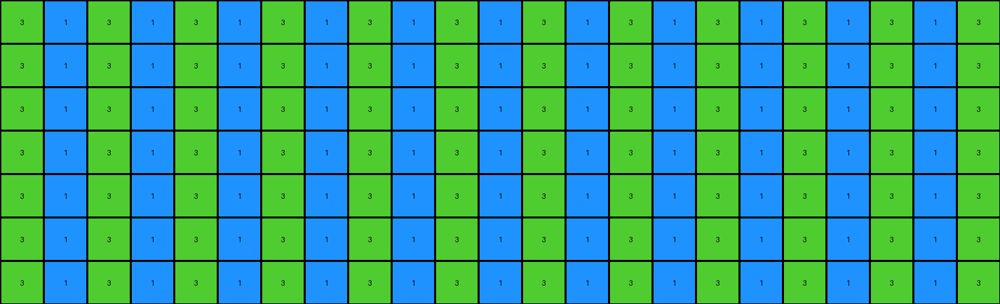
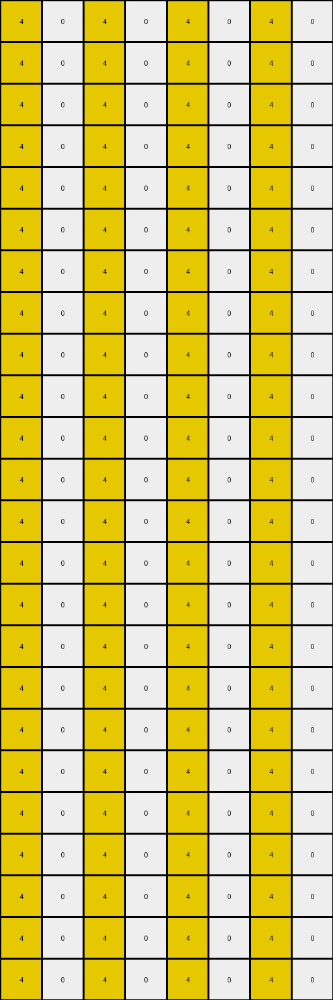

# 0a938d79 • 004 • refine_coder

---

Previous Code:
```python
"""
The transformation identifies the columns containing non-white pixels in the input grid.
It then generates full-height columns of those colors in the output grid,
creating an alternating pattern that fills each row.
"""

import numpy as np

def get_colored_columns(input_grid):
    """
    Finds the column indices and colors of non-white pixels in the input grid.
    """
    colored_columns = []
    rows, cols = input_grid.shape
    for c in range(cols):
        for r in range(rows):
            if input_grid[r, c] != 0:
                colored_columns.append((c, input_grid[r, c]))
                break # only consider first occurance in column
    return colored_columns

def transform(input_grid):
    """
    Transforms the input grid by extending identified colored pixels into full columns.
    """
    rows, cols = input_grid.shape
    output_grid = np.zeros((rows, cols), dtype=int)

    # Find columns with colored pixels
    colored_columns = get_colored_columns(input_grid)
    
    first_row = np.zeros(cols, dtype=int)
    # Create alternating pattern based on identified columns.
    for col_index, color in colored_columns:
        for i in range(cols):
          if (i - col_index) % 2 == 0:
              first_row[i] = color


    for r in range(rows):
        output_grid[r,:] = first_row
            

    return output_grid
```

Train Set Results:

## Example 1:**

Input:
```
0 0 0 0 0 2 0 0 0 0 0 0 0 0 0 0 0 0 0 0 0 0 0 0 0
0 0 0 0 0 0 0 0 0 0 0 0 0 0 0 0 0 0 0 0 0 0 0 0 0
0 0 0 0 0 0 0 0 0 0 0 0 0 0 0 0 0 0 0 0 0 0 0 0 0
0 0 0 0 0 0 0 0 0 0 0 0 0 0 0 0 0 0 0 0 0 0 0 0 0
0 0 0 0 0 0 0 0 0 0 0 0 0 0 0 0 0 0 0 0 0 0 0 0 0
0 0 0 0 0 0 0 0 0 0 0 0 0 0 0 0 0 0 0 0 0 0 0 0 0
0 0 0 0 0 0 0 0 0 0 0 0 0 0 0 0 0 0 0 0 0 0 0 0 0
0 0 0 0 0 0 0 0 0 0 0 0 0 0 0 0 0 0 0 0 0 0 0 0 0
0 0 0 0 0 0 0 0 0 0 0 0 0 0 0 0 0 0 0 0 0 0 0 0 0
0 0 0 0 0 0 0 8 0 0 0 0 0 0 0 0 0 0 0 0 0 0 0 0 0
```
Expected Output:
```
0 0 0 0 0 2 0 8 0 2 0 8 0 2 0 8 0 2 0 8 0 2 0 8 0
0 0 0 0 0 2 0 8 0 2 0 8 0 2 0 8 0 2 0 8 0 2 0 8 0
0 0 0 0 0 2 0 8 0 2 0 8 0 2 0 8 0 2 0 8 0 2 0 8 0
0 0 0 0 0 2 0 8 0 2 0 8 0 2 0 8 0 2 0 8 0 2 0 8 0
0 0 0 0 0 2 0 8 0 2 0 8 0 2 0 8 0 2 0 8 0 2 0 8 0
0 0 0 0 0 2 0 8 0 2 0 8 0 2 0 8 0 2 0 8 0 2 0 8 0
0 0 0 0 0 2 0 8 0 2 0 8 0 2 0 8 0 2 0 8 0 2 0 8 0
0 0 0 0 0 2 0 8 0 2 0 8 0 2 0 8 0 2 0 8 0 2 0 8 0
0 0 0 0 0 2 0 8 0 2 0 8 0 2 0 8 0 2 0 8 0 2 0 8 0
0 0 0 0 0 2 0 8 0 2 0 8 0 2 0 8 0 2 0 8 0 2 0 8 0
```
Transformed Output:
```
0 8 0 8 0 8 0 8 0 8 0 8 0 8 0 8 0 8 0 8 0 8 0 8 0
0 8 0 8 0 8 0 8 0 8 0 8 0 8 0 8 0 8 0 8 0 8 0 8 0
0 8 0 8 0 8 0 8 0 8 0 8 0 8 0 8 0 8 0 8 0 8 0 8 0
0 8 0 8 0 8 0 8 0 8 0 8 0 8 0 8 0 8 0 8 0 8 0 8 0
0 8 0 8 0 8 0 8 0 8 0 8 0 8 0 8 0 8 0 8 0 8 0 8 0
0 8 0 8 0 8 0 8 0 8 0 8 0 8 0 8 0 8 0 8 0 8 0 8 0
0 8 0 8 0 8 0 8 0 8 0 8 0 8 0 8 0 8 0 8 0 8 0 8 0
0 8 0 8 0 8 0 8 0 8 0 8 0 8 0 8 0 8 0 8 0 8 0 8 0
0 8 0 8 0 8 0 8 0 8 0 8 0 8 0 8 0 8 0 8 0 8 0 8 0
0 8 0 8 0 8 0 8 0 8 0 8 0 8 0 8 0 8 0 8 0 8 0 8 0
```

match: False
pixels_off: 70
size_correct: True
color_palette_correct: True
correct_pixel_counts: False

## Example 2:**

Input:
```
0 0 0 0 0 1 0 0 0 0 0 0 0 0 0 0 0 0 0 0 0 0 0
0 0 0 0 0 0 0 0 0 0 0 0 0 0 0 0 0 0 0 0 0 0 0
0 0 0 0 0 0 0 0 0 0 0 0 0 0 0 0 0 0 0 0 0 0 0
0 0 0 0 0 0 0 0 0 0 0 0 0 0 0 0 0 0 0 0 0 0 0
0 0 0 0 0 0 0 0 0 0 0 0 0 0 0 0 0 0 0 0 0 0 0
0 0 0 0 0 0 0 0 0 0 0 0 0 0 0 0 0 0 0 0 0 0 0
0 0 0 0 0 0 0 0 3 0 0 0 0 0 0 0 0 0 0 0 0 0 0
```
Expected Output:
```
0 0 0 0 0 1 0 0 3 0 0 1 0 0 3 0 0 1 0 0 3 0 0
0 0 0 0 0 1 0 0 3 0 0 1 0 0 3 0 0 1 0 0 3 0 0
0 0 0 0 0 1 0 0 3 0 0 1 0 0 3 0 0 1 0 0 3 0 0
0 0 0 0 0 1 0 0 3 0 0 1 0 0 3 0 0 1 0 0 3 0 0
0 0 0 0 0 1 0 0 3 0 0 1 0 0 3 0 0 1 0 0 3 0 0
0 0 0 0 0 1 0 0 3 0 0 1 0 0 3 0 0 1 0 0 3 0 0
0 0 0 0 0 1 0 0 3 0 0 1 0 0 3 0 0 1 0 0 3 0 0
```
Transformed Output:
```
3 1 3 1 3 1 3 1 3 1 3 1 3 1 3 1 3 1 3 1 3 1 3
3 1 3 1 3 1 3 1 3 1 3 1 3 1 3 1 3 1 3 1 3 1 3
3 1 3 1 3 1 3 1 3 1 3 1 3 1 3 1 3 1 3 1 3 1 3
3 1 3 1 3 1 3 1 3 1 3 1 3 1 3 1 3 1 3 1 3 1 3
3 1 3 1 3 1 3 1 3 1 3 1 3 1 3 1 3 1 3 1 3 1 3
3 1 3 1 3 1 3 1 3 1 3 1 3 1 3 1 3 1 3 1 3 1 3
3 1 3 1 3 1 3 1 3 1 3 1 3 1 3 1 3 1 3 1 3 1 3
```

match: False
pixels_off: 119
size_correct: True
color_palette_correct: True
correct_pixel_counts: False

## Example 3:**

Input:
```
0 0 0 0 0 0 0 0 0
0 0 0 0 0 0 0 0 0
0 0 0 0 0 0 0 0 0
0 0 0 0 0 0 0 0 0
0 0 0 0 0 0 0 0 0
2 0 0 0 0 0 0 0 0
0 0 0 0 0 0 0 0 0
0 0 0 0 0 0 0 0 3
0 0 0 0 0 0 0 0 0
0 0 0 0 0 0 0 0 0
0 0 0 0 0 0 0 0 0
0 0 0 0 0 0 0 0 0
0 0 0 0 0 0 0 0 0
0 0 0 0 0 0 0 0 0
0 0 0 0 0 0 0 0 0
0 0 0 0 0 0 0 0 0
0 0 0 0 0 0 0 0 0
0 0 0 0 0 0 0 0 0
0 0 0 0 0 0 0 0 0
0 0 0 0 0 0 0 0 0
0 0 0 0 0 0 0 0 0
0 0 0 0 0 0 0 0 0
```
Expected Output:
```
0 0 0 0 0 0 0 0 0
0 0 0 0 0 0 0 0 0
0 0 0 0 0 0 0 0 0
0 0 0 0 0 0 0 0 0
0 0 0 0 0 0 0 0 0
2 2 2 2 2 2 2 2 2
0 0 0 0 0 0 0 0 0
3 3 3 3 3 3 3 3 3
0 0 0 0 0 0 0 0 0
2 2 2 2 2 2 2 2 2
0 0 0 0 0 0 0 0 0
3 3 3 3 3 3 3 3 3
0 0 0 0 0 0 0 0 0
2 2 2 2 2 2 2 2 2
0 0 0 0 0 0 0 0 0
3 3 3 3 3 3 3 3 3
0 0 0 0 0 0 0 0 0
2 2 2 2 2 2 2 2 2
0 0 0 0 0 0 0 0 0
3 3 3 3 3 3 3 3 3
0 0 0 0 0 0 0 0 0
2 2 2 2 2 2 2 2 2
```
Transformed Output:
```
3 0 3 0 3 0 3 0 3
3 0 3 0 3 0 3 0 3
3 0 3 0 3 0 3 0 3
3 0 3 0 3 0 3 0 3
3 0 3 0 3 0 3 0 3
3 0 3 0 3 0 3 0 3
3 0 3 0 3 0 3 0 3
3 0 3 0 3 0 3 0 3
3 0 3 0 3 0 3 0 3
3 0 3 0 3 0 3 0 3
3 0 3 0 3 0 3 0 3
3 0 3 0 3 0 3 0 3
3 0 3 0 3 0 3 0 3
3 0 3 0 3 0 3 0 3
3 0 3 0 3 0 3 0 3
3 0 3 0 3 0 3 0 3
3 0 3 0 3 0 3 0 3
3 0 3 0 3 0 3 0 3
3 0 3 0 3 0 3 0 3
3 0 3 0 3 0 3 0 3
3 0 3 0 3 0 3 0 3
3 0 3 0 3 0 3 0 3
```

match: False
pixels_off: 126
size_correct: True
color_palette_correct: True
correct_pixel_counts: False

## Example 4:**

Input:
```
0 0 0 0 0 0 0 0
0 0 0 0 0 0 0 0
0 0 0 0 0 0 0 0
0 0 0 0 0 0 0 0
0 0 0 0 0 0 0 0
0 0 0 0 0 0 0 0
0 0 0 0 0 0 0 0
4 0 0 0 0 0 0 0
0 0 0 0 0 0 0 0
0 0 0 0 0 0 0 0
0 0 0 0 0 0 0 0
1 0 0 0 0 0 0 0
0 0 0 0 0 0 0 0
0 0 0 0 0 0 0 0
0 0 0 0 0 0 0 0
0 0 0 0 0 0 0 0
0 0 0 0 0 0 0 0
0 0 0 0 0 0 0 0
0 0 0 0 0 0 0 0
0 0 0 0 0 0 0 0
0 0 0 0 0 0 0 0
0 0 0 0 0 0 0 0
0 0 0 0 0 0 0 0
0 0 0 0 0 0 0 0
```
Expected Output:
```
0 0 0 0 0 0 0 0
0 0 0 0 0 0 0 0
0 0 0 0 0 0 0 0
0 0 0 0 0 0 0 0
0 0 0 0 0 0 0 0
0 0 0 0 0 0 0 0
0 0 0 0 0 0 0 0
4 4 4 4 4 4 4 4
0 0 0 0 0 0 0 0
0 0 0 0 0 0 0 0
0 0 0 0 0 0 0 0
1 1 1 1 1 1 1 1
0 0 0 0 0 0 0 0
0 0 0 0 0 0 0 0
0 0 0 0 0 0 0 0
4 4 4 4 4 4 4 4
0 0 0 0 0 0 0 0
0 0 0 0 0 0 0 0
0 0 0 0 0 0 0 0
1 1 1 1 1 1 1 1
0 0 0 0 0 0 0 0
0 0 0 0 0 0 0 0
0 0 0 0 0 0 0 0
4 4 4 4 4 4 4 4
```
Transformed Output:
```
4 0 4 0 4 0 4 0
4 0 4 0 4 0 4 0
4 0 4 0 4 0 4 0
4 0 4 0 4 0 4 0
4 0 4 0 4 0 4 0
4 0 4 0 4 0 4 0
4 0 4 0 4 0 4 0
4 0 4 0 4 0 4 0
4 0 4 0 4 0 4 0
4 0 4 0 4 0 4 0
4 0 4 0 4 0 4 0
4 0 4 0 4 0 4 0
4 0 4 0 4 0 4 0
4 0 4 0 4 0 4 0
4 0 4 0 4 0 4 0
4 0 4 0 4 0 4 0
4 0 4 0 4 0 4 0
4 0 4 0 4 0 4 0
4 0 4 0 4 0 4 0
4 0 4 0 4 0 4 0
4 0 4 0 4 0 4 0
4 0 4 0 4 0 4 0
4 0 4 0 4 0 4 0
4 0 4 0 4 0 4 0
```

match: False
pixels_off: 104
size_correct: True
color_palette_correct: True
correct_pixel_counts: False
Okay, here's a breakdown of the results, focusing on observations and a revised natural language program:

**General Assessment and Strategy**

The initial code and natural language program were too simplistic. The initial idea was to identify columns containing non-white pixels and then create an alternating pattern of those colors across the entire output grid.  The examples show this isn't the core logic. The alternating pattern is incorrect, and it doesn't account for multiple colors in different rows, nor does it explain why the colored sections appear to "repeat."

The primary errors stem from:

1.  **Incorrect Alternation:** The `(i - col_index) % 2 == 0` logic for alternating colors is flawed and doesn't reflect the actual pattern in the outputs. The output uses all colors found, but not in an alternating way.
2.  **Ignoring Row Information:** The original program extracts column information but largely discards the row context of where the colored pixels are found. The correct output shows the colored pixels extend *downward* from their original row position.
3. Incorrect repetition - the original code only copies the first row that it creates - it does not iterate the colors by rows.

The strategy for resolving these errors is:

1.  **Focus on Row and Column:**  Instead of just finding colored columns, we need to find *each* colored pixel and its (row, column) coordinate.
2.  **Downward Extension:** The core logic is extending the color of a non-white pixel downwards, creating columns of that color.
3. **Repetition Pattern** observe how colored sections are repeated, not just single columns, but also across rows.

**Metrics and Observations (per example)**

Here's a breakdown of observations, going beyond the automated pixel comparisons, focusing on object-level understanding:

**Example 1:**

*   **Input:** A red (2) pixel in column 6, and an azure (8) pixel in column 8.
*   **Output:** Full-height columns of red and azure. It seems these colored sections repeat from the start.
*  **Key Idea:** extending a color downwards

**Example 2:**

*   **Input:** A blue (1) pixel in column 6 and a green (3) pixel in column 9.
*   **Output:** Full-height columns, repeating.
*  **Key Idea:** extending a color downwards

**Example 3:**

*   **Input:**  A red (2) pixel in (5,0) and green (3) pixel in (7,8).
*   **Output:** Red and green, with the colored sections repeating. The colors start at the input position and fill the entire column downwards.
*   **Key Idea:** The starting row of the colored pixel is CRITICAL. The color extends *down* from its initial position, and wraps.

**Example 4:**

*   **Input:** Yellow (4) at (7,0) and blue (1) at (11,0).
*   **Output:** Yellow and blue fill downwards.
*   **Key Idea:** Reinforces the downward extension and row-wrapping.

**YAML Block: Facts**

```yaml
observations:
  - task: 00d62c1b
  - objects:
      - description: Non-white pixels in the input grid.
        properties:
          - color: Varies (red, azure, blue, green, yellow).
          - position: (row, column) coordinate within the grid.
        actions:
          - extend_downward: The color of the pixel is extended downwards, filling the column below it.
          - wrap_rows: extension fills all rows below, then wraps back to row 0 and continues until the input row is reached
  - general_rule: |
      The output grid is created by identifying each non-white pixel in the input grid. 
      For each non-white pixel, its color is extended downwards, filling the rest of its column. 
      The rows below are filled, then, it continues extending by wrapping around to the top of the grid (row 0) and filling down. This continues until the original row of the pixel is reached.
```

**Natural Language Program**

1.  **Identify Non-White Pixels:** Iterate through the input grid, cell by cell, to find all pixels that are *not* white (color 0).
2.  **Record Position and Color:** For each non-white pixel found, store its (row, column) coordinates and its color value.
3.  **Create Output Grid:** Initialize an output grid of the same dimensions as the input grid, filled with white (0).
4.  **Extend Colors Downward:** For each non-white pixel (with its stored row, column, and color):
    *   Starting from the pixel's row, fill the corresponding column in the output grid with the pixel's color, moving downwards.
    *   When reaching the bottom of the grid (last row), continue filling from row 0.
    *   Continue this downward (and wrapping) filling until you reach the row *above* the original pixel's row.

This natural language program addresses the downward extension, row wrapping, and the importance of the initial pixel position, capturing the core logic observed in the examples. It is more precise than the initial program and avoids the incorrect alternation assumption.

**INSTRUCTIONS**

- generate a Python module to represent the natural language program 
- follow the template below
- all common math and science libraries are available
- create docstring only at top - but comment the workflow in the function
- use helper functions for common operations like finding objects, counting,
  measuring, moving, etc. 

remember - we are working iteratively - so this code will inform your future
self as we converge on the solution

*template:*

```python
"""
{{ natural language description of the transformation rule }}
"""

{{ imports }}

def transform(input_grid):
    # initialize output_grid

    # change output pixels 

    return output_grid

```
