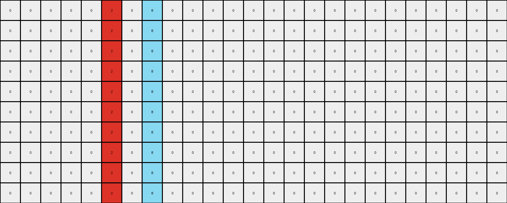

# 0a938d79 • 005 • refine_dreamer

---

Previous Code:
```python
"""
The output grid is created by identifying each non-white pixel in the input grid. 
For each non-white pixel, its color is extended downwards, filling the rest of its column. 
The rows below are filled, then, it continues extending by wrapping around to the top of the grid (row 0) and filling down. This continues until the original row of the pixel is reached.
"""

import numpy as np

def transform(input_grid):
    """
    Transforms the input grid by extending the color of each non-white pixel downwards, wrapping around rows.
    """
    rows, cols = input_grid.shape
    output_grid = np.zeros((rows, cols), dtype=int)

    # Iterate through the input grid to find non-white pixels
    for r in range(rows):
        for c in range(cols):
            if input_grid[r, c] != 0:
                color = input_grid[r, c]
                # Extend the color downwards, wrapping around
                current_row = r
                while True:
                    output_grid[current_row, c] = color
                    current_row = (current_row + 1) % rows  # Wrap around to row 0
                    if current_row == r:
                        break  # Stop when we reach the original row

    return output_grid
```

Train Set Results:

## Example 1:**

Input:
```
0 0 0 0 0 2 0 0 0 0 0 0 0 0 0 0 0 0 0 0 0 0 0 0 0
0 0 0 0 0 0 0 0 0 0 0 0 0 0 0 0 0 0 0 0 0 0 0 0 0
0 0 0 0 0 0 0 0 0 0 0 0 0 0 0 0 0 0 0 0 0 0 0 0 0
0 0 0 0 0 0 0 0 0 0 0 0 0 0 0 0 0 0 0 0 0 0 0 0 0
0 0 0 0 0 0 0 0 0 0 0 0 0 0 0 0 0 0 0 0 0 0 0 0 0
0 0 0 0 0 0 0 0 0 0 0 0 0 0 0 0 0 0 0 0 0 0 0 0 0
0 0 0 0 0 0 0 0 0 0 0 0 0 0 0 0 0 0 0 0 0 0 0 0 0
0 0 0 0 0 0 0 0 0 0 0 0 0 0 0 0 0 0 0 0 0 0 0 0 0
0 0 0 0 0 0 0 0 0 0 0 0 0 0 0 0 0 0 0 0 0 0 0 0 0
0 0 0 0 0 0 0 8 0 0 0 0 0 0 0 0 0 0 0 0 0 0 0 0 0
```
Expected Output:
```
0 0 0 0 0 2 0 8 0 2 0 8 0 2 0 8 0 2 0 8 0 2 0 8 0
0 0 0 0 0 2 0 8 0 2 0 8 0 2 0 8 0 2 0 8 0 2 0 8 0
0 0 0 0 0 2 0 8 0 2 0 8 0 2 0 8 0 2 0 8 0 2 0 8 0
0 0 0 0 0 2 0 8 0 2 0 8 0 2 0 8 0 2 0 8 0 2 0 8 0
0 0 0 0 0 2 0 8 0 2 0 8 0 2 0 8 0 2 0 8 0 2 0 8 0
0 0 0 0 0 2 0 8 0 2 0 8 0 2 0 8 0 2 0 8 0 2 0 8 0
0 0 0 0 0 2 0 8 0 2 0 8 0 2 0 8 0 2 0 8 0 2 0 8 0
0 0 0 0 0 2 0 8 0 2 0 8 0 2 0 8 0 2 0 8 0 2 0 8 0
0 0 0 0 0 2 0 8 0 2 0 8 0 2 0 8 0 2 0 8 0 2 0 8 0
0 0 0 0 0 2 0 8 0 2 0 8 0 2 0 8 0 2 0 8 0 2 0 8 0
```
Transformed Output:
```
0 0 0 0 0 2 0 8 0 0 0 0 0 0 0 0 0 0 0 0 0 0 0 0 0
0 0 0 0 0 2 0 8 0 0 0 0 0 0 0 0 0 0 0 0 0 0 0 0 0
0 0 0 0 0 2 0 8 0 0 0 0 0 0 0 0 0 0 0 0 0 0 0 0 0
0 0 0 0 0 2 0 8 0 0 0 0 0 0 0 0 0 0 0 0 0 0 0 0 0
0 0 0 0 0 2 0 8 0 0 0 0 0 0 0 0 0 0 0 0 0 0 0 0 0
0 0 0 0 0 2 0 8 0 0 0 0 0 0 0 0 0 0 0 0 0 0 0 0 0
0 0 0 0 0 2 0 8 0 0 0 0 0 0 0 0 0 0 0 0 0 0 0 0 0
0 0 0 0 0 2 0 8 0 0 0 0 0 0 0 0 0 0 0 0 0 0 0 0 0
0 0 0 0 0 2 0 8 0 0 0 0 0 0 0 0 0 0 0 0 0 0 0 0 0
0 0 0 0 0 2 0 8 0 0 0 0 0 0 0 0 0 0 0 0 0 0 0 0 0
```

match: False
pixels_off: 80
size_correct: True
color_palette_correct: True
correct_pixel_counts: False

## Example 2:**

Input:
```
0 0 0 0 0 1 0 0 0 0 0 0 0 0 0 0 0 0 0 0 0 0 0
0 0 0 0 0 0 0 0 0 0 0 0 0 0 0 0 0 0 0 0 0 0 0
0 0 0 0 0 0 0 0 0 0 0 0 0 0 0 0 0 0 0 0 0 0 0
0 0 0 0 0 0 0 0 0 0 0 0 0 0 0 0 0 0 0 0 0 0 0
0 0 0 0 0 0 0 0 0 0 0 0 0 0 0 0 0 0 0 0 0 0 0
0 0 0 0 0 0 0 0 0 0 0 0 0 0 0 0 0 0 0 0 0 0 0
0 0 0 0 0 0 0 0 3 0 0 0 0 0 0 0 0 0 0 0 0 0 0
```
Expected Output:
```
0 0 0 0 0 1 0 0 3 0 0 1 0 0 3 0 0 1 0 0 3 0 0
0 0 0 0 0 1 0 0 3 0 0 1 0 0 3 0 0 1 0 0 3 0 0
0 0 0 0 0 1 0 0 3 0 0 1 0 0 3 0 0 1 0 0 3 0 0
0 0 0 0 0 1 0 0 3 0 0 1 0 0 3 0 0 1 0 0 3 0 0
0 0 0 0 0 1 0 0 3 0 0 1 0 0 3 0 0 1 0 0 3 0 0
0 0 0 0 0 1 0 0 3 0 0 1 0 0 3 0 0 1 0 0 3 0 0
0 0 0 0 0 1 0 0 3 0 0 1 0 0 3 0 0 1 0 0 3 0 0
```
Transformed Output:
```
0 0 0 0 0 1 0 0 3 0 0 0 0 0 0 0 0 0 0 0 0 0 0
0 0 0 0 0 1 0 0 3 0 0 0 0 0 0 0 0 0 0 0 0 0 0
0 0 0 0 0 1 0 0 3 0 0 0 0 0 0 0 0 0 0 0 0 0 0
0 0 0 0 0 1 0 0 3 0 0 0 0 0 0 0 0 0 0 0 0 0 0
0 0 0 0 0 1 0 0 3 0 0 0 0 0 0 0 0 0 0 0 0 0 0
0 0 0 0 0 1 0 0 3 0 0 0 0 0 0 0 0 0 0 0 0 0 0
0 0 0 0 0 1 0 0 3 0 0 0 0 0 0 0 0 0 0 0 0 0 0
```

match: False
pixels_off: 28
size_correct: True
color_palette_correct: True
correct_pixel_counts: False

## Example 3:**

Input:
```
0 0 0 0 0 0 0 0 0
0 0 0 0 0 0 0 0 0
0 0 0 0 0 0 0 0 0
0 0 0 0 0 0 0 0 0
0 0 0 0 0 0 0 0 0
2 0 0 0 0 0 0 0 0
0 0 0 0 0 0 0 0 0
0 0 0 0 0 0 0 0 3
0 0 0 0 0 0 0 0 0
0 0 0 0 0 0 0 0 0
0 0 0 0 0 0 0 0 0
0 0 0 0 0 0 0 0 0
0 0 0 0 0 0 0 0 0
0 0 0 0 0 0 0 0 0
0 0 0 0 0 0 0 0 0
0 0 0 0 0 0 0 0 0
0 0 0 0 0 0 0 0 0
0 0 0 0 0 0 0 0 0
0 0 0 0 0 0 0 0 0
0 0 0 0 0 0 0 0 0
0 0 0 0 0 0 0 0 0
0 0 0 0 0 0 0 0 0
```
Expected Output:
```
0 0 0 0 0 0 0 0 0
0 0 0 0 0 0 0 0 0
0 0 0 0 0 0 0 0 0
0 0 0 0 0 0 0 0 0
0 0 0 0 0 0 0 0 0
2 2 2 2 2 2 2 2 2
0 0 0 0 0 0 0 0 0
3 3 3 3 3 3 3 3 3
0 0 0 0 0 0 0 0 0
2 2 2 2 2 2 2 2 2
0 0 0 0 0 0 0 0 0
3 3 3 3 3 3 3 3 3
0 0 0 0 0 0 0 0 0
2 2 2 2 2 2 2 2 2
0 0 0 0 0 0 0 0 0
3 3 3 3 3 3 3 3 3
0 0 0 0 0 0 0 0 0
2 2 2 2 2 2 2 2 2
0 0 0 0 0 0 0 0 0
3 3 3 3 3 3 3 3 3
0 0 0 0 0 0 0 0 0
2 2 2 2 2 2 2 2 2
```
Transformed Output:
```
2 0 0 0 0 0 0 0 3
2 0 0 0 0 0 0 0 3
2 0 0 0 0 0 0 0 3
2 0 0 0 0 0 0 0 3
2 0 0 0 0 0 0 0 3
2 0 0 0 0 0 0 0 3
2 0 0 0 0 0 0 0 3
2 0 0 0 0 0 0 0 3
2 0 0 0 0 0 0 0 3
2 0 0 0 0 0 0 0 3
2 0 0 0 0 0 0 0 3
2 0 0 0 0 0 0 0 3
2 0 0 0 0 0 0 0 3
2 0 0 0 0 0 0 0 3
2 0 0 0 0 0 0 0 3
2 0 0 0 0 0 0 0 3
2 0 0 0 0 0 0 0 3
2 0 0 0 0 0 0 0 3
2 0 0 0 0 0 0 0 3
2 0 0 0 0 0 0 0 3
2 0 0 0 0 0 0 0 3
2 0 0 0 0 0 0 0 3
```

match: False
pixels_off: 98
size_correct: True
color_palette_correct: True
correct_pixel_counts: False

## Example 4:**

Input:
```
0 0 0 0 0 0 0 0
0 0 0 0 0 0 0 0
0 0 0 0 0 0 0 0
0 0 0 0 0 0 0 0
0 0 0 0 0 0 0 0
0 0 0 0 0 0 0 0
0 0 0 0 0 0 0 0
4 0 0 0 0 0 0 0
0 0 0 0 0 0 0 0
0 0 0 0 0 0 0 0
0 0 0 0 0 0 0 0
1 0 0 0 0 0 0 0
0 0 0 0 0 0 0 0
0 0 0 0 0 0 0 0
0 0 0 0 0 0 0 0
0 0 0 0 0 0 0 0
0 0 0 0 0 0 0 0
0 0 0 0 0 0 0 0
0 0 0 0 0 0 0 0
0 0 0 0 0 0 0 0
0 0 0 0 0 0 0 0
0 0 0 0 0 0 0 0
0 0 0 0 0 0 0 0
0 0 0 0 0 0 0 0
```
Expected Output:
```
0 0 0 0 0 0 0 0
0 0 0 0 0 0 0 0
0 0 0 0 0 0 0 0
0 0 0 0 0 0 0 0
0 0 0 0 0 0 0 0
0 0 0 0 0 0 0 0
0 0 0 0 0 0 0 0
4 4 4 4 4 4 4 4
0 0 0 0 0 0 0 0
0 0 0 0 0 0 0 0
0 0 0 0 0 0 0 0
1 1 1 1 1 1 1 1
0 0 0 0 0 0 0 0
0 0 0 0 0 0 0 0
0 0 0 0 0 0 0 0
4 4 4 4 4 4 4 4
0 0 0 0 0 0 0 0
0 0 0 0 0 0 0 0
0 0 0 0 0 0 0 0
1 1 1 1 1 1 1 1
0 0 0 0 0 0 0 0
0 0 0 0 0 0 0 0
0 0 0 0 0 0 0 0
4 4 4 4 4 4 4 4
```
Transformed Output:
```
1 0 0 0 0 0 0 0
1 0 0 0 0 0 0 0
1 0 0 0 0 0 0 0
1 0 0 0 0 0 0 0
1 0 0 0 0 0 0 0
1 0 0 0 0 0 0 0
1 0 0 0 0 0 0 0
1 0 0 0 0 0 0 0
1 0 0 0 0 0 0 0
1 0 0 0 0 0 0 0
1 0 0 0 0 0 0 0
1 0 0 0 0 0 0 0
1 0 0 0 0 0 0 0
1 0 0 0 0 0 0 0
1 0 0 0 0 0 0 0
1 0 0 0 0 0 0 0
1 0 0 0 0 0 0 0
1 0 0 0 0 0 0 0
1 0 0 0 0 0 0 0
1 0 0 0 0 0 0 0
1 0 0 0 0 0 0 0
1 0 0 0 0 0 0 0
1 0 0 0 0 0 0 0
1 0 0 0 0 0 0 0
```

match: False
pixels_off: 57
size_correct: True
color_palette_correct: True
correct_pixel_counts: False
**INSTRUCTIONS**

The code above was generated based on observations from the first training
example

we have tested the transform function on each of the task example inputs and
compared with the expected output

review each of the examples provided and the results and consider how the
natural language program should be updated to accommodate this new knowledge

respond with the following deliverables:

- general assessment of the information provided and strategy for resolving the
  errors
- gather metrics about each of the examples and results - use code_execution to
  develop accurate reports on your assumptions
- a YAML block documenting facts - Focus on identifying objects, their properties, and the actions performed on them.
- a natural language program - Be as clear and concise as possible, providing a complete description of the transformation rule.


your responses should be considered as information in a report - not a
conversation
