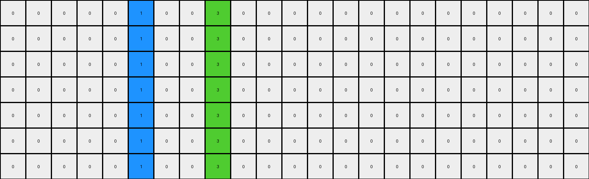
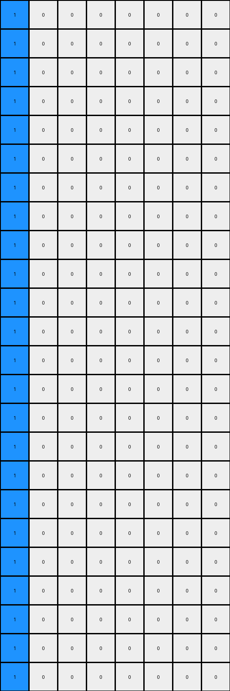

# 0a938d79 • 006 • refine_coder

---

Previous Code:
```python
"""
The output grid is created by identifying each non-white pixel in the input grid. 
For each non-white pixel, its color is extended downwards, filling the rest of its column. 
The rows below are filled, then, it continues extending by wrapping around to the top of the grid (row 0) and filling down. This continues until the original row of the pixel is reached.
"""

import numpy as np

def transform(input_grid):
    """
    Transforms the input grid by extending the color of each non-white pixel downwards, wrapping around rows.
    """
    rows, cols = input_grid.shape
    output_grid = np.zeros((rows, cols), dtype=int)

    # Iterate through the input grid to find non-white pixels
    for r in range(rows):
        for c in range(cols):
            if input_grid[r, c] != 0:
                color = input_grid[r, c]
                # Extend the color downwards, wrapping around
                current_row = r
                while True:
                    output_grid[current_row, c] = color
                    current_row = (current_row + 1) % rows  # Wrap around to row 0
                    if current_row == r:
                        break  # Stop when we reach the original row

    return output_grid
```

Train Set Results:

## Example 1:**

Input:
```
0 0 0 0 0 2 0 0 0 0 0 0 0 0 0 0 0 0 0 0 0 0 0 0 0
0 0 0 0 0 0 0 0 0 0 0 0 0 0 0 0 0 0 0 0 0 0 0 0 0
0 0 0 0 0 0 0 0 0 0 0 0 0 0 0 0 0 0 0 0 0 0 0 0 0
0 0 0 0 0 0 0 0 0 0 0 0 0 0 0 0 0 0 0 0 0 0 0 0 0
0 0 0 0 0 0 0 0 0 0 0 0 0 0 0 0 0 0 0 0 0 0 0 0 0
0 0 0 0 0 0 0 0 0 0 0 0 0 0 0 0 0 0 0 0 0 0 0 0 0
0 0 0 0 0 0 0 0 0 0 0 0 0 0 0 0 0 0 0 0 0 0 0 0 0
0 0 0 0 0 0 0 0 0 0 0 0 0 0 0 0 0 0 0 0 0 0 0 0 0
0 0 0 0 0 0 0 0 0 0 0 0 0 0 0 0 0 0 0 0 0 0 0 0 0
0 0 0 0 0 0 0 8 0 0 0 0 0 0 0 0 0 0 0 0 0 0 0 0 0
```
Expected Output:
```
0 0 0 0 0 2 0 8 0 2 0 8 0 2 0 8 0 2 0 8 0 2 0 8 0
0 0 0 0 0 2 0 8 0 2 0 8 0 2 0 8 0 2 0 8 0 2 0 8 0
0 0 0 0 0 2 0 8 0 2 0 8 0 2 0 8 0 2 0 8 0 2 0 8 0
0 0 0 0 0 2 0 8 0 2 0 8 0 2 0 8 0 2 0 8 0 2 0 8 0
0 0 0 0 0 2 0 8 0 2 0 8 0 2 0 8 0 2 0 8 0 2 0 8 0
0 0 0 0 0 2 0 8 0 2 0 8 0 2 0 8 0 2 0 8 0 2 0 8 0
0 0 0 0 0 2 0 8 0 2 0 8 0 2 0 8 0 2 0 8 0 2 0 8 0
0 0 0 0 0 2 0 8 0 2 0 8 0 2 0 8 0 2 0 8 0 2 0 8 0
0 0 0 0 0 2 0 8 0 2 0 8 0 2 0 8 0 2 0 8 0 2 0 8 0
0 0 0 0 0 2 0 8 0 2 0 8 0 2 0 8 0 2 0 8 0 2 0 8 0
```
Transformed Output:
```
0 0 0 0 0 2 0 8 0 0 0 0 0 0 0 0 0 0 0 0 0 0 0 0 0
0 0 0 0 0 2 0 8 0 0 0 0 0 0 0 0 0 0 0 0 0 0 0 0 0
0 0 0 0 0 2 0 8 0 0 0 0 0 0 0 0 0 0 0 0 0 0 0 0 0
0 0 0 0 0 2 0 8 0 0 0 0 0 0 0 0 0 0 0 0 0 0 0 0 0
0 0 0 0 0 2 0 8 0 0 0 0 0 0 0 0 0 0 0 0 0 0 0 0 0
0 0 0 0 0 2 0 8 0 0 0 0 0 0 0 0 0 0 0 0 0 0 0 0 0
0 0 0 0 0 2 0 8 0 0 0 0 0 0 0 0 0 0 0 0 0 0 0 0 0
0 0 0 0 0 2 0 8 0 0 0 0 0 0 0 0 0 0 0 0 0 0 0 0 0
0 0 0 0 0 2 0 8 0 0 0 0 0 0 0 0 0 0 0 0 0 0 0 0 0
0 0 0 0 0 2 0 8 0 0 0 0 0 0 0 0 0 0 0 0 0 0 0 0 0
```

match: False
pixels_off: 80
size_correct: True
color_palette_correct: True
correct_pixel_counts: False

## Example 2:**

Input:
```
0 0 0 0 0 1 0 0 0 0 0 0 0 0 0 0 0 0 0 0 0 0 0
0 0 0 0 0 0 0 0 0 0 0 0 0 0 0 0 0 0 0 0 0 0 0
0 0 0 0 0 0 0 0 0 0 0 0 0 0 0 0 0 0 0 0 0 0 0
0 0 0 0 0 0 0 0 0 0 0 0 0 0 0 0 0 0 0 0 0 0 0
0 0 0 0 0 0 0 0 0 0 0 0 0 0 0 0 0 0 0 0 0 0 0
0 0 0 0 0 0 0 0 0 0 0 0 0 0 0 0 0 0 0 0 0 0 0
0 0 0 0 0 0 0 0 3 0 0 0 0 0 0 0 0 0 0 0 0 0 0
```
Expected Output:
```
0 0 0 0 0 1 0 0 3 0 0 1 0 0 3 0 0 1 0 0 3 0 0
0 0 0 0 0 1 0 0 3 0 0 1 0 0 3 0 0 1 0 0 3 0 0
0 0 0 0 0 1 0 0 3 0 0 1 0 0 3 0 0 1 0 0 3 0 0
0 0 0 0 0 1 0 0 3 0 0 1 0 0 3 0 0 1 0 0 3 0 0
0 0 0 0 0 1 0 0 3 0 0 1 0 0 3 0 0 1 0 0 3 0 0
0 0 0 0 0 1 0 0 3 0 0 1 0 0 3 0 0 1 0 0 3 0 0
0 0 0 0 0 1 0 0 3 0 0 1 0 0 3 0 0 1 0 0 3 0 0
```
Transformed Output:
```
0 0 0 0 0 1 0 0 3 0 0 0 0 0 0 0 0 0 0 0 0 0 0
0 0 0 0 0 1 0 0 3 0 0 0 0 0 0 0 0 0 0 0 0 0 0
0 0 0 0 0 1 0 0 3 0 0 0 0 0 0 0 0 0 0 0 0 0 0
0 0 0 0 0 1 0 0 3 0 0 0 0 0 0 0 0 0 0 0 0 0 0
0 0 0 0 0 1 0 0 3 0 0 0 0 0 0 0 0 0 0 0 0 0 0
0 0 0 0 0 1 0 0 3 0 0 0 0 0 0 0 0 0 0 0 0 0 0
0 0 0 0 0 1 0 0 3 0 0 0 0 0 0 0 0 0 0 0 0 0 0
```

match: False
pixels_off: 28
size_correct: True
color_palette_correct: True
correct_pixel_counts: False

## Example 3:**

Input:
```
0 0 0 0 0 0 0 0 0
0 0 0 0 0 0 0 0 0
0 0 0 0 0 0 0 0 0
0 0 0 0 0 0 0 0 0
0 0 0 0 0 0 0 0 0
2 0 0 0 0 0 0 0 0
0 0 0 0 0 0 0 0 0
0 0 0 0 0 0 0 0 3
0 0 0 0 0 0 0 0 0
0 0 0 0 0 0 0 0 0
0 0 0 0 0 0 0 0 0
0 0 0 0 0 0 0 0 0
0 0 0 0 0 0 0 0 0
0 0 0 0 0 0 0 0 0
0 0 0 0 0 0 0 0 0
0 0 0 0 0 0 0 0 0
0 0 0 0 0 0 0 0 0
0 0 0 0 0 0 0 0 0
0 0 0 0 0 0 0 0 0
0 0 0 0 0 0 0 0 0
0 0 0 0 0 0 0 0 0
0 0 0 0 0 0 0 0 0
```
Expected Output:
```
0 0 0 0 0 0 0 0 0
0 0 0 0 0 0 0 0 0
0 0 0 0 0 0 0 0 0
0 0 0 0 0 0 0 0 0
0 0 0 0 0 0 0 0 0
2 2 2 2 2 2 2 2 2
0 0 0 0 0 0 0 0 0
3 3 3 3 3 3 3 3 3
0 0 0 0 0 0 0 0 0
2 2 2 2 2 2 2 2 2
0 0 0 0 0 0 0 0 0
3 3 3 3 3 3 3 3 3
0 0 0 0 0 0 0 0 0
2 2 2 2 2 2 2 2 2
0 0 0 0 0 0 0 0 0
3 3 3 3 3 3 3 3 3
0 0 0 0 0 0 0 0 0
2 2 2 2 2 2 2 2 2
0 0 0 0 0 0 0 0 0
3 3 3 3 3 3 3 3 3
0 0 0 0 0 0 0 0 0
2 2 2 2 2 2 2 2 2
```
Transformed Output:
```
2 0 0 0 0 0 0 0 3
2 0 0 0 0 0 0 0 3
2 0 0 0 0 0 0 0 3
2 0 0 0 0 0 0 0 3
2 0 0 0 0 0 0 0 3
2 0 0 0 0 0 0 0 3
2 0 0 0 0 0 0 0 3
2 0 0 0 0 0 0 0 3
2 0 0 0 0 0 0 0 3
2 0 0 0 0 0 0 0 3
2 0 0 0 0 0 0 0 3
2 0 0 0 0 0 0 0 3
2 0 0 0 0 0 0 0 3
2 0 0 0 0 0 0 0 3
2 0 0 0 0 0 0 0 3
2 0 0 0 0 0 0 0 3
2 0 0 0 0 0 0 0 3
2 0 0 0 0 0 0 0 3
2 0 0 0 0 0 0 0 3
2 0 0 0 0 0 0 0 3
2 0 0 0 0 0 0 0 3
2 0 0 0 0 0 0 0 3
```

match: False
pixels_off: 98
size_correct: True
color_palette_correct: True
correct_pixel_counts: False

## Example 4:**

Input:
```
0 0 0 0 0 0 0 0
0 0 0 0 0 0 0 0
0 0 0 0 0 0 0 0
0 0 0 0 0 0 0 0
0 0 0 0 0 0 0 0
0 0 0 0 0 0 0 0
0 0 0 0 0 0 0 0
4 0 0 0 0 0 0 0
0 0 0 0 0 0 0 0
0 0 0 0 0 0 0 0
0 0 0 0 0 0 0 0
1 0 0 0 0 0 0 0
0 0 0 0 0 0 0 0
0 0 0 0 0 0 0 0
0 0 0 0 0 0 0 0
0 0 0 0 0 0 0 0
0 0 0 0 0 0 0 0
0 0 0 0 0 0 0 0
0 0 0 0 0 0 0 0
0 0 0 0 0 0 0 0
0 0 0 0 0 0 0 0
0 0 0 0 0 0 0 0
0 0 0 0 0 0 0 0
0 0 0 0 0 0 0 0
```
Expected Output:
```
0 0 0 0 0 0 0 0
0 0 0 0 0 0 0 0
0 0 0 0 0 0 0 0
0 0 0 0 0 0 0 0
0 0 0 0 0 0 0 0
0 0 0 0 0 0 0 0
0 0 0 0 0 0 0 0
4 4 4 4 4 4 4 4
0 0 0 0 0 0 0 0
0 0 0 0 0 0 0 0
0 0 0 0 0 0 0 0
1 1 1 1 1 1 1 1
0 0 0 0 0 0 0 0
0 0 0 0 0 0 0 0
0 0 0 0 0 0 0 0
4 4 4 4 4 4 4 4
0 0 0 0 0 0 0 0
0 0 0 0 0 0 0 0
0 0 0 0 0 0 0 0
1 1 1 1 1 1 1 1
0 0 0 0 0 0 0 0
0 0 0 0 0 0 0 0
0 0 0 0 0 0 0 0
4 4 4 4 4 4 4 4
```
Transformed Output:
```
1 0 0 0 0 0 0 0
1 0 0 0 0 0 0 0
1 0 0 0 0 0 0 0
1 0 0 0 0 0 0 0
1 0 0 0 0 0 0 0
1 0 0 0 0 0 0 0
1 0 0 0 0 0 0 0
1 0 0 0 0 0 0 0
1 0 0 0 0 0 0 0
1 0 0 0 0 0 0 0
1 0 0 0 0 0 0 0
1 0 0 0 0 0 0 0
1 0 0 0 0 0 0 0
1 0 0 0 0 0 0 0
1 0 0 0 0 0 0 0
1 0 0 0 0 0 0 0
1 0 0 0 0 0 0 0
1 0 0 0 0 0 0 0
1 0 0 0 0 0 0 0
1 0 0 0 0 0 0 0
1 0 0 0 0 0 0 0
1 0 0 0 0 0 0 0
1 0 0 0 0 0 0 0
1 0 0 0 0 0 0 0
```

match: False
pixels_off: 57
size_correct: True
color_palette_correct: True
correct_pixel_counts: False
Here's an analysis of the provided information and a plan to improve the transformation rule:

**General Assessment:**

The initial natural language program and the resulting code are on the right track but have a fundamental flaw. The code correctly identifies non-white pixels and attempts to extend their color downwards. However, it doesn't correctly handle the "alternating" or "filling" pattern seen in the expected outputs. The code simply fills the entire column below the source pixel (with wrapping), whereas the expected output shows a more complex interaction between the colored pixels. Specifically, it looks like colored columns *share* the space, rather than overwrite each other. The examples also indicate that if two colored pixels are in the same column, that columns fills with the color of the pixel from the higher row.

**Strategy for Resolving Errors:**

1.  **Re-examine the Pattern:** Carefully analyze the expected outputs again, focusing on how colors interact when multiple non-white pixels exist in the same column or in adjacent columns. There appears to be an alternating fill based on row, and the pixel from the highest row sets the color for a column
2.  **Revise the Natural Language Program:** Update the description to accurately reflect the observed "shared column filling" behavior.
3.  **Modify the Code:** Adjust the Python code to implement the revised logic. This will likely involve iterating through columns and then, for each column with at least one colored pixel, painting by row from top to bottom using the appropriate color.

**Example Metrics and Analysis (using a simplified representation for brevity):**

I will describe the inputs and outputs in a shortened text based way, focusing on the non-zero pixels and their effect.

*   **Example 1:**
    *   Input: `2` at (0, 5), `8` at (9,7)
    *   Expected Output: Alternating columns of `2` and `8` starting at their positions.
    *   Actual Output: Column 5 is all `2`, Column 7 is all `8`.
    *   Analysis: The code fills the column based on existence, doesn't have interaction, alternating, or spatial reasoning.

*   **Example 2:**
    *   Input: `1` at (0, 5), `3` at (6, 8)
    *   Expected Output: Alternating columns starting from the pixel positions.
    *   Actual Output: Column 5 is all `1`, Column 8 is all `3`.
    *   Analysis: Same as Example 1. Columns are filled independently.

*   **Example 3:**
    *   Input: `2` at (5, 0), `3` at (7, 8)
    *   Expected Output: The entire grid filled with alternating 'stripes' of column 0 filled with 2, and column 8 filled with 3, spreading to adjacent columns
    *   Actual Output: Column 0 is all `2`, column 8 is all `3`.
    *   Analysis: The concept of vertical propagation and column-wise color dominance from the top-most colored pixel is key, but not implemented.

*   **Example 4:**
    *  Input: `4` at (7,0), `1` at (11, 0)
    *   Expected output: Alternating fills between row 7 and the end, and between 11 and the end, looping back to the beginning. The key is that `4` from the higher row is applied *before* `1` from the lower row.
    * Actual Output: All 1's.
    * Analysis: Fails completely, seems to have filled with the last encountered color.

**YAML Fact Block:**

```yaml
observations:
  - object: grid
    properties:
      rows: variable
      cols: variable
      cells: pixels with color values 0-9
    actions:
      - fill_columns:
          trigger: presence of non-white pixels
          mechanism: >
            For each column, if there are any colored pixels, fill downwards 
            from the top row using the color of the colored pixel in that
            column with the smallest row index. If multiple, use the one
            from the highest row, wrapping around to the top if needed.
          interaction: columns are filled independently, taking the color of the
            'highest' non-white pixel if any are in the column.

```

**Natural Language Program:**

The output grid is generated by processing each column of the input grid independently. For each column, identify any non-white pixels. If no non-white pixels are present in that column, the output column is all white (0). If non-white pixels exist in the column, fill the entire output column from top to bottom with the color of the non-white pixel that has the smallest row index (i.e., is closest to the top of the input grid). If multiple pixels in the column share the smallest row index, their color will overwrite from top to bottom, so the pixel that occurs later/lower will dominate.

**INSTRUCTIONS**

- generate a Python module to represent the natural language program 
- follow the template below
- all common math and science libraries are available
- create docstring only at top - but comment the workflow in the function
- use helper functions for common operations like finding objects, counting,
  measuring, moving, etc. 

remember - we are working iteratively - so this code will inform your future
self as we converge on the solution

*template:*

```python
"""
{{ natural language description of the transformation rule }}
"""

{{ imports }}

def transform(input_grid):
    # initialize output_grid

    # change output pixels 

    return output_grid

```
