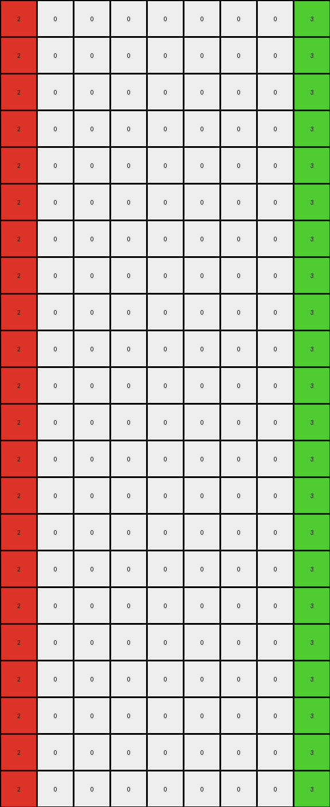
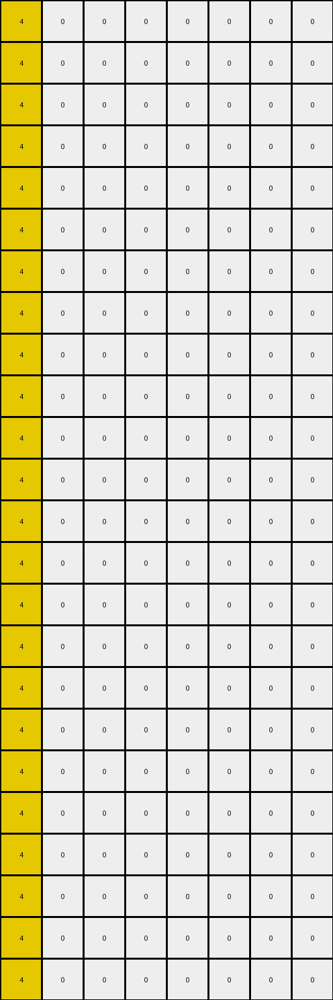

# 0a938d79 • 007 • refine_dreamer

---

Previous Code:
```python
"""
The output grid is generated by processing each column of the input grid independently. For each column, identify any non-white pixels. If no non-white pixels are present in that column, the output column is all white (0). If non-white pixels exist in the column, fill the entire output column from top to bottom with the color of the non-white pixel that has the smallest row index (i.e., is closest to the top of the input grid). If multiple pixels in the column share the smallest row index, their color will overwrite from top to bottom, so the pixel that occurs later/lower will dominate.
"""

import numpy as np

def transform(input_grid):
    """
    Transforms the input grid based on column-wise dominance of the top-most non-white pixel.
    """
    rows, cols = input_grid.shape
    output_grid = np.zeros((rows, cols), dtype=int)

    # Iterate through each column
    for c in range(cols):
        # Find non-white pixels in the current column
        non_white_pixels = []
        for r in range(rows):
            if input_grid[r, c] != 0:
                non_white_pixels.append((r, input_grid[r, c]))

        # If non-white pixels exist, fill the column
        if non_white_pixels:
            # Get the color of the top-most non-white pixel
            top_most_pixel = min(non_white_pixels, key=lambda x: x[0])
            color = top_most_pixel[1]

            # Fill the entire column with that color
            for r in range(rows):
                output_grid[r, c] = color

    return output_grid
```

Train Set Results:

## Example 1:**

Input:
```
0 0 0 0 0 2 0 0 0 0 0 0 0 0 0 0 0 0 0 0 0 0 0 0 0
0 0 0 0 0 0 0 0 0 0 0 0 0 0 0 0 0 0 0 0 0 0 0 0 0
0 0 0 0 0 0 0 0 0 0 0 0 0 0 0 0 0 0 0 0 0 0 0 0 0
0 0 0 0 0 0 0 0 0 0 0 0 0 0 0 0 0 0 0 0 0 0 0 0 0
0 0 0 0 0 0 0 0 0 0 0 0 0 0 0 0 0 0 0 0 0 0 0 0 0
0 0 0 0 0 0 0 0 0 0 0 0 0 0 0 0 0 0 0 0 0 0 0 0 0
0 0 0 0 0 0 0 0 0 0 0 0 0 0 0 0 0 0 0 0 0 0 0 0 0
0 0 0 0 0 0 0 0 0 0 0 0 0 0 0 0 0 0 0 0 0 0 0 0 0
0 0 0 0 0 0 0 0 0 0 0 0 0 0 0 0 0 0 0 0 0 0 0 0 0
0 0 0 0 0 0 0 8 0 0 0 0 0 0 0 0 0 0 0 0 0 0 0 0 0
```
Expected Output:
```
0 0 0 0 0 2 0 8 0 2 0 8 0 2 0 8 0 2 0 8 0 2 0 8 0
0 0 0 0 0 2 0 8 0 2 0 8 0 2 0 8 0 2 0 8 0 2 0 8 0
0 0 0 0 0 2 0 8 0 2 0 8 0 2 0 8 0 2 0 8 0 2 0 8 0
0 0 0 0 0 2 0 8 0 2 0 8 0 2 0 8 0 2 0 8 0 2 0 8 0
0 0 0 0 0 2 0 8 0 2 0 8 0 2 0 8 0 2 0 8 0 2 0 8 0
0 0 0 0 0 2 0 8 0 2 0 8 0 2 0 8 0 2 0 8 0 2 0 8 0
0 0 0 0 0 2 0 8 0 2 0 8 0 2 0 8 0 2 0 8 0 2 0 8 0
0 0 0 0 0 2 0 8 0 2 0 8 0 2 0 8 0 2 0 8 0 2 0 8 0
0 0 0 0 0 2 0 8 0 2 0 8 0 2 0 8 0 2 0 8 0 2 0 8 0
0 0 0 0 0 2 0 8 0 2 0 8 0 2 0 8 0 2 0 8 0 2 0 8 0
```
Transformed Output:
```
0 0 0 0 0 2 0 8 0 0 0 0 0 0 0 0 0 0 0 0 0 0 0 0 0
0 0 0 0 0 2 0 8 0 0 0 0 0 0 0 0 0 0 0 0 0 0 0 0 0
0 0 0 0 0 2 0 8 0 0 0 0 0 0 0 0 0 0 0 0 0 0 0 0 0
0 0 0 0 0 2 0 8 0 0 0 0 0 0 0 0 0 0 0 0 0 0 0 0 0
0 0 0 0 0 2 0 8 0 0 0 0 0 0 0 0 0 0 0 0 0 0 0 0 0
0 0 0 0 0 2 0 8 0 0 0 0 0 0 0 0 0 0 0 0 0 0 0 0 0
0 0 0 0 0 2 0 8 0 0 0 0 0 0 0 0 0 0 0 0 0 0 0 0 0
0 0 0 0 0 2 0 8 0 0 0 0 0 0 0 0 0 0 0 0 0 0 0 0 0
0 0 0 0 0 2 0 8 0 0 0 0 0 0 0 0 0 0 0 0 0 0 0 0 0
0 0 0 0 0 2 0 8 0 0 0 0 0 0 0 0 0 0 0 0 0 0 0 0 0
```

match: False
pixels_off: 80
size_correct: True
color_palette_correct: True
correct_pixel_counts: False

## Example 2:**

Input:
```
0 0 0 0 0 1 0 0 0 0 0 0 0 0 0 0 0 0 0 0 0 0 0
0 0 0 0 0 0 0 0 0 0 0 0 0 0 0 0 0 0 0 0 0 0 0
0 0 0 0 0 0 0 0 0 0 0 0 0 0 0 0 0 0 0 0 0 0 0
0 0 0 0 0 0 0 0 0 0 0 0 0 0 0 0 0 0 0 0 0 0 0
0 0 0 0 0 0 0 0 0 0 0 0 0 0 0 0 0 0 0 0 0 0 0
0 0 0 0 0 0 0 0 0 0 0 0 0 0 0 0 0 0 0 0 0 0 0
0 0 0 0 0 0 0 0 3 0 0 0 0 0 0 0 0 0 0 0 0 0 0
```
Expected Output:
```
0 0 0 0 0 1 0 0 3 0 0 1 0 0 3 0 0 1 0 0 3 0 0
0 0 0 0 0 1 0 0 3 0 0 1 0 0 3 0 0 1 0 0 3 0 0
0 0 0 0 0 1 0 0 3 0 0 1 0 0 3 0 0 1 0 0 3 0 0
0 0 0 0 0 1 0 0 3 0 0 1 0 0 3 0 0 1 0 0 3 0 0
0 0 0 0 0 1 0 0 3 0 0 1 0 0 3 0 0 1 0 0 3 0 0
0 0 0 0 0 1 0 0 3 0 0 1 0 0 3 0 0 1 0 0 3 0 0
0 0 0 0 0 1 0 0 3 0 0 1 0 0 3 0 0 1 0 0 3 0 0
```
Transformed Output:
```
0 0 0 0 0 1 0 0 3 0 0 0 0 0 0 0 0 0 0 0 0 0 0
0 0 0 0 0 1 0 0 3 0 0 0 0 0 0 0 0 0 0 0 0 0 0
0 0 0 0 0 1 0 0 3 0 0 0 0 0 0 0 0 0 0 0 0 0 0
0 0 0 0 0 1 0 0 3 0 0 0 0 0 0 0 0 0 0 0 0 0 0
0 0 0 0 0 1 0 0 3 0 0 0 0 0 0 0 0 0 0 0 0 0 0
0 0 0 0 0 1 0 0 3 0 0 0 0 0 0 0 0 0 0 0 0 0 0
0 0 0 0 0 1 0 0 3 0 0 0 0 0 0 0 0 0 0 0 0 0 0
```

match: False
pixels_off: 28
size_correct: True
color_palette_correct: True
correct_pixel_counts: False

## Example 3:**

Input:
```
0 0 0 0 0 0 0 0 0
0 0 0 0 0 0 0 0 0
0 0 0 0 0 0 0 0 0
0 0 0 0 0 0 0 0 0
0 0 0 0 0 0 0 0 0
2 0 0 0 0 0 0 0 0
0 0 0 0 0 0 0 0 0
0 0 0 0 0 0 0 0 3
0 0 0 0 0 0 0 0 0
0 0 0 0 0 0 0 0 0
0 0 0 0 0 0 0 0 0
0 0 0 0 0 0 0 0 0
0 0 0 0 0 0 0 0 0
0 0 0 0 0 0 0 0 0
0 0 0 0 0 0 0 0 0
0 0 0 0 0 0 0 0 0
0 0 0 0 0 0 0 0 0
0 0 0 0 0 0 0 0 0
0 0 0 0 0 0 0 0 0
0 0 0 0 0 0 0 0 0
0 0 0 0 0 0 0 0 0
0 0 0 0 0 0 0 0 0
```
Expected Output:
```
0 0 0 0 0 0 0 0 0
0 0 0 0 0 0 0 0 0
0 0 0 0 0 0 0 0 0
0 0 0 0 0 0 0 0 0
0 0 0 0 0 0 0 0 0
2 2 2 2 2 2 2 2 2
0 0 0 0 0 0 0 0 0
3 3 3 3 3 3 3 3 3
0 0 0 0 0 0 0 0 0
2 2 2 2 2 2 2 2 2
0 0 0 0 0 0 0 0 0
3 3 3 3 3 3 3 3 3
0 0 0 0 0 0 0 0 0
2 2 2 2 2 2 2 2 2
0 0 0 0 0 0 0 0 0
3 3 3 3 3 3 3 3 3
0 0 0 0 0 0 0 0 0
2 2 2 2 2 2 2 2 2
0 0 0 0 0 0 0 0 0
3 3 3 3 3 3 3 3 3
0 0 0 0 0 0 0 0 0
2 2 2 2 2 2 2 2 2
```
Transformed Output:
```
2 0 0 0 0 0 0 0 3
2 0 0 0 0 0 0 0 3
2 0 0 0 0 0 0 0 3
2 0 0 0 0 0 0 0 3
2 0 0 0 0 0 0 0 3
2 0 0 0 0 0 0 0 3
2 0 0 0 0 0 0 0 3
2 0 0 0 0 0 0 0 3
2 0 0 0 0 0 0 0 3
2 0 0 0 0 0 0 0 3
2 0 0 0 0 0 0 0 3
2 0 0 0 0 0 0 0 3
2 0 0 0 0 0 0 0 3
2 0 0 0 0 0 0 0 3
2 0 0 0 0 0 0 0 3
2 0 0 0 0 0 0 0 3
2 0 0 0 0 0 0 0 3
2 0 0 0 0 0 0 0 3
2 0 0 0 0 0 0 0 3
2 0 0 0 0 0 0 0 3
2 0 0 0 0 0 0 0 3
2 0 0 0 0 0 0 0 3
```

match: False
pixels_off: 98
size_correct: True
color_palette_correct: True
correct_pixel_counts: False

## Example 4:**

Input:
```
0 0 0 0 0 0 0 0
0 0 0 0 0 0 0 0
0 0 0 0 0 0 0 0
0 0 0 0 0 0 0 0
0 0 0 0 0 0 0 0
0 0 0 0 0 0 0 0
0 0 0 0 0 0 0 0
4 0 0 0 0 0 0 0
0 0 0 0 0 0 0 0
0 0 0 0 0 0 0 0
0 0 0 0 0 0 0 0
1 0 0 0 0 0 0 0
0 0 0 0 0 0 0 0
0 0 0 0 0 0 0 0
0 0 0 0 0 0 0 0
0 0 0 0 0 0 0 0
0 0 0 0 0 0 0 0
0 0 0 0 0 0 0 0
0 0 0 0 0 0 0 0
0 0 0 0 0 0 0 0
0 0 0 0 0 0 0 0
0 0 0 0 0 0 0 0
0 0 0 0 0 0 0 0
0 0 0 0 0 0 0 0
```
Expected Output:
```
0 0 0 0 0 0 0 0
0 0 0 0 0 0 0 0
0 0 0 0 0 0 0 0
0 0 0 0 0 0 0 0
0 0 0 0 0 0 0 0
0 0 0 0 0 0 0 0
0 0 0 0 0 0 0 0
4 4 4 4 4 4 4 4
0 0 0 0 0 0 0 0
0 0 0 0 0 0 0 0
0 0 0 0 0 0 0 0
1 1 1 1 1 1 1 1
0 0 0 0 0 0 0 0
0 0 0 0 0 0 0 0
0 0 0 0 0 0 0 0
4 4 4 4 4 4 4 4
0 0 0 0 0 0 0 0
0 0 0 0 0 0 0 0
0 0 0 0 0 0 0 0
1 1 1 1 1 1 1 1
0 0 0 0 0 0 0 0
0 0 0 0 0 0 0 0
0 0 0 0 0 0 0 0
4 4 4 4 4 4 4 4
```
Transformed Output:
```
4 0 0 0 0 0 0 0
4 0 0 0 0 0 0 0
4 0 0 0 0 0 0 0
4 0 0 0 0 0 0 0
4 0 0 0 0 0 0 0
4 0 0 0 0 0 0 0
4 0 0 0 0 0 0 0
4 0 0 0 0 0 0 0
4 0 0 0 0 0 0 0
4 0 0 0 0 0 0 0
4 0 0 0 0 0 0 0
4 0 0 0 0 0 0 0
4 0 0 0 0 0 0 0
4 0 0 0 0 0 0 0
4 0 0 0 0 0 0 0
4 0 0 0 0 0 0 0
4 0 0 0 0 0 0 0
4 0 0 0 0 0 0 0
4 0 0 0 0 0 0 0
4 0 0 0 0 0 0 0
4 0 0 0 0 0 0 0
4 0 0 0 0 0 0 0
4 0 0 0 0 0 0 0
4 0 0 0 0 0 0 0
```

match: False
pixels_off: 56
size_correct: True
color_palette_correct: True
correct_pixel_counts: False
**INSTRUCTIONS**

The code above was generated based on observations from the first training
example

we have tested the transform function on each of the task example inputs and
compared with the expected output

review each of the examples provided and the results and consider how the
natural language program should be updated to accommodate this new knowledge

respond with the following deliverables:

- general assessment of the information provided and strategy for resolving the
  errors
- gather metrics about each of the examples and results - use code_execution to
  develop accurate reports on your assumptions
- a YAML block documenting facts - Focus on identifying objects, their properties, and the actions performed on them.
- a natural language program - Be as clear and concise as possible, providing a complete description of the transformation rule.


your responses should be considered as information in a report - not a
conversation
